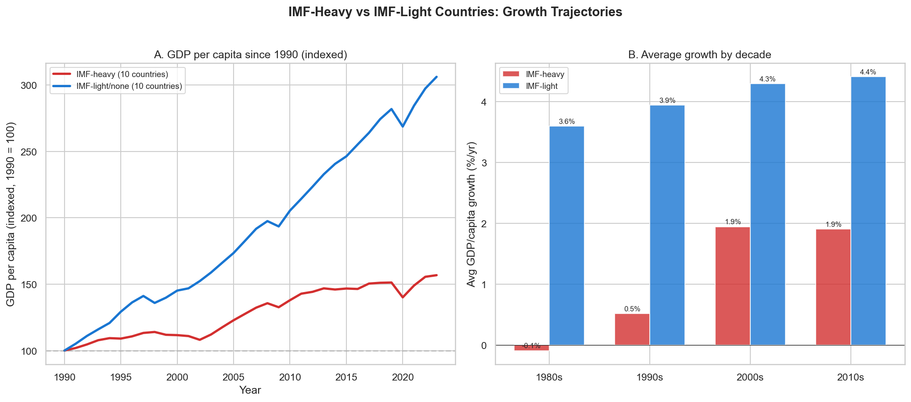
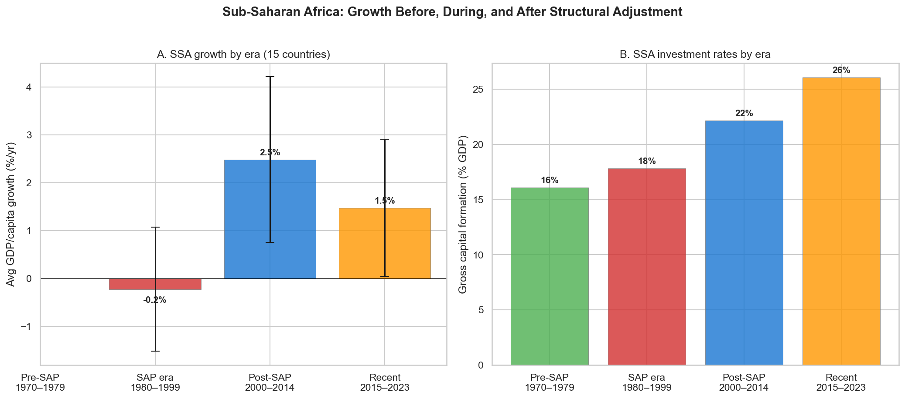

# The IMF and World Bank: Help or Harm?

**A deep dive into the Bretton Woods institutions and development outcomes.**

> This is supplementary material to the [main analysis](README.md). It examines a specific question — whether the IMF and World Bank have helped or hindered developing countries — in more detail than the core argument requires. Charts 72–77 are produced by `analysis/run_analysis_15.py`.

---

## The institutional landscape

The IMF and World Bank play distinct roles: the IMF provides short-term liquidity to countries facing balance-of-payments crises, with conditions aimed at macroeconomic stabilization; the World Bank provides long-term development lending for infrastructure and poverty reduction. Both are controversial — particularly the IMF's structural adjustment programs (SAPs) of the 1980s–90s, which required austerity, privatization, trade liberalization, and fiscal discipline (the "Washington Consensus") as conditions for lending.

The negative view of the IMF has substantial empirical support. The academic literature shows "no consensus on the long-term effects of IMF programs on growth" (Stone 2002). Our data reveals a striking pattern, though with a critical caveat:

## The growth divergence

*Countries that relied heavily on IMF programs (Argentina, Ghana, Jamaica, Pakistan, Kenya, Zambia, etc.) grew at +1.4%/yr from 1990–2023, while countries that largely avoided the IMF (China, Vietnam, India, Botswana, Bangladesh, etc.) grew at +4.0%/yr. The gap held across every decade. But this is the selection problem: countries seek IMF help because they're in crisis, not the other way around.*

The selection problem is the central methodological challenge: **countries don't randomly enter IMF programs.** They enter because they're in economic distress, which makes it nearly impossible to disentangle whether the IMF caused the slow growth or merely treated patients who were already sick. The pattern — IMF-heavy countries investing 22% of GDP vs. 29% for IMF-light countries — could reflect either IMF-imposed austerity or the underlying fiscal weakness that drove countries to the IMF in the first place.

## Structural adjustment in Sub-Saharan Africa

**The strongest evidence of harm comes from Sub-Saharan Africa during the structural adjustment era:**

*Across 15 SSA countries, GDP per capita actually contracted during the SAP era (–0.2%/yr, 1980–1999) before rebounding to +2.5%/yr in the post-SAP period (2000–2014). Investment rates remained low during SAPs (~18% vs. the 25% threshold associated with sustained development). The crude before/after comparison is damning, even accounting for other factors (oil shocks, Cold War proxy conflicts, commodity price collapses).*

The SAP critique is strongest on four points:
- **Austerity during crises was often procyclical**, deepening recessions rather than stabilizing them. Cutting government spending during a contraction is textbook-wrong Keynesian economics, but it was standard IMF prescription through the 1990s.
- **One-size-fits-all conditionality** imposed Washington Consensus policies regardless of local context. Privatizing state enterprises in countries without functioning capital markets, or liberalizing trade before domestic industries could compete, often destroyed productive capacity rather than creating it.
- **Social spending cuts** in health and education undermined long-term human capital formation. A 2017 systematic review found SAPs had "detrimental effects on maternal and child health." TB deaths rose 16.6% across 21 countries with IMF programs.
- **Forced export orientation** pushed dozens of countries to produce similar primary commodities simultaneously, causing oversupply and collapsing prices — developing countries lost 52% of export revenues between 1980 and 1992.

## The 1997 Asian Financial Crisis: a natural experiment

Korea, Thailand, and Indonesia accepted IMF programs with severe conditions (fiscal austerity, financial sector restructuring, capital account liberalization). Malaysia's Mahathir rejected the IMF, imposed capital controls, and pegged the ringgit — the opposite of IMF orthodoxy. The results:

| Country | IMF program? | 1998 trough | Recovery (1999–2005) |
|---|---|---|---|
| South Korea | Yes | –5.6% | +5.9%/yr |
| Thailand | Yes | –8.8% | +4.1%/yr |
| Indonesia | Yes | –14.5% | +2.8%/yr |
| Malaysia | **No** | –9.6% | +3.1%/yr |

The results are inconclusive. Korea recovered fastest (supporting IMF) but had the strongest pre-crisis institutions. Indonesia fared worst (indicting IMF) but also faced political collapse (Suharto's fall). Malaysia's no-IMF path produced outcomes roughly similar to Thailand's IMF path. Stiglitz, the World Bank's own former chief economist, argued in *Globalization and Its Discontents* that IMF-mandated capital account liberalization *caused* the crisis, then IMF-prescribed austerity *deepened* it. The IMF itself acknowledged problems: its 2016 paper "Neoliberalism: Oversold?" conceded that fiscal austerity and financial deregulation had been "oversold" and exacerbated both inequality and financial crises.

## Do frequent IMF users grow more?

The claim has a nuanced basis. Dreher (2006) found that countries that engage with the IMF quickly rather than delaying tend to have slightly better outcomes — but this likely reflects willingness to reform rather than IMF program quality. Countries that delay until crisis becomes catastrophic tend to need harsher medicine and recover more slowly. This is a point about crisis management discipline, not an endorsement of structural adjustment.

## Institutional evolution

The institutions have evolved substantially. The World Bank shifted from SAPs to Poverty Reduction Strategy Papers (PRSPs) in the late 1990s, increasing country ownership. The IMF's own research department now acknowledges the failures of 1980s–90s orthodoxy. Modern IMF programs are less rigidly conditioned than their predecessors, though critics (including Oxfam) argue austerity remains embedded in post-COVID lending.

But two structural problems persist. First, **the governance problem**: the U.S. holds veto power (>16% of votes) and Western countries dominate decision-making. Borrowing countries — overwhelmingly from the Global South — have minimal voice in designing the programs they must implement. Second, **the creditor bias**: the IMF's dual role as both lender and macroeconomic advisor creates an inherent conflict — it has strong incentives to ensure loans are repaid, which can override the borrowing country's development interests.

## The bottom line

The IMF probably prevents some crises from becoming worse (Korea 1997 is the strongest case), while its structural adjustment programs from the 1980s–90s caused genuine harm to African and Latin American development. The World Bank's infrastructure lending has been more clearly beneficial than the IMF's conditioned stabilization loans. China's rise entirely outside IMF tutelage — and the subsequent emergence of alternatives like the AIIB and BRICS New Development Bank — reveals that the Bretton Woods institutions are neither necessary nor sufficient for development. **What they are is a reflection of the post-WWII power structure, and whether they help or harm depends heavily on the era, the country, and how much reform pressure exists from within.**

## Additional charts

The full IMF/World Bank analysis (`analysis/run_analysis_15.py`) produces six charts:

| Chart | Description |
|---|---|
| 72 | IMF-heavy vs IMF-light growth trajectories |
| 73 | 1997 Asian crisis recovery comparison |
| 74 | SSA structural adjustment eras |
| 75 | Social spending patterns under IMF programs |
| 76 | Selection problem scatter (IMF programs vs growth) |
| 77 | Investment rates: IMF-heavy vs IMF-light |

---

*Back to the [main analysis](README.md).*
