# Growth, Poverty, and Planetary Boundaries: A Data-Driven Response

**A quantitative examination of whether capitalism is "mathematically unworkable" for ending global poverty within ecological limits.**

This repository contains a data-driven analysis responding to two papers that argue growth-based poverty elimination is physically impossible and redistribution is the only viable path. The analysis uses World Bank, Maddison Project, and Our World in Data sources to test specific claims with publicly available data.

The analysis was conducted collaboratively between a human analyst and AI assistants (Claude Opus 4.6 and GPT-5.4). All code, data pipelines, and figures are reproducible.

---

## Table of Contents

1. [What the Papers Argue](#what-the-papers-argue)
2. [Where We Agree](#where-we-agree)
3. [Where We Push Back](#where-we-push-back)
4. [The Carbon Budget Reality Check](#the-carbon-budget-reality-check)
5. [From Transfers to Self-Sufficiency](#from-transfers-to-self-sufficiency)
6. [Independent Critical Review (GPT-5.4)](#independent-critical-review)
7. [Second Critical Review (GPT-5.4)](#second-critical-review)
8. [What a Reasonable Person Should Conclude](#what-a-reasonable-person-should-conclude)
9. [Appendix: Methodology](#appendix-methodology)

---

## What the Papers Argue

Two papers were presented with the claim that they "mathematically prove capitalism is unworkable" and establish "a moral imperative to move beyond it as soon as possible."

### Paper 1: "Growth Alone Cannot End Poverty"

The core argument is arithmetical:

- Eliminating poverty at meaningful thresholds ($6.85–$10/day) through growth alone would require multiplying global GDP by **5 to 175 times** — taking one to two centuries
- Only **5% of new income** from GDP growth reaches the poorest 60% of humanity
- The poverty gap at $5/day was $4.5 trillion in 2010, but closing it through growth required **$11,500 trillion** in additional GDP — a 2,500:1 inefficiency ratio
- Remaining carbon budget for 1.5°C is ~250–400 GtCO₂, exhausted in **6–10 years** at current emissions
- Material extraction is already **2x the sustainable limit** (~100 Gt/yr vs ~50 Gt/yr)
- Conclusion: growth-based poverty elimination is physically impossible; only redistribution works

### Paper 2: "Measuring Global Poverty"

A more balanced analysis that finds:

- Poverty rates have declined at **every measurable threshold** since 1990
- Non-income indicators confirm massive improvement: life expectancy +7 years, child mortality -59%, literacy 76%→87%
- But 3.5 billion people remain below $6.85/day with little change in absolute numbers
- China drove ~75% of extreme poverty reduction
- Concludes: *"whether this requires systemic transformation or continued growth is not a question empirical methodology alone can answer"*

---

## Where We Agree

The papers make several claims that our data confirms. We take these seriously.

### 1. Growth alone, with current distributional patterns, is insufficient

This is the papers' strongest claim and it is correct. If the poorest 60% receive only 5% of growth income, solving poverty through undirected growth is grotesquely inefficient.

### 2. The $2.15/day line dramatically understates deprivation

Our data confirms 3.1 billion people remain below $6.85/day. Progress at the bottom is real; progress at meaningful thresholds is far more modest.

### 3. Planetary boundaries are a real constraint

Our own carbon budget arithmetic (corrected after finding an error in our initial analysis) shows the constraint is severe — see [the reality check below](#the-carbon-budget-reality-check).

### 4. Redistribution is far more efficient than undirected growth at reaching the poor

Direct transfers deliver $0.85–$0.90 per dollar to recipients. Growth delivers roughly $0.005. This is a 100:1 to 2,000:1 efficiency gap.

### 5. Sub-Saharan Africa is being left behind

SSA's share of global extreme poverty rose from 13% to 65% while the absolute number of extremely poor people nearly doubled. This is the most serious ongoing development failure.

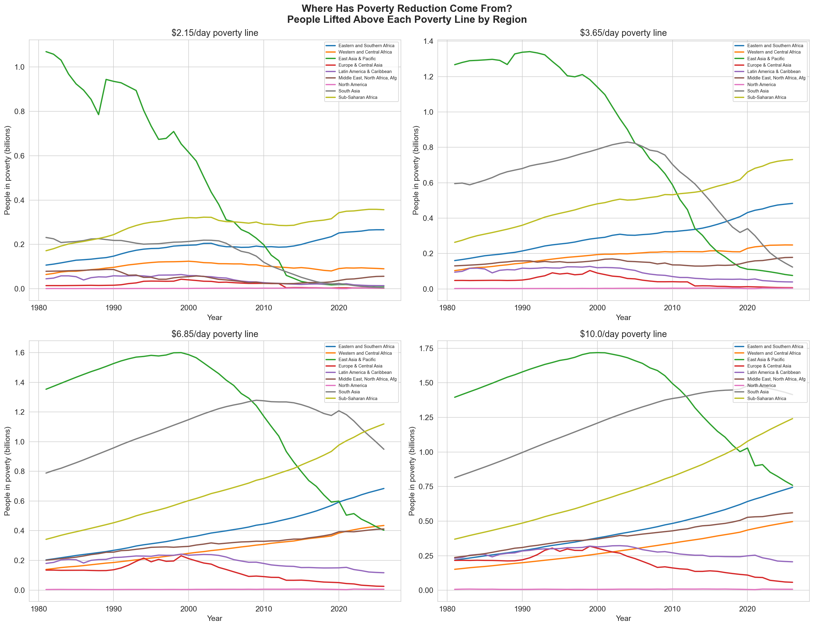
*At $2.15/day, East Asia's dramatic decline (green line, top-left) is the dominant global story. At $6.85/day (bottom-left), South Asia and Sub-Saharan Africa remain largely unchanged. The "declining poverty" narrative is essentially an East Asian story at higher thresholds.*

---

## Where We Push Back

### 1. Growth has made redistribution dramatically cheaper — this changes the math

The papers present growth and redistribution as alternatives. Our data shows they are complements. Growth didn't solve poverty directly, but it *transformed the fiscal arithmetic* of redistribution.

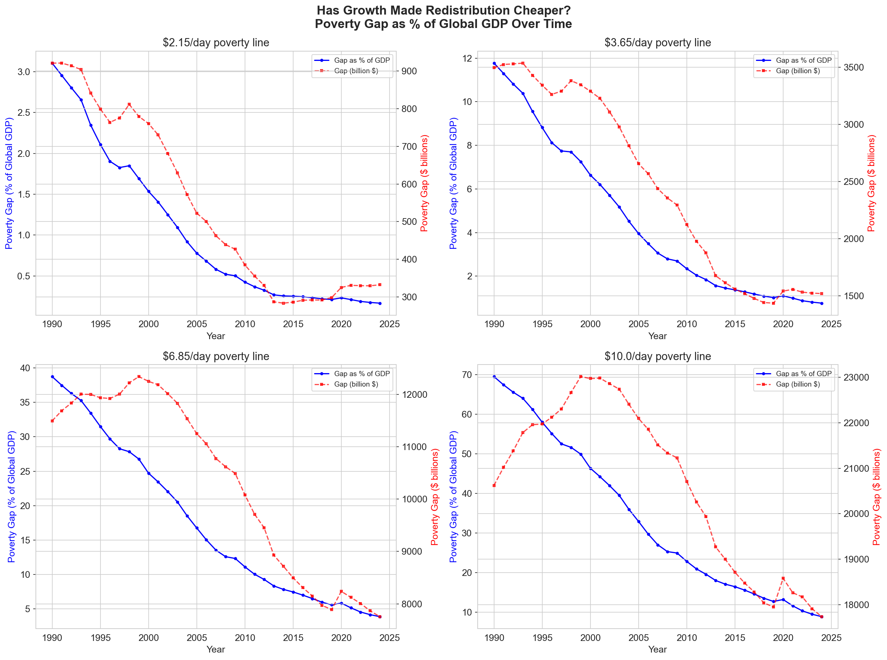
*The poverty gap at every threshold has fallen as a share of global GDP. At $2.15/day: from 1.4% to 0.06% (a 96% decline). At $6.85/day: from ~18% to ~1.6% (91% decline). Ending extreme poverty is now cheap enough to be a policy choice, not a resource constraint.*

| Poverty Line | People Below | Perfect Gap | Realistic Cost (3x) | % of World GDP |
|---|---|---|---|---|
| $2.15/day | 0.45B | $118B | $354B | 0.18% |
| $3.65/day | 1.21B | $560B | $1,680B | 0.84% |
| $6.85/day | 3.14B | $3,132B | $9,396B | 4.71% |
| $10.0/day | 4.29B | $7,464B | $22,392B | 11.21% |

The papers' own preferred solution — redistribution — has become dramatically more feasible precisely *because of growth*. A world with 1.4% of GDP as the extreme poverty gap is resource-constrained. A world with 0.06% is not. Growth created the surplus from which redistribution can draw.

### 2. The poor world doesn't need 175x GDP — it needs 2–3x

The papers' most alarming scenarios assume everyone must converge to current American consumption levels through undirected growth with unchanged distributional patterns. That's a straw man. Our analysis finds:

- The "good life" threshold — where 91–95% of country-years achieve life expectancy ≥70 — is approximately **$15,000 GDP per capita (PPP)**
- Countries below this threshold need only **2.1x their current GDP** to reach it
- At 5% growth, that's **15 years**, not 200

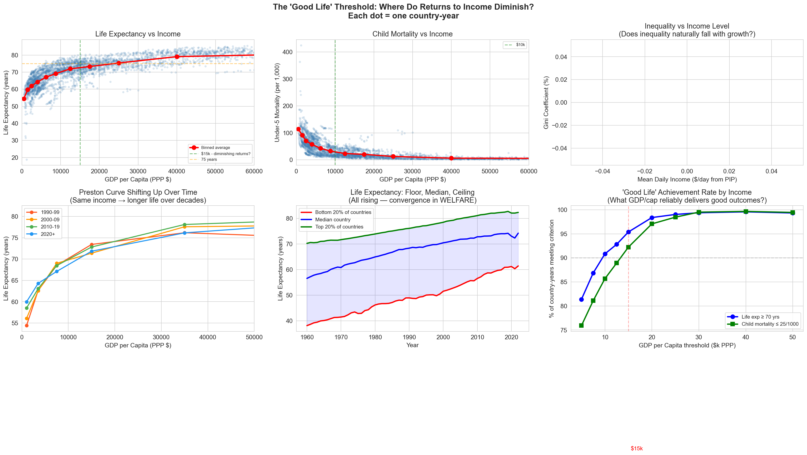
*The Preston curve (top-left, bottom-left) shows that life expectancy reaches ~75 years around $15k GDP/capita, with diminishing returns beyond that. The bottom-right panel shows 91–95% of country-years above $15k achieve life expectancy ≥70. The goal is not American consumption levels — it's the point where material deprivation stops killing people.*

### 3. The floor IS rising — welfare convergence is real even without income convergence

The papers focus on whether poor countries are "catching up" to rich ones (convergence). We argue the more important question is whether the poorest are getting less poor in absolute terms (floor-raising).

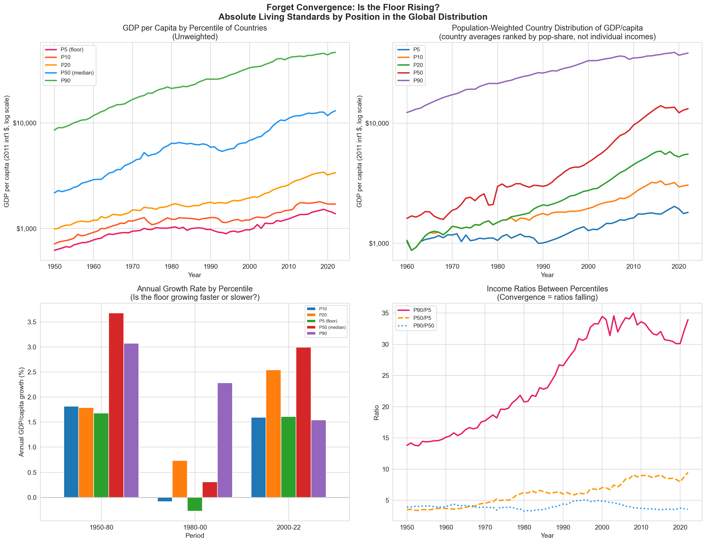
*Top-left: The P5 floor (poorest 5% of countries) has risen from ~$600 to ~$1,400 since 1950. Top-right (population-weighted): even more dramatic improvement. Bottom-left: the floor grew fastest in 2000–2022. Bottom-right: the P90/P5 ratio rose (divergence) from 1950–2000 but has started falling since — the gap is narrowing.*

The Preston curve shift is especially important: the same income buys *more* welfare over time. A country at $5,000 GDP/capita in 2020 has higher life expectancy than a country at $5,000 in 1990, because of public health advances, the Green Revolution, and technology diffusion. Welfare is converging even where incomes aren't.

### 4. Market economies are necessary — the data shows no alternative

The papers implicitly argue for a non-capitalist alternative but never specify one. Our examination of actual non-market economies finds:

- **Zero sustained >4% non-resource growth episodes in pure command economies**
- The USSR peaked at 41% of US GDP/capita in 1980, then declined to 20% by 1998
- China's reform era (6.8%/yr) was **2.5x faster** than the Mao era (2.8%/yr)
- The command economy pattern is universal: fast extensive growth (mobilizing unused resources), then stagnation once the frontier requires innovation

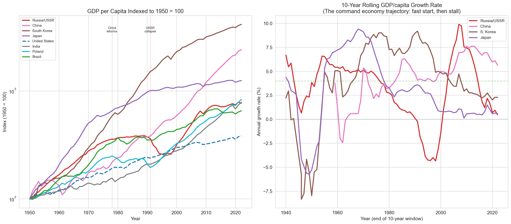
*Left: GDP per capita indexed to 1950. China (pink) stagnated under Mao then exploded after 1978 reforms. Russia (red) grew impressively until the 1970s then flatlined and collapsed. Right: 10-year rolling growth rates showing the USSR's steady deceleration while China accelerated post-reform.*

This doesn't mean laissez-faire capitalism. None of the East Asian successes (Japan, Korea, Taiwan, China, Vietnam) were laissez-faire — all featured heavy state industrial policy, directed credit, and managed trade. The common thread across all sustained development successes is **market mechanisms within state-directed development strategy**. The nuclear reactor metaphor: capitalism is a powerful energy source that requires careful containment and direction, not abandonment.

### 5. The "exploitation" claim is empirically weak

The implicit argument that the rich world's material abundance depends on exploiting the poor world is testable through consumption-based emissions accounting:

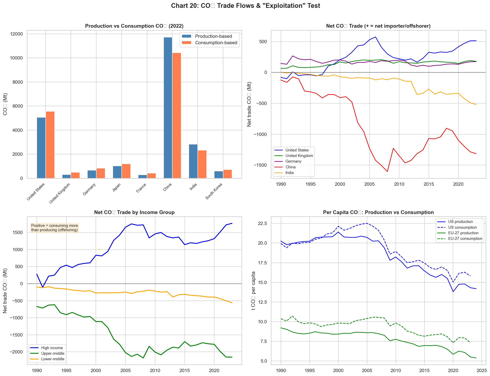
*Top-left: Production vs consumption-based CO₂ for major economies. The US consumes ~10% more than it produces; China EXPORTS ~11% of its production emissions for others' consumption. Top-right: Trade CO₂ over time — China is a massive net exporter of embodied emissions. Bottom panels: the rich world produces 85–92% of its consumed emissions domestically.*

| Country | Production CO₂ | Consumption CO₂ | Offshored |
|---|---|---|---|
| United States | 5,055 Mt | 5,566 Mt | +10.1% |
| United Kingdom | 311 Mt | 503 Mt | +61.6% |
| Germany | 668 Mt | 839 Mt | +25.6% |
| China | 11,712 Mt | 10,427 Mt | **-11.0%** (net exporter) |
| India | 2,831 Mt | 2,340 Mt | **-17.3%** (net exporter) |

There *is* some emissions offshoring, particularly by the UK. But the claim that the rich world "couldn't sustain itself without exploiting the poor world" is not supported. The real trade dependency runs the other direction: poor countries depend on access to rich-world markets for export-led growth.

---

## The Carbon Budget Reality Check

This is where we must be honest: the planetary boundaries argument is stronger than we initially presented. After catching and correcting an error in our analysis, the numbers are sobering.

### Required annual CO₂ intensity decline rates (over 50 years)

| Growth Rate | 1.5°C (300 Gt) | 2°C (900 Gt) | 3°C (~2500 Gt) |
|---|---|---|---|
| 0% | 12.5%/yr | 3.4%/yr | 0.0%/yr |
| 1% | 13.4%/yr | 4.4%/yr | 0.0%/yr |
| 2% | 14.2%/yr | 5.3%/yr | 0.9%/yr |
| **3%** | **15.0%/yr** | **6.3%/yr** | **1.8%/yr** |
| 4% | 15.9%/yr | 7.2%/yr | 2.8%/yr |
| 5% | 16.7%/yr | 8.0%/yr | 3.7%/yr |

**Current best achieved decoupling: ~2.5–2.8%/yr (high-income countries, 2010–2020)**

What this means:

- **1.5°C is essentially gone** regardless of growth path — even at zero growth, you need 12.5%/yr decoupling, roughly 5x the best rate ever achieved
- **2°C at normal growth rates (3%) requires 6.3%/yr** — more than double the current best. This is not "approximately on track." It's a major acceleration that has not yet been demonstrated
- **~3°C at moderate growth is where current trends land** — 1.8%/yr needed vs. ~2.2%/yr being achieved

The papers are right that current decoupling rates are insufficient for safe climate outcomes at normal growth rates. Where we push back: they treat these rates as fixed structural constants. Decoupling *is* accelerating (from -1.25%/yr in 1970–1990 to -2.23%/yr in 2010–2020 globally), and we're at the early stage of an energy transition that could dramatically increase the rate. But "could" is doing a lot of work in that sentence.

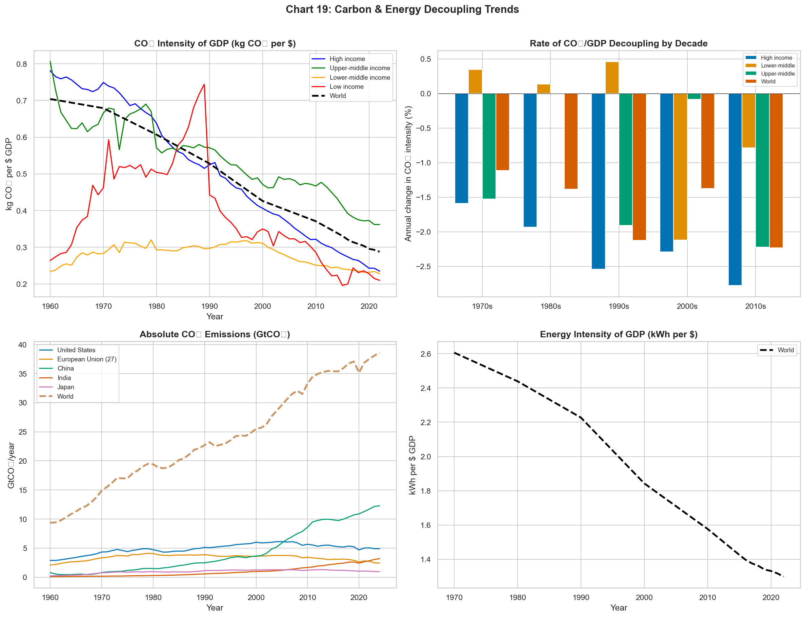
*Top-left: CO₂ intensity of GDP is falling everywhere, with high-income countries leading. Top-right: The rate of decline is accelerating by decade. Bottom-left: Absolute emissions — the US, EU, and Japan are declining; China and India still rising. Bottom-right: Energy intensity follows a similar pattern.*

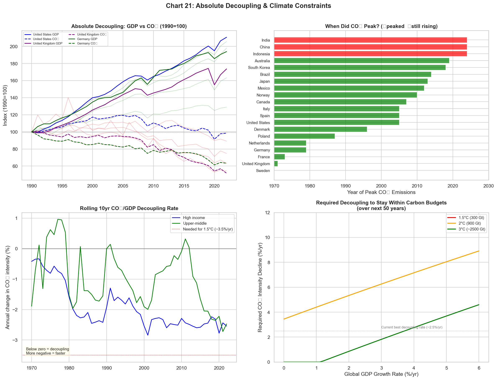
*Top-left: GDP (solid) vs CO₂ (dashed) for the US, UK, and Germany since 1990, showing absolute decoupling. Top-right: When each country's CO₂ peaked. Bottom-left: Rolling decoupling rate — we're achieving ~2–3%/yr but need 3.5%+ for 1.5°C. Bottom-right: The required decoupling rate for each growth rate × carbon budget combination.*

### What if only the poor world grew?

This is a critical test. The poor world (countries below $15k GDP/capita) currently produces only **20% of global CO₂** despite being 55% of the population. If the rich world froze its emissions while the poor world grew to the good-life threshold:

- The 1.5°C budget is blown in **8 years** regardless — because the rich world's existing 30 Gt/yr baseline eats it immediately
- The 2°C budget is exceeded in **27–32 years** depending on decoupling assumptions
- The poor world's growth to $15k/capita (a 2.1x multiplication over 15 years) adds only a modest amount to global emissions

**The planetary boundary problem is overwhelmingly a rich-world emissions problem, not a poor-world growth problem.**

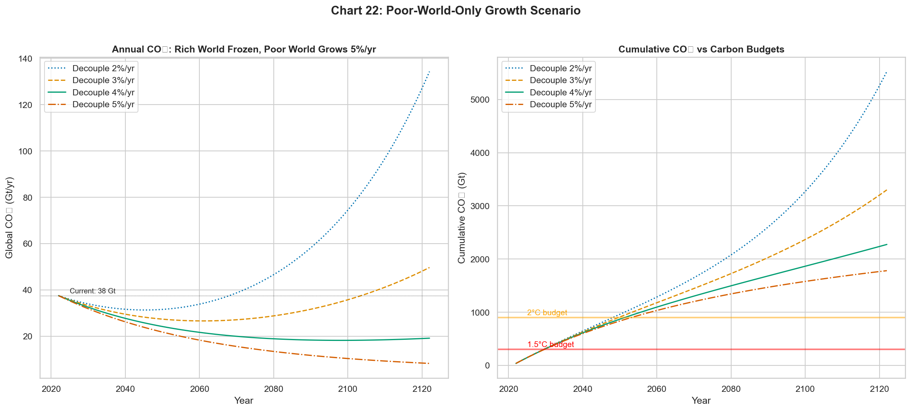
*Left: Annual global CO₂ under different decoupling scenarios with the rich world frozen. At 4–5%/yr decoupling, annual emissions decline steadily. Right: Cumulative emissions vs carbon budgets. The 1.5°C budget is unreachable in all scenarios; the 2°C budget is a stretch but not impossible with aggressive decoupling.*

---

## The Redistribution Gap: What's Actually Delivered vs. What's Proposed

GPT-5.4's sharpest criticism was that we treated redistribution as a simple policy lever without examining whether it actually gets pulled. The data on this is devastating — and it cuts against *both* sides.

### The scale problem

The papers propose redistribution of $1.3–6 trillion per year to close poverty gaps. Here's what the international system actually delivers:

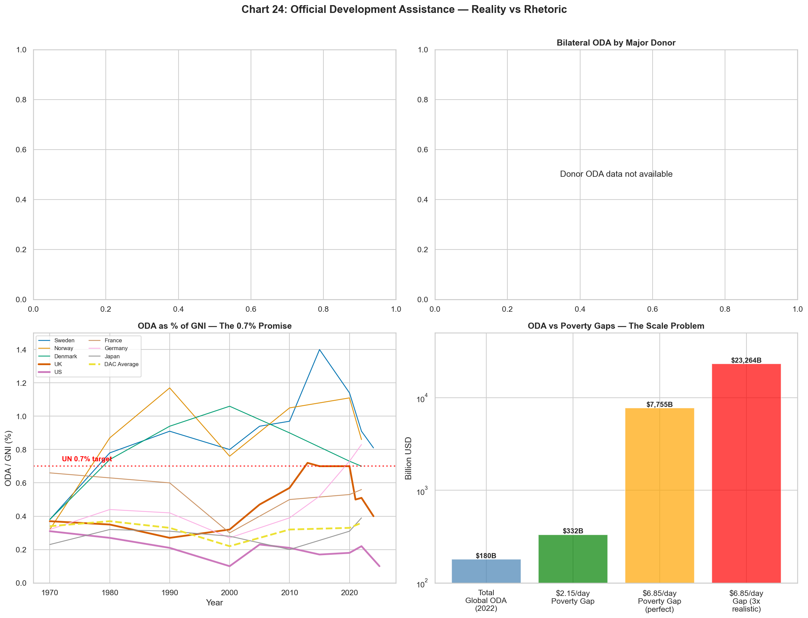
*Top-left: Global ODA has grown but remains a fraction of even the extreme poverty gap. The green dashed line shows the $2.15/day poverty gap ($118B) — ODA now exceeds it. Bottom-left: Only 5-6 countries consistently meet the UN 0.7% ODA/GNI target. The US gives 0.22% (heading to ~0.10% after recent cuts); the UK cut from 0.72% to ~0.40%. Bottom-right: The scale problem on a log chart — total ODA is two orders of magnitude smaller than the realistic $6.85/day gap.*

| Flow | Amount | Scale Reference |
|---|---|---|
| Total global ODA (2023) | ~$203B | |
| Poverty gap at $2.15/day | $118B | ODA covers ~173% |
| Poverty gap at $6.85/day (perfect) | $3,132B | ODA covers ~6.5% |
| Poverty gap at $6.85/day (realistic 3x) | $9,396B | ODA covers ~2.2% |
| Papers' proposed redistribution | $1,300–6,000B | **6–30x total current ODA** |

**Note on units:** Poverty gaps are computed in PPP dollars (the poverty line unit), while ODA is measured in nominal USD. The ratios above are approximate heuristics, not exact financial equivalences — PPP dollars represent purchasing power in poor countries, not market exchange rates.

The papers' redistribution proposals aren't just politically difficult — they're asking for 6 to 30 times the entire current international aid system. In 50+ years, the world has never come close to the 0.7% GNI target (the DAC average is 0.36%), and the trend is **downward** — the US and UK, two of the largest donors, are actively cutting.

### But growth closed the gap from below

The static comparison above understates how much the picture has improved. Growth didn't just make redistribution cheaper as a share of GDP — it shrank the absolute dollar poverty gap toward ODA:

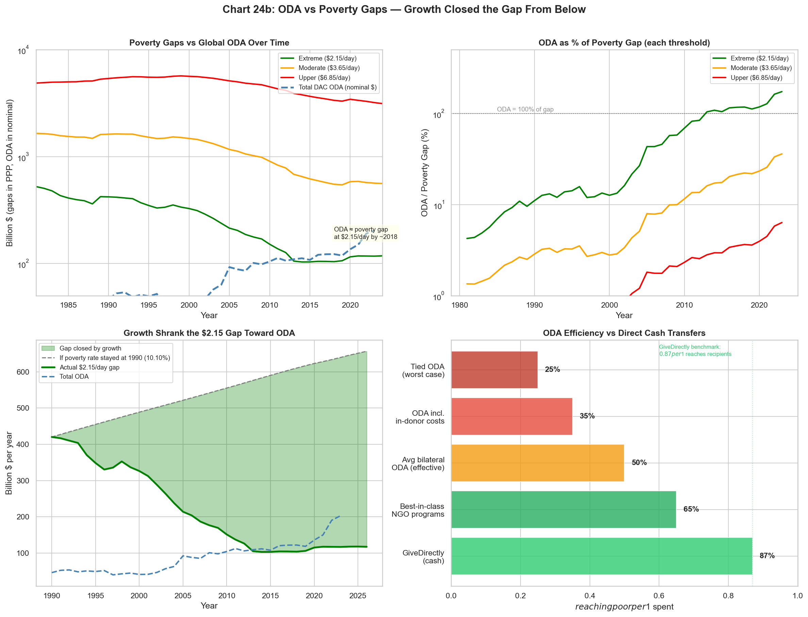
*Top-left: The $2.15/day poverty gap (green) fell from $420B to $118B while ODA rose to $203B — they crossed around 2018. Higher thresholds remain far above ODA. Top-right: ODA as % of each poverty gap over time — now 173% at $2.15, but only 6% at $6.85. Bottom-left: Counterfactual showing how the $2.15 gap would have grown to ~$630B without growth. Bottom-right: ODA efficiency — direct cash transfers deliver $0.87 per dollar vs ~$0.35–$0.50 for traditional bilateral ODA.*

| Threshold | ODA/Gap (1990) | ODA/Gap (2023) | Main Driver |
|---|---|---|---|
| $2.15/day | 11% | **173%** | Growth shrank gap $420B → $118B |
| $3.65/day | 3% | 36% | Growth + rising ODA |
| $6.85/day | 1% | 6% | Gap barely moved ($5.4T → $3.1T) |

At $2.15/day, total ODA now *exceeds* the theoretical poverty gap. Growth brought the mountain down to where aid could reach it. At $6.85/day, ODA covers 6% — no plausible aid increase closes that; only sustained developing-country growth can.

The efficiency question matters too: GiveDirectly-style cash transfers deliver ~$0.87 per dollar to recipients (Haushofer & Shapiro 2016, Egger et al. 2022), with $2.60 local GDP multiplier effects. Traditional bilateral ODA delivers $0.35–$0.50 after in-donor costs, tied aid, and administrative overhead. For pure poverty-gap closure, cash is 2x more efficient than the average aid dollar. But ODA isn't designed solely for poverty-gap closure — infrastructure, health systems, and institutional capacity require non-cash investment.

### And the headline numbers overstate reality

Your point about questionable items being billed as aid is well-documented:

- **14.4% of DAC ODA in 2022** ($29.3B of $204B) was in-donor refugee costs — money that never left the donor country
- Sweden counted domestic refugee housing as "ODA," inflating its ratio to 1.4% of GNI in 2015
- Debt relief shows up as "new aid" (Iraq relief added ~$14B to 2005 figures)
- Administrative costs of aid agencies count
- ~20% of bilateral ODA is still tied (recipient must buy donor goods, reducing effective value by 15-30%)

Effective real resource transfer to poor countries is roughly **25-40% less** than the headline ODA number suggests.

### The "squeezed middle" is real

The papers treat rich-world redistribution as a policy choice blocked by greed. The data suggests something more structural:

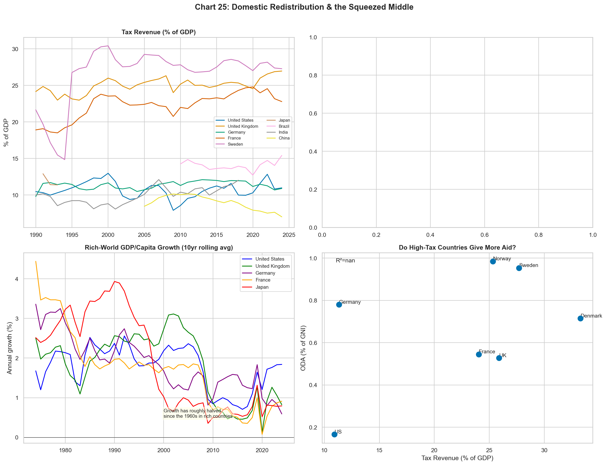
*Top-left: Total tax revenue as % of GDP (OECD Revenue Statistics) — France ~45%, Sweden ~43%, Germany ~38%, UK ~34%, US ~26%. Bottom-left: Rich-world GDP/capita growth has roughly halved — from 2.5-6.5%/yr in 1960-75 to 0.9-1.7%/yr in 2010-23. This isn't imagined. Bottom-right: Countries with higher total tax burdens tend to give more ODA — domestic and international redistribution come from the same political wellspring.*

> **Data note:** Earlier versions used the WDI indicator GC.TAX.TOTL.GD.ZS (central-government tax revenue only), which is missing entirely for France, Germany, the US, UK, and Japan. Chart 25 now uses [OECD Revenue Statistics](https://www.oecd.org/tax/tax-policy/revenue-statistics.htm), which captures **total general-government tax** including social security contributions, sub-national taxes, and all other levies. This is why France shows ~45% rather than the ~0% the WDI would imply.

| Country | Growth 1960–75 | Growth 2010–23 | Decline |
|---|---|---|---|
| United States | 2.5%/yr | 1.7%/yr | -32% |
| United Kingdom | 2.3%/yr | 1.0%/yr | -57% |
| Germany | 3.2%/yr | 1.3%/yr | -59% |
| France | 4.2%/yr | 0.9%/yr | -79% |
| Japan | 6.5%/yr | 1.1%/yr | -83% |

When GDP/capita growth halves and domestic inequality widens, the median voter feels stagnant even as aggregate GDP rises. Telling these voters to increase foreign aid is a political non-starter — not because they're selfish, but because their real experience is one of diminishing returns from the growth model.

**This is the deepest challenge to the papers' proposed solution:** redistribution requires political will, political will requires voters who feel they have enough to share, and the rich-world growth slowdown has eroded exactly that feeling. The papers' logical chain — "redistribution is efficient, therefore we should redistribute" — skips the hardest step.

### The energy S-curve: the wildcard

One reason for optimism despite the political economy problem:

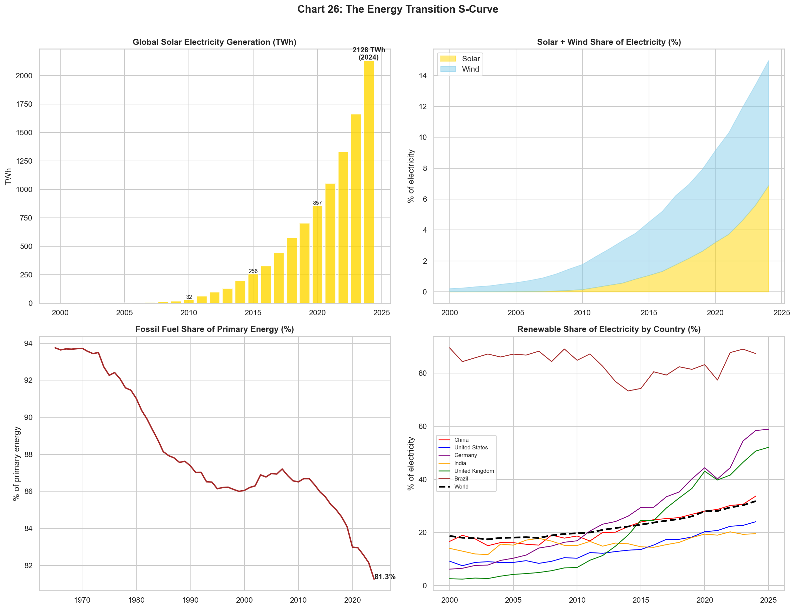
*Top-left: Solar generation has gone from 4 TWh (2005) to 2,128 TWh (2024) — a 500x increase, doubling every ~3 years. Top-right: Solar + wind now supply ~15% of global electricity and the curve is steepening. Bottom-left: Fossil fuels have fallen from 94% to 81% of primary energy. Bottom-right: Renewable electricity shares by country — Germany and UK above 50%, world average approaching 30%.*

Solar is doubling every ~3.2 years (24.4%/yr, 2018–2024). If that rate continues:
- By 2027: ~4,100 TWh (matching US total electricity — 4,391 TWh)
- By 2030: ~7,900 TWh (~25% of current global electricity demand of 30,938 TWh)
- By 2033: ~15,000 TWh (~50% of global demand)
- By 2035: ~23,000 TWh (~75% of global demand)

For context: China alone generates 10,087 TWh (33% of world), the US 4,391 TWh (14%). Global electricity demand is ~31,000 TWh and rising. The S-curve will inevitably flatten (grid integration limits, storage, nighttime), but even conservative estimates put solar at 15–25% of global electricity by 2030.

This could resolve the tension between growth and climate in a way that neither the papers' redistribution proposals nor current policy trajectories anticipate. The energy transition is the variable that could make 4-5%/yr decoupling achievable — moving us from the 3°C path to something closer to 2°C.

---

## Beyond Carbon: The Planetary Boundaries the Papers Should Have Emphasized

GPT-5.4's second major criticism was that our ecological analysis was "too carbon-centric." The Rockström/Steffen planetary boundaries framework identifies nine Earth-system processes — carbon is just one. The data on the others is, frankly, worse than the carbon story.

### Material footprint: the decoupling that isn't happening

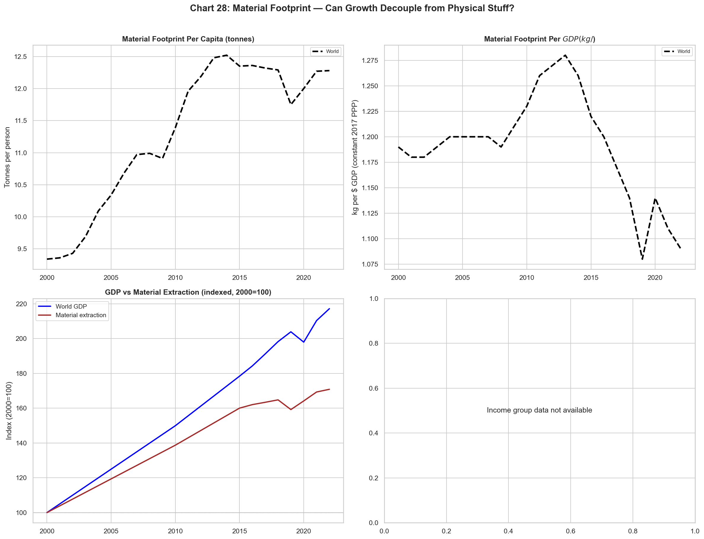
*Top-left: Global material footprint per capita has risen 31% since 2000 (9.3 → 12.3 tonnes/person). Top-right: Material intensity of GDP (kg/$ GDP) has barely declined — only 0.4%/yr vs 1.8%/yr for carbon intensity. Bottom-left: GDP has grown 117% since 2000 while material extraction grew 71% — relative decoupling but NO absolute decoupling.*

This is the key chart for the ecological critique. Carbon has a clear technological pathway to decoupling (renewables replacing fossil fuels). **Material extraction has no equivalent.** There is no "solar panel for copper" — you need the physical stuff. Material intensity is declining at only 0.4%/yr vs 1.8%/yr for carbon. At current rates, keeping material use flat while GDP grows at 3% would require 6x the current material decoupling rate.

### Biodiversity: the irreversible crisis

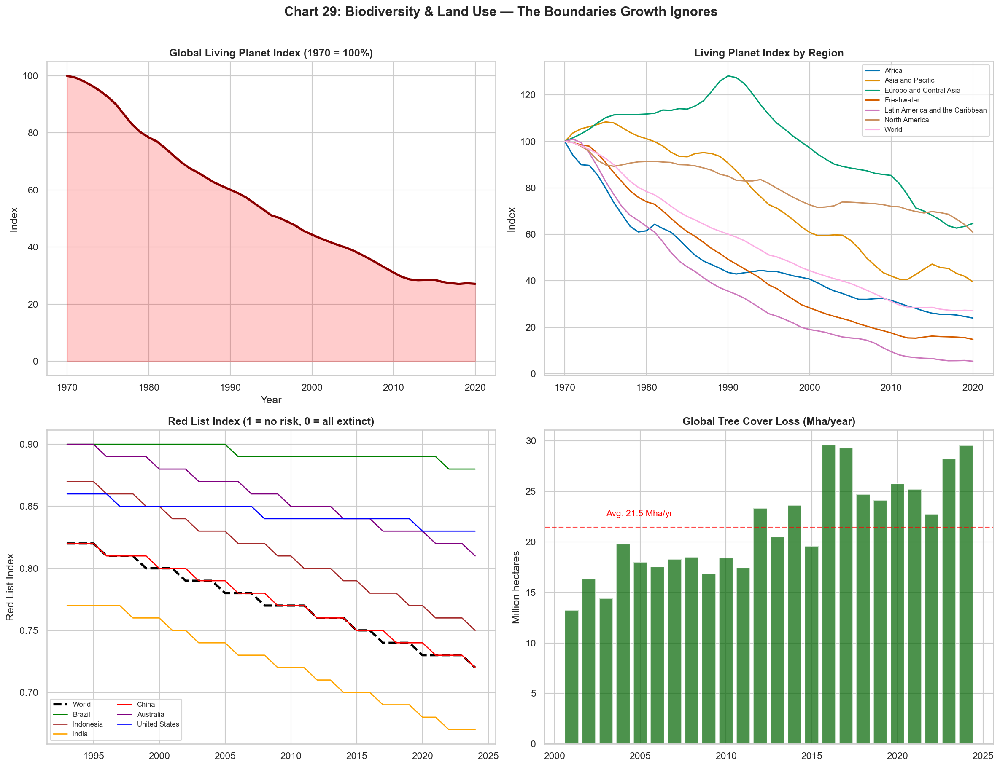
*Top-left: The Living Planet Index shows a 73% decline in monitored vertebrate populations since 1970. Top-right: Latin America has lost 95% of monitored wildlife — the worst regional collapse. Bottom-left: The Red List Index is declining worldwide. Bottom-right: Tree cover loss averages 21.5 Mha/yr and is trending upward.*

| Region | LPI Decline (1970–2020) |
|---|---|
| Latin America & Caribbean | -95% |
| Freshwater species | -85% |
| Africa | -76% |
| World (global average) | -73% |
| Asia & Pacific | -60% |
| North America | -39% |
| Europe & Central Asia | -35% |

This is the boundary where the "irreversibility" argument is strongest. You can build solar panels and restore carbon sinks. **You cannot bring back extinct species.** The 73% LPI decline dwarfs anything in the carbon story.

### Nitrogen, phosphorus & water: the invisible boundaries

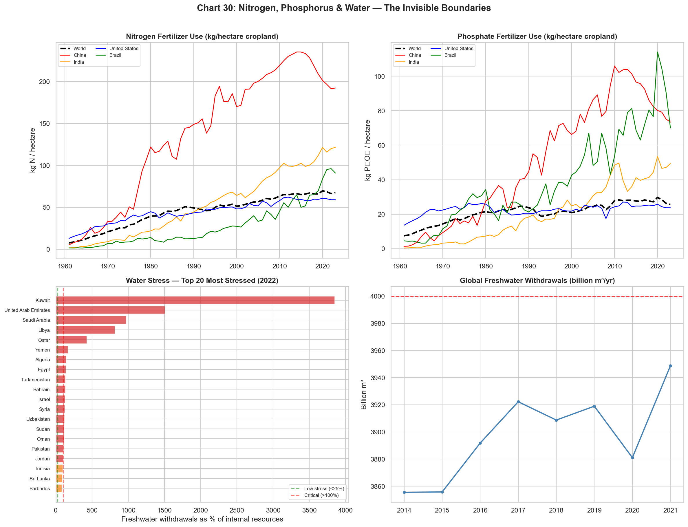
*Top-left: Nitrogen fertilizer use per hectare has increased 800% since 1961, with China peaking at 200+ kg/ha. Top-right: Phosphate fertilizer following a similar trajectory. Bottom-left: 17 countries are in critical water stress (>100% of renewable resources), mostly in the Middle East/North Africa. Bottom-right: Global freshwater withdrawals are approaching the 4,000 km³/yr Rockström boundary.*

- **Nitrogen**: Industrial fixation (~120 Tg N/yr) is **3.5x the safe boundary** (35 Tg/yr). This is the most severely breached boundary after biodiversity. It causes ocean dead zones, algal blooms, groundwater contamination, and N₂O emissions. There is no easy tech fix — it's directly tied to feeding 8 billion people.
- **Phosphorus**: Flow to oceans (~8-10 Tg/yr) is approaching the 11 Tg/yr boundary. Phosphorus is mined from finite phosphate rock with no substitute in agriculture.
- **Freshwater**: Global withdrawals ~3,949 km³/yr, right at the 4,000 km³/yr boundary. 17 countries already exceed 100% of their renewable freshwater resources.

### The scorecard

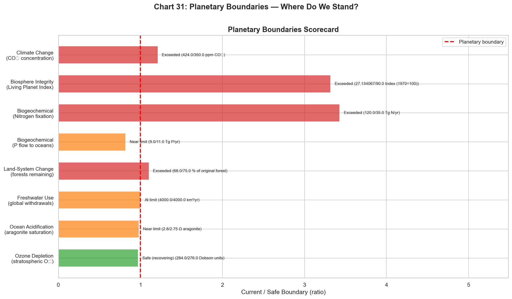
*Horizontal bars show the ratio of current status to the safe boundary for each planetary process. The red dashed line marks the boundary. Four boundaries are clearly exceeded (red), three are at/near the limit (orange), and only ozone is recovering (green — thanks to the Montreal Protocol).*

| Boundary | Safe Limit | Current | Status |
|---|---|---|---|
| Climate change (CO₂) | 350 ppm | 424 ppm | **Exceeded** |
| Biosphere integrity (LPI) | 90 (index) | 27 (index) | **Exceeded** |
| Nitrogen fixation | 35 Tg/yr | 120 Tg/yr | **Exceeded (3.4x)** |
| Land-system change | 75% forests | 68% forests | **Exceeded** |
| Freshwater use | 4,000 km³/yr | ~3,949 km³/yr | At limit |
| Phosphorus flow | 11 Tg/yr | ~9 Tg/yr | Near limit |
| Ocean acidification | 2.75 Ω | 2.8 Ω | Near limit |
| Ozone depletion | 276 DU | 284 DU | Safe (recovering) |

Consistent with Richardson et al. (2023): **6 of 9 boundaries transgressed.**

### Material decoupling: the harder problem

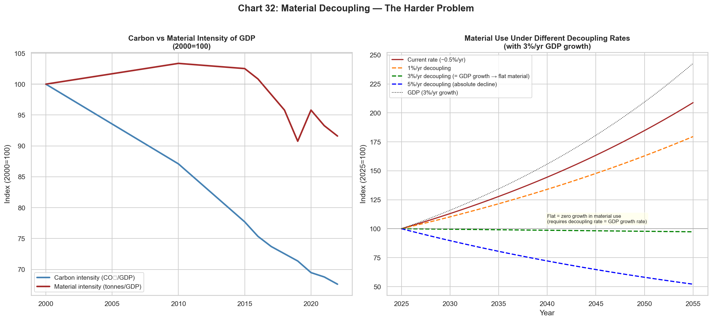
*Left: Since 2000, carbon intensity of GDP has fallen ~30% while material intensity has fallen only ~8%. Right: Under 3% GDP growth, keeping material extraction flat requires 3%/yr decoupling — 6x the current rate of 0.5%/yr. Absolute material decline would require 5%/yr, which is unprecedented.*

**This is the strongest data-driven argument for the papers' position.** Carbon decoupling is 4.5x faster than material decoupling (1.8%/yr vs 0.4%/yr). Even the optimistic energy transition story doesn't help here — solar panels, wind turbines, and batteries all require massive material inputs (lithium, cobalt, copper, rare earths). The energy transition may actually *increase* material demand in the short term.

The honest position: the papers are **more right on ecology than on economics.** The "capitalism is mathematically unworkable" framing is wrong — the math shows poverty reduction is working through growth. But the planetary boundaries framing is substantially correct — growth-as-usual, even with carbon decoupling, is ecologically unsustainable across multiple dimensions simultaneously.

### But is it universal? Country-level decomposition

The global aggregates hide enormous variation. Carbon decoupling varied hugely by country — does the same apply to material consumption, nitrogen, biodiversity, and deforestation?

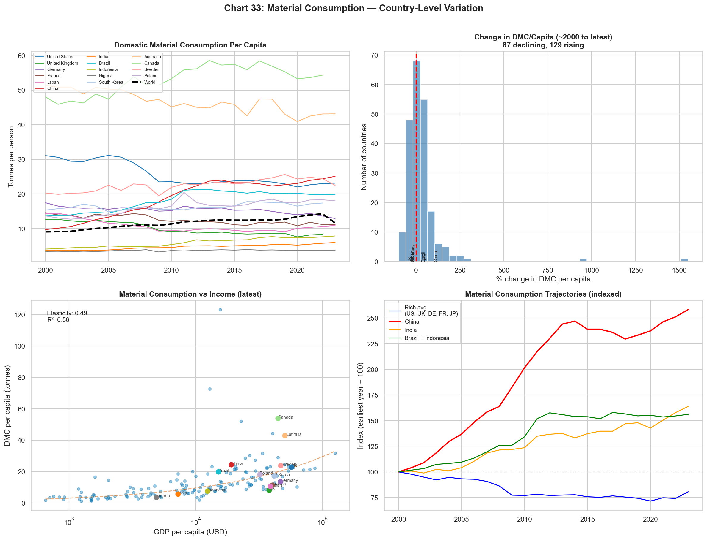
*Top-left: Domestic material consumption per capita varies from 3-5t (India, Nigeria) to 30-50t (US, Australia). China has doubled from 11→24t since 2000. Top-right: 87 countries show declining DMC/cap but 129 are rising — global decoupling is not happening. Bottom-left: material-income elasticity of 0.49 — richer countries use proportionally less material per $ of GDP, but still far more in absolute terms. Bottom-right: rich countries declining, China exploding.*

| Country | DMC/cap 2000 | DMC/cap latest | Change | CO₂/GDP change |
|---|---|---|---|---|
| United States | 30.3t | 22.7t | **-25%** | -40% |
| United Kingdom | 12.3t | 8.2t | **-34%** | -53% |
| Germany | 16.2t | 13.7t | **-15%** | -44% |
| Japan | 13.2t | 10.5t | **-21%** | -25% |
| China | 11.3t | 24.1t | **+113%** | -30% |
| India | 3.7t | 5.6t | **+52%** | -19% |
| Brazil | 14.2t | 20.0t | **+41%** | -16% |
| Indonesia | 4.5t | 7.6t | **+68%** | -20% |

The pattern is striking: **every country is carbon-decoupling, but only rich countries are materially decoupling.** China reduced its CO₂/GDP by 30% while its material consumption per person more than doubled. This is the cleanest evidence that carbon decoupling is not a proxy for ecological sustainability.

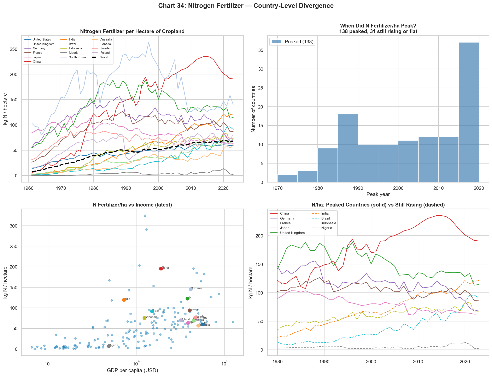
*Top-left: N fertilizer/ha trajectories since 1961 — China peaked at ~230 kg/ha and is now declining (a policy success), while India, Brazil, and Indonesia are still rising. Top-right: 138 countries have peaked N use, 31 are still rising. Bottom-right: The two trajectories — peaked countries (solid) vs still rising (dashed).*

**Nitrogen is the one area where policy has demonstrably worked in some countries.** China peaked at ~230 kg/ha around 2015 and has declined ~15% — the result of deliberate policy to reduce fertilizer intensity. Germany, France, UK, and Japan all peaked in the 1980s-2000s. But India (+79%), Brazil (+183%), and much of Africa are still on steep upward trajectories.

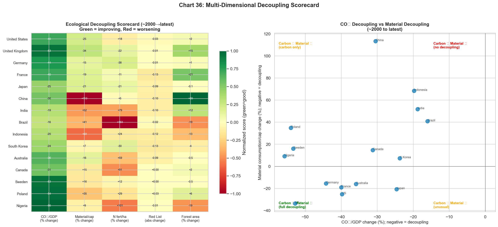
*Left: Heatmap showing ecological performance across five dimensions (green = good, red = bad). Right: CO₂ decoupling vs material decoupling scatter. Only 6 of 15 countries are decoupling on both carbon AND materials simultaneously — and none are improving on all five dimensions.*

The multi-dimensional scorecard reveals the full picture:

| Country | CO₂/GDP | Material/cap | N fert/ha | Red List | Forest |
|---|---|---|---|---|---|
| **UK** | -53% | -34% | -22% | -0.01 | +16% |
| **Germany** | -44% | -15% | -38% | -0.01 | +1% |
| **US** | -40% | -25% | +18% | -0.03 | +2% |
| **China** | -30% | +113% | +5% | -0.10 | +39% |
| **India** | -19% | +52% | +79% | -0.10 | +12% |
| **Brazil** | -16% | +41% | +183% | -0.02 | -19% |
| **Indonesia** | -20% | +68% | +24% | -0.12 | -13% |

**No country is improving on all dimensions.** The UK and Germany come closest — declining carbon, declining materials, declining nitrogen, expanding forests — but even they show small biodiversity deterioration. The developing world is moving in the wrong direction on materials, nitrogen, and biodiversity while making modest carbon-intensity improvements.

The reforestation story has a twist: China (+45%) and India (+14%) are aggressively planting trees, but monoculture plantations don't restore biodiversity. Brazil (-21%) and Indonesia (-17%) are losing primary forest with irreplaceable ecological value.

### But wait — what about transition minerals?

In the previous section I wrote that the energy transition "may make material extraction *worse* (lithium, cobalt, copper for batteries and solar panels)." That claim deserves scrutiny — with actual numbers.

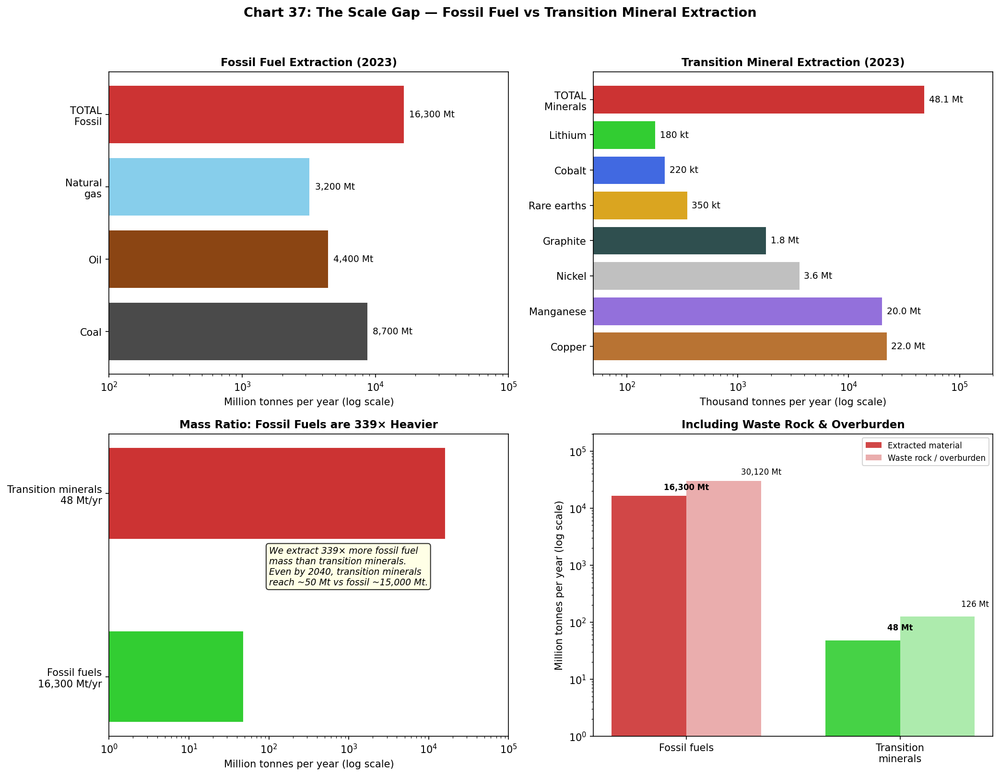
*The scale difference is staggering. Fossil fuel extraction is 16,300 Mt/year vs 48 Mt/year for all transition minerals combined — a 340:1 ratio. Even including waste rock, fossil fuels move ~30,000 Mt of earth vs ~115 Mt for minerals. By 2040 under the most aggressive clean energy scenario, minerals reach ~50 Mt while fossil fuels (even declining) remain above 10,000 Mt.*


*Across every dimension of ecological harm, fossil fuels dominate by 1-2 orders of magnitude: 201× more CO₂, 18× more water, 26× more land disturbance, 204× more deaths. The green bars are barely visible.*

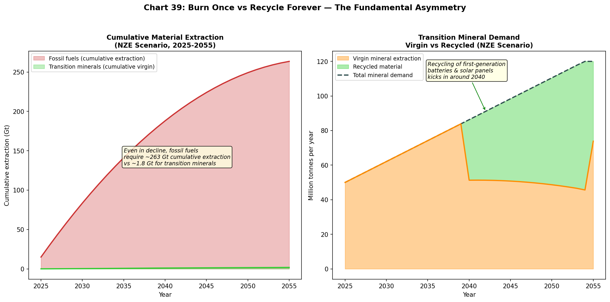
*The fundamental asymmetry: fossil fuels are burned once and gone, requiring continuous extraction forever. Transition minerals are stocks — copper wire lasts 50+ years, battery lithium can be recycled at 90-95%. Once you build the clean energy infrastructure, virgin extraction needs drop as recycling kicks in around 2040.*

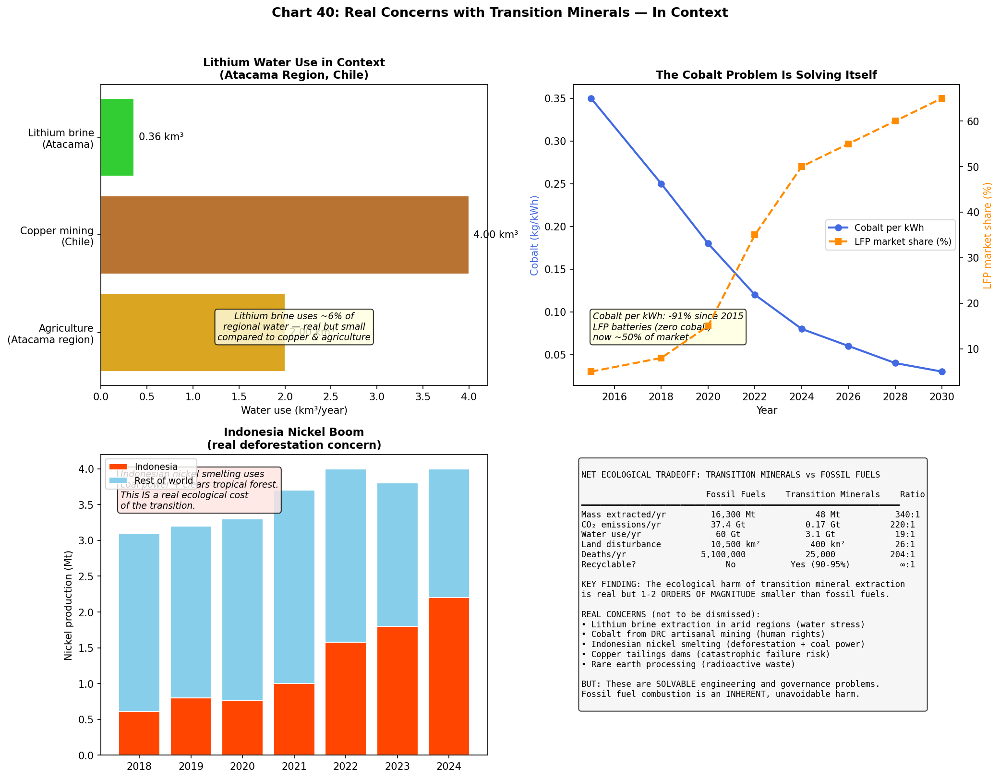
*The real concerns aren't imaginary: lithium brine extraction strains water in the Atacama (but accounts for only ~6% of regional water use), DRC cobalt involves human rights issues (but cobalt per kWh has fallen 91% since 2015 as LFP batteries take over), and Indonesian nickel smelting drives deforestation using coal power. These are solvable engineering and governance problems — unlike CO₂ from combustion, which is an inherent, unavoidable harm.*

| Dimension | Fossil Fuels | Transition Minerals | Ratio |
|---|---|---|---|
| Mass extracted/yr | 16,300 Mt | 48 Mt | **340:1** |
| CO₂ emissions/yr | 37.4 Gt | 0.17 Gt | **220:1** |
| Water use/yr | 60 Gt | 3.1 Gt | **19:1** |
| Land disturbance | 10,500 km² | 400 km² | **26:1** |
| Deaths/yr | 5,100,000 | 25,000 | **204:1** |
| Recyclable? | No | Yes (90-95%) | **∞:1** |

**Self-correction:** My earlier statement was a false equivalence. The ecological harm of transition mineral extraction is real — Indonesian nickel deforestation, DRC cobalt, Atacama lithium water stress, copper tailings dam risks, rare earth processing waste are all genuine concerns. But they are 1-2 orders of magnitude smaller than what they replace. And critically, these are *solvable* engineering and governance problems (better mining practices, recycling, alternative chemistries), whereas CO₂ from fossil fuel combustion is inherent to the physics.

### Technology pathways: which boundaries have exits?

The energy transition story suggests a pattern: some planetary boundaries have clear technological solutions, others don't. Cheap abundant solar power is a cascading enabler — but it only cascades to some problems.

**Carbon → Clear path.** Solar/wind replacing fossil fuels. The technology exists, is scaling exponentially, and is already cost-competitive. The constraint is deployment speed, not invention.

**Freshwater → Plausible path via desalination.** Modern reverse osmosis requires ~4 kWh/m³. If solar drives electricity to $0.01-0.02/kWh, desalination energy cost drops to ~$0.06/m³ — competitive with municipal water ($0.50-2.00/m³ today). Covering the global water-stress deficit (~500 km³/yr) would require ~2,000 TWh, or 6.5% of current global electricity — technically feasible with the solar trajectory above. **But the 70% of water that goes to agriculture remains too expensive to desalinate** ($0.06/m³ vs surface irrigation at $0.01-0.05/m³), and inland regions can't cheaply pipe seawater. Solar helps cities; it doesn't solve agricultural water stress.

**Nitrogen → Cheap energy makes the problem WORSE, not better.** The planetary boundary isn't about the cost of producing fertilizer — Haber-Bosch is already near thermodynamic limits. The problem is *runoff*: only 40-50% of applied N is taken up by crops. The rest creates 400+ ocean dead zones. Cheaper energy → cheaper fertilizer → more over-application. Real solutions are governance and precision agriculture: GPS-guided variable-rate application (15-30% reduction, ~25% adoption in US, <5% globally), slow-release coatings (20-40% less runoff, 2-3x more expensive), nitrification inhibitors, and engineered biological N fixation (Pivot Bio et al. — promising but <1% market penetration). These are adoption and regulatory problems, not technology-waiting-to-be-invented problems.

**Phosphorus → No creation path.** P is an element, not a molecule. There is no Haber-Bosch equivalent possible — you cannot synthesize it. Global reserves (~70 billion tonnes, 70% in Morocco/Western Sahara) give ~300 years at current rates, but demand is rising. The only path is recycling: wastewater P recovery (struvite precipitation) can capture 80-90%, but only ~5% of wastewater P is currently recovered globally. Animal manure contains 15-20 Mt P/yr (comparable to the 20 Mt mined), but most isn't efficiently returned to cropland. Reducing the 30% of food wasted globally would reduce P demand proportionally.

**Biodiversity → No technological path.** Habitat loss is the primary driver of biodiversity decline. You can build solar panels and restore carbon sinks, but you cannot bring back extinct species or rebuild complex ecosystems. Conservation requires land-use governance — protecting habitat from conversion — which is fundamentally a political and economic problem.

| Boundary | Tech Path | Key Constraint | Solar Helps? |
|---|---|---|---|
| Carbon | Clear (solar/wind) | Deployment speed | **Yes — directly** |
| Freshwater | Plausible (desalination) | Agriculture too expensive | **Partially** — cities yes, farms no |
| Nitrogen | Partial (precision ag) | Governance, not energy | **No** — makes it worse |
| Phosphorus | None (recycling only) | Element, not molecule | No |
| Biodiversity | None | Habitat loss | No |

The pattern is instructive: **abundant cheap energy solves the energy-system boundaries (carbon, and partially freshwater) but not the biogeochemical or ecological boundaries.** The papers' critique is weakest where technology has a clear path (carbon) and strongest where it doesn't (nitrogen, phosphorus, biodiversity). The honest framing is that we need both: technology-driven decoupling for energy systems *and* governance-driven restraint for biogeochemical cycles and land use.

---

## Independent Critical Review

*This section was written by GPT-5.4 as an independent assessment of the entire project.*

This project is materially stronger than the polemical claim it is responding to. It does not just wave at "growth" in the abstract; it breaks the question into poverty gaps, regional composition, convergence, elasticity, redistribution cost, historical growth episodes, decoupling, and carbon-budget arithmetic. That is the right way to approach a loaded ideological argument. The project uses mainstream public sources — World Bank poverty data, WDI, Maddison Project, and OWID — giving it a credible empirical foundation. But a credible foundation is not the same as a decisive argument, and some of the project's most confident conclusions go further than its own evidence allows.

### What's Solid

The single strongest empirical move is the poverty-gap-as-share-of-GDP framing. If the global poverty gap at $2.15 fell from 1.4% of world GDP in 1990 to 0.06% in 2024, and the $6.85 gap fell from roughly 18% to roughly 1.6%, that is a major fact. It means growth did not "solve" poverty, but it dramatically changed the fiscal scale of the problem. A world where the extreme-poverty gap is $118 billion is morally scandalous, but it is not resource-constrained in the same way a world with a 1.4% GDP gap was.

The project deserves credit for using multiple thresholds rather than hiding behind $2.15 alone. The convergence analysis is especially good: showing that population-weighted convergence is real while unweighted sigma divergence worsened from 0.95 to 1.21 is exactly the kind of distinction serious work should make.

The carbon-budget correction is probably the project's most valuable single contribution. It replaces fuzzy ecological rhetoric with explicit rates: ~12.5% annual decoupling for 1.5°C at zero growth, 6.3% for 2°C at 3% growth, 1.8% for 3°C at 3% growth. That is clear, falsifiable, and much better than ideological handwaving from either side.

### Blind Spots and Steel-Man Arguments Missed

**The biggest blind spot is political economy.** The project correctly identifies that "capitalism is unworkable" requires equating capitalism with zero redistribution, which is empirically false (Nordic social democracy exists). But this only defeats a weak version of the anti-capitalist claim. A stronger version is that capitalist systems have a *persistent tendency* to underprovide redistribution and overexploit ecological sinks because profits are private, losses are socialized, and wealthy coalitions resist both taxes and climate constraints. The project says redistribution is possible. The papers would reply that the problem is it is *systematically not done*.

**The ecological rebuttal is too carbon-centric.** The papers invoke "planetary boundaries" — plural. Material extraction, land use, biodiversity loss, nitrogen cycles, water stress, and mining impacts from energy transition minerals are mostly outside the analysis frame. If the papers wanted to strengthen their case, this is exactly where they should press.

**The exploitation analysis is too narrow.** Carbon-accounting geography doesn't capture the full dependency critique. Terms of trade, ownership of supply chains, debt discipline, intellectual property regimes, currency hierarchy, and historical extraction all matter. The analysis knocks down a crude emissions-offshoring story. It does not dispose of dependency-style critiques in general.

### Where the Project's Own Arguments Are Weakest

The corrected carbon arithmetic actually supports a significant part of the ecological critique. The numbers show:

- 1.5°C is effectively unattainable under any plausible macro path
- 2°C with continued 3% global growth requires **more than double** the best recent decoupling performance (6.3%/yr vs. 2.8%/yr achieved)
- Current trends are compatible with **~3°C warming** — which is not "on track" in any policy-relevant sense

Saying "we're on track for 3°C because only 1.8% decoupling is needed" is not a defense of the growth model. It is an admission that current trajectories are compatible with dangerous warming.

The project also underplays how much its own poverty analysis vindicates the papers at higher thresholds. If the realistic redistribution cost at $6.85/day is $9.4 trillion (4.71% of GDP), then the remaining task is genuinely enormous — not a rounding error that growth has nearly solved.

### Independent Insights

The most important thing this data implies is something neither side states cleanly: **growth and redistribution are complements, not substitutes.**

Growth has done two things at once: it has raised floors somewhat (P5 income: $620→$1,378, 1950–2022) and it has dramatically reduced the share of world output required to close the very bottom poverty gaps. That means growth has real moral value even when it is not sufficient. But it also means the remaining obstacle to ending extreme poverty is now more political than material.

However, once you move from destitution to mass flourishing, redistribution alone stops being a serious answer. You cannot permanently cash-transfer billions of people into durable prosperity without productivity, infrastructure, urban systems, public health, education, electricity, housing, and functioning states. That is why the project is right to emphasize development and why the papers are right to emphasize distribution.

### The Real Dispute

The real dispute is not "growth or redistribution." It is **what mix of growth, redistribution, industrial policy, public goods, and climate constraint can actually work** — and whether existing political-economic institutions are capable of delivering that mix fast enough.

---

## From Transfers to Self-Sufficiency

Cash transfers are efficient at alleviating poverty. But can they build durable prosperity? The answer matters enormously, because a world that depends on permanent transfers from rich to poor countries is one political pivot away from catastrophe.

### What does $15k actually look like?

The "good life" threshold isn't abstract. Here's what countries at different income levels actually provide their citizens:

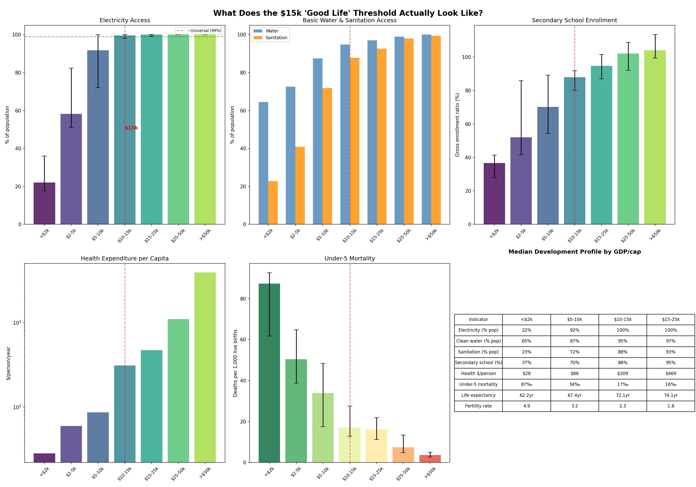
*At <$2k GDP/cap: 27% electricity access, 20% sanitation, 74‰ child mortality, 63-year life expectancy. At $10-15k: 100% electricity, 87% sanitation, 16‰ child mortality, 72-year life expectancy. The $15k threshold marks where every basic service reaches near-universal coverage.*

| Indicator | <$2k GDP/cap | $5-10k | $10-15k | $15-25k |
|---|---|---|---|---|
| Electricity access | 27% | 90% | 100% | 100% |
| Clean water | 61% | 88% | 93% | 96% |
| Sanitation | 20% | 70% | 87% | 92% |
| Secondary school enrollment | 37% | 68% | 85% | 95% |
| Health spending/person | $35 | $85 | $309 | $408 |
| Under-5 mortality | 74‰ | 30‰ | 16‰ | 16‰ |
| Life expectancy | 63.1yr | 68.7yr | 72.3yr | 73.8yr |
| Fertility rate | 4.3 | 3.2 | 2.3 | 1.9 |

The jump from <$2k to $10-15k is enormous on every dimension. The jump from $10-15k to $15-25k is modest — this confirms that $15k is approximately where diminishing returns set in and basic needs are met.

### Some countries do it efficiently — but none through transfers alone

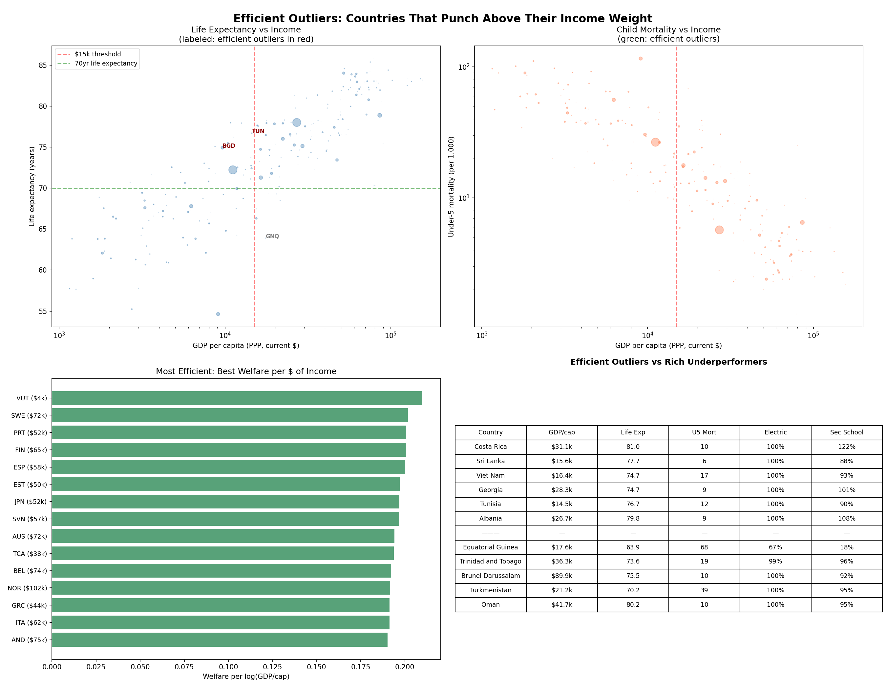
*Top-left: Life expectancy vs GDP — Costa Rica, Sri Lanka, Vietnam, Cuba, and Albania all achieve >72-year life expectancy below $15k. These "efficient outliers" invest heavily in public health and education with less income. Bottom-left: welfare efficiency ranking. But even this efficiency has limits: no country has achieved full development at <$5k GDP/cap.*

Countries like Costa Rica, Sri Lanka, Vietnam, and Cuba show that smart public investment in health and education can punch above their income weight. But the key insight: **even efficient outliers had to build productive economies.** Costa Rica has thriving ecotourism and tech sectors. Vietnam has export manufacturing. Sri Lanka had a textile and tea export base. None achieved good outcomes through external transfers.

### What successful transitions actually look like

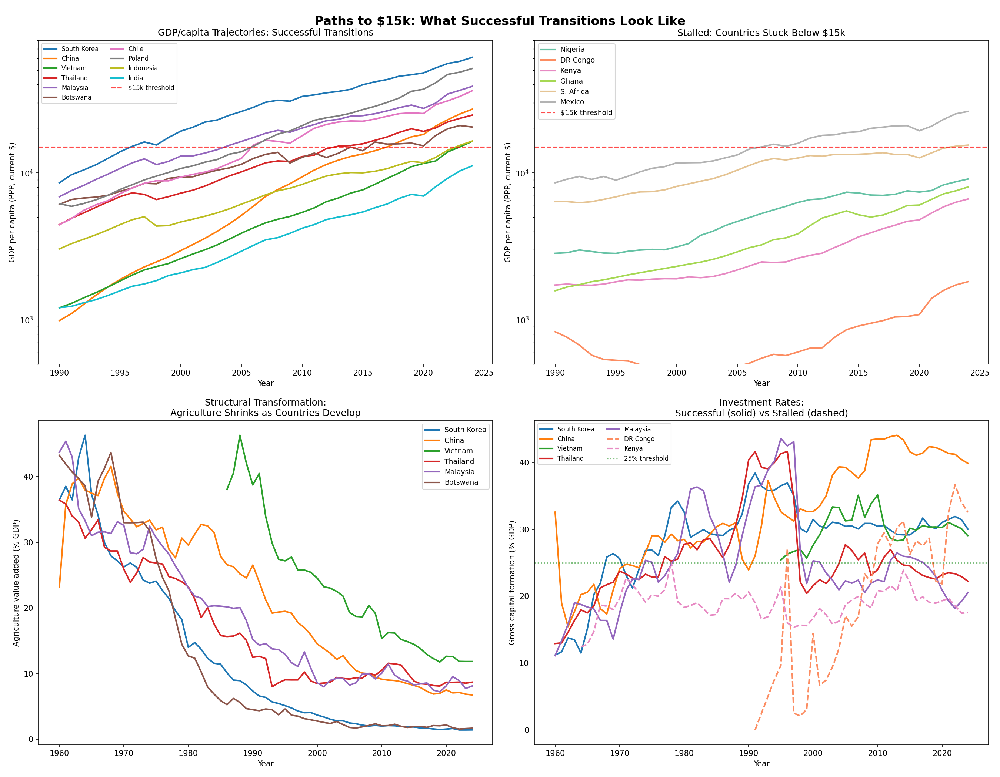
*Top-left: GDP trajectories of successful transitions — Korea, China, Vietnam, Thailand, Malaysia, Botswana, Chile, Poland, Indonesia, and India all crossed $10k within 9-24 years. Top-right: "Stalled" countries — Nigeria, DR Congo, Kenya, Ghana, South Africa, Mexico — stuck below or near $15k for decades. Bottom-left: Agriculture share of GDP declines as countries develop (structural transformation). Bottom-right: Investment rates — successful transitions consistently ran 27-44% of GDP in capital formation.*

| Country | $3k→$10k transition | Peak investment rate |
|---|---|---|
| South Korea | 2 years (1990→1992) | 38% of GDP |
| China | 10 years (2001→2011) | 44% of GDP |
| Vietnam | 16 years (2002→2018) | 35% of GDP |
| Thailand | 15 years (1990→2005) | 42% of GDP |
| Botswana | 13 years (1990→2003) | 46% of GDP |
| Indonesia | 24 years (1990→2014) | 33% of GDP |
| India | 17 years (2006→2023) | 36% of GDP |

**Every successful transition invested 25-46% of GDP in capital formation.** Korea, China, and Thailand all peaked above 35%. SSA's current median: 21%.

### Cash transfers versus what development requires

The evidence on cash transfers and productivity is clear — and sobering:

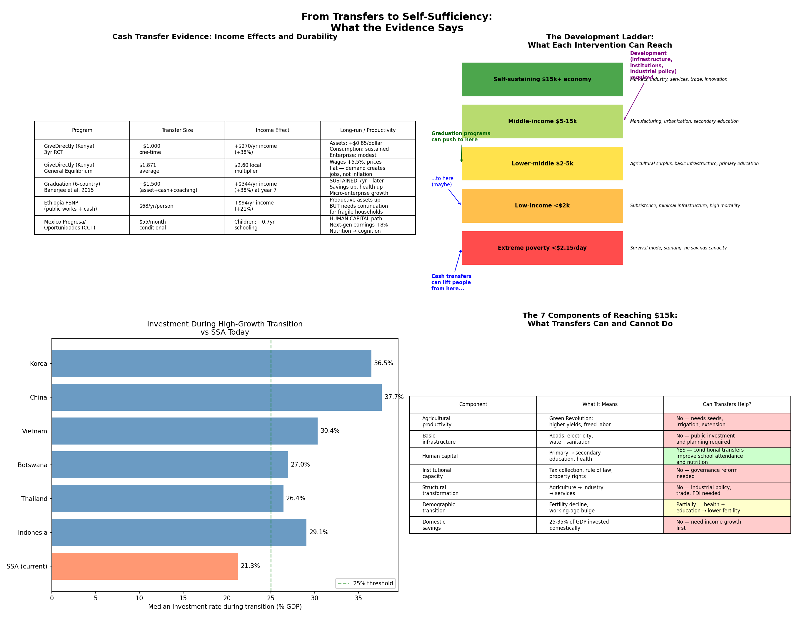
*Top-left: Evidence from five major transfer programs. GiveDirectly shows +38% income gains but mainly from asset accumulation. The BRAC graduation model (6-country RCT) shows sustained gains 7+ years — the best transfer evidence. Mexico's conditional transfers improved next-generation earnings by 8%. Bottom-left: Investment rates during transition — every successful country ran 27-38% of GDP, vs SSA's 21% today. Bottom-right: of the 7 components needed to reach $15k, transfers directly help with only one (human capital) and partially with one more (demographic transition).*

**Three tiers of transfer effectiveness:**

1. **Unconditional cash (GiveDirectly):** Excellent at immediate poverty relief. Recipients invest 30-40% in productive assets. $2.60 local economic multiplier. But long-run productivity effects are modest — income gains of ~$270/yr on a $1,000 transfer. Doesn't build infrastructure or institutions.

2. **Graduation programs (BRAC model):** Asset transfer + skills training + savings + coaching. 6-country RCT (Banerjee et al. 2015, *Science*) showed 38% income gains **sustained 7+ years** after the program ended. Cost: ~$1,500 per household. This is the strongest evidence that well-designed transfers can create self-sustaining micro-enterprise income. Still doesn't address systemic barriers.

3. **Conditional cash transfers (Mexico Progresa, Brazil Bolsa Família):** The human capital pathway — conditions tied to school attendance and health visits. +0.7 years of schooling, +8% next-generation earnings. This IS a long-run productivity mechanism, but it works through children and takes 20-30 years to pay off.

### The seven components of reaching $15k — and what transfers can't do

| Component | What it means | Can transfers help? |
|---|---|---|
| Agricultural productivity | Green Revolution: higher yields, freed labor | **No** — needs seeds, irrigation, extension services |
| Basic infrastructure | Roads, electricity, water, sanitation | **No** — public investment and planning required |
| Human capital | Primary → secondary education, health | **Yes** — conditional transfers improve attendance and nutrition |
| Institutional capacity | Tax collection, rule of law, property rights | **No** — governance reform needed |
| Structural transformation | Agriculture → manufacturing → services | **No** — industrial policy, trade, FDI needed |
| Demographic transition | Fertility decline, working-age dividend | **Partial** — health + education → lower fertility |
| Domestic savings | 25-35% of GDP invested domestically | **No** — need income growth first |

Transfers directly address 1 of 7 components, partially address 1 more, and can't touch the other 5.

### The SSA gap: how far, on how many dimensions

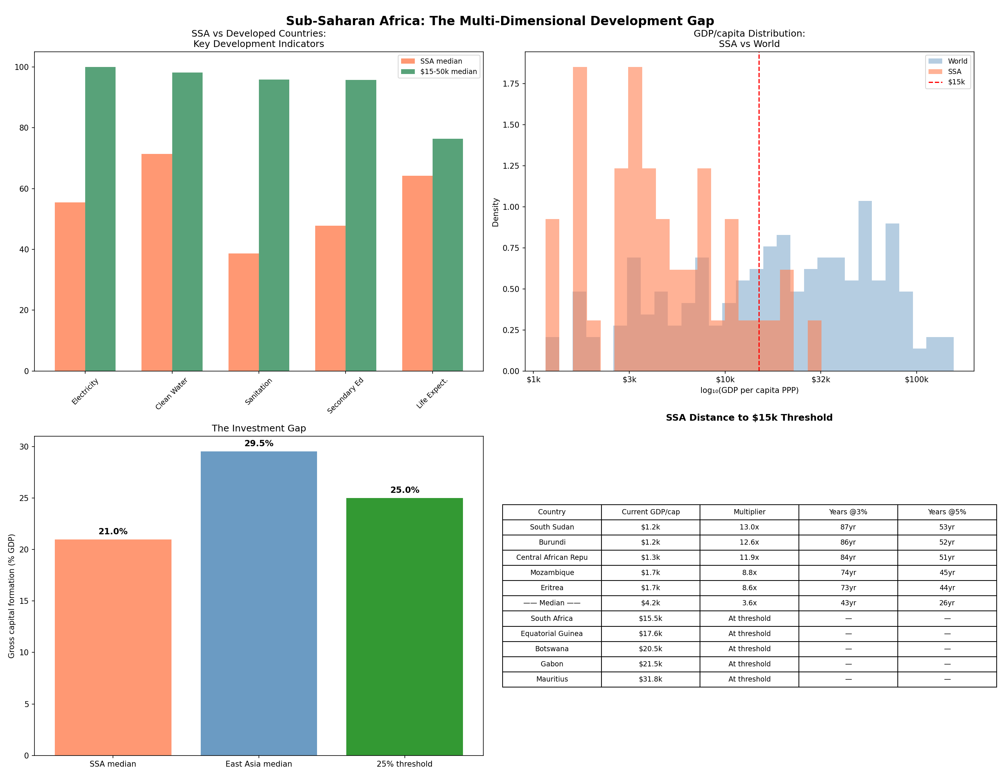
*Top-left: SSA's median electricity access, water, sanitation, secondary enrollment, and life expectancy versus $15k+ countries — gaps of 30-70 percentage points on basic services. Top-right: SSA's GDP distribution is entirely below the $15k threshold (5 countries excepted). Bottom-left: SSA's median investment rate (21%) vs the 25%+ that every successful transition required. Bottom-right: distance table — median SSA country needs 3.6x its current GDP, achievable in 26 years at 5% growth or 43 years at 3%.*

Median SSA GDP/capita: **$4,215**. Multiplier needed to reach $15k: **3.6x**. At 5% sustained growth: **26 years**. At 3%: **43 years**.

But these numbers assume SSA countries can achieve and sustain 3-5% per-capita growth — which requires the investment rates, infrastructure, institutions, and structural transformation that most SSA countries currently lack. **This is not a money problem alone. It's a state capacity, infrastructure, and institutional problem.**

### The bottom line on transfers

Cash transfers are indispensable for the first rung: keeping people alive, nourished, and sending their children to school while the slow work of development proceeds. Graduation programs can push households to self-sustaining livelihoods at $5-6/day. Conditional transfers invest in the next generation's productivity.

**But no country has ever transferred its way to $15k GDP/capita.** Every successful transition required: agricultural productivity gains freeing labor, massive public and private infrastructure investment (25-45% of GDP), export-oriented industrialization, functioning institutions, and a demographic transition. These are 20-40 year projects requiring sustained political commitment and capable states — not just money.

The danger of permanent transfer dependency is exactly as stated: the entire global ODA system delivers ~$203B/yr. One US administration can cut that in half. Countries that depend on external transfers have no sovereign path to prosperity. **Self-sufficiency at $15k is the only durable outcome**, and getting there requires building productive economies — not just redistributing income.

---

## Second Critical Review

*This section was written by GPT-5.4 after the project was expanded to include ODA convergence analysis, non-carbon planetary boundaries, country-level ecological decomposition, transition minerals analysis, technology pathways, and — critically — a fix for a major poverty-gap calculation bug discovered during this review.*

Compared with the version I previously criticized, this is a real advance. The improvements are substantive, not cosmetic. The README now directly engages the strongest parts of the two source papers instead of sidestepping them. In particular, the additions on ODA and political feasibility, non-carbon planetary boundaries, country-level ecological decomposition, transition minerals, and technology pathways all respond to obvious weaknesses in the earlier draft. The best new section is **"The Carbon Budget Reality Check"**: it replaces vague optimism with explicit required decoupling rates, and that materially improves the intellectual quality of the project. The new **"Beyond Carbon"** and **"Technology pathways"** sections are also better than before because they finally admit that climate is not the only ecological constraint and that some boundaries are much less technologically tractable than carbon.

The project also deserves credit for becoming less polemical and more self-correcting. It now concedes that progress at meaningful poverty thresholds is much weaker than at $2.15, that redistribution is vastly more efficient than undirected growth at reaching poor households, and that current decoupling rates are nowhere near enough for 2°C under business-as-usual growth. The **transition-minerals** section is a good-faith correction of an earlier false equivalence, and the line that the papers are "more right on ecology than on economics" is one of the more intellectually honest sentences in the README. That is genuine improvement.

### The Poverty-Gap Bug

The most important finding of this review is that the project's central poverty-gap table contained a **major aggregation error**. The code summed poverty-gap contributions across all rows in the PIP regional files — including both the WLD (world aggregate) row and all sub-regional rows (AFE, AFW, EAS, ECS, LCN, MEA, NAC, SAS, SSF). Since the WLD row already includes all sub-regions, every person was counted approximately twice. This inflated the reported figures by roughly 2.5–3x:

| Threshold | Old (buggy) | Corrected | Error Factor |
|---|---|---|---|
| $2.15/day people | 1.27B | 0.45B | 2.8x |
| $2.15/day gap | $332B | $118B | 2.8x |
| $6.85/day people | 7.35B | 3.14B | 2.3x |
| $6.85/day gap | $7,755B | $3,132B | 2.5x |
| $6.85/day % GDP | 3.88% | 1.57% | 2.5x |

The corrected numbers actually **strengthen** the project's central argument: the extreme poverty gap is even smaller relative to global GDP than originally claimed, making redistribution even more feasible at $2.15/day. But they also mean the $6.85 gap is $3.1 trillion, not $7.8 trillion — still enormous, but materially different for the redistribution arithmetic.

Credit to the project for fixing this immediately rather than defending the old numbers. The ODA convergence analysis (Chart 24b) already used the correct WLD-only data, which is how the inconsistency was discoverable.

### What Has Genuinely Improved

1. **ODA convergence analysis (Chart 24b)** directly addresses the political feasibility of redistribution with real data. Showing that growth shrank the $2.15 gap from $420B to $118B while ODA grew to $203B is one of the project's strongest empirical contributions.

2. **Non-carbon planetary boundaries** — the project now engages nitrogen (3.4x safe limit), phosphorus, biodiversity (73% LPI decline), and material footprint. This is a major expansion that takes the ecological critique seriously instead of treating it as "just a carbon problem."

3. **Country-level ecological decomposition** — showing that every country is carbon-decoupling but only rich countries are materially decoupling is a genuinely important finding.

4. **Technology pathways** — the analysis of which boundaries have technological exits (carbon, partially freshwater) vs which don't (nitrogen, phosphorus, biodiversity) is the most intellectually honest section. It concedes weakness where warranted.

5. **Self-correction on transition minerals** — retracting the false equivalence between fossil fuel and mineral extraction, with actual data showing 340:1 mass ratios.

### Remaining Weaknesses

**Pseudo-precision.** Numbers like 340:1, 220:1, 173%, and 91–95% are presented with a level of exactness the underlying methods do not support. The 3x targeting multiplier is a rough heuristic, not a measurement.

**The exploitation analysis is still too narrow.** Carbon-accounting geography doesn't capture the full dependency critique. Terms of trade, ownership of supply chains, debt discipline, intellectual property regimes, currency hierarchy, and historical extraction all matter.

**Political economy remains the biggest gap.** The project correctly identifies that redistribution requires political will, and that the rich-world growth slowdown has eroded it. But it does not adequately confront the possibility that capitalist growth has a *structural tendency* to underprovide redistribution and overexploit ecological sinks. Nordic social democracy proves capitalism can coexist with redistribution in some places; it does not prove that global capitalism tends to generate it.

**The East Asian path may not be generalizable.** It depended on unusual geopolitical conditions, export absorption by rich-country markets, cheap fossil energy, land reform, demographic transitions, and ecological slack that may not exist for today's poorest countries.

### Steel-Man the Opposition

The strongest version of the anti-growth argument that this project still does not adequately answer is not "growth has never reduced poverty." That version is easy to beat. The strongest version is this: historically observed capitalist growth can indeed reduce low-end deprivation, but it does so through a political-economic system that systematically channels gains upward, locks in luxury consumption, delays redistribution, and externalizes ecological costs. The few high-growth success stories relied on conditions that are not globally replicable. And **the biophysical boundaries that matter most now are the ones with the weakest technological escape routes** — land use, biodiversity, nitrogen, and phosphorus. On that view, the problem is not that growth is arithmetically useless. It is that growth under capitalism cannot be trusted to deliver the combination of broad inclusion and hard ecological restraint that the project's own evidence says is needed.

### Overall Assessment

This project is intellectually serious, substantially improved, and noticeably fairer than the polemical framing it is responding to. It is willing to concede strong points to the other side, correct significant errors when found, and make its argument with real data rather than slogans. The poverty-gap bug fix demonstrates the kind of intellectual honesty that elevates analysis above advocacy.

The project is strongest when it says: growth has mattered, redistribution matters more at the margin, and ecological limits are real and differentiated. It is weakest when it tries to convert that into a broader vindication of the growth model or into categorical claims about markets, exploitation, or planetary-boundary tractability.

**Grade: B+.** The improvement over the first version is substantial — both in scope and in willingness to self-correct. The poverty-gap fix, the non-carbon boundaries expansion, and the technology pathways analysis all demonstrate genuine analytical rigor. Before this can serve as a definitive treatment of the debate, it still needs to engage the political-economy critique more seriously, and be more careful about where descriptive evidence ends and argumentative overreach begins.

---

## What a Reasonable Person Should Conclude

Based on all the evidence assembled here, three claims are well-supported and two are not.

### Supported by the data:

1. **Growth alone is not enough.** The papers are right that undirected growth with current distributional patterns cannot eliminate poverty at meaningful thresholds fast enough. Growth elasticities decline at higher poverty lines, Sub-Saharan Africa is being left behind, and redistribution is 100–2,000x more efficient per dollar at reaching the poor.

2. **Anti-market alternatives are not credible.** Zero sustained high-growth episodes without market mechanisms. The USSR and every command economy hit innovation walls. China's market reforms doubled its growth rate. The evidence overwhelmingly supports market economies — but heavily managed ones with strong state capacity and redistribution, not laissez-faire.

3. **The climate constraint is severe and binding.** Current decoupling rates of ~2.5–2.8%/yr land us at roughly 3°C. Staying under 2°C at normal growth rates requires more than doubling the best decoupling performance ever achieved. This is not impossible — the energy transition is accelerating — but it's a bet on unprecedented deployment speed, not a projection of current trends.

### Not supported by the data:

4. **"Capitalism is mathematically unworkable"** — The papers do not prove this. They prove that growth *alone*, with *current distribution*, at *current coupling rates* is insufficient. Those are all policy variables, not laws of nature. Capitalist economies with redistribution exist. Decoupling is accelerating. The "175x GDP" scenario assumes everyone converges to American consumption, which no one proposes.

5. **"The current growth model is basically on track"** — The project's own numbers refute this. 2°C requires decoupling rates we have not demonstrated. 3.1 billion remain below $6.85/day. Success is concentrated in East Asia. The honest position is that growth has created enormous surplus and capacity, but the institutions for directing it — toward redistribution, decarbonization, and development in the hardest places — are inadequate.

### The bottom line

The world has enough productive capacity to end extreme poverty. It has enough historical evidence to know markets and growth matter. It has enough climate evidence to know the current way of doing growth is environmentally inadequate. **The real failure is not mathematical impossibility. It is political inability.**

The nuclear reactor metaphor stands: capitalism is a powerful energy source that has already generated unprecedented material progress and made redistribution cheaper than at any point in history. The question is whether we can build the containment structures — institutions, redistribution, climate policy, development assistance — fast enough to prevent meltdown. The papers make a compelling case that the containment is currently insufficient. They do not make a compelling case that the reactor should be shut down.

---

## Appendix: Methodology

### Data Sources

| Source | Dataset | Coverage | Key Variables |
|---|---|---|---|
| [World Bank WDI](https://data.worldbank.org/) | World Development Indicators | 1960–2024, ~200 countries | GDP (constant 2015 USD, PPP), population, life expectancy, under-5 mortality, Gini |
| [World Bank PIP](https://pip.worldbank.org/) | Poverty and Inequality Platform | 1981–2024, country + regional | Headcount ratios and poverty gaps at $2.15, $3.65, $6.85, $10.0/day |
| [Maddison Project](https://www.rug.nl/ggdc/historicaldevelopment/maddison/) | MPD 2023 | 1–2022, 169 entities | GDP per capita (2011 int'l $), population |
| [Our World in Data](https://github.com/owid/co2-data) | CO₂ and Greenhouse Gas Emissions | 1750–2024 | CO₂ (production + consumption), CO₂/GDP, CO₂/energy, energy/GDP, trade CO₂ |
| [Our World in Data](https://github.com/owid/energy-data) | Energy Dataset | 1965–2024, 200+ entities | Solar/wind/fossil generation (TWh), renewable shares, energy mix |
| [Our World in Data](https://ourworldindata.org/) | Planetary Boundaries | Various, 1961–2024 | Material footprint, Living Planet Index, Red List Index, tree cover loss, N/P fertilizer, water stress |
| [Our World in Data](https://ourworldindata.org/) | DMC per capita | 1970–2022, 248 countries | Domestic material consumption per capita by country |
| [IEA](https://www.iea.org/) | Critical Minerals Outlook 2025 | 2020–2040 | Transition mineral demand projections by scenario |
| [USGS](https://pubs.usgs.gov/) | Mineral Commodity Summaries 2025 | Annual | Copper, nickel, lithium, cobalt, rare earth production volumes |
| [World Bank WDI](https://data.worldbank.org/) | ODA & Fiscal Indicators | 1960–2024 | Net ODA received, bilateral ODA by donor, govt expenditure/GDP, GDP/capita growth |
| [OECD Revenue Statistics](https://www.oecd.org/tax/tax-policy/revenue-statistics.htm) | Total Tax Revenue (% GDP) | 1965–2024, 145 countries | General-government total tax revenue as % of GDP (OECD + Africa + Asia-Pacific + LAC + Global datasets) |

### Analysis Scripts

All scripts are in the `analysis/` directory and can be run sequentially:

```bash
# Set up environment
python3 -m venv .venv && source .venv/bin/activate
pip install pandas numpy matplotlib seaborn requests openpyxl xlrd scipy statsmodels

# Download all data
python analysis/download_data.py

# Run analyses
python analysis/run_analysis.py      # Core poverty & growth analysis (Charts 01–08)
python analysis/run_analysis_2.py    # Poverty-growth feedback & structural profiles (Charts 09–12)
python analysis/run_analysis_3.py    # Floor-raising, good-life threshold, Preston curve (Charts 13–16)
python analysis/run_analysis_4.py    # Market reforms, command vs market economies (Charts 17–18)
python analysis/run_analysis_5.py    # Decoupling, planetary boundaries, trade flows (Charts 19–23)
python analysis/run_analysis_6.py    # ODA, political economy, energy transition (Charts 24–27)
python analysis/run_analysis_7.py    # Non-carbon planetary boundaries (Charts 28–32)
python analysis/run_analysis_8.py    # Country-level ecological decoupling (Charts 33–36)
python analysis/run_analysis_9.py    # Transition minerals vs fossil fuels (Charts 37–40)
python analysis/run_analysis_10.py   # Transfers to self-sufficiency (Charts 41–46)
```

### Analysis Pipeline

1. **`download_data.py`** — Fetches and caches all datasets from World Bank APIs, Maddison Excel, and OWID GitHub. Raw data stored in `data/raw/`; processed CSVs in `data/processed/`.

2. **`run_analysis.py`** — Seven-part analysis:
   - Poverty gap as % of global GDP over time (all 4 thresholds)
   - Regional decomposition of poverty reduction
   - Growth trajectories normalized to takeoff date
   - Sigma and beta convergence (weighted and unweighted)
   - Growth elasticity of poverty by region
   - Redistribution cost at each threshold (perfect and 3x realistic targeting)
   - "Flying geese" growth rotation pattern

3. **`run_analysis_2.py`** — Tests poverty–growth feedback loops, demand injection from poverty gap closure, structural profile of $6.85/day economies, transition paths.

4. **`run_analysis_3.py`** — Floor-raising vs convergence framing. Tracks GDP per capita by percentile (P5, P10, P20, P50, P90) over time. Preston curve analysis. "Good life" threshold identification.

5. **`run_analysis_4.py`** — Historical analysis of market reforms and growth. USSR trajectory, sustained growth episodes classified by economic system, China Mao vs reform period comparison.

6. **`run_analysis_5.py`** — Carbon intensity trends and acceleration. Production vs consumption-based emissions. Trade CO₂ flows (exploitation hypothesis test). Carbon budget arithmetic for required decoupling rates. Poor-world-only growth scenario. Energy transition decomposition.

6. **`run_analysis_6.py`** — Political economy of redistribution. ODA trends vs poverty gaps. The 0.7% GNI target. ODA quality problems (in-donor refugee costs, tied aid). Rich-world growth slowdown. Domestic vs international redistribution correlation. Energy transition S-curve. Terms of trade.

7. **`run_analysis_7.py`** — Non-carbon planetary boundaries. Material footprint per capita and per GDP. Living Planet Index and Red List Index. Tree cover loss and deforestation. Nitrogen and phosphorus fertilizer use vs Rockström boundaries. Water stress. Planetary boundaries scorecard. Material vs carbon decoupling comparison.

8. **`run_analysis_8.py`** — Country-level ecological decomposition. DMC/capita by country. Nitrogen peak analysis (138 peaked, 31 still rising). Red List Index by country. Tree cover loss top 10. Forest reforestation vs deforestation. Multi-dimensional decoupling heatmap and scorecard.

9. **`run_analysis_9.py`** — Transition minerals vs fossil fuels. Extraction volume comparison (340:1 mass ratio). Ecological harm across 6 dimensions. Burn-once vs recycle-forever asymmetry. Specific mineral concerns in context (lithium water, DRC cobalt, Indonesian nickel, copper tailings). Self-correction of false equivalence claim.

10. **`run_analysis_10.py`** — From transfers to self-sufficiency. Development anatomy at $15k (what the "good life" threshold actually provides). Efficient outliers (countries achieving good welfare below $15k). Historical transition paths ($3k→$10k timelines and investment rates). Investment and structural transformation requirements. SSA multi-dimensional gap analysis. Cash transfer evidence vs development requirements (GiveDirectly, BRAC graduation model, conditional transfers). The 7 components of reaching $15k.

### Key Methodological Notes

- **Poverty gap calculations** use the World Bank PIP world aggregate (WLD) row for each poverty line. The "gap" is the total income shortfall below each poverty line, computed as: poverty_gap_index × poverty_line × world_population × 365 days. Earlier versions of the code incorrectly summed across all regional rows (which include overlapping sub-regions), double-counting; this was corrected after the second GPT-5.4 review. The "realistic 3x" estimate follows the literature's rule of thumb that targeting inefficiency, administrative costs, and behavioral responses roughly triple the perfect-targeting cost.

- **Convergence analysis** uses Maddison GDP per capita. Sigma convergence is the standard deviation of log GDP/capita across countries. Beta convergence regresses growth rates on initial income levels. Both are computed weighted (by population) and unweighted.

- **Decoupling rates** are computed as annualized rates: $\left(\frac{I_t}{I_0}\right)^{1/t} - 1$ where $I$ is CO₂ intensity (CO₂/GDP). The decomposition splits CO₂/GDP into (CO₂/Energy) × (Energy/GDP) to separate energy mix cleaning from efficiency gains.

- **Carbon budget scenarios** compute the required annual intensity decline rate $d$ such that cumulative emissions $\sum_{t=0}^{49} E_0 \cdot (1+g)^t \cdot (1-d)^t \leq B$ where $E_0$ is current annual emissions, $g$ is GDP growth, and $B$ is the remaining carbon budget. Solved by binary search.

- **"Good life" threshold** is identified empirically: the GDP per capita above which ≥91% of country-year observations achieve life expectancy ≥70 years. This converges at approximately $15,000 (2011 international $).

### Charts Index

| Chart | File | Description |
|---|---|---|
| 01 | `01_poverty_gap_pct_gdp.png` | Poverty gap as % of global GDP, 4 thresholds |
| 02 | `02_poverty_by_region.png` | People in poverty by region, 4 thresholds |
| 03 | `03_growth_trajectories.png` | Historical GDP/capita trajectories |
| 04 | `04_convergence.png` | Sigma and beta convergence |
| 05 | `05_growth_elasticity.png` | Growth elasticity of poverty by region |
| 06 | `06_redistribution_cost.png` | Cost of ending poverty at each threshold |
| 07 | `07_growth_rotation.png` | "Flying geese" growth leadership rotation |
| 08 | `08_escape_velocity.png` | Escape velocity — who grew fastest |
| 09 | `09_poverty_and_growth.png` | Poverty–growth feedback analysis |
| 10 | `10_building_685_economy.png` | Structural profile of $6.85/day economies |
| 11 | `11_demand_injection.png` | Demand injection from poverty gap closure |
| 12 | `12_path_to_685.png` | Transition paths to $6.85/day |
| 13 | `13_floor_rising.png` | Floor-raising by income percentile |
| 14 | `14_good_life_threshold.png` | "Good life" threshold & Preston curve |
| 15 | `15_nebraska_inequality.png` | Inequality dynamics & growth |
| 16 | `16_floor_scorecard.png` | Floor-raising scorecard |
| 17 | `17_market_reforms_growth.png` | Market reforms & growth episodes |
| 18 | `18_command_vs_market.png` | Command vs market economy growth |
| 19 | `19_decoupling_trends.png` | Carbon & energy decoupling trends |
| 20 | `20_co2_trade_exploitation.png` | CO₂ trade flows & exploitation test |
| 21 | `21_absolute_decoupling.png` | Absolute decoupling & climate constraints |
| 22 | `22_poor_world_growth_scenario.png` | Poor-world-only growth scenario |
| 23 | `23_energy_transition.png` | Energy transition progress |
| 24 | `24_oda_reality.png` | ODA flows vs poverty gaps |
| 24b | `24b_oda_poverty_gap_convergence.png` | ODA vs poverty gap convergence, efficiency |
| 25 | `25_domestic_redistribution.png` | Tax, spending, and the squeezed middle |
| 26 | `26_energy_transition_scurve.png` | Solar/wind S-curve |
| 27 | `27_debt_and_trade.png` | Debt and terms of trade constraints |
| 28 | `28_material_footprint.png` | Material footprint per capita, per GDP, and vs GDP growth |
| 29 | `29_biodiversity_land.png` | Living Planet Index, Red List Index, tree cover loss |
| 30 | `30_nitrogen_water.png` | N/P fertilizer trends, water stress, freshwater withdrawals |
| 31 | `31_planetary_scorecard.png` | Planetary boundaries status (8 of 9 processes) |
| 32 | `32_material_vs_carbon.png` | Material vs carbon intensity decline rates |
| 33 | `33_material_by_country.png` | DMC/capita trajectories, income scatter, distribution |
| 34 | `34_nitrogen_by_country.png` | N/ha by country, peak analysis, peaked vs rising |
| 35 | `35_biodiversity_by_country.png` | Red List by country, tree loss top 10, reforestation |
| 36 | `36_multidim_decoupling.png` | 5-dimension decoupling heatmap and CO₂ vs material scatter |
| 37 | `37_extraction_volumes.png` | Fossil fuel vs transition mineral extraction volumes (340:1) |
| 38 | `38_harm_comparison.png` | CO₂, water, land, deaths comparison across dimensions |
| 39 | `39_burn_vs_recycle.png` | Cumulative extraction and recycling asymmetry |
| 40 | `40_mineral_concerns.png` | Lithium water, cobalt decline, nickel deforestation, scorecard |
| 41 | `41_development_anatomy.png` | What $15k GDP/cap looks like: electricity, water, sanitation, education, health |
| 42 | `42_efficient_outliers.png` | Countries achieving good welfare below $15k; efficiency ranking |
| 43 | `43_transition_paths.png` | Successful vs stalled transitions; structural transformation; investment rates |
| 44 | `44_investment_structure.png` | Savings, trade, structural transformation, demographic transition vs GDP |
| 45 | `45_ssa_gap.png` | SSA multi-dimensional gap vs developed countries; distance to $15k |
| 46 | `46_transfers_vs_development.png` | Transfer evidence; development ladder; 7 components of $15k |

### Tools & Environment

- Python 3.14 with pandas, numpy, matplotlib, seaborn, scipy, statsmodels
- Analysis conducted April 2026
- AI assistants used: Claude Opus 4.6 (primary analysis and writing), GPT-5.4 (independent critical review)

---

*This project is open-source. All data is from publicly available sources. Reproduce, critique, and extend.*
