# Growth, Poverty, and Planetary Boundaries

**A quantitative response to the claim that capitalism is "mathematically unworkable" for ending global poverty within ecological limits.**

This project uses World Bank, Maddison Project, Our World in Data, OECD, IEA, and USGS data to examine two papers arguing that growth-based poverty elimination is physically impossible and redistribution is the only viable path. The analysis was conducted collaboratively between a human analyst and AI assistants. All code, data, and figures are reproducible.

> Supporting exploratory analysis, critical review notes, and detailed supplementary material are preserved in [README_v2_archive.md](README_v2_archive.md). The main report synthesizes 101 charts, robustness checks, and an expanded good-life threshold audit.

---

## Executive Summary

Nineteen analyses and 101 charts later, here is what the data shows:

1. **Growth alone cannot end poverty fast enough** at meaningful thresholds. Only 5% of GDP growth reaches the poorest 60% [[2]](#references-and-sources). The papers are right about this.

2. **But growth transformed the scale of the redistribution problem — dramatically at the bottom, modestly at higher thresholds.** The \$6.85/day poverty gap fell from 18% to 1.6% of world GDP — from a genuinely crushing burden to a large but conceivable one. At \$2.15/day, the gap is now smaller than existing aid flows. But 3.14 billion people remain below \$6.85/day, a \$3.1 trillion shortfall that international transfers cannot reliably close — not because the money doesn't exist, but because there is no sovereign authority to guarantee it. Domestic transfers (pensions, disability, UBI) work because states have taxing power and accountability to recipients. International aid has neither: one political pivot in a major donor can halve it overnight.

3. **The ecological constraint is real and differentiated.** Carbon has a clear technological pathway (renewables) that requires deployment at unprecedented speed. Nitrogen (1.9–3.4× over, depending on boundary definition) is addressable through a stack of agricultural bioengineering, food technology, and precision farming — but requires breakthroughs (especially nitrogen-fixing cereals) not yet deployed. The aggregate "material footprint" metric overstates the constraint by treating all tonnes as equal; the boundary-specific problems (nitrogen, biodiversity, land use) are genuinely severe while the mass-based metric is weaker than the carbon budget. Six of nine planetary boundaries are breached — though our analysis directly tests only eight of the nine, and the status of some depends on which published framework is used.

4. **Poverty is a flow problem, not a stock problem.** The papers frame poverty as a gap to be filled with transfers. But even if you lifted everyone above \$6.85/day tomorrow, you'd need to do it again next year — forever — unless the underlying economies develop the productive capacity to sustain welfare. Aid is humanitarian insurance (~10% of total resource flows to the developing world); investment is the growth driver (FDI alone is 4× all ODA).

5. **The development recipe has common elements, but institutional context matters.** Peace, macroeconomic stability, high investment rates (25–40% of GDP), early fertility decline, trade openness, and capable states are associated with success across regions. Bangladesh, Rwanda, Chile, and Botswana demonstrate this is not an "Asian" formula. The most powerful rich-country levers are not aid but trade access, FDI facilitation, and cheaper remittance corridors. But whether this recipe can be replicated under 2020s constraints — tighter carbon budgets, reduced ecological slack, different geopolitics — is genuinely uncertain.

6. **Sustainable consumption is about composition, not deprivation — but the mass target is uncertain.** The aggregate "material footprint" conflates sand with burned coal. The ecologically destructive components of consumption — fossil fuels, nitrogen-intensive agriculture, land clearing — are artifacts of current technology, not inherent to high welfare. But our robustness check weakens the clean ~9 t/cap headline: under broad category-level uncertainty, the post-transition rich-country footprint centers closer to ~11 t/cap, with 9 t/cap requiring optimistic assumptions about biomass, metals, construction intensity, and circularity. The conceptual point still stands — a tonne of burned coal is not equivalent to a tonne of maintained rail ballast — but damage-weighted material accounting remains unresolved.

7. **Abundant cheap clean energy is the strongest enabling condition — not a complete solution.** Solar generation grew from 4 TWh (2005) to 2,128 TWh (2024), doubling every ~3.2 years. This S-curve, if it continues, unlocks cascading solutions: electrification tackles the carbon boundary, cheap desalination helps freshwater, cheap energy improves recycling economics, and clean power enables precision agriculture and controlled-environment farming. But the later energy-transition audit matters: fossil fuels still supply ~82% of primary energy, interconnection queues are a real bottleneck, long-duration storage cost targets are not yet demonstrated at gigawatt scale, and critical-mineral supply is tight. Energy abundance is necessary for almost every optimistic pathway in this document; it is not sufficient for nitrogen, biodiversity, land governance, or political containment.

---

## What the robustness checks resolve — and what they don't

Two provisional benchmarks recur in the argument below. The first is a **\$15k GDP/capita welfare proxy**: an early empirical line where basic health and service outcomes begin to saturate, useful for rejecting the idea that ending poverty requires American consumption levels. The second is a **~9 t/cap post-transition material-footprint scenario**: an optimistic estimate of how low rich-country material throughput might fall if fossil fuels, wasteful biomass, and linear metals use are largely replaced by clean energy, circular materials, and different consumption. Neither benchmark is meant to be final. They are starting points for testing the papers' claims, and the robustness checks show where each one breaks down.

Some of the unresolved issues above *can* be narrowed with data. Others cannot be settled by more charts because they are counterfactual, institutional, or normative. Analysis 18 adds explicit sensitivity checks rather than relying on single-point estimates.

| Issue | What the new checks show | What remains unresolved |
|---|---|---|
| **The "good life" threshold** | A \$15k GDP/cap line is a lower-bound heuristic for a narrow health/service pair, not the best estimate of a full welfare bundle. The expanded audit tests health, nutrition, water, sanitation, electricity, clean cooking, education, safety, air quality, PIP median welfare, and household consumption. For 90% reliability on an 85% outcome score, the threshold is roughly \$20k GDP/cap population-weighted and \$40k unweighted; \$12.5k-\$15k household consumption/cap; or \$15-\$25/day PIP median welfare. | Causality, within-country inequality, subjective wellbeing, non-market welfare, and whether any bundle should be treated as normatively final. |
| **Poverty-gap affordability** | The low-line result is robust: at \$2.15/day, even a 3x delivery-cost assumption is ~\$122B, or 0.11% of world GDP. At \$6.85/day the same calculation is ~\$2.9T, or 2.6% of world GDP; at \$10/day it is ~\$6.9T, or 6.2%. | The political problem: no global fiscal authority can compel recurring transfers at the high-line scale. |
| **Growth-distribution arithmetic** | The conclusion is highly sensitive to who receives new income. If the poor receive 5% of new income, growth-only closure is far slower than if they receive 10-20%. | Future growth incidence is a policy/institutional variable, not a physical constant. |
| **Nitrogen pathway** | Tier 1-2 measures alone do not close the boundary in the uncertainty model: median final fixation is ~101 Tg N/yr. Adding Tier 3 measures brings the median to ~63 Tg N/yr, with ~48% of draws meeting the relaxed Richardson boundary (62 Tg), ~5% meeting a 44 Tg intermediate boundary, and <1% meeting the original 35 Tg boundary. | Breakthrough probability, adoption speed, regional runoff dynamics, and governance. |
| **Post-transition material footprint** | A ~9 t/cap target is optimistic. Broad category-level uncertainty centers closer to ~11.1 t/cap; the naive 5.9 t/cap mass budget is not reached in the scenario draws. | Whether 10-12 t/cap of mostly construction maintenance and recyclable metals is ecologically acceptable requires damage-weighted LCA, not mass accounting alone. |
| **Development recipe** | A simple 392-spell panel check supports the broad pattern: high investment is positively associated with subsequent 10-year GDP/cap growth (+0.62 percentage points per standardized increase), and fertility is negatively associated (-0.49); trade, FDI, schooling, and tax revenue are not significant in this specification. | Causal identification and institutional mechanisms. The panel is a discipline check, not proof of a recipe. |
| **Systemic political economy** | Data can document historical outcomes and institutional variation. | It cannot by itself answer whether capitalism will reliably build the political containment structures it needs. |

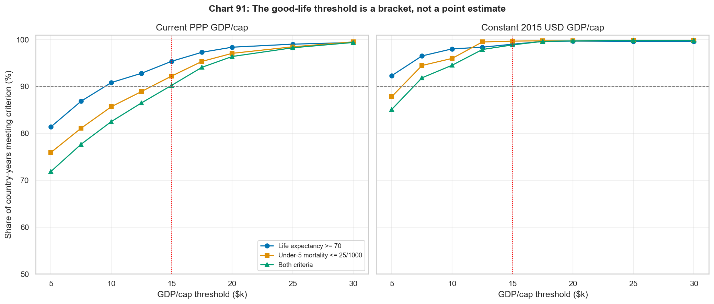
*The \$15k threshold is useful, but it is not a magic number. The income level at which welfare indicators reliably saturate depends on the outcome metric and price base.*

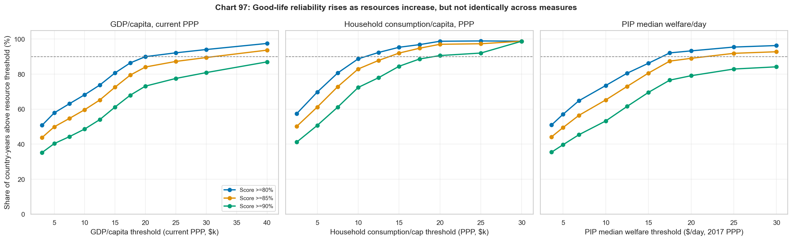
*The expanded bundle raises the bar. GDP/capita is the noisiest resource proxy; household consumption and PIP median welfare give a more concrete measure of ordinary living standards.*

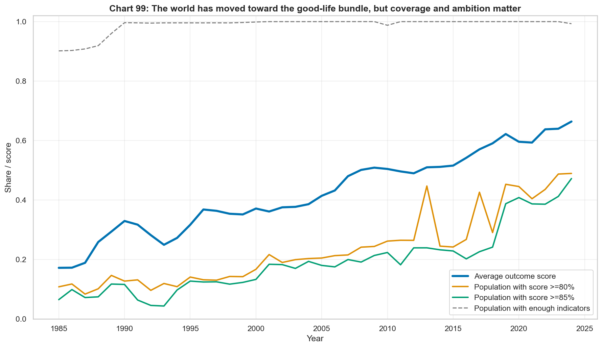
*The world has moved substantially toward the good-life bundle since 1990, but only about half of covered population now lives in countries scoring at least 80% on the expanded outcome bundle, and about 40% reaches 90%.*

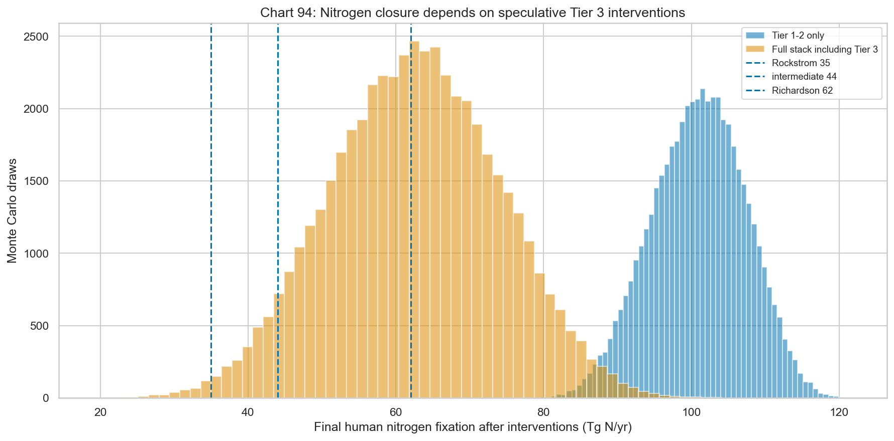
*Nitrogen is the clearest case where the optimistic ecological response depends on Tier 3 technologies and governance, not just deployment of already-proven tools.*

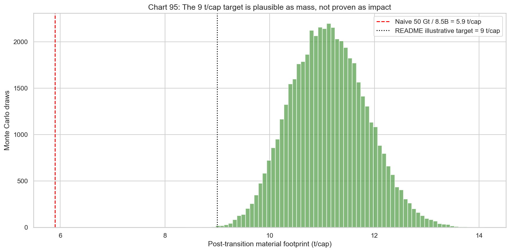
*A ~9 t/cap post-transition mass target is possible only under optimistic category assumptions; the unresolved question is whether a 10-12 t/cap footprint with radically different composition is ecologically acceptable.*

---

## The Debate

Two papers were presented as evidence that capitalism cannot solve poverty within ecological limits. Paper 1 explicitly argues the system is "mathematically unworkable"; Paper 2 is more methodologically careful, concluding that empirical data alone cannot settle the systemic question.

**Paper 1 — "Growth Alone Cannot End Poverty"** makes three interlocking arguments:

- *Arithmetic*: Between 1990–2008, every \$100 of per capita growth contributed only \$0.60 to poverty reduction below \$1/day — a 166:1 inefficiency ratio [[1]](#references-and-sources). The poorest 60% received just 5% of new income. Growth elasticity of poverty collapses at higher thresholds (from –2.0 at \$1.90/day to near zero at \$6.85), meaning growth increasingly bypasses the poor as ambition rises.
- *Provisioning*: The world already extracts ~100 Gt of materials per year — enough to meet basic needs for 8.5 billion people several times over. The problem is allocation, not production capacity. Hickel & Sullivan (2024) estimate decent living standards require roughly 28–40 Gt/yr of materials and ~175 EJ of energy — well within current extraction. GDP growth is the wrong tool because capital flows toward profitable returns, not essential needs.
- *Ecological*: Material extraction is already 2× the sustainable limit (~50 Gt/yr) [[19]](#references-and-sources). A synthesis of 835 peer-reviewed studies (Haberl et al. 2020) found absolute decoupling of GDP from material use "rare" and never observed at global scale [[18]](#references-and-sources). Even countries with absolute CO₂ decoupling would need 220+ years at achieved rates to cut emissions 95%, overshooting fair-share carbon budgets by 27×. The remaining 1.5°C carbon budget is exhausted in 6–10 years at current emissions.
- *Institutional update*: In June 2025, the World Bank itself revised its poverty lines upward using 2021 PPPs, setting the new extreme threshold at \$3.00/day (from \$2.15) and the upper-middle-income line at \$8.30/day (from \$6.85). Under the new \$3.00 line, 838 million people were in extreme poverty in 2022 — 125 million more than previously estimated. The Bank also introduced a "Prosperity Gap" benchmarked at \$25/day, finding that global incomes would need to increase roughly 5-fold on average to reach this standard, and 12-fold in Sub-Saharan Africa. Paper 1 reads this revision as the Bank itself conceding that growth-only approaches are insufficient.

The paper's strongest claim is not the 175× GDP headline. It is that a system which allocates by profitability rather than need will predictably underdeliver redistribution and ecological restraint — and that historically, it has.

**Paper 2 — "Measuring Global Poverty"** is the more methodologically rigorous of the two, and its real contribution is showing how measurement choices shape the narrative:

- *Threshold sensitivity*: At \$2.15/day, both rates and absolute numbers fell dramatically. At \$6.85/day, the rate fell (67% → 47%) but absolute numbers barely moved — ~3.5 billion for three decades. The poverty line you choose determines whether you see triumph or stagnation.
- *PPP and BNPL uncertainty*: The alternative Basic Needs Poverty Line methodology avoids PPP conversions by comparing incomes to local prices of essentials, finding more modest progress (only 6 percentage points of decline, 1980–2011, with absolute numbers *rising*). But BNPL has its own fatal flaw: under socialist price controls with severe shortages, low nominal prices produce artificially low poverty counts despite actual scarcity — making pre-reform China look implausibly good.
- *Non-income confirmation*: Independent welfare indicators (life expectancy +7 years, child mortality –59%, literacy 76% → 87%, caloric supply +400–600 kcal) confirm real material improvement that cannot be dismissed as a PPP artifact.
- *China's outsized not determinative role*: China drove ~75% of extreme poverty reduction, but excluding China entirely still shows poverty rates falling from 33% to 12% (1990–2025). Both camps overstate what China proves: growth-pessimists use it to minimize global progress; growth-optimists credit "capitalism" when China used heterodox state-directed development.

It concludes that *"whether this requires systemic transformation or continued growth is not a question empirical methodology alone can answer"* — and that measurement itself is political: the \$1.90 line makes the world look like a success story; the \$7.40 line makes it look catastrophic; both describe the same underlying reality.

We largely agree with Paper 2's measured framing. Our pushback is mainly against Paper 1's leap from "growth alone is insufficient" (true) to "capitalism is mathematically unworkable" (not supported). But Paper 1's provisioning and system-dynamics arguments deserve more serious engagement than most growth-optimist responses give them.

---

## A note on terms: capitalism, growth, and development

Before adjudicating the debate, three categories need clarifying, because the disagreement partly dissolves or sharpens depending on which definitions are in use.

**Capitalism.** This document uses "capitalism" loosely — roughly "market economies with private ownership of productive assets." But Paper 1 and the heterodox tradition it draws on (Brenner, Ellen Meiksins Wood, Hickel & Sullivan in *Monthly Review*) use it in a narrower, technical sense: an economy characterized by *generalized market dependence* plus *capital accumulation as a systemic imperative* plus the *separation of direct producers from the means of production*. On that stricter definition, pre-reform China (communal land, work units, no labor market) was not capitalism; post-reform China is. Nordic social democracy is capitalism with a large redistributive state. The East Asian developmental states are capitalism with heterodox macro governance. This matters because our claim that "historical command economies failed" is closer to a tautology on the strict definition (virtually no non-capitalist modern economy has been tested at scale in the post-WWII era), and the question "can capitalism deliver ecological containment?" is genuinely open rather than rhetorically empty. The Varieties-of-Capitalism literature (Hall & Soskice 2001; Amable 2003; Streeck 2014) distinguishes at least three working species — liberal market, coordinated market, and state-permeated — with very different distributional and ecological track records. When we conclude "market economies with strong states have delivered broad-based growth," we are making a claim about the coordinated and state-permeated variants, not the Anglo-American liberal-market variant that dominates global rule-setting.

**Growth.** Mainstream economics treats growth as an outcome variable — something policy can target or moderate. Paper 1's deeper claim, inherited from the growth-imperative literature (Binswanger 2009; Richters & Siemoneit 2019; Jackson & Victor 2020; Fix 2021), is that growth is a *structural compulsion* of an economy built on interest-bearing debt, inter-firm competitive accumulation, and a fiscal structure whose solvency tracks nominal GDP. On this view, telling a capitalist economy to stop growing is like telling a bicycle to stay upright while stationary. We do not settle this question — it is genuinely unresolved in post-Keynesian and ecological-economic literatures — but the document should not evade it. Where we claim "rich-world material throughput can fall while welfare rises," we are making a bet that compositional change (from goods to services, from fossil to clean, from linear to circular) can outrun the accumulation imperative. Rich-country material-footprint trajectories are partial evidence on both sides. The US case is the most-studied and the most demanding: material use rose roughly with GDP through ~1980, relative decoupling set in during the 1980s–2000s (MF/GDP fell), absolute MF peaked around 28–30 t/cap in 2007 (methodology-dependent; there is ~15–20% spread across consumption-based accounting methods), fell to ~22–25 t/cap post-2008 and has roughly stabilized there. The UK, Germany, France, Japan, and the Nordics display a similar *qualitative* pattern — relative decoupling from the 1970s–80s, a modest absolute peak in the mid-2000s, and a post-2008 plateau at a lower per-capita level (roughly 12–18 t/cap depending on country and methodology) — confirming that compositional shift produces real decoupling across institutional variants, not just in the US. What none of these trajectories have produced is reduction to anywhere near the sustainable level (~5–8 t/cap). The services share of rich-country GDP rising from roughly 50% in 1950 to 60–82% today has taken material intensity down substantially, but has plateaued the absolute footprint at roughly 2–4× the sustainable budget. The growth-imperative literature's strongest version of the claim is not that no decoupling occurs but that decoupling tends to stall where it matters — at the level needed for ecological sufficiency — because the underlying accumulation dynamic keeps pushing the absolute total back up. That is a weaker claim than "no decoupling" but a stronger claim than "composition can solve the problem," and the cross-country post-2007 data are genuinely ambiguous between the two readings.

**Development and measurement.** The quantitative apparatus we use - GDP per capita, WDI indicators, poverty lines, planetary boundary budgets - embeds specific commitments: that monetary aggregates proxy welfare, that nations are the natural unit of analysis, that "the economy" is separable from society and ecology, and that welfare thresholds can be numerically specified. Several decades of development anthropology (Escobar 1995; Ferguson 1994, 2006; Mitchell 2002; Li 2007; Mosse 2005) argue that "development" as an epistemic regime tends to convert political questions into technical ones and to render legible only what can be counted. Graeber & Wengrow (2021) and the longer Sahlins/Polanyi line show that the poverty/affluence framing itself fits uneasily onto subsistence, commoning, and gift-exchange economies. We do not dismiss this critique. We use the global statistical apparatus because it exists at scale and because its findings on child mortality, literacy, nutrition, and life expectancy describe something real. But the numbers should be read with their blind spots visible.

**How to read the welfare metrics.** The good-life threshold is an *outcome-reliability floor*, not a complete theory of flourishing. It asks when severe measurable deprivations become uncommon; it does not decide what makes a life meaningful, chosen, dignified, or culturally intact.

- **What the metric sees:** life expectancy, child survival, safe childbirth, nutrition, water, sanitation, electricity, clean cooking, schooling, safety, air quality, household consumption, and PIP median welfare.
- **What it misses on the upside:** commons access (grazing, forage, fuelwood, fisheries, water), gift exchange, reciprocity and mutual-insurance networks, unpaid care, kinship, ritual life, land attachment, autonomy, and diversified subsistence options. Where those institutions are intact, measured income and consumption can understate welfare.
- **What it misses on the downside:** commodification of previously free provisioning, alienation, land loss, coercive migration, debt dependency, cultural destruction, and loss of political autonomy. A country can score well on the outcome bundle while producing harms the bundle does not price.
- **How it should be used:** diagnostically, not as a moral aggregator. If two development paths produce similar gains in survival, schooling, services, and consumption, the path that preserves more autonomy and does less social damage is better. If there is a trade-off, the metric should expose it rather than pretend to resolve it.
- **What data could add:** Cantril life satisfaction, Gallup social support and perceived freedom, World Values Survey trust and agency items, V-Dem and Freedom House political measures, land-tenure and conflict datasets, and DHS/MICS/LSMS/IPUMS/PIP subgroup data. These can become companion diagnostics for subjective wellbeing, agency, subgroup exclusion, and provisioning-mode harms; they should not be collapsed uncritically into the same score.

The anthropological critique therefore has real merit but should be aimed precisely. It is a serious critique of calling any quantitative bundle "the good life." It is not a strong critique of measuring whether preventable child death, undernutrition, unsafe water, lack of sanitation, illiteracy, indoor air pollution, and extreme material insecurity have become uncommon. Below the floor, large-scale flourishing is predictably constrained; above it, people may or may not have lives they would choose, for reasons the metric only partly sees.

*Commons as working institutions, not nostalgia.* Elinor Ostrom's *Governing the Commons* (1990) and the subsequent meta-analyses (Cox, Arnold & Villamayor-Tomás 2010; Porter-Bolland et al. 2012) show empirically that well-designed commons management consistently outperforms both privatization and state control for a specific class of resources — renewable natural resources with clear boundaries and repeated-interaction communities. Modern working examples include Maine lobster fisheries, Swiss alpine grazing cooperatives, Japanese iriai forests, and Nepalese community forestry (which reversed ~1M hectares of deforestation between 1990 and 2015). Community forestry vs. concession-based logging in the tropics averages ~50% lower deforestation rates at equivalent harvest. Urban commons — community land trusts, housing cooperatives (Swiss and Viennese models serve ~20% of urban housing), public libraries, municipal broadband — and digital commons (Linux, Wikipedia, OpenStreetMap, academic preprint servers) are cases where commons institutions outperform pure-market or pure-state provision at planetary scale. Commons restoration is not a substitute for productivity growth or state capacity, and it does not fit food-at-scale, heavy industry, or high-specialization urban services. But it is a genuine institutional form that development planning has systematically undervalued, and rebuilding it in the domains where Ostrom-design-principles apply produces welfare gains — probably single-digit percent of GDP in aggregate, much larger for the specific populations (fishing communities, forest-dependent peoples, pastoralists, urban low-income households) who rely on these resources. The countries that do best on combined welfare and ecological indicators — Nordics, Costa Rica, Kerala — pair high state capacity with strong commons-like institutions, not one or the other.

None of this changes the arithmetic below. It changes how the arithmetic should be read.

---

## Where the Papers Are Right

### Growth alone is too slow and too blunt

If only 5% of GDP growth reaches the poorest 60% [[2]](#references-and-sources), then relying on undirected growth to eliminate poverty is grotesquely inefficient. Our data confirms this: growth elasticities of poverty decline at higher thresholds, and progress above \$6.85/day has been far more modest than the headline \$2.15 numbers suggest. (A base-year sensitivity caveat: the Lakner–Milanovic "5% to the poorest 60%" figure is drawn from the 1988–2008 elephant-curve window; updated 2013–2018 data show the rich-world-worker stagnation trough easing somewhat and the Asian middle-class gains continuing, which modestly changes the share going to each decile. The *direction* — sharply skewed capture of growth gains — is robust across windows; the exact 5% is window-specific and should be read as "single-digit percent" rather than a stable constant.)

*At \$2.15/day, East Asia's dramatic decline dominates the global story. At \$6.85/day, South Asia and Sub-Saharan Africa remain largely unchanged. The "declining poverty" narrative is essentially an East Asian story at higher thresholds.*

### Transfers hit the poverty gap more directly

Direct cash transfers deliver \$0.85–\$0.90 per dollar to recipients [[15]](#references-and-sources). Undirected growth, under the Lakner-Milanovic distributional window, delivers only single-digit cents per dollar of new global income to the poorest 60%. For immediate poverty-gap closure, transfers are far more direct. The qualification matters: a one-time transfer closes a current income gap, while growth can change the future tax base, employment structure, and domestic productive capacity. The right comparison is not "transfers or growth," but what each tool is good at.

### Sub-Saharan Africa is being left behind

SSA's share of global extreme poverty rose from 13% to 65% while the absolute number of poor people nearly doubled. This is the most serious ongoing development failure, and no amount of global-average optimism erases it.

### Planetary boundaries are real

This is arguably the papers' strongest claim. According to the Richardson et al. 2023 update [[16]](#references-and-sources), six of nine planetary boundaries are now transgressed. Our analysis covers eight of the nine (excluding novel entities / chemical pollution) and finds four clearly exceeded, three at or near the limit, and one recovering.

*Four boundaries are clearly exceeded (red), three are at or near the limit (orange), and only ozone is recovering — thanks to the Montreal Protocol, one of the few successful global environmental agreements. Reference values from Rockström et al. 2009, Steffen et al. 2015, and Richardson et al. 2023.*

**Epistemic caveat on the framework itself.** The planetary boundaries framework is the best synthetic tool available, but it is not settled science at the level of precise numerical boundaries. Montoya, Donohue & Pimm (2018, *TEE*) argue the boundaries are under-specified for several Earth-system processes and that the single-threshold framing obscures interactions and nonlinearities. Biermann & Kim (2020, *Annual Review of Environment and Resources*) note that the freshwater, biosphere integrity, and land-system change boundaries rest on weaker empirical foundations than the carbon budget. Nordhaus (2019) has questioned the epistemic status of the material footprint limit in particular. Persson et al. (2022) formally declared the novel entities boundary transgressed — bringing the Richardson et al. 2023 total to six, but via a boundary that is almost entirely unquantified at the global level. Our headline "six of nine transgressed" inherits all of this uncertainty: the *direction* is robust (we are pushing hard on multiple Earth-system processes), but the precise ratios we report (3.4× for nitrogen, 1.2× for carbon, etc.) carry more uncertainty than the point-estimate presentation suggests. Paper 1's critique does not require precise numerical transgression — it requires that the Earth system is being pushed past thresholds with nonlinear consequences, which is well supported.

| Boundary | Safe Limit | Current | Status |
|---|---|---|---|
| Climate change (CO₂) | 350 ppm | 424 ppm | **Exceeded** |
| Biosphere integrity (LPI) | 90 (index) | 27 (index) | **Exceeded** |
| Nitrogen fixation | 35–62 Tg/yr¹ | ~150 Tg/yr | **Exceeded (1.9–3.4×)** |
| Land-system change | 75% forests | 68% forests | **Exceeded** |
| Freshwater use | 4,000 km³/yr | ~3,949 km³/yr | At limit |
| Phosphorus flow | 11 Tg/yr | ~9 Tg/yr | Near limit |
| Ocean acidification | 2.75 Ω | 2.8 Ω | Near limit |
| Ozone depletion | 276 DU | 284 DU | Safe (recovering) |

*¹The safe boundary for human nitrogen fixation (the maximum annual rate the biosphere can absorb without ecosystem damage) is contested: Rockström 2009 set it at 35 Tg/yr, which puts current fixation (~150 Tg/yr) at 3.4× over. Richardson 2023 revised the boundary upward to 62 Tg/yr, reducing the overshoot to 1.9×. We report the range to acknowledge this uncertainty; either way, nitrogen is significantly exceeded.*

### Progress depends on which poverty line you use

At \$2.15/day, the world has achieved extraordinary progress — from 1.9 billion (36%) in 1990 to 0.45 billion (5.7%) in 2024. At \$6.85/day, 3.14 billion people remain below the line, with only modest improvement in absolute numbers. The papers are right to insist on higher thresholds.

---

## The Poverty Arithmetic: What Growth Actually Changed

The papers frame growth and redistribution as alternatives. Our central finding is that they are complements. Growth didn't solve poverty directly, but it transformed the fiscal problem of solving it.

### Growth made redistribution dramatically cheaper — but it was never truly impossible

*The poverty gap at every threshold has fallen as a share of global GDP. At \$2.15/day: from 1.4% to 0.06%. At \$6.85/day: from ~18% to ~1.6%. Growth created the surplus from which redistribution can draw — though at \$2.15, even the 1990 gap was within fiscal reach.*

| Poverty Line | People Below | Gap (2017 PPP) | Nominal Cost | ×3 Overhead | % World GDP |
|---|---|---|---|---|---|
| \$2.15/day | 0.45B | \$118B | ~\$41B | ~\$122B | 0.12% |
| \$3.65/day | 1.21B | \$560B | ~\$179B | ~\$538B | 0.51% |
| \$6.85/day | 3.14B | \$3,132B | ~\$965B | ~\$2,895B | 2.76% |

The trajectory tells the story: at \$6.85/day, the gap fell from 18.1% of world GDP in 1990 to 1.6% today — still enormous in absolute terms, but a 91% decline relative to global capacity. At \$2.15/day, total ODA (\$203B nominal) exceeds the nominal delivery cost (~\$41B) by roughly 5:1 — though even the 1990 gap of 1.4% of GDP was never a true resource constraint. For intuition: France collects 45% of GDP in taxes within its borders — 1.4% was never an arithmetically impossible ask, even if cross-border redistribution faces fundamentally different political obstacles. Growth made an already-solvable problem even cheaper, but the deeper shift is at higher thresholds where the gap was once genuinely crushing.

**Note on units:** Poverty gaps are in 2017 PPP dollars (the poverty line's unit). "Nominal cost" converts each country's gap to market-rate USD using its implicit price level (GDP nominal ÷ GDP PPP), weighted by poverty share. Goods cost less in poor countries: \$1 PPP requires only ~\$0.31–0.34 nominal to deliver where poverty is concentrated. This conversion *strengthens* the affordability finding — ODA buys more local purchasing power than its face value suggests. See [methodology](analysis/ppp_nominal_conversion.py).

### The target is basic welfare, not American consumption — but that raises hard questions

The papers' most alarming scenario assumes everyone must converge to American consumption levels — a common rhetorical benchmark but not a serious policy target. Our first-pass welfare proxy — the GDP per capita above which 91–95% of country-years achieve life expectancy ≥70 — converged near **\$15,000 per capita (PPP)** (our analysis, not from external literature — see note [[37]](#references-and-sources)). The expanded audit shows why that number should be read as a lower-bound heuristic rather than a complete good-life threshold. When the target is broadened from life expectancy and under-5 mortality to a 19-indicator bundle covering health, nutrition, water, sanitation, electricity, clean cooking, education, safety, and air quality, the reliable resource band rises: roughly \$20k GDP/cap population-weighted and \$40k unweighted for 90% reliability on an 85% outcome score; \$12.5k-\$15k household consumption/cap; or \$15-\$25/day PIP median welfare.

This makes the good-life threshold more concrete and more demanding. In 2024, the World Bank PIP world aggregate has 52.7% of humanity below \$10/day, 65.0% below \$15/day, 72.3% below \$20/day, and 77.2% below \$25/day. In the outcome bundle itself, the latest covered population-weighted score is 0.67; about 49% of covered population lives in countries scoring at least 80%, 47% at least 85%, and 40% at least 90%. The world is not at an American-consumption target, but it is also not close to a thick good-life floor.

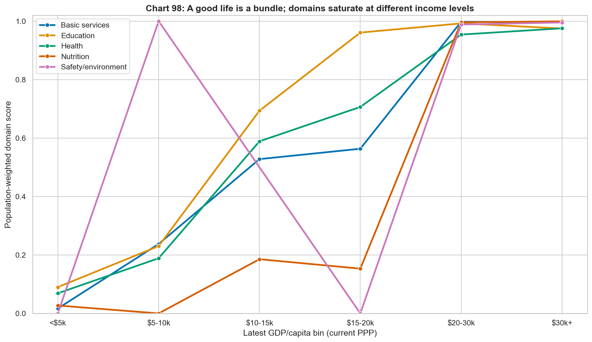
*The bundle is not one thing. Education, health, nutrition, clean services, and safety/environment outcomes saturate at different income levels, which is why a single GDP threshold overstates precision.*

This reframing, however, creates a moral problem we should not dodge. If the good-life band is far below rich-world consumption, why does the US consume at roughly \$75,000 GDP/cap — several times even the expanded threshold? Our own ecological data answers that question uncomfortably: **the US material footprint is 22.7 tonnes per capita against a sustainable limit of 5–8 tonnes.** Rich-world consumption is not just excessive relative to the poor world's needs; it is ecologically indefensible on its own terms. The planetary boundaries analysis in this project shows that even if the poor world stopped growing entirely, the rich world's current throughput still breaches multiple boundaries.

The implication is both empirical and normative. The poor world needs growth, redistribution, and state capacity to reach a real good-life threshold, and that threshold does not require American consumption levels. The rich world also needs to *reduce* its material throughput substantially, and whether market economies can deliver that reduction is genuinely uncertain. The defensible endpoint is not universal Americanization or poor-world restraint: it is upward convergence in human welfare and downward convergence in material throughput. Our data shows a few rich countries (UK, Germany) making progress on material decoupling, but none are anywhere near the sustainable limit. This is one of the strongest points in the papers' favor.

### A note on rich-world working-class stagnation

The argument above assumes the rich world *can* reduce material throughput. The binding political constraint on that reduction — and on scaling up international redistribution generally — is the distribution of gains *within* rich countries, and how voters perceive their own position. Both "the rich-world working class has been stagnating" and "the rich world has never had it so good" are heard in this debate, and the honest answer is that both are partially right but they describe different things. This section distinguishes three separable claims that are often run together: (1) absolute material welfare, (2) relative economic position, and (3) subjective/political dissatisfaction. The direction of each is different, and conflating them produces bad analysis.

**Absolute material welfare: up substantially across the rich world.** Bottom-quintile households are measurably better off than 50 years ago on nearly every objective dimension — housing square footage, vehicles per household, appliance ownership, food quality, medical technology, information goods (essentially free), communications, air quality, and life expectancy. The US data are the most commonly cited (Sacerdote 2017; Meyer & Sullivan's consumption-based poverty measures show bottom-quintile material welfare up 50–100% since 1970 on quality-adjusted metrics; US life expectancy rose until roughly 2014 even for non-college workers before stagnating), but the direction is general across the OECD: Eurostat material-deprivation indices fell across almost every EU-15 country between 2005 and 2019; UK DWP Households Below Average Income data show bottom-quintile real consumption up meaningfully since the 1970s; Japanese bottom-quintile consumption rose through the 1990s stagnation thanks to falling durable-goods prices and universal healthcare. Stevenson & Wolfers (2008, 2013) largely falsified the Easterlin paradox at the national-income level *cross-nationally*: richer countries genuinely are happier, and the relationship does not saturate. Killingsworth (2021, *PNAS*) extended this to individuals, finding life satisfaction rises with income at all levels tested; Kahneman & Killingsworth (2023) jointly reconciled to "absolute income rises help nearly everyone." If you believe — as we do — that absolute material gains are what matter morally once externalities are accounted for, then by this measure the rich-world working class is meaningfully better off than 50 years ago, not worse, and this is a multi-country finding rather than a US peculiarity.

**Relative economic position: stagnant or falling for non-college workers — but the severity varies enormously by country.** The debate is routinely anchored on US data: real median US wages for men without a bachelor's degree have been roughly flat since the late 1970s in CPI-U terms; labor's share of GDP fell from ~65% to ~58% between 1970 and 2015 (Karabarbounis & Neiman 2014 — a *cross-country* finding, not a US-specific one); the EPI productivity–pay gap shows median hourly pay grew ~15% while productivity grew ~60% since 1979. Milanovic's elephant curve captured this at the global scale as the *rich-world* working and lower-middle class being the clearest relative losers of the 1988–2008 globalization window, though later updates (Milanovic 2023) show some easing of that trough from 2008 onward. Cost-disease sectors (housing in productive metros, healthcare in the US, childcare, higher education) have absorbed a rising share of household budgets in most rich countries, so the goods that got cheaper (electronics, clothing) are less salient to life chances than the services that got more expensive. The picture that emerges once you look outside the US is that relative position did deteriorate for non-college workers over roughly 1970–2010 in most rich democracies, but the severity is institutionally contingent: Nordic, Dutch, and Belgian bottom-half trajectories remained far better than the Anglo-American average, while Italian and Japanese wages stagnated worse than the US since 1990.

That said, the single "non-college men" series routinely invoked to anchor this story is the *worst-performing* demographic slice of the *worst-performing* major rich economy, and treating it as representative of a pan-rich-world working class is empirically misleading. Chart 78 plots US real median weekly earnings (CPI-U, constant 2024 \$) by education level for workers aged 25+. All four groups — less-than-HS, HS graduate, some college, bachelor's+ — have been roughly flat-to-slightly-up since 2000, with the post-2019 period showing the strongest gains (less-than-HS earnings are up ~13% vs 2000 by 2024, partly a composition effect as that group shrinks, but directionally positive). Chart 79 shows why slicing by men-only exaggerates stagnation: US real median weekly earnings for women 16+ rose ~35% between 1979 and the mid-2020s, while men 16+ earnings were roughly flat over the same period; household earnings, which are what actually pay for housing and healthcare, reflect both trajectories. Chart 80 adds the race/ethnicity cut (FRED, workers 16+, 2000–2025 in 1982–84 \$): Asian earnings rose ~35% since 2000, Hispanic ~30%, while White (~10%) and Black (~10%) both posted real gains. A worker-level story told only through "non-college White men" captures neither women's trajectory nor the recent gains for Black and Hispanic workers — and that is before leaving the US.

The cross-country comparison in Chart 81 (OECD real average annual wages, constant 2022 USD PPP) makes the US-centric framing still more problematic. Between 1990 and 2024, real average wages rose ~52% in the United States — roughly the G7 average, below Norway (+76%) and Sweden (+62%), and well above Japan (~0%) and Italy (~−3%). If "rich-world working-class stagnation" were a generic story about late capitalism, Japan and Italy would be the paradigm cases, not the US. The actual pattern is that *cross-country wage growth varies by a factor of ~3*, and the US sits in the middle of that distribution, not at the bottom. The interpretation that best fits the data is not "capitalism immiserates the working class in rich countries" but "the institutional configuration of each rich country — labor-market policy, collective bargaining coverage, sectoral composition, monetary regime — predicts a very wide range of outcomes within the same broadly capitalist framework." Where the true stagnation story holds most tightly, however, is in the *distributional* dimension: Chart 82 (WID.world, `sptincj992`) shows the bottom-50% share of pre-tax national income falling in nearly every major rich economy since 1980, with the US the clearest case (~20% → ~13%) but France, Germany, Italy, and the UK all declining meaningfully. Nordic bottom-50% shares remained around 24%, the Anglo-American economies compressed toward 13–17%, and the gap between the two clusters widened. So the "relative position" concern is real and distributional, but it is not primarily a story about flat wages: it is a story about where the growth went, and it is a cross-national story with institutional variation, not a US story writ large.

**Subjective dissatisfaction and political backlash: the causal picture is genuinely unsettled.** The intuitive move is to attribute rising rich-world dissatisfaction — Brexit 2016, Trump 2016 and 2024, AfD's growth in Germany, Le Pen's successive advances in France, Meloni in Italy, Wilders in the Netherlands, the Sweden Democrats entering government, and the 2025 USAID dismantling and UK ODA cut — to the relative-position story. That attribution is plausible but far from proven, and several lines of evidence cut against a clean "material stagnation → political backlash" chain:

- **Social-capital and civic-association decline has distinct national trajectories.** The US version (Putnam, *Bowling Alone* 2000; Putnam & Garrett, *The Upswing* 2020) — union membership, church attendance, civic-association participation, friendship-group size, and third-place density all declining on roughly linear trajectories since the 1970s regardless of macroeconomic cycles — predates the wage-stagnation story and continues through periods of both strong and weak wage growth. But cross-national data complicate the picture: union density fell sharply in the Anglo-American economies and France, held up much better in the Nordics and Belgium, and rose in some East European accession states in the 2000s. OECD and Eurobarometer trust indicators fell modestly in Western Europe but nowhere near the US magnitude, and Nordic associational life remained comparatively robust through the same window. So "social-capital collapse" is a real story, but it is most acute in the US and the UK and varies enormously in severity by national institutional context — which is itself evidence that the driver is not pan-capitalist economic change but country-specific civic and political pathways.
- **The post-2012 teen mental-health crisis** (Haidt 2024; Twenge 2017–2023; CDC YRBS data) inflects sharply at the smartphone-saturation point and affects cohorts too young to be labor-market participants. The same inflection appears in UK NHS and ONS data, Australian and Canadian national surveys, and Nordic health registers regardless of local wage trajectories, which is strong evidence that smartphones and social media are a common cause operating *independently* of economic conditions. A significant fraction of what gets attributed to "material stagnation" may instead be this technology shock running in parallel.
- **The vibecession (2022–2024) was global, not just American.** Autor, Dube & McGrew (2023, "The Unexpected Compression") documented that real wages for the bottom US quintile rose *faster* than for the top during 2020–2024 — the strongest bottom-quintile real-wage growth in roughly 40 years — yet US consumer sentiment stayed at historic lows. The same sentiment-reality gap appeared across the OECD: UK GfK consumer confidence and EU Economic Sentiment Indicator both sat well below what 2022–2024 employment and real-wage data alone would predict, and German, French, and Japanese confidence followed similar patterns. The common factor is the 2022 inflation shock and the price-level reset it produced — households compare to the pre-inflation price level, not the post-inflation real-wage trajectory. If the lowest-wage workers in multiple rich economies were simultaneously experiencing unusually strong material gains and reporting unusually high dissatisfaction, "material conditions drive dissatisfaction" cannot be the full explanation anywhere.
- **Partisan identity distorts reported sentiment — and the US is an international outlier on how strongly.** In US survey data, self-reported economic wellbeing responds more strongly to whether one's party holds the presidency than to objective macro indicators post-2016; co-partisans of the winning candidate report large sentiment jumps on election night with no underlying economic change. Cross-national evidence (Boxell, Gentzkow & Shapiro 2020, NBER "Cross-Country Trends in Affective Polarization") shows this kind of partisan distortion rose most sharply in the US, Canada, New Zealand, and Switzerland over the past four decades, held roughly flat in the UK and Australia, and *fell* in Germany, Sweden, and Norway over the same period. Partisan-identity effects on sentiment are therefore real, but they are *most* distorting where affective polarization has risen most — i.e., in a specific subset of rich democracies, with the US as the clearest case. A pan-rich-world "perception is driven by partisan sorting, not material conditions" framing overgeneralizes a US-amplified phenomenon; for the median European or East Asian voter the partisan-distortion term is smaller than the material-conditions term.
- **The deaths-of-despair case is weaker than it was** (see the caveat above): the cross-country failure (UK, Germany, France, Italy, Japan did not produce equivalent mortality crises despite similar or worse working-class stagnation) points to US-specific factors — the opioid supply shock, employer-linked healthcare, firearm availability — doing work that "stagnation + despair" cannot do. This is itself an argument *against* reading US pathology as a generic diagnosis of rich-country politics.

**Synthesis:** Community and institutional dissolution, technology-driven mental-health effects, and partisan-sorted perception are doing a substantial and under-credited share of the causal work that popular narratives assign to material stagnation. Correlation between wage-stagnation and political backlash does not establish that the first caused the second; several alternative causes are better time-correlated with the dissatisfaction phenomena and operate cross-nationally in ways that the economic story does not.

For this document's argument, the key point survives, but in a more precise form: what binds international redistribution is not "rich-world workers are materially immiserated" (largely false in absolute terms) but "rich-world voters perceive themselves as losing out and vote accordingly." That perception may be partly relative-position, partly partisan identity, partly community-dissolution, partly social-media-amplified, and partly genuine stagnation of specific cohorts in specific dimensions. For the political-constraint argument it does not matter whether the perception accurately tracks material conditions — perception is the operative political variable regardless. But it does matter analytically: we should not license a "capitalism made rich-world workers miserable" story that the data does not actually support. Paper 1's redistribution arithmetic collides with a political reality of rich-country voter dissatisfaction whose *causes* remain contested, and interventions that assume a purely-material explanation (e.g., "if we just raise wages, the political coalition for global redistribution will form") may underperform expectations — exactly as such interventions have historically underperformed.

### Testing the provisioning argument directly

Paper 1's strongest version is not "175× GDP." It is that decent lives require specific material inputs — housing, nutrition, healthcare, sanitation, education, energy — and the world already extracts enough material (~100 Gt/yr) to provide these several times over. The problem, on this view, is not insufficient production but misallocation: capital flows toward profitable returns rather than essential needs, so the poor lack what already exists in aggregate.

This framework can be tested against our own data:

**Where provisioning is right:**
- At \$2.15/day, the poverty gap (\$118B PPP, ~\$41B nominal) is 0.06% of world GDP. The resources exist. The gap is a distribution failure, not a production failure. This is unambiguously true.
- Global food production is sufficient to feed ~10 billion people. Roughly one-third is wasted. Hunger is a distribution and poverty problem, not a supply problem (FAO 2023).
- The Decent Living Standards (DLS) framework (Rao & Min 2018) [[33]](#references-and-sources) estimates basic material needs at 15–28 GJ/cap energy, ~3–5 t/cap material footprint. Global extraction could provide this for everyone within the sustainable boundary — if it were allocated differently.

**Where provisioning is incomplete:**
- The DLS framework describes a *minimum floor*, not the thicker welfare level at which health, nutrition, infrastructure, education, and safety outcomes reliably saturate. The gap between DLS (~\$3–5k) and the expanded good-life resource band is large, and that gap is filled by infrastructure, institutions, and productive capacity — not just material allocation. Peer-reviewed provisioning analyses are the right anchor here. Millward-Hopkins, Steinberger et al. (2020, *Global Environmental Change*) estimate that decent living for 10 billion people could be met with ~40% of current global final energy consumption, and Kikstra et al. (2021) estimate ~15–40 GJ/cap/yr depending on climate and urban form. These bracket the Hickel & Sullivan numbers Paper 1 cites and support the papers' framing that *current global output is sufficient for basic provisioning if allocated differently*. The expanded good-life threshold is a different claim — about the resource level at which a broad outcome bundle reliably saturates — and it sits above DLS because it embeds the cost of the institutions, infrastructure, and productive capacity that convert material throughput into durable welfare.
- Provisioning works for *consumables* (food, energy, basic shelter) but not for *capabilities* (healthcare systems, education quality, institutional trust, economic opportunity). You can redistribute grain; you cannot redistribute a functioning hospital system or a capable civil service.
- The flow problem remains: even perfect one-time redistribution of material goods does not create the *sustained productive capacity* that generates welfare year after year. A country needs not just enough concrete this year but the ability to produce concrete next year — and the institutions to direct it toward housing rather than monuments.

**Synthesis:** The provisioning critique is largely correct for basic needs at the lowest thresholds — the world produces enough, and the distribution failure is real and damaging. It becomes progressively less applicable at higher welfare thresholds, where the binding constraint shifts from material allocation to institutional capacity, productive investment, and sustained economic complexity.

We can partially test this against the papers' own framework. Paper 1 cites Hickel & Sullivan's estimate that DLS for 8.5 billion people requires 28–40 Gt of materials and ~175 EJ of energy. Our post-transition material budget (an illustrative scenario, not a precise forecast) lands at roughly 50–55 Gt — above the DLS minimum but radically different in composition from today's 100 Gt. The gap between DLS (~28–40 Gt) and our post-transition estimate (~50–55 Gt) is largely construction minerals for infrastructure maintenance — the ecologically least damaging category. Whether that gap matters depends on whether the aggregate mass limit (50 Gt) or the boundary-specific impacts (carbon, nitrogen, land use) are the real constraint. We argue the latter; the papers' framework implies the former. This is a genuine point of disagreement, not a gap we can close with more data.

The \$15k proxy is a GDP correlation (our analysis — see [[37]](#references-and-sources)), not a direct material-needs calculation. The expanded audit narrows this gap by moving from a two-outcome GDP proxy to a broader outcome bundle and adding household consumption plus PIP median welfare as resource measures. It still does not replace DLS material accounting: a more rigorous provisioning comparison would map DLS material bundles to post-transition budgets category by category.

*This threshold chart is useful for the narrow claim that life expectancy has sharp diminishing returns. It should not be read as the full good-life threshold.*

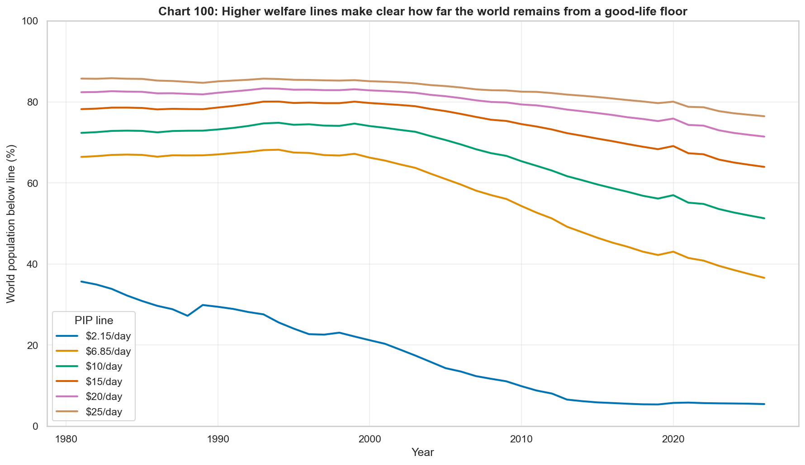
*Higher PIP lines show the scale of the remaining welfare gap. Extreme poverty has fallen dramatically, but most of humanity remains below \$15-\$25/day, the band associated with reliable achievement of the expanded outcome bundle.*

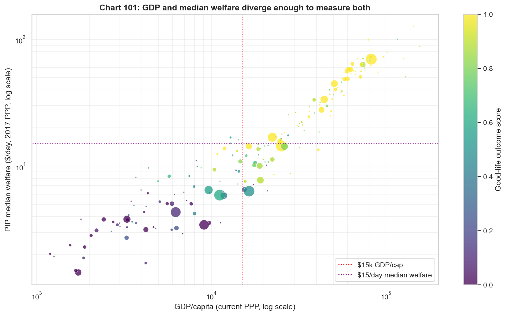
*GDP and median household welfare are correlated but not interchangeable. A good-life analysis should measure both national productive capacity and ordinary-person command over resources.*

### ODA and the extreme poverty gap converged

*The \$2.15/day poverty gap fell from ~\$420B to \$118B (2017 PPP) while ODA rose to \$203B (nominal USD). In comparable nominal terms, ODA exceeds the extreme-poverty delivery cost by roughly 5:1. At higher thresholds, ODA covers only a fraction of the gap. Growth brought the extreme-poverty mountain down to where aid could reach it.*

### Sovereignty and the enforcement gap

The deeper obstacle, underlying every specific proposal above, is the absence of sovereign authority at the global scale. Domestic redistribution works because modern states combine three features: compulsory taxing power over activity within their jurisdiction, monopoly on legitimate coercion to enforce collection, and *some* functioning mechanism of accountability to the population being taxed. That last feature need not be democratic. Pre-1987 South Korea and post-1965 Singapore taxed effectively and delivered substantial redistribution (near-universal healthcare, mandatory provident funds, infrastructure, mass public housing) without meaningful competitive elections — operating instead through performance legitimacy, elite-internal contestation, party discipline, and technocratic capacity. The PRC is a more complicated case: it taxes effectively and has lifted ~800 million people out of extreme poverty, but its social safety net remains modest relative to its GDP — hukou-tiered healthcare and pension access, rural basic pensions around ¥200/month, high out-of-pocket medical costs, and a growth-prioritizing rather than redistribution-prioritizing orientation even under a nominally communist party. It is nonetheless a state with extractive and allocative capacity far exceeding the international system, which is the relevant point here. LDP-dominated Japan and the PAP-dominated Singapore tax and redistribute well precisely *because* their governing parties have internalized long-horizon planning, not despite their thin electoral alternation. The operative variable is whether the state is legible and responsive to the welfare of those it taxes, via any mechanism that disciplines it; democracy is one such mechanism, but not the only one. The international system has *none* of them. There is no global tax authority, no accountability — democratic, performance-based, or party-disciplined — of donors to recipients, and no enforcement mechanism that survives a unilateral exit by a major power. This is not a minor institutional detail — it is the structural reason Rodrik's trilemma (deep integration, nation-state, mass democracy: pick two) keeps reasserting itself in every attempt at global governance, and it holds even in the weaker form where "mass democracy" is replaced by "any binding accountability to the taxed population."

The 2025 USAID dismantling made the enforcement gap concrete: a single election in a single donor country halved a significant share of global aid overnight, with no mechanism for recourse. A US \$20B social security benefit cannot be unilaterally cancelled by a single president in the same way; international aid can. The strongest redistribution proposals above (FTT, wealth tax, Pillar Two) all run up against the same underlying problem — any meaningful global tax instrument requires near-universal participation to resist avoidance, and near-universal participation requires an enforcement mechanism that does not exist. Pillar Two is the closest anyone has come; the fact that it still allows 15% minimum rather than full harmonization is a measure of how tight the constraint is.

This framing sharpens what the papers are proposing. "Redistribute \$6 trillion per year globally" is arithmetically trivial against ~\$110 trillion in world GDP. It is politically non-trivial against zero sovereign authority to compel it. Streeck's *Buying Time* (2014) and Pistor's *The Code of Capital* (2019) argue, from different angles, that the current international legal and financial architecture is actively designed to insulate capital from democratic-redistributive pressure — which is one version of Paper 1's structural claim. Whether this architecture can be reformed within existing political economy, or whether reform itself requires a shift in the underlying social order, is not a question our data can answer. It is however the question on which the debate actually turns.

### But the scale problem at higher thresholds is genuine — and the strongest proposals go beyond ODA

The papers propose redistribution of \$1.3–6 trillion per year. Total global ODA is ~\$224 billion (2024 OECD preliminary), stagnant and trending downward in several major donors. That gap — 6–30× the entire current aid system — is the weakest version of the redistribution case, because serious proponents don't propose scaling up ODA alone. The stronger proposals include:

- **Global financial transaction tax (Tobin tax)**: A 0.1% levy on foreign exchange, equity, and derivative trades could raise \$200–400B/yr (CEPR, Schulmeister 2014). The EU has debated versions since 2012 without achieving consensus.
- **SDR reallocation**: The IMF's \$650B 2021 Special Drawing Rights allocation went overwhelmingly to rich countries that didn't need it. Rechanneling 30–50% to low-income countries would provide \$200–300B in liquidity at near-zero cost. Some reallocation has occurred but at far smaller scale.
- **Global minimum corporate tax**: The OECD Pillar Two (15% minimum, 2024) could reduce profit-shifting that costs developing countries an estimated \$100–240B/yr (Tax Justice Network 2021). Early implementation is underway but enforcement is uncertain.
- **Carbon border adjustments**: The EU CBAM (phasing in 2026) creates a revenue stream that could partially fund climate adaptation in the Global South, though current designs don't earmark revenue this way.
- **Wealth taxes on global billionaires**: The Zucman proposal (2% annual tax on billionaire wealth) could raise ~\$250B/yr globally. No implementation mechanism exists.

These proposals are more serious than the ODA straw man — several have partial institutional infrastructure and generate revenue without requiring legislative appropriation each year. But they share a fundamental challenge: **no sovereign enforcement mechanism exists for global taxation**, and the mechanical obstacles go beyond politics.

**The financial transaction tax illustrates the engineering problem.** A 0.1% levy sounds trivial, but financial markets restructure around taxes with extraordinary speed. The EU's 13-year failure is not just political gridlock — it reflects a real avoidance problem. Any unilateral or partial implementation drives volume to non-participating jurisdictions (the "Estonia becomes the new Cayman Islands" dynamic). More fundamentally, financial institutions would develop internal netting arrangements, deferred-settlement systems, and synthetic instruments that move economic exposure without triggering taxable transactions — structurally similar to how hawala and informal value transfer systems enable international payments without cross-border money movement. Your deposit cancels someone else's withdrawal; the economic transfer occurs but no taxable transaction does. Sweden's 1984 FTT drove 50% of equity trading to London within a year; the tax was repealed in 1991 having raised a fraction of projected revenue.

**The wealth tax faces a different but equally severe mechanical problem.** Taxing illiquid assets at 2% annually creates three compounding difficulties: (a) *Valuation cost*: how do you annually assess the value of a 30% stake in a private company, a ranch, or an art collection? The administrative infrastructure is expensive and the valuations are inherently contested. (b) *Announcement-driven devaluation*: the moment a 2% wealth tax is credibly expected, markets discount the net present value of all affected assets — the "wealth" being taxed partially evaporates before a cent is collected. (c) *Liquidity mismatch*: a billionaire whose wealth is concentrated in a privately held company may have \$50M in annual income but \$200M in tax liability, forcing asset sales at distressed prices. These fire sales concentrate ownership among the most cash-rich buyers — frequently the very wealthiest — producing the opposite of the policy's intent. Wealth is also the most mobile tax base; enforcement either requires near-universal participation or accelerates capital flight.

**SDR reallocation is not actually redistribution** — it is liquidity provision. SDRs create reserve assets that strengthen a country's balance of payments position; they do not directly fund spending programs. The gap between "\$200–300B in liquidity" and "\$200–300B in development spending" is large. And CBAM revenue is currently designed to flow to EU fiscal coffers, not the Global South — the gap between "could partially fund" and actual earmarking is also large.

These are not reasons to dismiss the proposals. The global minimum corporate tax (Pillar Two) — the most advanced proposal — is actually being implemented, however imperfectly. Institutional innovation on global public goods is slow but real: the Paris Agreement, CBAM, and the IRA represent genuine (if insufficient) coordination capacity. But honest engagement requires distinguishing between proposals that have functioning enforcement mechanisms (Pillar Two, partially), proposals that face severe avoidance engineering problems (FTT, wealth tax), and proposals that are mislabeled (SDR reallocation is liquidity, not spending; CBAM revenue is unearmarked).

Assessment: redistribution at the \$2.15/day threshold is already achievable within existing institutional capacity. At \$6.85/day, the gap (\$3.1 trillion) is genuinely beyond any plausible international transfer mechanism that currently exists or is under serious negotiation. The strongest redistribution proposals could plausibly reach \$500B–1T/yr — a transformative amount, but still well short of the \$6.85 gap. In 50+ years, the world has never come close to the 0.7% GNI target (the DAC average is 0.36%). Higher-threshold gaps have only ever been closed by sustained domestic growth — though advocates correctly note this is partly because the alternative has never been tried at scale.

Historically, every development success story — China, South Korea, Vietnam, Bangladesh, Botswana, Chile — was driven by FDI, export manufacturing, domestic savings, and state-directed industrial policy, not by international transfers. But this observation has a selection bias problem: the international system never *offered* transfers at the scale the papers propose. We cannot know whether a well-resourced global redistribution program would have worked because one has never existed. The strongest case for growth-led development is not that redistribution is impossible in principle, but that the political conditions for it at the necessary scale have never materialized — and that growth has actually delivered results under actually existing institutions.

---

## The Ecological Constraint

### Carbon: severe, with a plausible but unproven technological pathway

The carbon budget arithmetic is sobering.

| Growth Rate | Required decoupling for 1.5°C | For 2°C | For ~3°C |
|---|---|---|---|
| 0% growth | 12.5%/yr | 3.4%/yr | 0.0%/yr |
| **3% growth** | **15.0%/yr** | **6.3%/yr** | **1.8%/yr** |
| 5% growth | 16.7%/yr | 8.0%/yr | 3.7%/yr |

**Current best achieved: ~2.5–2.8%/yr (high-income countries, 2010–2020).**

1.5°C is effectively gone regardless of growth path — even at zero growth, you need 12.5%/yr decoupling, roughly 5× the best ever achieved. 2°C at normal growth rates requires more than double the best performance. Current trends are compatible with roughly 3°C — which is not "on track" in any policy-relevant sense.

The energy transition is the wildcard. Solar generation grew from 4 TWh (2005) to 2,128 TWh (2024), doubling every ~3.2 years. If that continues, solar could supply 25% of global electricity by 2030. This *could* make 4–5%/yr decoupling achievable — but "could" is carrying substantial weight. The transition requires significant mineral inputs (lithium, cobalt, copper, nickel, rare earths, silver). By mass, extraction volumes are 1–2 orders of magnitude smaller than the fossil fuels they replace, and minerals are recyclable while fossil fuels are burned once. But mass is not the only relevant metric: critical-mineral extraction concentrates ecological and social pressure on a much smaller and more specific set of geographies (Chilean and Bolivian lithium; Congolese cobalt; Indonesian nickel; Chinese and Australian rare earths), and the just-transition literature (Sovacool 2021; Riofrancos 2023) documents that "clean" extraction often reproduces extractive-colonial patterns of labor exploitation, water depletion, and Indigenous-rights violations. The IEA's *Critical Minerals Outlook* (2024) projects 4–6× growth in critical mineral demand by 2040 under stated-policies scenarios, with copper and lithium the likeliest bottlenecks. This does not falsify the transition thesis, but it does mean "solar has no ecological cost" is wrong; the cost is smaller than fossil's and falls on different people and places. A political-economy caveat belongs here: incumbent fossil-fuel industries have substantial structural incentives to delay this transition and a demonstrated track record of doing so — through direct lobbying, regulatory capture, and financing of climate misinformation. The S-curve is real, but whether it can continue its trajectory depends partly on whether the political economy allows it.

**Solar is by far the strongest horse, and intermittency is a more tractable problem than it appears.** The standard worry is that solar needs massive batteries to cover nighttime and cloudy periods, making the system cost prohibitive. But the economics of solar are so favorable that *overbuilding* — installing 2× the nameplate capacity needed to meet average demand — is cheaper than adding firm backup. At 2× overbuild with solar at \$25/MWh, effective cost is ~\$50/MWh with massive daily surplus available for battery charging. Even during worst-case low-output periods (7–10% of nameplate), a 2× overbuilt system still covers 60–90% of demand, leaving only a small gap. Solar + short-duration batteries + a small fraction of gas peakers yields system costs of ~\$40–60/MWh, well below new nuclear (\$141–221/MWh). The Bank of America LFSCOE comparison sometimes cited (\$413–1,548/MWh for "firm" solar) assumes 100% solar with *zero* backup and no overbuild — a straw man nobody proposes.

**Won't demand just expand to consume the surplus?** This is Jevons paradox applied to the overbuild margin. The standard optimistic answer is that the loads which show up to consume cheap midday surplus — electrolyzers, data-center batch processing, EV charging, desalination, industrial heat storage — are inherently *flexible* demand that ramps down when power is scarce and prices spike, effectively becoming demand-side batteries. There is real truth to this, but the 2024–2026 experience with AI data-center load growth complicates the picture: utilities in Virginia, Georgia, and Texas have responded by extending coal-plant retirement dates, building new gas peakers, and pre-contracting the output of planned nuclear rather than by absorbing clean surplus. Data-center load has in several cases been neither flexible nor clean-displacing — it has directly *extended* fossil operation. The general principle ("new flexible loads can soak up surplus and accelerate displacement") is correct in principle but contingent on grid composition, interconnection queue timing, and utility business models; the 2020s experience shows it is not automatic. Jevons for fossils means more emissions; Jevons for solar *can* mean more fossil displacement, but only when the marginal supply is actually cleaner than what it replaces. The careful claim is that intermittency is more tractable than often portrayed, not that Jevons resolves itself.

**Grid-scale storage is on its own S-curve — but not all of it is proven at scale.** US grid battery deployments grew from ~1 GW (2020) to ~16 GW (2024). Lithium-ion costs fell ~90% in a decade and currently dominate at 2–4 hour durations. The real game-changer would be long-duration storage technologies designed for 24–100+ hours: **iron-air batteries** (Form Energy; target \$20/kWh vs ~\$150–200 for Li-ion systems; uses iron rusting/unrusting; first commercial deployments at Great River Energy and Xcel Energy slipped from an initial 2023–2024 target to 2025–2026 and are still pre-commercial at scale as of this writing — the technology is demonstrated, but the cost targets and reliability at megawatt scale are not yet proven); **flow batteries** (vanadium, iron-chromium, zinc-bromine; already commercial at 4–12hr; scaling to 24hr+ requires adding electrolyte tanks, since power and energy are decoupled); and **thermal storage** (sand, rock, or carbon blocks heated with cheap solar electricity; very cheap per kWh at scale). At \$20/kWh, 24 hours of storage for a 60 GW grid costs ~\$29 billion — large but well within normal infrastructure spending. Iron-air round-trip efficiency is only ~45–50% (vs 85–90% for Li-ion), but with 2× overbuilt solar producing massive curtailed surplus, you are charging with electricity that would otherwise be wasted — efficiency of free input is irrelevant. A caveat on learning rates: Wright's Law does not guarantee continued cost declines, and learning rates slow as industries mature (solar PV's learning rate has slowed in recent years, and the early-deployment cost premium on a new chemistry is typically 2–4× the mature cost). If iron-air follows even a fraction of lithium-ion's cost curve, residual gas peaker need drops to perhaps 1–2% of capacity running fewer than 100 hours per year; if it stalls at a higher cost than target, the architecture still works but with a larger residual firm-power component. The case does not rest on iron-air specifically; it rests on *some* long-duration chemistry scaling, with multiple competing candidates.

**HVDC transmission eliminates the latitude problem.** The objection that high-latitude countries face extended Dunkelflaute (multi-week low-solar periods) is real but already being solved by grid interconnection rather than nuclear baseload. HVDC lines lose only ~3% per 1,000 km. Morocco to London is 2,400 km. North Africa receives ~2,000+ kWh/m²/yr (vs ~900 in northern Germany). The Xlinks project (Morocco → UK, 3.6 GW HVDC undersea cable) is in development; NordLink (Norway → Germany, 623 km) is operational; Viking Link (Denmark → UK) went live in 2023. The pattern is clear: rather than making every grid self-sufficient with expensive firm power, connect sunnier regions to high-demand centers. This replicates what fossil fuel supply chains already do — move energy from where it is abundant to where it is needed — but over wires instead of tankers.

**Three complementary technologies further strengthen the portfolio:**

- **Enhanced geothermal** taps heat from deep hot rock anywhere, not just volcanic regions. Fervo Energy's 2023 Nevada demonstration proved commercial-scale EGS power from non-volcanic geology; their Cape Station project in Utah is scaling toward 400 MW. It provides firm, carbon-free baseload at 80–90% capacity factor — no batteries needed. The DOE estimates 60–90 GW feasible in the US by 2050 (up from 3.7 GW today), and the MIT "Future of Geothermal Energy" study estimated US EGS resources exceed 13,000 zettajoules. Current LCOE is \$61–102/MWh (Lazard 2023); the DOE Earthshot targets \$45/MWh by 2035. Geothermal is a valuable firm complement to solar — and unlike nuclear, drilling techniques transfer directly from oil and gas, creating a plausible cost-decline pathway.
- **Nuclear fission** supplies ~10% of global electricity and is proven, carbon-free, and extremely safe (0.03 deaths/TWh vs coal's 24.6). But new nuclear is expensive (\$141–221/MWh vs \$24–96 for solar) and — uniquely among energy technologies — shows *no learning curve*; costs have *increased* in most countries. The exceptions (France, South Korea) achieved cost control through design standardization, not deregulation. Nuclear's role is shrinking as storage costs fall: it competes not just against solar but against solar + long-duration storage, a combination that is plausibly cheaper, faster to deploy, and does not carry nuclear's political and waste-management baggage. Factory-fabricated SMRs could in principle deliver Wright's Law cost reductions — but this is plausible, not demonstrated, and the window in which nuclear offers something the rest of the portfolio cannot is narrowing. [Detailed cost data and learning-curve analysis in the [archive](analysis/ARCHIVE.md#nuclear-detailed).]
- **Fusion** is the wildcard. Commonwealth Fusion Systems (MIT spinout) demonstrated a 20-tesla superconducting magnet in 2021 and targets net-energy demonstration in the late 2020s. Even optimistic timelines put commercial fusion in the 2040s at earliest, too late for the critical 2030s transition. But if it arrives, it provides effectively unlimited clean baseload for the second half of the century.

The energy transition is best understood as a portfolio with **three tiers of confidence**, and the techno-optimist case is strong for Tier 1, plausible for Tier 2, and genuinely contested for Tier 3:

- **Tier 1 (high confidence, proven at GW scale):** solar PV, onshore wind, short-duration (2–4hr) Li-ion storage for grid firming, HVDC long-distance interconnection, EV passenger cars, heat pumps for buildings, pumped hydro where geography permits. These are on clear cost-decline S-curves and are displacing incumbents on price today in most markets.
- **Tier 2 (moderate confidence, commercial and scaling but with residual cost gaps):** 8-hour Li-ion and flow batteries, industrial heat pumps (<200 °C), high-temperature industrial electrification (>400 °C via green hydrogen or electric arc) at 2–3× cost gap, long-haul battery/fuel-cell trucking, enhanced geothermal, offshore wind in mature markets. Pathways are demonstrated; the question is deployment speed and cost parity.
- **Tier 3 (contested, pre-commercial or target-only):** 24–100+hr long-duration storage (iron-air, novel chemistries) at published cost targets, sustainable aviation fuel (~0.2% of current aviation), green ammonia shipping, H₂-DRI green steel (<1% of current output), cement decarbonization (half of cement emissions are process CO₂ from calcination, which electrification does not touch), petrochemical feedstocks, fusion. Some Tier 3 pathway in each category will probably scale — the design space is broad — but treating manufacturer targets as achieved is a category error, and the carbon budget demands results within a window that current trajectories may not deliver.

The thesis does not require any single technology to succeed. It requires the Tier 1 S-curves to continue (strongest evidence), Tier 2 pathways to close their residual cost gaps on deployment timescales (strong but not automatic), and *some* subset of the Tier 3 pathways to mature within 10–20 years (the weakest link). The direction of travel aligns with what California, Texas, Australia, the EU, and especially China are already building. The *speed* depends on permitting, interconnection queues, critical-mineral supply, long-duration-storage maturation, and whether incumbent-industry resistance can be contained. The rest of this subsection tests each constraint against current deployment data.

*Solar generation is on a classic technology S-curve — 4 TWh in 2005 to 2,128 TWh in 2024, doubling every ~3.2 years. If this trajectory continues, solar crosses 25% of electricity by ~2030 and 100% of current electricity by ~2036. This is the curve the ecological argument pivots on: the carbon boundary has a plausible exit; the non-carbon boundaries largely do not.*

**Deployment vs. required trajectory.** Combined solar + wind generation reached ~4,600 TWh in 2024, up from ~30 TWh in 2000 — an extraordinary S-curve by any historical standard. The IEA's 1.5 °C-consistent Net Zero scenario calls for roughly 16,400 TWh by 2030, a further 3.5× increase in six years. At the current ~17%/yr CAGR, 2030 generation reaches ~12,000 TWh — approximately on track for the IEA Announced Pledges Scenario (~1.7 °C) and IPCC AR6 2 °C-consistent pathways, but 25–30% short of the 1.5 °C NZE waypoint. "On an S-curve" and "on track for 1.5 °C" are not the same statement.

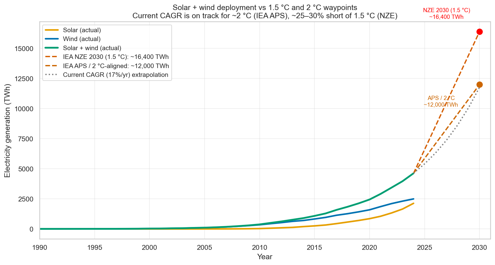
*Solar + wind reached 4,628 TWh in 2024 — a real S-curve. The IEA NZE 2030 waypoint (1.5 °C-consistent) is ~16,400 TWh; the current 17%/yr CAGR extrapolation reaches ~12,000 TWh by 2030, which matches the IEA Announced Pledges Scenario (APS, ~1.7 °C) and IPCC AR6 2 °C-consistent pathways. The present trajectory is approximately on track for ~2 °C but ~25–30% short of 1.5 °C.*

**Primary energy tells a harder story than electricity.** Most of the celebratory solar numbers are in the electricity frame, where solar+wind are now ~14% of global generation. But electricity is only ~20% of *final* energy consumption. In primary-energy terms, fossil fuels fell from 94% in 1965 to ~82% in 2024. That 12-point decline is a real structural shift, but the S-curve's *absolute* displacement of fossils is modest: total fossil consumption is still higher than at any earlier date in history because new renewable supply has mostly been *additive* to fossils rather than substitutive. Vaclav Smil's long-running critique — that energy transitions take 50–100 years to reshape primary-energy mix — remains empirically supported through 2024; the claim that this transition is faster survives only if the next decade bends the fossil curve sharply downward, which requires the storage and grid build-out described below actually to arrive.

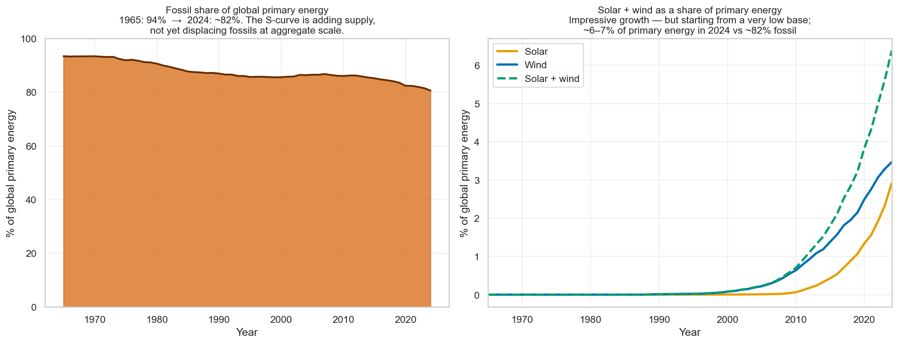
*Left: fossil share of global primary energy, 1965–2024. The S-curve has bent the curve, but fossils are still ~82% of primary energy. Right: solar + wind combined are only ~6–7% of primary energy despite being ~14% of electricity — because most final energy is not electrified.*

**Grid integration is the current binding constraint, not generation cost.** The US interconnection queue grew from ~600 GW in 2014 to ~3,450 GW at end-2024 — more than double the country's total installed generating capacity, with the overwhelming majority being solar, wind, and storage. Median time-in-queue has risen to ~5 years. LCOE comparisons implicitly price generation in isolation; they do not price the ~5-year wait to plug in, the transmission upgrades required, or the grid-service shortfalls that create curtailment. Large clean-generation additions *exist* on paper but are not *deploying* at the rate the LCOE numbers would predict.

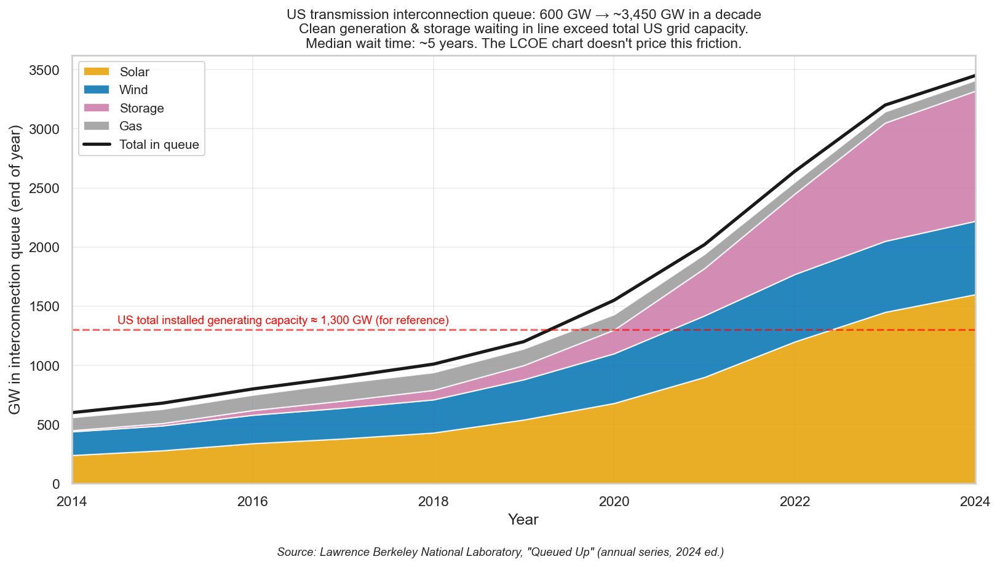
*The US grid has roughly 3,450 GW of generation and storage waiting to interconnect — nearly 3× total installed capacity. Clean technologies dominate the queue. The bottleneck is no longer project economics but transmission access, interconnection-study backlogs, and state-level siting permits. This friction is invisible in standard LCOE presentations.*

**Storage cost is duration-dependent, and durations beyond ~4 hours are a different evidentiary tier.** Li-ion at 2–4 hours has fallen ~90% in cost over a decade and is deployed at GW scale; LCOS of ~\$180–210/MWh is competitive in the peaker market and approaches cost parity with gas. Longer durations degrade the economics sharply: 8-hour Li-ion exceeds \$300/MWh. The 24–100+hr chemistries that would close the residual-firm-power gap — iron-air, flow, thermal — are Tier 3: Form Energy's iron-air \$20/MWh figure is a manufacturer target; pilot-scale engineering-cost estimates are 2–4× higher; no gigawatt-scale deployment has been operated through a full year. Residual gas peakers remain part of the plausible 2030s architecture at any cost above the target.

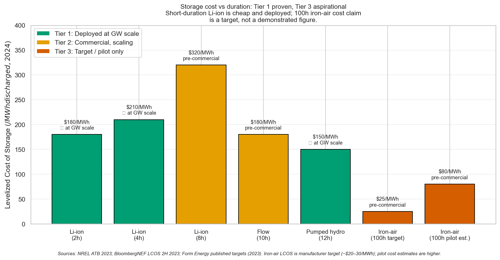
*Short-duration Li-ion is Tier 1 (proven at scale). Pumped hydro is Tier 1 where geography permits. 8-hour Li-ion and flow batteries are Tier 2 (commercial, scaling). Iron-air at 100 hours is Tier 3: the \$20–25/MWh target is a published manufacturer figure, not a demonstrated operating cost. Pilot-stage cost estimates are meaningfully higher. The case holds if Tier 2 chemistries scale; it weakens significantly if Tier 3 targets stall.*

**Critical-mineral supply is a near-term bottleneck.** Copper is the most immediate concern: S&P Global's *Future of Copper* (2022) projects demand roughly doubling to ~50 Mt/yr by 2035 under a net-zero pathway, against announced mine capacity plus recycling of ~40 Mt — a ~10 Mt/yr gap, or ~20% of total demand. Lithium supply is less constrained in absolute terms (reserves are adequate for decades of NZE demand) but announced project pipelines cover only ~65% of IEA STEPS demand and ~40% of NZE demand by 2040. Mining is slow to expand (10–15 year lead times from discovery to first metal), and the social/environmental constraints identified in the "just transition" literature compress the available pool further. This is not a thesis-killer — the transition does not require any single mineral — but it is a pricing pressure not yet visible in LCOE curves, and it falls disproportionately on a small number of countries (Chile, DRC, Indonesia, China).

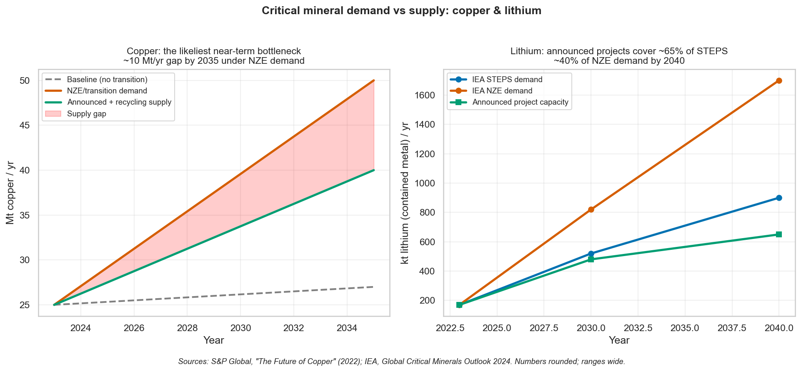
*Copper: ~10 Mt/yr gap by 2035 between announced supply and NZE demand. Lithium: announced projects cover ~65% of STEPS demand and ~40% of NZE demand by 2040. Neither is fatal to the transition, but both imply significant price pressure and concentration of geographic exposure.*

**Incumbent resistance, measured honestly.** IMF's headline figure (Parry, Black & Vernon 2023) for total fossil subsidies reached \$7.0T in 2022, but the composition matters and is frequently misrepresented. The *explicit* component — direct fiscal transfers to fossil producers or consumers — was ~\$1.3T in 2022 (spiking from ~\$500B pre-2022 when European governments capped consumer prices during the Russia-Ukraine energy emergency). The much larger *implicit* component (~\$5.7T) is the IMF's estimate of *uncharged externalities*: air-pollution health costs, climate damages, and foregone consumption taxation. It is not money being paid to fossil firms; it is damage those firms cause that is not priced. Against the ~\$1.8T of clean-energy investment in 2023 (IEA), two distinct facts matter: (a) clean-energy investment *exceeds* direct fossil subsidies by roughly 1.4×, which is progress on the fiscal-support front; (b) the \$5.7T implicit figure shows the scale of *damage that is not yet being priced*, which is a different — and arguably larger — policy problem. These are separate measurement categories and should not be collapsed into a single ratio.

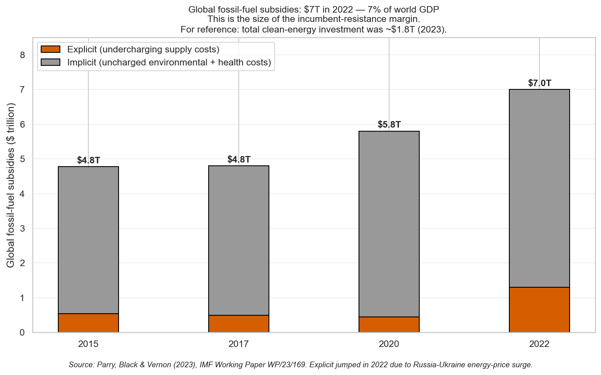
*Global fossil subsidies (IMF). The \$7.0T 2022 total splits into ~\$1.3T *explicit* (direct transfers, spiked by European 2022 price-cap emergency measures) and ~\$5.7T *implicit* (uncharged externalities — not money transferred to fossil firms, but damage they cause that is not priced). Clean-energy investment (~\$1.8T in 2023) now exceeds explicit fossil subsidies; the implicit number is a separate fact about what the price system is failing to charge for.*

**Where the deployment frontier actually is: China, not the US.** A US-centric framing misses the most important recent development — China is now dramatically ahead of the US on nearly every leading-edge electrification metric, and meaningfully ahead on industrial electrification. EV share of new car sales hit ~47% in China in 2024 vs ~10% in the US and ~21% in the EU. China produces ~80% of global solar modules, ~75% of global lithium-ion batteries (by cell capacity), and ~60% of global wind turbine components. On industrial electrification (the electricity share of industrial final energy consumption), China is at ~27%, roughly 6 points ahead of the US at ~21%, though behind the EU (~32%), Japan (~29%), and Korea (~42%). US climate policy debate often treats domestic politics as the binding constraint on the global transition; in practice, the global transition is now substantially driven by Chinese manufacturing scale and Chinese consumer adoption, with the US participating as an importer rather than a frontier.

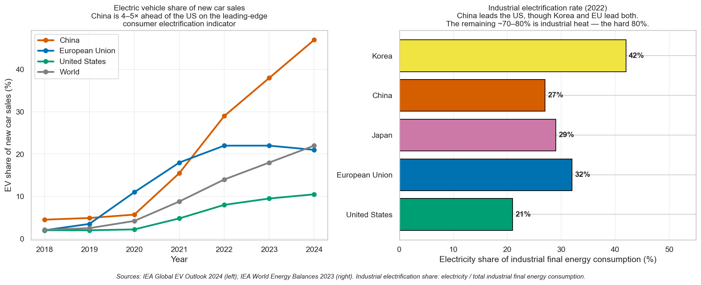
*Left: China is now 4–5× ahead of the US on EV share of new car sales. Right: on industrial electrification, China leads the US but both lag the EU, Japan, and particularly Korea. The US is not the frontier on either consumer or industrial electrification; framing the transition as "US-led" overstates where the deployment actually is.*

**The hard 80%: final energy is not electricity.** Electricity is only ~20% of global final energy consumption. The other ~80% is buildings heat (partially electrified), road transport (early electrification), industrial heat across temperature ranges, industrial *process feedstocks* (the carbon atoms themselves, used in plastics, fertilizers, and reduced iron), cement *process* CO₂ (calcination chemistry, not combustion — therefore unaffected by electrification), aviation, shipping, and agriculture. Applying the Tier 1/2/3 framework to final energy:

| Sector | Share of final energy | Best-available pathway | Tier |
|---|---|---|---|
| Buildings | ~30% | Heat pumps + electric + insulation | **1** (proven, cost-competitive today in most climates) |
| Road transport | ~20% | EVs for cars; e-trucks emerging | **1** for cars, **2** for long-haul trucking |
| Industry: low-temp heat (<200 °C) | ~8% | Industrial heat pumps, electric boilers | **2** (commercial, scaling; cost gap 10–40%) |
| Industry: high-temp heat (>400 °C) | ~15% | Green H₂, electric arc, CCS | **2** (demonstrated, cost gap 2–3×) |
| Industry: process feedstocks (petchem, H₂-DRI steel reduction) | ~7% | Green H₂ reduction, biogenic petrochem | **3** (pre-commercial at relevant scale) |
| Cement (process CO₂ from calcination) | ~3% | CCS, novel cement chemistries (CSA, geopolymer) | **3** (calcination emissions not avoided by electrification) |
| Aviation | ~3% | SAF (bio/synthetic); ~0.2% market share | **3** (economics 3–10× conventional) |
| Shipping | ~3% | Ammonia/methanol, battery-electric short-haul | **3** (early pilots) |
| Agriculture | ~2% | Electric tractors, low-C fertilizers, precision ag | **2** (proven, adoption slow) |
| Other (rail, pipelines, commercial services, non-specified) | ~9% | Mixed — mostly already electrified or efficiency-driven | **2** (varies by subsector) |

Sector shares are drawn from IEA World Energy Balances 2023 (global 2022 final consumption, ~440 EJ) and are rounded to sum to 100%.

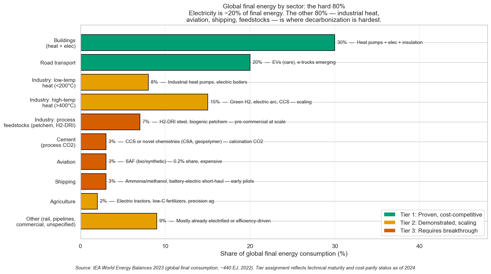
*Roughly half of global final energy is in sectors with proven, cost-competitive decarbonization pathways (Tier 1). About a third is demonstrated but still needs cost-parity work (Tier 2). The remaining ~16% — process feedstocks, cement process CO₂, aviation, shipping — requires breakthroughs not yet at commercial scale. This is what "the hard 80%" looks like once decomposed.*

Roughly half of global final energy (buildings + road transport) sits in Tier 1 pathways where the engineering and cost story is largely solved and the bottleneck is deployment speed and political will. About 34% (low-temp industrial heat + high-temp industrial heat + agriculture + other/miscellaneous) is Tier 2: pathways are demonstrated, cost gaps are 10–40% for low-temp and 2–3× for high-temp, scaling is under way but not at NZE rates. The remaining ~16% — process feedstocks, cement calcination CO₂, aviation, and shipping — is Tier 3: commercial-scale decarbonization is not yet solved. Green steel is making pilot-scale progress (Stegra/H2GS, HYBRIT, Boston Metal), but the IEA tracker has less than 1% of global steel output on a decarbonized pathway. SAF is at 0.2% of aviation fuel. Cement is the hardest single bulk material precisely because electrification does not help: roughly half its emissions are *process* CO₂ from calcination (CaCO₃ → CaO + CO₂), which is chemistry, not combustion. Decarbonizing cement requires CCS or a different cement chemistry, and neither is commercial at scale.

**Bottom line.** A carbon budget that requires all three tiers to decarbonize at global scale within 20 years sits at the edge of what current technology trajectories can deliver under favorable political conditions — and the political conditions are visibly worse than favorable. The pathway is defensible for Tier 1 and Tier 2; Tier 3 is where the portfolio is genuinely exposed, and where the next decade of engineering progress determines whether decarbonization of industry, aviation, shipping, and cement arrives in time to matter.

*Absolute decoupling is happening in the US, UK, and Germany. But rolling rates of ~2–3%/yr need to at least double for 2°C compatibility at normal growth rates.*

### The poor world's growth is not the problem — but climate is a development headwind

Using the lower-bound \$15k threshold, the poor world (below \$15k GDP/capita) produces only 20% of global CO₂ despite being 55% of the population. If the rich world froze emissions while the poor world grew to \$15k, the 1.5°C budget is still exhausted in 8 years by the rich world's existing baseline alone.

*The planetary boundary problem is overwhelmingly a rich-world emissions problem, not a poor-world growth problem.*

That framing is correct but incomplete: it measures the poor world's *contribution* to the climate problem, not climate's *contribution* to the poor world's development problem. Burke, Hsiang & Miguel (2015, *Nature*) and a substantial follow-up literature (Kahn et al. 2021; Kotz, Levermann & Wenz 2024, *Nature*) estimate that warming is already depressing tropical GDP growth by roughly 0.5–1.5 percentage points per year relative to a no-warming counterfactual, with the effect concentrated precisely in countries still far from the good-life resource band. Kotz et al. (2024) project climate damages of 19% of global income by 2050 under current emission pathways, with SSA, South Asia, and Latin America bearing disproportionate losses.

**The channels through which warming depresses tropical growth** are now fairly well characterized, though the relative weights are still debated:

- *Crop yields.* Zhao et al. (2017, *PNAS*) synthesized global crop models and field experiments: each 1°C of warming reduces global yields of maize by ~7.4%, wheat ~6.0%, rice ~3.2%, and soybean ~3.1% on average, with tropical regions doing worse than the global mean because they are already near or past the optimal growing temperature. Schlenker & Lobell (2010) found SSA staple yields fall ~8–22% per 1°C. At 2°C above pre-industrial (roughly where we are headed by the 2040s on current trajectories), that is already 15–40% losses in the crops that feed the populations furthest from the good-life threshold.
- *Labor productivity.* Outdoor and non-cooled indoor work fall sharply above wet-bulb temperatures of ~28°C. ILO (2019) estimates heat stress will cost 80 million full-time-equivalent jobs globally by 2030 (2.2% of working hours), concentrated in South Asia (~5% of hours lost) and West Africa. Somanathan et al. (2021, *JPE*) measured Indian manufacturing plants and found a ~2–4% output drop per 1°C above optimum, with worker absenteeism rising on hot days. This is not an agricultural story — it affects garment factories, construction, and urban services.
- *Natural-disaster damage and its long tail.* Hsiang & Jina (2014, NBER WP 20352) assembled a global history of 6,700 tropical cyclones and exploited within-country year-to-year variation to identify long-run growth effects. Their headline finding: a 90th-percentile cyclone reduces per-capita income by ~7.4% two decades later, effectively erasing ~3.7 years of average development. The losses accumulate from a small but persistent suppression of annual growth rates over the fifteen years following the strike — economies do not visibly "bounce back" in aggregate statistics, they shift permanently onto a lower growth path. IPCC AR6 attributes ~5% increase in Atlantic hurricane intensity to warming already; projected 10–15% by 2100. Flooding (Pakistan 2022: ~\$30B damage, 8% of GDP in one event), drought (Horn of Africa 2020–2023), and wildfire have similar balance-sheet profiles: disaster years subtract from the investment that would have funded the next year's growth.
- *Health and human capital.* Heat mortality (IHME: ~500k excess deaths/yr globally from heat and cold shifts, net positive in the tropics), vector-borne disease range expansion (malaria, dengue moving to higher altitudes and later seasons), and worker-learning effects. Park, Goodman, Hurwitz & Smith (2020, *AEJ: Economic Policy*) — using ~10 million US PSAT retakes linked to local daily weather — found that *without* air conditioning, a 1 °F hotter school year reduces that year's cumulative learning by ~1%. The effect vanishes in schools with adequate AC. The implication for developing-country schools (most of South Asia, most of SSA, much of SE Asia) where AC is nearly universal *absent*, and where school-year temperatures are rising fastest, is direct: hot school days without AC are foregone human-capital accumulation. We are not aware of a globally-representative replication of the Park et al. magnitude outside the US, but narrower evidence (Graff Zivin et al. 2018 on Chinese gaokao exams; Garg, Jagnani & Taraz 2020 on Indian test scores) is directionally consistent.
- *Water and energy stress.* Himalayan and Andean glacier retreat shifts river-flow seasonality (affecting Indus, Ganges, Yangtze, and much of Andean hydropower). Hydropower output in Zambia, Kenya, and Ecuador has been curtailed by drought in the last five years. Thermal plant efficiency drops in heat waves precisely when cooling demand spikes.
- *Conflict amplification.* Hsiang, Burke & Miguel (2013, *Science*) meta-analyzed 60 studies and found that a 1σ rise in temperature or rainfall anomaly raises inter-group conflict risk by ~14% and personal violence by ~4%. Not a deterministic chain, but the Sahel, Syrian pre-war drought, and parts of Central America are the empirical testbed. Conflict then triggers the fragile-states cascade the document already flags.

The BHM mechanism is that warming reduces the *level* of productivity in hot countries; Kahn et al. (2021) and Kotz et al. (2024) argue the damage accumulates because shocks destroy capital faster than it is rebuilt, so the effect shows up in the *growth rate* rather than resetting. This distinction matters enormously for long-run projections — it is why Kotz's 19%-of-GDP-by-2050 number is an order of magnitude above earlier integrated-assessment estimates (Nordhaus DICE, Stern Review). The growth-rate specification is more consistent with the tropical-disaster evidence but is still contested; Newell, Prest & Sexton (2021) argue the BHM results are fragile to specification choices. Call it a range: 10–20% of developing-country GDP by 2050 under current policy, with genuine uncertainty about whether the hit is to levels or to growth rates.

**What would it cost to neutralize these effects, and is it investable?** Adaptation costs split cleanly into three categories with different financing profiles:

1. *Commercially investable (~40–50% of the need).* Drought-tolerant and heat-tolerant seed varieties (CGIAR pipeline, commercial successors), climate-resilient building codes and materials, precision irrigation, index-based crop insurance, cool-roof paint, air-conditioning rollout, and climate-resilient supply-chain redesign all generate private returns to the investor. These move on the FDI / private-capital rails the document already identified as the dominant flow. The Global Commission on Adaptation (GCA 2019) estimated \$1.8T of investment across five priority areas (early warning, resilient infrastructure, dryland agriculture, mangrove protection, water) would return \$7.1T in avoided losses — a 4:1 benefit-cost ratio, which is investable on those numbers but requires functional capital markets and policy credibility to actually mobilize.

2. *Public goods requiring domestic fiscal capacity (~30–40%).* Seawalls, urban drainage, early-warning systems, public-health surveillance, ecosystem restoration (mangroves, wetlands), and climate-smart zoning are non-excludable and fund themselves only through taxation. For a middle-income country with functioning revenue institutions (Bangladesh, Vietnam, Kenya), this is a domestic-mobilization problem — the same one the development-recipe section identifies — now with a climate surcharge. For fragile states, it is unreachable without external finance.

3. *Loss-and-damage and disaster recovery (~15–25%).* When a cyclone destroys 8% of Pakistan's GDP in a month, no insurance market or domestic budget can absorb that. This is where the aid-vs-investment distinction collapses: the flow has to arrive quickly, cheaply, and without conditionality, which is what concessional finance and humanitarian aid are structured for. The COP27/28 Loss and Damage Fund was capitalized at roughly \$700M at launch against annual needs estimated at \$100–580B by 2030 (UNEP Adaptation Gap Report 2023) — a shortfall of two to three orders of magnitude.

Adding it up: UNEP (2023) estimates developing-country adaptation needs at \$215–387B/yr by 2030, against current international adaptation finance of ~\$21B/yr (2021). The gap is 10–18×, and that is before loss-and-damage. Crucially, roughly half of the total is commercially investable in principle — but the half that is public-goods or disaster-recovery is not, and it is the half that is most under-financed. This is the same sovereignty problem flagged earlier in this document: there is no global authority that can compel rich countries to fund tropical adaptation at scale, and unilateral aid cuts (USAID 2025) can halve the flow overnight.

Synthesis: about half the climate-growth headwind is addressable through the same FDI / domestic-savings / private-capital channels that drive development generally. The other half — public adaptation goods in low-capacity states, and disaster loss-and-damage — requires concessional or aid finance that the international system has structurally failed to deliver for 30 years. If climate change is eroding the baseline growth rate from which we project progress toward the good-life threshold, the development arithmetic is harder than a naive extrapolation implies — and the moral asymmetry (the rich world caused the warming; the poor world pays in foregone growth, at roughly 1 percentage point per year) is an additional dimension of Paper 1's structural critique that our analysis has not adequately weighted.

### Beyond carbon: harder problems with emerging solutions

Carbon gets the headlines, but the non-carbon boundaries are arguably more concerning — because they lack equivalent technological exits.

*Material intensity of GDP is declining at only 0.4%/yr — compared to 1.8%/yr for carbon. But see the discussion below on whether aggregate material tonnage is the right metric: a tonne of sand is not a tonne of burned coal.*

*Since 2000, carbon intensity fell ~30% while material intensity fell only ~8%. However, the composition of material extraction matters enormously — the energy transition eliminates the most ecologically damaging 15% entirely.*

The technology pathway analysis reveals a clear pattern, but with very different evidentiary status across boundaries:

**Tier 1 — Deployed and scaling (conclusions robust):**

| Boundary | Technology | Status |
|---|---|---|
| **Carbon** | Solar/wind generation (doubling every ~3.2 years) | Commercial, scaling exponentially |
| **Carbon** | EV adoption, heat pump deployment | Commercial, on S-curves |
| **Materials** | Industrial recycling (steel, aluminum) | Mature, economics improving with cheap energy |

**Tier 2 — Demonstrated but contingent on scaling (conclusions depend on continued progress):**

| Boundary | Technology | Status |
|---|---|---|
| **Freshwater** | Desalination | Commercial, but too expensive for agriculture at scale |
| **Nitrogen** | Precision agriculture, nitrification inhibitors | Commercial, underdeployed; alone insufficient (reaches ~2.4×) |
| **Food/Land** | Precision fermentation (dairy proteins) | Commercial, scaling |
| **Phosphorus** | Waste-stream recovery, precision application | Proven, adoption limited |

**Tier 3 — Requires breakthroughs not yet achieved (conclusions speculative if these stall):**

| Boundary | Technology | Key Uncertainty |
|---|---|---|
| **Nitrogen** | Nitrogen-fixing cereals | The single biggest lever (~30 Mt reduction); active R&D (Pivot Bio, ENSA, Gates CSIA) but not deployed |
| **Food/Land** | Cultivated meat at price parity (\$2–5/kg) | Fell from \$300k/kg to ~\$10/kg but parity not achieved |
| **Carbon** | Direct air capture at gigatonne scale | Demonstrated at small scale; economics uncertain |
| **Biodiversity** | Active rewilding + land release at scale | Requires food tech to free agricultural land first |

Abundant cheap energy solves the energy-system boundaries and *enables* the agricultural technology stack (precision farming, controlled-environment agriculture, cultivated meat) — but the biogeochemical boundaries also require bioengineering breakthroughs and governance. **The papers' critique is weakest where technology is deployed and scaling (carbon/energy — Tier 1), moderate where solutions exist but require scaling (nitrogen partial, freshwater — Tier 2), and strongest where conclusions depend on breakthroughs not yet achieved (nitrogen-fixing cereals, cultivated meat at parity, biodiversity restoration — Tier 3).** If Tier 3 technologies stall, the nitrogen boundary remains at 2–2.4× overshoot, agricultural land pressure persists, and the papers' core ecological critique stands substantially unrebutted. An adequate response requires technology-driven decoupling for energy, bioengineering for agriculture, *and* governance-driven restraint for land use.

### The implied policy differentiation

The ecological evidence points toward a differentiated strategy rather than a single global prescription. Rich countries — which produce 80% of CO₂ on 45% of population — need rapid decarbonization and reduced material throughput. Poor countries still need substantial productivity growth to reach basic welfare thresholds, and that growth will have ecological costs. Both need far stronger ecological governance than currently exists. The question is not "growth or no growth" at the global level. It is whether the institutions exist to deliver restraint where it's needed and development where it's needed — simultaneously and fast enough. Our analysis suggests they currently do not.

### Can everyone live well? What a good future requires

The analysis so far establishes that rich-world material throughput is ecologically indefensible and poor-world growth is necessary. But this frames the future as a zero-sum tradeoff — the rich must consume less so the poor can consume more. Is that actually true? Or is there a plausible technological pathway to universal high welfare within planetary boundaries?

**The most important enabling condition is abundant cheap clean energy.** Solar generation grew from 4 TWh (2005) to 2,128 TWh (2024), doubling every ~3.2 years. A mechanical S-curve extrapolation would imply ~8,000 TWh by 2030 (27% of current electricity), ~29,000 TWh by 2036 (100% of current electricity), and potentially 40% of all primary energy by 2040. That is a pathway, not a forecast: grids, storage, permitting, mineral supply, and fossil displacement all have to keep pace. If energy becomes abundant and nearly free, it unlocks a cascade of solutions that are currently too expensive:

| Boundary | What cheap clean energy unlocks | What remains hard | Tier |
|---|---|---|---|
| **Carbon** | Electrify everything; direct air capture at scale | DAC at gigatonne scale is unproven | 1 (electrification) / 3 (DAC) |
| **Freshwater** | Desalination becomes viable even for agriculture | Distribution infrastructure | 2 |
| **Nitrogen** | Precision ag, controlled-environment farming (95% N efficiency), cultivated meat (eliminates feed-grain demand), eliminates combustion NOx | N-fixing cereals are the biggest lever but still in R&D (Pivot Bio, ENSA, Gates CSIA). Full stack needed: precision ag alone only reaches 2.4× (insufficient) | 2 (precision ag) / 3 (N-fixing cereals) |
| **Materials** | Recycling becomes economically dominant; circular loops close | Mining the initial stock; some elements scarce | 2 |
| **Food/Land** | Vertical farming, precision fermentation, cultured meat | Cultural adoption; transition timeline | 2 (fermentation) / 3 (cultured meat at parity) |
| **Biodiversity** | If food production intensifies off-land, farmland returns to nature | Requires active rewilding, not just stopping damage | 3 |

**The food revolution is the second key.** Precision fermentation and cultured meat are on S-curves of their own. If they scale — and cost curves suggest they could — some estimates project freeing up to 75% of agricultural land — the single biggest lever for biodiversity, nitrogen, phosphorus, and the land-system boundary simultaneously. Agriculture is the primary driver of four of the six transgressed boundaries. Shrinking its footprint solves more ecological problems than any other single intervention.

**But does "material footprint" measure the right thing?** The optimistic technology scenario above still leaves a typical rich-country citizen at ~8–11 tonnes per capita (US at ~10.6) against a "sustainable" budget of ~5.9 (50 Gt ÷ 8.5 billion people). That sounds alarming — until you ask what the 50 Gt limit actually measures and where it comes from.

The ~50 Gt "safe" material extraction limit (UNEP International Resource Panel; Bringezu 2015, Hickel et al. 2022) [[19]](#references-and-sources) is far less rigorous than the carbon budget. The carbon budget rests on hard physics: CO₂ concentrations → radiative forcing → temperature, with a clear causal chain. The material budget is an aggregate mass estimate of ecosystem capacity to absorb extraction impacts — and it treats all tonnes as equal. A tonne of sand from a quarry and a tonne of rainforest cleared for soybeans count the same. They are obviously not the same.

Current global extraction (~100 Gt/yr) breaks down roughly as:

| Category | Gt/yr | Share | Ecological character |
|---|---|---|---|
| Construction minerals (sand, gravel, stone) | 44 | 44% | Quarries, mostly local. Among the *least* ecologically damaging per tonne |
| Biomass (crops, wood, fiber) | 24 | 24% | Agriculture and forestry. Primary driver of land, nitrogen, and phosphorus boundaries |
| Fossil fuels (coal, oil, gas) | 15 | 15% | *Burned and gone*. Drives the carbon boundary. Eliminated by solar/wind/nuclear |
| Metal ores | 10 | 10% | Mining. Concentrated ecological damage, but recyclable |
| Industrial minerals | 7 | 7% | Chemicals, fertilizer feedstocks |

After the energy and food transitions, the composition changes radically: fossil fuels (15 Gt) disappear entirely, agricultural biomass drops sharply, and metal ore extraction falls with circular-economy recycling. What remains is mostly construction minerals and recycled metals — ecologically far less damaging per tonne than what was removed. Whether ~55 Gt of mostly sand, gravel, and recycled steel is ecologically equivalent to today's 100 Gt (which includes burning fossil fuels and clearing forests) is not a question the aggregate metric can answer.

This matters because the aggregate material footprint metric is doing heavy argumentative lifting in both our document and the papers we're responding to. The *boundary-specific* problems — nitrogen fixation at 3.4× the safe limit, biodiversity collapse (73% LPI decline), land-system change — are well-measured and genuinely severe. The "total material extraction" aggregate is a weaker, more contested measure that may significantly overstate the ecological constraint on a post-transition economy.

One comparison illustrates the point: solar is roughly 4,000× less materially intensive than coal per lifetime GWh, because fossil fuels *burn through* their material input while renewables *reuse* their structure. The energy transition does not just solve the carbon problem — it eliminates 15% of global material extraction and transforms energy from a consumable input to durable capital. Nuclear power is similarly capital-intensive but fuel-light. A world running on solar, wind, and nuclear does not face the same material constraint as a world running on coal and oil, even if the aggregate tonnage metric doesn't fully capture that difference.

**What does a sustainable consumption target actually look like?** The aggregate material footprint obscures a crucial insight: different categories of consumption have vastly different ecological impacts. Decomposing a high-consumption rich-country footprint into sustainable targets by category — we use the US (22.7 t/cap) as the worked example because it is the heaviest major rich-country footprint and therefore the most demanding case; European and Japanese footprints sit at ~12–18 t/cap, with correspondingly smaller gaps to close:

| Category | Current US | Sustainable Target | How |
|---|---|---|---|
| Fossil fuels | 5.5 t/cap | 0.0 | Solar/wind/nuclear |
| Construction | 7.5 | 4.0 | Dense urbanism (Japanese/European density) |
| Biomass/food | 4.0 | 2.0 | Precision ag + bioreactor protein + waste reduction |
| Metals | 3.0 | 1.5 | Circular economy, 90%+ recycling with cheap clean energy |
| Other/imports | 2.7 | 1.5 | Lighter manufactured goods, digital substitution |
| **TOTAL** | **22.7** | **9.0** | |

*Note: The sustainable targets above are our illustrative estimates, not sourced from peer-reviewed literature. They represent plausible post-transition figures given the technology pathways described, but carry substantial uncertainty — particularly the biomass and metals targets, which depend on food-tech and circular-economy scaling. European and Japanese starting points are lower primarily because of denser urban form (less construction per capita), smaller vehicle fleets, and less beef-heavy diets — three of the same levers in the "How" column — so the qualitative pathway generalizes even though the arithmetic is tuned to the US case.*

The naive "sustainable budget" is 5.9 t/cap (50 Gt ÷ 8.5B). But if you weight by actual ecological damage rather than mass — fossil fuels cause far more damage per tonne than construction minerals — the effective sustainable budget for a post-transition economy is plausibly higher. Our robustness check, however, shows why a ~9 t/cap number should be treated as an optimistic scenario rather than a settled target: with broad category-level uncertainty, the median post-transition rich-country footprint is ~11.1 t/cap, and 9 t/cap appears only in the optimistic tail. The key unresolved question is therefore not just "how many tonnes?" but "which tonnes, extracted where, with what ecological damage?" We do not yet have a rigorous damage-weighting methodology to cite — this remains a conceptual argument, not a quantified metric. **Sustainable consumption is not only about less stuff. It is about different stuff, different methods, and damage-weighted accounting.**

**The crucial reframe: welfare can decouple from material throughput even when GDP doesn't fully.** Rich economies have already made large compositional shifts toward services — the US is ~82% services by value, Japan and the UK ~70%, Germany ~63%, with most of the OECD clustered between 60% and 80%. The marginal unit of rich-world welfare is increasingly weightless — streaming, telehealth, education, AI tools, social connection, creative work. Welfare growth may be far less materially intensive than past GDP growth: better health outcomes, richer experiences, more knowledge, and more creativity do not require proportionally more tonnes of stuff. Whether this constitutes fully "weightless" growth or merely *lighter* growth is an open empirical question — and the cross-country evidence is mixed: the UK, Germany, France, and Japan have achieved modest *absolute* decoupling of material footprint from GDP since ~2000, while the US plateau since 2007 is weaker decoupling. But a future of continued improvement in living standards — more abundance, more research, more exploration, more wonders — does not require proportionally more material extraction, especially once energy is cheap, clean, and abundant.

What does this good future look like concretely?

- **Energy**: abundant, clean, and cheap enough to power desalination, recycling, vertical farming, and direct air capture at scale
- **Food**: this is the hardest boundary, because development and ecological sustainability are in *genuine* tension here. As populations become wealthier, meat consumption rises sharply — from ~10–15 kg/person/year in low-income countries to 60–80 kg in upper-middle-income countries to 125 kg in the US. China's meat consumption quadrupled from 15 to 63 kg/cap between 1980 and 2023. Beef is the critical variable: it requires ~164 m² of land per kg, versus ~7 m² for chicken and ~3 m² for tofu — a 20–50× difference. Without intervention, FAO projects meat demand rising 50–70% by 2050, requiring ~600 million more hectares of agricultural land — roughly all remaining tropical forest.

  Two forces push back. First, population is projected to peak this century (UN: ~10.3B in 2080s; IHME: ~9.7B by 2064) and then *decline*, so the total number of mouths to feed plateaus. Second, the development pattern matters: East Asian development was overwhelmingly pork and chicken (beef is only 8% of China's meat), not American-level beef. If developing countries follow the East Asian pattern rather than the American one, the land pressure is manageable.

  But the optimistic scenario — releasing 1–2 billion hectares back to forest and habitat — *requires* food technology reaching price parity. Cultivated meat fell from \$300,000/kg in 2013 to ~\$10/kg in 2025, but price parity (\$2–5/kg) is not yet achieved. Precision fermentation for dairy proteins is already commercial. If these technologies scale, the combination of fewer people, higher yields, and protein produced in bioreactors rather than on pasture could free an area larger than the United States for ecosystem restoration. If they don't, agricultural land is the boundary where growth and sustainability most genuinely conflict. (New England's reforestation — 30% forest in 1850, 80% today — demonstrates that post-agricultural rewilding works, but it required agricultural intensification to make it possible.)

  A political-economy caveat — but less of a moral stop-sign than the usual framing implies. The "1–2 billion hectares released to nature" phrasing sometimes gets paired with objections that treat smallholder persistence as an end in itself, which collapses three very different situations. Separating them matters:

  *Who actually drives the frontier.* The last two decades of tropical deforestation have been roughly evenly split between commercial commodity production (~27%) and shifting smallholder agriculture (~24%), with the remainder split between forestry and wildfire (Curtis et al. 2018, *Science*; updated via Global Forest Watch / WRI). But the geography is skewed: the Amazon, Cerrado, and Chaco frontiers are overwhelmingly commercial — roughly 80% of Brazilian Amazon deforestation is for cattle pasture, feeding supply chains dominated by JBS, Marfrig, and Minerva, and much of the nominally "small-rancher" clearing is speculative grilagem that gets consolidated into larger holdings later. Indonesian and Malaysian palm/pulp deforestation is ~40–60% industrial concessions with the remainder being smallholders *contractually integrated* into Wilmar / Golden Agri / Sime Darby supply chains. Only in Sub-Saharan Africa is forest loss more genuinely subsistence-driven (charcoal, shifting cultivation, population pressure) — and SSA's deforestation rate is *slower* than Latin America's despite its much larger smallholder population. Pendrill et al. (2019, *Global Environmental Change*) found 29–39% of tropical deforestation emissions are embodied in *internationally traded* commodities, and DeFries et al. (2010, *Nature Geoscience*) found that after ~2000 the dominant predictors of tropical forest loss became urban population and export demand rather than rural population. The popular image of subsistence peasants chopping down rainforests to feed themselves is mostly wrong for the fastest-clearing frontiers; the real picture is global beef, soy, and palm supply chains using smallholders as the cutting edge of clearing that is later monetized by larger operators.

  *Smallholder numbers are near peak and falling in every region that has successfully developed.* There are ~570 million farms globally (Lowder, Skoet & Raney 2016, *World Development*), ~84% under 2 ha. Combined with pastoralists and landless agricultural labor, this produces the oft-cited "2 billion smallholders" figure. But the trajectory is unambiguous: countries that grow past ~\$5k/cap see agricultural employment fall from 50–70% to 10–20% over 30–50 years. South Korea went from 63% agriculture in 1960 to 5% today. China went from 69% in 1980 to 23%. Brazil went from 54% in 1960 to 9%. In every case, smallholder farming contracted *as part of development success* — not as a loss but as structural transformation, with the people moving to cities for better livelihoods. SSA is earlier on the same curve. The revealed preference of smallholders, when urban jobs exist, is overwhelmingly to leave agriculture. Treating smallholder persistence as a moral end inverts what the people in question typically want.

  *Do smallholders feed the world?* Partially, and in a narrower sense than the advocacy literature claims. Ricciardi et al. (2018, *Global Food Security*) revised the widely-repeated "80% of food" figure: farms under 2 ha produce ~30–34% of global food calories on ~24% of agricultural land. That *does* mean smallholders are more productive per hectare than industrial operations — the "inverse farm-size productivity relationship" first documented by Sen (1962) on Indian data and replicated across dozens of developing-country datasets. But the reasons are less flattering than they first sound: smallholders use more labor-hours per hectare (multiple weedings, hand-planting, intercropping, multi-cropping); they grow calorie-dense staples (maize, rice, cassava, potatoes) rather than the animal feed, cotton, sugar, and biofuels that dominate industrial acreage; and they tend to farm the best-quality cultivable land while marginal land goes to large operators or abandonment. Industrial agriculture is dramatically more productive per *worker-hour* — a US corn farmer produces roughly 200× the calories per labor-hour of a Malawian maize farmer — which is exactly why industrial agriculture is compatible with a non-agricultural workforce and smallholder agriculture is not. Recent work (Carletto, Savastano & Zezza 2013, *JDE*; Desiere & Jolliffe 2018, *JDE*) has also shown that the inverse relationship weakens by ~30–40% once land is measured by GPS rather than self-report and output by objective crop-cut rather than farmer recall — part of the "smallholder advantage" is measurement artifact. The real inverse relationship exists, but it is not a prescription. The cited measurement work does *not* directly estimate the land-use counterfactual under consolidation, so any claim about net land demand has to be flagged as a model-dependent inference rather than an established fact. That inference goes: if industrial operators who replace smallholders follow the observed pattern — growing animal feed, cotton, sugar, and biofuels rather than calorie-dense staples — then per-calorie land demand would rise even though per-labor-hour productivity rises dramatically. It is possible to imagine policy regimes that force consolidated operators to grow equivalent-calorie crops, in which case the land-use offset from industrialization could be positive (Evenson & Gollin 2003 on the Green Revolution shows this channel is real). The defensible version of the argument is therefore: the rewilding case depends on either *food-tech* (precision fermentation, cultivated meat, vertical farming) moving protein production off-land entirely, *or* on a consolidation-with-staples policy regime that history has rarely produced — not on industrial replacement of smallholders under current crop-mix incentives, which would likely raise land pressure rather than reduce it.

  *Three cases with different moral weight.* The political-economy objection collapses three situations that deserve to be separated:
  1. **Subsistence smallholders in regions with functioning development trajectories** (most of South Asia, SE Asia, Latin America, coastal SSA). These are people whose revealed preference is typically to exit agriculture; the policy concern is *orderly* transition (urban jobs, land-tenure security, phased consolidation), not preservation. The East Asian developmental-state pattern handled this relatively well; Latin American rural exodus produced large favelas but broadly improved welfare; SSA's transition is under way and is the open question of this century.
  2. **Pastoralists and agro-pastoralists** (Maasai, Mongolian herders, Andean llama/alpaca herders, Sahelian nomads). Their land-use is often *low-impact* relative to any plausible replacement, and the cultural-political claims to mobile-access land tenure are empirically distinct from sedentary peasant claims. Enclosure of pastoral commons for ranching or conservation has a well-documented record of harm (Fratkin 2001; Homewood 2009). Pastoralist exit from the land is neither desired by most pastoralists nor ecologically helpful.
  3. **Indigenous forest and ecosystem communities**. Garnett et al. (2018, *Nature Sustainability*) documented that ~40% of the world's ecologically intact landscapes sit inside Indigenous-held territory, and Indigenous tenure is the single strongest empirical predictor of forest preservation across the Amazon, Congo Basin, and SE Asia. Rewilding that respects Indigenous tenure is compatible with — and in most cases *requires* — their continued presence. The relevant policy response is land-rights formalization and demarcation, not displacement.

  *The real incumbent resistance is commercial.* The more honest framing of who blocks the land-use transition is not "displaced peasants" but the global beef, soy, palm, and dairy complex — JBS, Cargill, ADM, Bunge, Wilmar, Golden Agri, the US cattle lobby, EU CAP livestock subsidies (€32B/yr, ~20% of CAP), and meat-industry opposition to cultivated-meat labelling regulation (Florida and Alabama US state bans on cultivated meat, 2024; Italy's national ban, 2023). The smallholder framing can — not always intentionally — serve as rhetorical cover for the actual incumbent-resistance constituency, which is large-scale commercial agriculture and its political infrastructure. "Free up 1–2 billion hectares" is politically hard primarily because Big Ag + Big Livestock are organized to resist it, secondarily because pastoralist and Indigenous communities have legitimate prior claims to specific land areas (which the food-tech transition can and should respect), and only thirdly because of subsistence-smallholder displacement (which, in most regions, is what successful development already does — not what the transition newly causes).
- **Materials**: circular economy where nearly everything is recycled, with virgin extraction limited to replacing losses — not feeding linear throughput. This is not hypothetical for metals: the US steel industry has already substantially made this transition. Electric arc furnace (EAF) steelmaking — which melts scrap steel using electricity rather than smelting iron ore with coking coal — now produces ~70% of American steel, up from ~15% in the 1970s. EAF uses ~75% less energy than blast furnace steelmaking and produces ~75% fewer CO₂ emissions. With clean electricity, EAF steel approaches near-zero carbon. Globally, EAF is ~30% of production and growing. Aluminum recycling is similarly transformative: remelting scrap uses ~95% less energy than primary smelting from bauxite, and ~75% of all aluminum ever produced is still in use. Copper is almost infinitely recyclable with no loss of properties. The pattern is clear: cheap clean electricity makes recycling economically dominant over virgin extraction for most metals, because the energy cost — not the material itself — is the binding constraint. The developing world's infrastructure buildout will initially require virgin metal, but once the stock is built, the circular economy takes over.
- **Welfare growth**: measured in health, longevity, education, digital abundance, and creative output rather than in tonnes of stuff consumed
- **Ecology**: restored forests, recovering biodiversity, and stabilized nutrient cycles. But nitrogen deserves honest treatment. At 3.4× the safe limit (150 vs 44 Mt N/yr), nitrogen fixation is currently *further* beyond its boundary than climate (1.2×). Precision agriculture alone — reducing application 20–40% — only gets to ~2.4×. That's insufficient. Closing the gap requires a *stack* of interventions (our illustrative scenario, not an engineering estimate): eliminating combustion NOx via the energy transition (−15 Mt), engineering cereal crops to fix their own nitrogen the way legumes do (the single biggest lever at −30 Mt; active research by Pivot Bio, Cambridge ENSA, and Gates Foundation CSIA), reducing feed-grain demand through cultivated meat (−15 Mt), widespread nitrification inhibitors (−15 Mt), and deploying engineered denitrifying organisms in constructed wetlands and buffer zones to intercept runoff before it reaches waterways (−10 Mt). The full stack can plausibly reach the boundary (~40–50 Mt), but each individual reduction is an order-of-magnitude estimate, and the convenient arithmetic should not mask the compounding uncertainty. Nitrogen is more regional than climate (dead zones, not global atmosphere), more reversible (ecosystems recover in decades once runoff stops), and more amenable to technology — but "more amenable" still means a multi-decade, multi-technology transition, not a quick fix. Cheap, abundant energy is again the enabler: it powers precision agriculture, controlled-environment farming with ~95% nitrogen efficiency, and cultivated meat production.

This is not utopian fantasy — every component is on an observable S-curve or has demonstrated feasibility. But assembly at global scale within 30–50 years requires everything to go right simultaneously: continued exponential solar deployment, food technology scaling, bioengineering breakthroughs in nitrogen-fixing cereals, circular economy adoption, *and* the political will to retire incumbent systems. The historical base rate for "everything goes right simultaneously" is not encouraging.

**But "everything must go right" may be the wrong frame.** Human civilization has always been building the plane while flying it — racing to innovate past looming threats to survival. The question is not whether we face grave threats (we do) but whether our capacity for *directed* innovation is fast enough to outrun them. The best reading is: probably, for energy and carbon; uncertain, for nitrogen and biodiversity.

**What about managed degrowth?** The document has so far engaged degrowth only as an involuntary catastrophe. But serious degrowth proponents — Hickel, Kallis, Raworth — propose something quite different: selective contraction of ecologically destructive production in rich countries (fossil fuels, fast fashion, planned obsolescence, SUVs, excessive aviation, advertising that drives overconsumption) while *expanding* healthcare, education, public transit, housing, clean energy, and ecological restoration. Raworth's "doughnut economics" frames this as operating between a social foundation (minimum welfare) and an ecological ceiling (planetary boundaries). This is not the Bronze Age Collapse. It is closer to a directed composition shift — which, strikingly, overlaps substantially with what this document itself proposes.

The overlap deserves honest acknowledgment. Our own analysis calls for eliminating fossil fuels, shifting from land-intensive to precision agriculture, transitioning from linear to circular material flows, and measuring welfare in health and education rather than tonnes of stuff. A degrowth proponent could fairly say: *that is what we are arguing for*. The genuine disagreement is narrower than the rhetorical distance suggests. It is about two things:

1. **Whether markets can deliver selective contraction.** The degrowth position says no: an economy organized around private capital accumulation and GDP growth will predictably resist shrinking profitable sectors, even ecologically destructive ones. This is not a straw man — no rich-world market economy has yet demonstrated sustained reduction in aggregate material throughput to sustainable levels, and the political economy of incumbent retirement (coal, beef, automotive) provides substantial supporting evidence. Our position is that technology-driven substitution can achieve compositional shift without requiring aggregate contraction — but we should be honest that this is a bet on technology outpacing political lock-in, not a proven outcome.

2. **Whether aggregate rich-world consumption must decline.** Our analysis argues for *different* consumption at roughly the same welfare level. Serious degrowth argues for *less* consumption of material goods, offset by more leisure, more care work, and better public services. The empirical question is whether post-transition economies can sustain high welfare around ~10-12 t/cap — with 9 t/cap as an optimistic case, not a central estimate — without aggregate GDP contraction, or whether the ecological math requires rich-world GDP to shrink. The services share of GDP has risen from 58% to 82% in the US since 1950, suggesting welfare growth can increasingly decouple from material throughput. But whether it *will* decouple fast enough is an open question, and the Jevons paradox (efficiency gains historically leading to *more* consumption, not less) is a serious threat.

The most honest framing: managed degrowth and technology-driven composition shift are not opposites. They share 80% of their prescriptions. The disagreement is about whether the remaining 20% — aggregate GDP trajectory and the political economy of transition — requires transcending market mechanisms or can be achieved within them. That question cannot be settled by data alone.

**Verdict:** Growth and ecological sustainability are not *mathematically* incompatible — the technology pathways to universal high welfare within planetary boundaries exist in principle. The boundary-specific problems vary enormously in tractability: carbon requires an economy-wide energy transition (underway but incomplete); nitrogen/phosphorus require an agricultural technology transition (proven solutions exist, deployment is the bottleneck); biodiversity loss requires land release (which population peak and food technology enable). The aggregate "material footprint" metric — which treats burned coal and quarried gravel as equivalent — overstates the constraint on a post-transition economy. But the transition itself requires a transformation in the *composition* of growth (from stuff to services), the *energy system* (from fossil to renewable), and the *food system* (from land-intensive to precision) that is unprecedented in speed and scope. The papers are wrong that this is impossible. They may be right that it is unlikely under current institutional arrangements — and that is a serious claim that deserves more than dismissal.

---

## Building Prosperity, Not Just Sending Checks

The papers frame poverty as a stock problem: X billion people are below the line, the gap is \$Y trillion, redistribute it. But poverty is a *flow* problem. Even if you transferred \$3.1 trillion to lift every person above \$6.85/day, you would need to do it again next year, and the year after — forever — unless those economies develop the productive capacity to sustain rising welfare independently. The question for durable prosperity is: what actually transforms a \$4,000/capita economy into one capable of sustaining \$15-\$25/day median welfare and the public systems that make the good-life bundle reliable?

### Aid saves lives but doesn't build economies

The scale of resource flows to developing countries reveals the real story:

| Flow | ~\$B/yr | Character |
|---|---|---|
| Foreign Direct Investment (FDI) | 870 | Factories, telecom, retail — brings capital + technology + management |
| Remittances | 656 | Workers abroad → families directly, zero bureaucratic overhead |
| Portfolio investment | 300 | Stocks, bonds in emerging markets |
| Official Development Assistance (ODA) | 224 | Government-to-government aid |
| South-South investment (China, etc.) | 150 | Belt and Road, development loans |
| Private philanthropy (international) | 75 | Gates Foundation, charities, NGOs |

**ODA is ~10% of total resource flows to developing countries.** FDI is 4× ODA. Remittances are 3×. The growth-relevant flows dwarf the aid flows.

The academic evidence (Banerjee, Duflo, Easterly, Deaton, Moyo) [[23]](#references-and-sources) converges on a nuanced consensus: aid *is* effective for specific interventions (vaccines, bed nets, famine relief, primary education) but has *not* generated sustained economic growth at the country level. No country has grown its way out of poverty via aid alone. Every success story — Korea, China, Vietnam, Bangladesh, Botswana, Chile — relied on FDI, exports, domestic savings, and institutional reform.

Most aid is not designed to generate growth, and this is not a failure — PEPFAR is designed to save HIV patients, not grow GDP, and it succeeds at what it is designed to do. The key distinction is between "aid" structured as *investment* (infrastructure loans, DFI equity, trade capacity, girls' education) and "aid" structured as *consumption* (food aid, cash transfers, emergency health). Both are valuable. Only the first generates growth. The clean narrative ("aid doesn't work") is wrong for emergencies; the clean narrative ("just redistribute more") is wrong for growth.

**The 2025 aid cuts made this distinction tragically concrete.** The US effectively dismantled USAID (~10,000 staff, 60–80% of bilateral programs frozen), and the UK cut ODA from 0.5% to 0.3% of GNI. The humanitarian impact has been **severe and immediate**: PEPFAR disruptions affecting 20M+ on antiretrovirals, WFP food shipments delayed, UNFPA family planning cut entirely. The growth impact is expected to be **small** — aid was 3–5% of GDP for the median SSA country while domestic revenue was 15–20% — but the cuts hit humanitarian programs (PEPFAR), investment programs (Power Africa), and growth-oriented aid (MCC compacts) indiscriminately. This is the sovereignty problem from our executive summary made concrete: international aid has no institutional guarantee, and one political pivot in a major donor can halve it overnight.

The elephant in the room is **remittances** (\$656B/yr): 3× all government ODA, going directly to families with zero bureaucratic overhead, completely insulated from donor politics. Philippines (\$37B vs \$1.5B ODA), India (\$125B), Kenya (\$4.1B vs \$3.2B). Private philanthropy (~\$75B/yr) is more politically stable — Gates Foundation continued through the USAID shutdown — but cannot replace \$224B in government ODA.

*Transfers directly address 1–2 of the 7 components needed to reach a durable good-life threshold (human capital, partially demographics). Agricultural productivity, infrastructure, institutional capacity, structural transformation, and domestic savings require building productive economies.*

The evidence on transfers is real but limited: unconditional cash (GiveDirectly) provides excellent immediate relief but modest long-run productivity effects; graduation programs (BRAC) show 38% income gains sustained 7+ years; conditional transfers (Bolsa Família) work through children over 20–30 years. To be clear: no serious redistribution advocate proposes aid alone. The real proposal is transfers *plus* public investment *plus* structural transformation — a combination that looks more like what successful developers actually did. The question is whether external funding can catalyze that combination or whether it must be primarily domestically driven.

### The development recipe — and demographics as the leading indicator

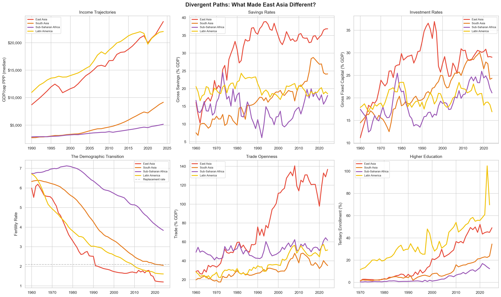
*East Asia pulled away from all other regions on income, savings, investment, trade openness, and education. The fertility panel is the leading indicator: East Asia began the demographic transition 20–30 years before Sub-Saharan Africa.*

The cross-country growth literature (Barro, Rodrik, Acemoglu, Hausmann, Pritchett) identifies a hierarchy. **Necessary conditions** (without these, nothing else works): physical security and basic macroeconomic stability. **Growth accelerators** (fundable from multiple sources): high investment rates, demographic transition, trade integration, infrastructure, and human capital. The factors that distinguish countries that took off from those that didn't:

- **High domestic savings** (30–45% in East Asia vs 10–20% in SSA) — funds investment without foreign debt
- **High investment rates** (25–40% of GDP) — in our cross-country data, the single strongest bivariate correlate of growth (r = +0.69, p < 0.001). This correlation should be read cautiously: the cross-country growth-regression literature has been heavily critiqued for fragility to specification, reverse causation (growth raises savings and investment, not only the other way around), and omitted variables correlated with both (Levine & Renelt 1992; Durlauf, Johnson & Temple 2005; Rodrik 2012). The association is robust across specifications and consistent with case evidence from East Asia, but "causal" language should be understood as shorthand for a correlation-plus-cases pattern, not an identified effect
- **Early fertility decline** — creating a demographic dividend of falling dependency ratios
- **Trade openness and export manufacturing** — technology transfer and learning-by-doing
- **State capacity** — whether government channels investment into productive capacity or elite consumption

This recipe is not "Asian." Bangladesh (+310% GDP/capita), Rwanda (+191%), Ethiopia (+231%), and Chile (+175%) all followed variations of the same pattern. Argentina (European, resource-rich) grew slower than Rwanda (African, landlocked, post-genocide). The relevant variable is institutional, not cultural or geographic.

**But the recipe presupposes peace.** Roughly one-third of the world's extreme poor now live in conflict-affected or fragile states, and the World Bank projects this share rising toward half by 2030 (World Bank *Fragility, Conflict, and Violence* Strategy 2020). For these populations — Yemen, DRC, Sudan, Somalia, Syria, Afghanistan, the Sahel, parts of Central America — the binding constraint is not trade policy or remittance cost reduction but physical security and minimal state function. None of the growth-recipe policies apply until that first precondition is met, and the standard aid apparatus is not designed for state-building under active conflict. Collier's *Bottom Billion* (2007) and the subsequent conflict-trap literature (Blattman & Miguel 2010) document that civil war can lower GDP by 15–20% and destroy institutional capital in ways that take decades to rebuild. Climate stress is worsening this picture: the Sahel, which is warming roughly 1.5× the global rate, combines demographic pressure, water stress, weak states, and active insurgency. For several hundred million people, the "development recipe" is not available at any price the current international system is willing to pay, and Paper 1's structural critique about mismatched incentives between donor priorities and recipient needs lands hardest here.

**This deserves more depth, because it is the scenario in which both growth and redistribution arguments largely fail.** You cannot run export-led manufacturing in a war zone, and you cannot reliably deliver cash transfers to a household that may be displaced next week by armed groups. A third of the global extreme-poor population is in a condition that neither paradigm the papers debate actually addresses.

**The conflict trap and why fragility is self-reinforcing.** Collier, Hoeffler & Söderbom (2004, *Journal of Peace Research* 41(3), "On the Duration of Civil War") model civil-war duration and find long expected spells once conflict begins; Collier & Hoeffler's earlier work (and the World Bank's *Breaking the Conflict Trap*, 2003) establishes that low-income countries sit at roughly 14% prevalence of active civil war at any given time. Collier, Hoeffler & Söderbom (2008, *Journal of Conflict Resolution* 52(4), "Post-Conflict Risks") find that post-conflict peace is typically fragile: *nearly half* of all civil wars are post-conflict relapses rather than fresh-onset conflicts, with the risk concentrated in the first decade after cessation. The mechanism is a feedback loop: war destroys capital and institutions → recovery is slow → youth cohorts grow up without jobs or functional schools → recruitment into armed groups becomes economically rational → low-intensity conflict persists → investors stay out → the cycle repeats. Besley & Persson (2011, *Pillars of Prosperity*) model this as a joint failure of fiscal capacity (the state cannot tax) and legal capacity (the state cannot enforce contracts), where each depresses the other. The "trap" framing is contested — Fearon & Laitin (2003, *APSR*) argue weak state capacity rather than grievance is the primary driver, and Blattman & Ralston (2015) find that the poverty–conflict correlation may run largely in the reverse direction — but the empirical pattern is robust: fragile states rarely escape fragility quickly, and when they do (Rwanda, Colombia partial, Ethiopia pre-2020) the exit depends on specific combinations of political settlement, security provision, and patient external support that are not easily replicated.

**Can you pay people to stop fighting? Sometimes — with important caveats.** The cash-for-peace intuition turns out to have a real empirical literature behind it:

- *Cash transfers in active-conflict contexts.* Blattman, Jamison & Sheridan tested cash + cognitive behavioral therapy on ~1,000 high-risk men in Liberia (ex-combatants, street criminals). The short-run (one-year) results appeared in Blattman, Jamison & Sheridan (2017, *American Economic Review* 107(4)); the 10-year follow-up is Blattman, Chaskel, Jamison & Sheridan (2023, *American Economic Review: Insights* 5(4) / NBER WP 30049, "Cognitive Behavior Therapy Reduces Crime and Violence over 10 Years"). A decade later, the combined cash-plus-CBT group was about half as likely as controls to engage in crime and violence — durability that cash alone and CBT alone did not produce. The intervention cost ~\$530 per participant. Crost, Felter & Johnston (2016, *Journal of Development Economics* 118, "Conditional Cash Transfers, Civil Conflict and Insurgent Influence") found that the Philippine *Pantawid Pamilya* CCT program *reduced* insurgent violence in treated municipalities — plausibly because transfers raised the opportunity cost of joining armed groups, and because government-delivered welfare partially substituted for insurgent-provided services.
- *Demobilization, disarmament, and reintegration (DDR).* Stipends to ex-combatants to return to civilian life are a standard post-conflict tool. The track record is mixed: Humphreys & Weinstein (2007, *APSR*) found Sierra Leone's DDR had modest effects on reintegration; Colombia's post-FARC DDR (2016–) has kept most of the ~13,000 demobilized ex-combatants out of active violence but struggled with reincorporation into the economy. DDR works best when the political settlement is stable; it fails when armed groups view it as a pause.
- *Cash-based programming in humanitarian crises.* The humanitarian sector has shifted substantially toward cash and voucher assistance (from ~2% of humanitarian aid in 2014 to ~21% in 2022). Evaluations in Lebanon, Jordan, Yemen, and Somalia consistently find cash more cost-effective than in-kind aid at preserving household welfare, and — crucially — *less* politically destabilizing than food aid, which can be captured by armed groups.
- *Elite bargains and buyouts.* At a different scale: Mozambique 1992, Northern Ireland 1998, and Colombia 2016 all involved negotiated settlements with substantial financial components — not "bribes" exactly, but integration of former combatants into legitimate political/economic roles through pensions, patronage, and reserved seats. The most successful peace agreements look less like aid programs and more like co-opting the leadership of armed groups into the formal political economy.

So "pay people to stop fighting" *does* work in specific forms — cash + skills for foot soldiers, elite bargains for leaders, humanitarian cash to prevent collapse — but it is not a substitute for a political settlement. Paying individuals creates incentives; only a settlement creates institutions. The ~\$530-per-person combined intervention in Blattman et al.'s Liberia study works *because* Liberia is post-war with a functioning-enough state; the same cash in active-conflict Sudan would be captured by checkpoints.

**What actually correlates with exits from fragility.** The evidence points to several recurring features of the few cases that escape the trap:

1. *A decisive political settlement, often with an external guarantor.* Mozambique (1992, ONUMOZ), Sierra Leone (2002, British intervention), Liberia (2003, UNMIL), Colombia (2016, Norway/Cuba-brokered). The common feature is not democracy — it is a credible commitment that the losing side will not be physically eliminated. North & Wallis & Weingast (2009) frame this as the shift from "limited access" (elite coalitions that manage violence by excluding outsiders) to a broader coalition; the shift is always politically fragile and often partial.
2. *Security provision that is accepted as legitimate.* UN peacekeeping is the single most-studied intervention, and the evidence is surprisingly positive. Fortna (2008, *Does Peacekeeping Work?*) and Hultman, Kathman & Shannon (2013, 2014, *APSR*) find that robust peacekeeping missions reduce the risk of civil war recurrence by roughly 50–75%, with effect size scaling in troop numbers. UN peacekeeping costs ~\$8B/yr globally (about 0.5% of global military spending) and has been arguably the best-value security investment of the post-Cold War era. The political obstacles are that Security Council politics block deployments (Syria, Yemen, Myanmar), host-country consent is required, and mandates are often too limited (Srebrenica, Rwanda).
3. *Revenue-sharing for resource-rich conflicts.* Many of the hardest cases (DRC, Sudan, parts of Nigeria, Colombia) are fueled by contested control of mineral, oil, or drug revenues. Mechanisms like the Extractive Industries Transparency Initiative (EITI), Kimberley Process, and conflict-mineral due-diligence rules (Dodd-Frank §1502) have had modest but real effects. When revenue is fenced off from armed groups (Colombia's post-2016 eradication-plus-substitution programs for coca), conflict intensity tends to fall.
4. *Jobs programs for at-risk youth.* Blattman & Annan (2016, *Review of Economics and Statistics*) found Liberian agricultural training + capital for high-risk men produced 40% earnings gains and lower interest in mercenary work. YouthStart (Uganda), Tumaini Innovation Center (Kenya), and various Sahel youth employment programs show similar patterns: the marginal recruit into armed groups is often recoverable with a plausible legitimate livelihood.
5. *Time, and not withdrawing too fast.* The Human Security Report Project's data shows that peace durations have been rising since the 1990s, but the gains are lumpy — they depend on sustained external engagement of 10–20 years, not the 2–3 years that matches most donor political cycles. The 2021 Afghanistan collapse is the textbook case of premature withdrawal; Bosnia, Sierra Leone, and Liberia are cases of sustained engagement that held.

**What doesn't work.** Several interventions have a consistent track record of failure or worse:

- *Pure military intervention without political settlement.* Iraq 2003–2011, Libya 2011–, Afghanistan 2001–2021. Removing a regime without a credible successor produces fragmentation, not governance.
- *Rapid democratization in post-conflict settings.* Paris & Sisk (2009, *The Dilemmas of Statebuilding*) and Snyder (2000) document the "democratization-first" pattern: elections before institutions produce winner-take-all violence (Angola 1992, Burundi 1993, Rwanda's precursors). The East Asian pattern — authoritarian-developmental, then gradual liberalization — has a better track record in weak-institution settings, even if it is politically uncomfortable for Western donors.
- *Structural adjustment during fragility.* IMF conditionality applied to post-conflict states (Rwanda 1990, Yugoslavia 1989) has been plausibly implicated in triggering rather than containing conflict by removing state capacity precisely when it was most needed.
- *Conditional aid that cannot be delivered if conditions are unmet.* Aid conditioned on governance reforms in states without the capacity to reform is aid that simply does not arrive.

**Costs and order of magnitude.** Rough estimates for what peace and state-building actually cost, for calibration:
- UN peacekeeping: ~\$8B/yr globally, ~\$1–2B per major mission. For comparison, the annual cost of global conflict (IEP 2023) is estimated at ~\$17T (13% of global GDP) including direct, indirect, and opportunity costs.
- Major peace-building programs (Afghanistan 2001–2021, Iraq 2003–2011): \$100B–\$1T+ over 10–20 years. Most was spent badly, on contractors and military operations rather than institution-building.
- Successful state-building (Mozambique, Sierra Leone, Liberia, Rwanda): typically \$1–3B/yr in combined ODA and peacekeeping, sustained for 10–15 years. Rwanda has received ~\$1.5B/yr on average since 1995 against a current GDP of ~\$13B.
- Cash-plus-CBT at the Blattman-Liberia scale: ~\$500 per high-risk participant for durable effect. A program reaching 1 million at-risk youth across the Sahel would cost ~\$500M — trivial against the cost of the conflicts it might prevent.

The order-of-magnitude conclusion: **preventing or exiting fragility is dramatically cheaper than living with it**, but the costs are front-loaded, politically unattractive, require 10–20 year commitments, and produce benefits that are diffuse and counterfactual (wars that don't happen rarely earn credit). This is the same structural mismatch the Sovereignty section identifies — except that where redistribution faces weak enforcement, state-building faces weak *attention-spans* and the absence of a global authority willing to sustain engagement beyond domestic political cycles.

**What this means for the broader argument.** The fragile-states case sharpens the paper-vs-paper debate in a particular way. For this subset of the world's poor:
- *Growth-led development* mostly fails because you cannot run the East Asian playbook in a war zone. FDI does not arrive; exports cannot be shipped; infrastructure gets blown up. The "recipe" section's policies are second-stage tools.
- *Redistribution* mostly fails because you cannot reliably deliver transfers where armed groups control territory, and because transfers without political settlement can fund further conflict (food aid diverted to militias, cash captured at checkpoints). Paper 1's redistribution arithmetic assumes the sovereignty exists to deliver the transfer; in fragile states the sovereignty is exactly what is missing.
- What *does* work is a specific stack — robust peacekeeping + negotiated settlement + sustained DDR and cash-plus-skills + patient institution-building — that looks less like either "capitalism" or "redistribution" and more like *state-construction*. It is neither the market nor the transfer; it is the precondition for both.

The conclusion is that a substantial fraction of humanity — perhaps a billion people by 2030 on current trends — lives in conditions where the debate between Paper 1 and Paper 2 is largely moot, and where the binding question is whether the international system can sustain the multi-decade, politically unglamorous commitments that actually exit countries from fragility. On that question the track record is poor but not hopeless: the number of countries in civil war has fallen roughly in half since the early 1990s peak, UN peacekeeping is empirically effective, and cash-plus-skills programs for at-risk individuals have real impact. What is missing is scale, patience, and the coordination that no actor currently has the authority to compel — which is, again, the sovereignty problem.

A political economy note: the papers would observe that this recipe — high investment, trade openness, state-directed capital — is easier to describe than to implement. The 0.7% ODA target has been unmet for 50+ years. Rich-world agricultural subsidies that harm developing-country farmers persist. EU FTT implementation has failed for 13 years. Rich-world material footprints have not declined to sustainable levels despite decades of efficiency gains. These are not footnotes — they are evidence that the international system structurally resists the very policies this analysis recommends, which is Paper 1's sharpest claim.

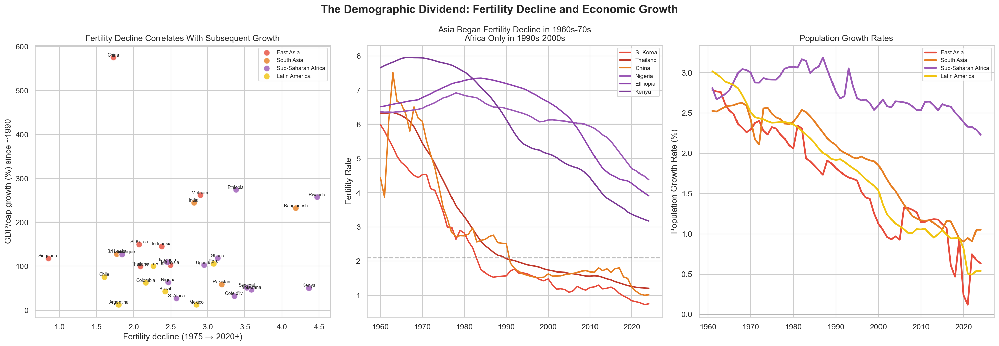
*Fertility decline since 1975 predicts GDP growth since 1990 — regardless of region. East Asia began the transition in the 1960s; SSA only in the 1990s. This 20–30 year head start is the single most important divergence driver.*

The demographic transition deserves emphasis because it is both the leading indicator and the strongest reason for cautious optimism. When fertility falls, dependency ratios improve, women enter the labor force, families invest more per child, and savings rates rise. Bangladesh — a Muslim-majority South Asian country — achieved replacement-rate fertility through female education and family planning programs, all while growing 310%. SSA is now entering this transition (TFR falling from ~6 to ~4), which is the single strongest reason for cautious optimism about the region's next 30 years.

Two important caveats. First, the transition is not uniformly teleological: Bongaarts (2017), Gerland et al. (2014, *Science*), and the UN's 2024 revision have increasingly argued that SSA may be on a qualitatively different trajectory — a slower, higher-desired-fertility path rather than a delayed version of the East Asian curve. UN 2024 projections have African population in 2100 considerably higher than 2019 projections, and the "stalling" fertility literature (Schoumaker 2019) documents several SSA countries where TFR declines plateaued at 4–5 rather than continuing to replacement. Second, the demographic *dividend* is conditional on labor absorption. A youth bulge without jobs is not Korea 1975; it is closer to the Arab Spring or Sahel instability. Whether the dividend becomes the disaster depends on whether structural transformation creates the formal jobs to absorb it — which depends, in turn, on the investment and trade conditions the rest of this section describes. The optimistic scenario is real but not automatic.

### Capital mobilization: how savings become investment

The development recipe says investment rates of 25–40% of GDP drive growth. But *where does the capital come from?*

**The history is uncomfortable.** Britain's industrial revolution was partly funded by colonial profits, slave-trade triangular trade, and enclosure of the commons. Marx called this "primitive accumulation" and the critique has real empirical support (slave-trade profits were perhaps 1–5% of British GDP — not the whole story, but not nothing). An anti-capitalist reading stops here. But the crucial evidence is that the *first* industrialization's ugly origins are not a *requirement* of the mechanism. South Korea, Taiwan, Singapore, and China were *colonized* countries, not colonizers. Their capital came from domestic savings, state-directed banking, and FDI — not plunder.

**East Asia's answer was domestic savings (30–45% of GDP), intermediated through state-directed banking.** Japan's postal savings reached every village; Korea directed bank lending to export industries; Singapore's CPF mandated 20–35% payroll savings; China's state banks channeled deposits into infrastructure. This is not laissez-faire capitalism; it is state-channeled capital mobilization.

**SSA saves 15–20% of GDP, but informal savings (livestock, rotating groups, grain storage) cannot be intermediated into productive investment at scale.** A goat is a store of value but cannot fund a power plant. The barriers — financial exclusion, inflation erosion, transaction costs, institutional distrust, and high dependency ratios from pre-transition fertility — are concrete and increasingly addressable, and the evidence on *what kind* of financial inclusion works at the bottom of the income pyramid has sharpened considerably in the last decade.

*Mobile money is the clearest development-finance win of the past 25 years — and the mechanism is commons-adjacent.* Jack & Suri (2014, *AER*) showed that M-PESA households in Kenya buffered idiosyncratic income shocks with zero consumption drop while non-users absorbed ~7% consumption cuts; Suri & Jack (2016, *Science*) used cross-sectional variation in agent access and estimated M-PESA lifted ~194,000 Kenyan households (~2%) out of extreme poverty between 2008 and 2014, with effects concentrated among female-headed households. The channel is *not* primarily credit. It is cheap, reliable digital transfer and savings, which lets kin and community risk-pooling networks function at larger geographic scale and lower transaction cost than the physical cash-and-visit economy could support. In the commons-and-kin-insurance framing above: pre-modern reciprocity networks handled idiosyncratic shocks (one household's house burns down) reasonably well and covariate shocks (drought, epidemic) poorly. Mobile money partially reconstitutes the idiosyncratic-shock function at national and cross-border scale, which is why the effects show up strongest for exactly the households (female-headed, remote, informally employed) that both the formal banking system and the traditional kin network serve worst. M-PESA now has ~50M users in East Africa; GCash (Philippines), bKash (Bangladesh), Orange Money (West Africa), and MTN MoMo (pan-African) have scaled to hundreds of millions; mobile-money penetration in SSA rose from ~10% in 2011 to ~55% in 2023 (Findex 2023); the Kenya–Tanzania remittance corridor cost fell from ~12% to ~3% post-M-PESA. [Detailed M-PESA and PAYG solar analysis in the [archive](analysis/ARCHIVE.md#mobile-money-payg-solar).]

*Savings and insurance beat credit, contrary to the popular microfinance narrative.* The six-country RCT meta-analysis (Banerjee, Duflo, Glennerster & Kinnan 2015, *AEJ: Applied* — India, Morocco, Bosnia, Mongolia, Ethiopia, Mexico) found classic microcredit produces modest positive effects on business investment and consumption smoothing but no detectable effect on income, poverty, health, education, or women's empowerment. Microcredit is a useful financial service that displaces informal moneylenders at 200–500% APR — not a development miracle, and it should not be marketed as one. The interventions with stronger evidence target the *other* two legs of household finance: Dupas & Robinson (2013, *AEJ: Applied*) showed that simply providing no-frills savings accounts to Kenyan market vendors raised business investment by 45% and food expenditure by 37%. Karlan, Osei, Osei-Akoto & Udry (2014, *QJE*) found rainfall-index insurance — not credit — significantly raised agricultural investment and income in Ghana by removing the downside risk that was suppressing investment; Cole et al. (2013, *AEJ: Applied*) replicated this finding for weather insurance in India. Weather, livestock, and health index-insurance products address covariate shocks that neither kin networks nor microcredit can handle, and they are probably underfunded relative to impact.

*Village savings-and-loan associations and cooperative finance work at small-to-medium scale when embedded in broader productive organization.* Karlan, Savonitto, Thuysbaert & Udry (2017, *PNAS*) evaluated CARE's VSLA model across Ghana, Malawi, and Uganda and found measurable gains in savings, agricultural investment, food security, and gender empowerment; VSLA-style networks now reach ~20M people across Africa and Asia. SEWA (Self-Employed Women's Association, India, founded 1972) — ~2M members, cooperative bank, producer cooperatives spanning textiles, dairy, and agriculture — is the most-admired of the women's cooperative finance institutions; the endurance of the institution is itself evidence, and the Bhatt (2006) observational record documents real occupational and political gains. Kerala's cooperative network (KSFE, primary agricultural cooperatives, fisheries cooperatives) is probably the largest successful Global South cooperative-finance ecosystem, with ~23M members, and it works because it is paired with unusually high state capacity. Mondragón (Spain, founded 1956, ~70,000 worker-owners, \$12B revenue, cooperative bank Caja Laboral Popular) is the developed-world benchmark. The common lesson: finance-as-commons works best when embedded in broader collective organization (marketing, production, bargaining), not standing alone — which is also Ostrom's finding for natural-resource commons.

*Peer-to-peer platforms are useful demonstrations, not scale interventions.* Kiva has disbursed ~\$2B over 20 years to ~5M borrowers at a median loan of ~\$400. The peer-to-peer framing is partly presentational — in practice Kiva pre-funds through local MFI field partners and backfills capital online — so its impact is bounded by the underlying microcredit evidence (modest). At \$100M/year against \$224B/year in ODA and \$656B/year in remittances, Kiva is a valuable civic-engagement and signaling vehicle, not a flow that moves development aggregates. The more significant peer-to-peer finance development is cross-border mobile remittance infrastructure itself — which is closer to a common carrier than a charitable platform, and which is where the scale impact sits.

*Implications for effective development work.* Mobile-money interoperability across networks and across borders, weather-and-health-index insurance, no-frills savings infrastructure, and cooperative-finance models embedded in productive organization are all better-evidenced than the interventions they are often positioned against. Classic microcredit is a cautionary tale about an institutional form that sounded commons-restorative but mostly wasn't; mobile money is the case where the technology actually is reconstituting kin-and-community risk-pooling at larger scale. Pay-as-you-go solar (\$0.50–1.50/day via mobile money, less than kerosene, with full ownership after 12–24 months) is a working example of how the mobile-money rails enable productive investment at the bottom of the income pyramid when financial infrastructure and cheap energy converge.

The chicken-and-egg of savings and investment is broken by five forces: external capital (FDI, concessional lending, remittances) that funds initial productivity gains; financial infrastructure that captures existing informal savings; the demographic transition; government revenue mobilization; and agricultural cooperatives that aggregate micro-savings. The question is whether SSA's institutions can *direct* savings toward productive investment — which is a question of governance, not economics.

### Debt: capitalism's growth engine — or trap

Borrowing against future returns to fund productivity-boosting investment is one of capitalism's foundational technologies. The question is not whether developing countries should borrow — it is whether the borrowing funds productive investment that generates returns exceeding the cost of capital.

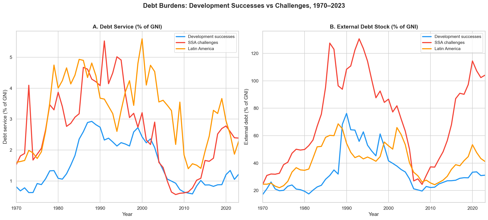
*Development successes maintained consistently lower **external** debt service (1–2% of GNI) compared to SSA challenges (2–5%) and Latin America (2–5%). But this understates how much the successes actually borrowed — they funded investment primarily from domestic savings (30–45% of GDP in East Asia), which is internal borrowing without currency risk or foreign creditor power.*

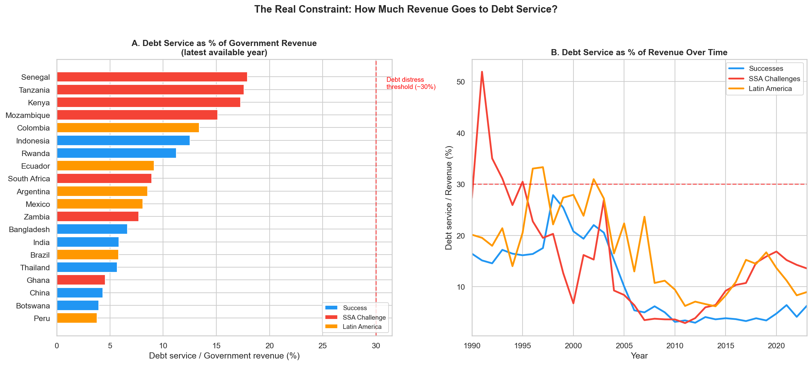
*The real constraint is what share of government revenue goes to creditors rather than investment. SSA peaked at 50%+ in the early 1990s, fell to ~5% after HIPC/MDRI debt relief, and is now climbing back toward 15%.*

**The distinction is not debt versus no debt — it is productive debt versus extractive debt.** East Asian successes mobilized enormous capital from domestic savings through state-directed banking into infrastructure and exports that generated returns well above the cost of capital. Latin America and SSA borrowed externally, often on commercial terms, sometimes to fund consumption or military spending, under conditions imposed by creditors whose interests diverged from borrowers'. SSA's HIPC (1996) and MDRI (2005) debt relief dropped external debt from ~100% to ~25% of GNI, creating fiscal space that accelerated growth — but new borrowing since 2010, increasingly from China and commercial creditors on less concessional terms, has rebuilt debt to ~45% of GNI. Ghana, Zambia, and Ethiopia all defaulted or restructured in 2020–2024. Many SSA countries now pay *more* in debt service than they receive in ODA. The goal is not to eliminate borrowing but to shift from external dependence to domestic capital mobilization — which circles back to the development recipe.

### What rich countries can actually do

The most powerful development levers available to rich countries are, paradoxically, not about money. But a recurring theme deserves attention: nearly every lever described below has been available for decades, and most remain underused or actively resisted. The question of *why* — whether structural features of capitalist political economies explain the persistent gap between known solutions and actual implementation — is the strongest version of the papers' argument, and it deserves more than relegation to the Limitations section.

**High impact (directly drive growth):**
- **Trade access.** Allow developing-country exports into rich-world markets. Bangladesh's \$47B/yr garment industry was enabled by EU preferential access. Vietnam's \$370B in exports followed trade agreements. This is the single most effective development tool — and costs donor countries almost nothing in aggregate GDP, though the political costs are concentrated in specific industries. Rich-world agricultural subsidies (EU CAP, US Farm Bill) that undercut developing-country farmers do active harm.
- **FDI facilitation.** Development Finance Institutions (US DFC, UK BII, Germany DEG) co-invest with private capital to de-risk pioneer investments. A \$50M DFI investment in a solar project can unlock \$500M in private follow-on. This is not aid — it is catalytic capital.
- **Remittance cost reduction.** SSA remittance costs average 7.9% — the highest in the world, against a UN target of 3%. Halving them would transfer ~\$3–4B/yr more to African families, more than many aid programs, at essentially zero fiscal cost to donor governments.
- **Debt restructuring.** Many SSA countries pay more to creditors than they receive in aid. Coordinated restructuring — as HIPC/MDRI demonstrated — can free fiscal space for productive investment. The goal is not debt forgiveness as charity but clearing the path for capitalism's own growth engine to function: borrowing that funds returns above the cost of capital.

**Moderate impact (build conditions for growth):**
- **Infrastructure investment** structured as loans, not grants — World Bank/IDA, AfDB, MCC compacts. Africa's infrastructure gap is ~\$100–170B/yr; ODA covers ~\$15–20B. China's Belt and Road, whatever its terms, has provided more infrastructure to Africa in 20 years than all Western donors combined.
- **Girls' education and family planning** — the highest-return investments in development, driving the demographic transition that unlocks everything else. Returns are real but generational (20–30 years).

**What rich countries should *stop* doing** often matters as much: agricultural subsidies that undercut poor farmers, enabling capital flight and tax havens, arms sales to conflict zones, tied aid (where contractors must be from the donor country), and expensive remittance corridors.

**The hardest truth:** the most important determinant of growth — institutional quality (Acemoglu & Robinson 2012) [[25]](#references-and-sources) — is the variable outsiders have the *least* ability to change. Rwanda built institutions internally. So did Botswana. So did Korea. External "governance programs" have a poor track record. The things only developing countries can do — build institutions, maintain peace, invest domestically, complete the demographic transition, choose dense urbanization over sprawl — are the most important things.

### The Bretton Woods institutions

The IMF and World Bank are central to the debt and development story, and the critique of their structural adjustment programs in the 1980s–90s has substantial empirical support. Our data shows IMF-heavy countries grew at +1.4%/yr vs. +4.0% for countries that largely avoided the Fund — though the selection problem (countries enter IMF programs *because* they're in crisis) makes causal inference genuinely difficult. The strongest evidence of harm comes from Sub-Saharan Africa, where GDP per capita actually contracted during the structural adjustment era (–0.2%/yr, 1980–1999) before rebounding to +2.5%/yr after 2000. The institutions have evolved, but structural problems persist: Western governance dominance and an inherent creditor bias. → [Full analysis: The IMF and World Bank](IMF_WORLD_BANK.md)

---

## What the Evidence Actually Shows

### Three claims well-supported by data:

**1. Growth alone is not enough.** Undirected growth with current distributional patterns cannot eliminate poverty at meaningful thresholds fast enough. Redistribution is 100–2,000× more efficient per dollar at reaching the poor. SSA is being left behind. The papers are right about this.

**2. Historical command economies failed, and no alternative has yet matched market-based development at scale.** The USSR peaked at 41% of US GDP per capita, then declined. China's market reform era (6.8%/yr) was 2.5× faster than the Mao era. But every successful market economy was heavily managed — Japan, Korea, Taiwan, China, and Vietnam all featured industrial policy, directed credit, and managed trade. The question is which *kind* of market economy, not whether to have one. This does not foreclose the possibility that as-yet-untested arrangements — democratic planning, provisioning models, hybrid systems — could outperform historical alternatives. It means the evidence base is currently thin.

**3. The ecological constraint is severe and binding.** Current decoupling rates land us at ~3°C. Staying under 2°C requires more than doubling the best performance ever achieved. Beyond carbon, material use, nitrogen, and biodiversity lack clear technological exits. The papers are more right on ecology than on economics.

### Two claims not supported by data:

**4. "Capitalism is mathematically unworkable."** The papers prove that growth *alone*, with *current distribution*, at *current coupling rates* is insufficient. Those are all policy variables, not laws of nature. Market economies with redistribution exist, and carbon decoupling is real in many high-income economies even though it remains too slow. The 175× GDP scenario assumes convergence to American consumption, which no one proposes. The data supports "current policies are inadequate," not "the system is mathematically impossible."

**5. "The current growth model is basically on track."** Our own carbon arithmetic refutes growth triumphalism. 2°C requires decoupling rates not yet demonstrated at scale. 3.14 billion remain below \$6.85/day. Six planetary boundaries are breached. Success is concentrated in East Asia. Growth has created enormous surplus and capacity, but the institutions for directing it — toward redistribution, decarbonization, and ecological restraint — are inadequate.

### The bottom line

The world has enough productive capacity to end extreme poverty at the lowest thresholds, and enough surplus to make deeper poverty reduction far less implausible than it was in 1990. It has enough historical evidence to know what economic institutions promote development. It has enough ecological data to know the current trajectory is unsustainable across multiple dimensions.

**Growth shrank the poverty gap from 18% to 1.6% of world GDP at meaningful thresholds. The remaining barriers are political-economic and ecological — but those may not be separable from the system itself.**

As the Building Prosperity section demonstrates, poverty is a *flow problem*: the papers' redistribution arithmetic treats it as a reservoir to be filled, but the development evidence says it is a leak to be fixed. Both the filling and the fixing are needed, but confusing one for the other leads to policy failure. The growth drivers are not mysterious, the most powerful rich-country levers cost almost nothing in fiscal terms, and the most important determinants — institutional quality, domestic savings, security — are things only developing countries can do for themselves.

Capitalism is a powerful energy source that has generated unprecedented material progress and made redistribution cheaper than at any point in history. The question is whether we can build the containment structures — redistribution, climate policy, ecological governance, development strategy — fast enough. The papers make a compelling case that the containment is currently insufficient. They do not make a compelling case that the reactor should be shut down.

But we should be honest about the limits of that metaphor. The reactor predictably resists containment. Market economies structurally tend to concentrate gains, lock in luxury consumption at ecologically indefensible levels, and externalize ecological costs. Rich-world material throughput is 3–4× the sustainable limit, and no market economy has yet demonstrated a path to reducing it. That political failure is not separate from the system — it is a feature of it. Nordic social democracy shows that better containment is possible within capitalism. It does not prove that capitalism globally tends toward that outcome.

Two claims should be distinguished. First: **the evidence rejects mathematical impossibility.** The technology pathways exist, the fiscal arithmetic works at lower thresholds, and historical development successes demonstrate that market economies with strong states can deliver broad-based growth. The papers do not prove the system cannot work. Second: **the evidence does not resolve whether capitalism will reliably deliver the containment it needs** — redistribution, ecological restraint, rich-world throughput reduction. The papers' strongest argument is that it structurally won't, and the ecological crisis requires the rich world to consume *less*, not just *differently*. Our data illuminates both sides of that question without settling it.

---

## Limitations and What This Doesn't Settle

- **The systemic political economy critique.** We show redistribution plus managed growth *could* work. But if capitalist political economies structurally tend to concentrate gains, resist redistribution, and externalize ecological costs, then "political failure" is not an external caveat — it is part of the indictment. Nordic social democracy proves better outcomes are possible; it does not prove the global system tends toward them. This is arguably the central unresolved question, and our data does not settle it.

- **The provisioning argument.** Paper 1's strongest version is not "175× GDP." It is that decent lives require specific material throughputs with real ecological costs, and the world already produces enough to meet those needs through reallocation rather than further growth. Our expanded good-life threshold is an outcome-reliability audit, not a direct rebuttal to provisioning frameworks that measure material sufficiency rather than GDP, consumption, or welfare correlations.

- **The exploitation critique and ecologically unequal exchange.** Our emissions-offshoring analysis is too narrow. It addresses carbon geography but not terms of trade, debt discipline, intellectual property regimes, supply chain ownership, currency hierarchy, or the structural orientation of Global South production toward exports rather than domestic provisioning. The [IMF/World Bank analysis](IMF_WORLD_BANK.md) partially addresses the debt discipline question — structural adjustment programs genuinely damaged African development in the 1980s–90s — but the deeper structural critique about who designs global economic rules remains. The ecologically-unequal-exchange literature (Hornborg 2009; Dorninger et al. 2021, *Global Environmental Change*) estimates net physical transfers from South to North on the order of ~10 Gt of raw materials, ~800 Mha-eq of embodied land, and ~3 Gt of embodied CO₂ per year, alongside Hickel, Sullivan & Zoomkawala (2021, *New Political Economy*) monetary-value-drain estimates of \$10–30 trillion over 1990–2015 depending on method. These numbers are contested (the value-drain estimate in particular depends on strong assumptions about counterfactual wages), but they are not marginal. They make Paper 1's framing — that Global North consumption is materially subsidized by Global South production — harder to dismiss. A companion literature on dollar hegemony and currency hierarchy (Prasad 2014; Pistor 2019, *The Code of Capital*; the "original sin" literature from Eichengreen & Hausmann) argues that the global financial architecture itself makes Global South borrowing structurally more expensive and pro-cyclical than Global North borrowing, which our debt analysis touches on but does not theorize. Chang's *Kicking Away the Ladder* (2002) makes the complementary historical argument that every currently-developed country used industrial policy, tariff protection, and weak IP enforcement of the kind now constrained by WTO/TRIPS rules — meaning "the development recipe" is partially unavailable to today's poor countries by design.

- **East Asian replicability.** Asian development success depended partly on Cold War geopolitics, cheap fossil energy, export absorption by rich-country markets, and ecological slack that may not exist for today's poorest countries. The development recipe is clear in retrospect; whether it can be followed under 2020s constraints is genuinely uncertain.

- **The anthropological and epistemic critique.** The quantitative apparatus used throughout this document — GDP, WDI indicators, poverty lines, planetary boundary budgets — is not politically neutral scaffolding. It renders certain things legible (income in monetary units; life expectancy in years) and others invisible (commoning, subsistence, care work, gift exchange, ecological relationships that do not map onto the production function). Several decades of development anthropology argue that "development" as an epistemic regime tends to convert political questions into technical ones and to impose forms of legibility that serve planners more than planned-for populations. Our analysis uses this apparatus because it is what exists at global scale and because its headline findings on child mortality, literacy, and material welfare describe something real. But a reader trained in this critical tradition will rightly note that many of our moves — "the good-life threshold is a measurable resource band," "the sustainable budget is 10-12 t/cap," "the development recipe is X" — are exactly the kind of technical-solution framings that literature identifies. Our answer is not that the critique is wrong. It is that the metric should be read as an outcome-reliability floor rather than a complete theory of flourishing. Hidden commons, kinship, autonomy, ritual life, dignity, and land attachment can raise welfare above the measured floor; coercive migration, land loss, debt, dependency, alienation, and cultural destruction can lower welfare even when measured outcomes improve. Subjective wellbeing, trust, perceived freedom, social support, violence, land security, and subgroup gaps can be added as a companion dashboard, but they cannot be collapsed into a universal moral score without recreating the problem. We do not resolve this tension; we make it explicit.

- **Measurement as politics.** As Paper 2 demonstrates, the poverty line you choose determines whether you see triumph or stagnation — both are accurate descriptions of the same underlying reality. Our analysis uses multiple thresholds, but every number still reflects choices about what counts as poverty, how to convert across currencies, and which welfare indicators to privilege. Numbers like "0.06% of GDP" and "3.4× the safe boundary" suggest precision the underlying methods don't fully support.

- **The welfare question.** Whether growth has "worked" depends on how much you weight improvements for the poorest versus total output. Our [welfare-weighted analysis](README_v2_archive.md) (Charts 52–57) shows country rankings shift dramatically with this value judgment — the US leads on mean income; Norway leads on every pro-poor measure.

- **What we don't fully answer.** Historically observed growth can reduce low-end deprivation, but it does so through a system that channels gains upward, locks in luxury consumption, and externalizes ecological costs. The boundaries that matter most now — land use, biodiversity, nitrogen — are the ones with the weakest technological escape routes. This is the strongest version of the papers' argument, and our data does not decisively refute it.

---

## References and Sources

Contested claims, headline numbers, and key frameworks are sourced below. Data sources for charts are listed in the Appendix.

### Poverty and growth
- **\$0.60 per \$100 of growth reaching extreme poor**: Woodward 2015, "Incrementum ad Absurdum," *World Economic Review* 4: 43–62. [1]
- **5% of new income reaching poorest 60%**: Lakner & Milanovic 2016, "Global Income Distribution," *World Bank Economic Review* 30(2): 203–232. [2]
- **Growth elasticity declining at higher thresholds**: Klasen & Misselhorn 2008; Ravallion 2012, "Why Don't We See Poverty Convergence?" *American Economic Review* 102(1): 504–523. [3]
- **Poverty headcounts and gaps**: World Bank Poverty and Inequality Platform (PIP), accessed April 2026. [4]
- **GDP data**: World Bank World Development Indicators (WDI), indicators NY.GDP.MKTP.PP.KD and NY.GDP.MKTP.CD. [5]
- **BNPL methodology and limitations**: Reddy & Pogge 2010, "How Not to Count the Poor," in Anand, Segal & Stiglitz eds., *Debates on the Measurement of Global Poverty*. [6]
- **Non-income welfare confirmation (life expectancy, mortality, literacy, calories)**: Kenny 2011, *Getting Better*; Deaton 2013, *The Great Escape*. [7]
- **China's ~75% share of extreme poverty reduction**: Ravallion 2011, "A Comparative Perspective on Poverty Reduction in Brazil, China, and India," *World Bank Research Observer* 26(1). [8]
- **3× targeting multiplier**: Ravallion 2009, "How Relevant is Targeting to the Success of an Antipoverty Program?" *World Bank Research Observer* 24(2). [9]

### Redistribution proposals
- **Global financial transaction tax (\$200–400B/yr)**: Schulmeister 2014, CEPR; Baker 2016, "The Benefits of a Financial Transactions Tax," *Tax Policy Center*. [10]
- **SDR reallocation**: Stiglitz & Bhatt 2021, "IMF and SDR Allocation," various; IMF 2021 allocation report. [11]
- **Global minimum corporate tax**: OECD 2021, "Two-Pillar Solution"; Tax Justice Network 2021, "State of Tax Justice" (\$100–240B estimate). [12]
- **Zucman billionaire wealth tax**: Zucman 2024, report for G20 Brazil presidency. [13]
- **ODA figures and 0.7% target**: OECD Development Assistance Committee preliminary 2024 data. [14]
- **Cash transfer effectiveness (\$0.85–\$0.90 per dollar)**: GiveDirectly RCTs; Haushofer & Shapiro 2016, *Quarterly Journal of Economics*. [15]

### Ecological boundaries and decoupling
- **Planetary boundaries framework**: Rockström et al. 2009, *Nature* 461: 472–475; Steffen et al. 2015, *Science* 347(6223); Richardson et al. 2023, *Science Advances* 9(37). [16]
- **Nitrogen boundary (44 vs 62 Tg/yr)**: Rockström 2009 (35 Tg/yr original); de Vries et al. 2013 (revised upward); Richardson 2023 (62 Tg/yr). [17]
- **Absolute decoupling "rare"**: Haberl et al. 2020, "A Systematic Review of the Evidence on Decoupling," *Environmental Research Letters* 15(6). [18]
- **Material footprint 50 Gt safe limit**: Bringezu 2015, "Possible Target Corridor for Sustainable Use of Global Material Resources," *Resources* 4(1); Hickel et al. 2022 synthesis. [19]
- **Solar S-curve data**: Our World in Data / BP Statistical Review / IEA, via OWID GitHub energy-data repository. [20]
- **1.5°C carbon budget**: IPCC AR6 WG1, Table SPM.2 (remaining budget from 2020: 400 GtCO₂ for 50% chance). [21]
- **Carbon budget exhaustion at 6–10 years**: Current emissions ~40 GtCO₂/yr ÷ 400 Gt remaining. [22]

### Development and aid
- **Aid effectiveness consensus**: Banerjee & Duflo 2011, *Poor Economics*; Easterly 2006, *The White Man's Burden*; Deaton 2013, *The Great Escape*; Moyo 2009, *Dead Aid*. [23]
- **FDI, remittances, ODA flow magnitudes**: World Bank 2024, *Migration and Development Brief*; OECD DAC statistics; UNCTAD *World Investment Report* 2024. [24]
- **Development recipe (savings, investment, institutions)**: Barro 1991, *Quarterly Journal of Economics*; Rodrik 2007, *One Economics, Many Recipes*; Acemoglu & Robinson 2012, *Why Nations Fail*. [25]
- **Demographic dividend**: Bloom, Canning & Sevilla 2003, "The Demographic Dividend," RAND; Galor 2011, *Unified Growth Theory*. [26]
- **M-Pesa and mobile money**: Jack & Suri 2014, "Risk Sharing and Transactions Costs: Evidence from Kenya's Mobile Money Revolution," *AER* 104(1): 183–223; Suri & Jack 2016, "The Long-Run Poverty and Gender Impacts of Mobile Money," *Science* 354(6317); Findex 2023, World Bank Global Findex Database. [27]
- **Microfinance, savings, and index insurance evidence**: Banerjee, Duflo, Glennerster & Kinnan 2015, "The Miracle of Microfinance? Evidence from a Randomized Evaluation," *AEJ: Applied* 7(1); Roodman 2012, *Due Diligence: An Impertinent Inquiry into Microfinance*; Dupas & Robinson 2013, "Savings Constraints and Microenterprise Development," *AEJ: Applied* 5(1); Karlan, Osei, Osei-Akoto & Udry 2014, "Agricultural Decisions after Relaxing Credit and Risk Constraints," *QJE* 129(2); Cole, Giné, Tobacman, Topalova, Townsend & Vickery 2013, "Barriers to Household Risk Management: Evidence from India," *AEJ: Applied* 5(1); Karlan, Savonitto, Thuysbaert & Udry 2017, "Impact of savings groups on the lives of the poor," *PNAS* 114(12); Bhatt 2006, *We Are Poor but So Many: The Story of Self-Employed Women in India*. [27a]
- **Commons governance and Ostrom principles**: Ostrom 1990, *Governing the Commons*; Cox, Arnold & Villamayor-Tomás 2010, "A Review of Design Principles for Community-based Natural Resource Management," *Ecology and Society* 15(4); Porter-Bolland et al. 2012, "Community managed forests and forest protected areas: An assessment of their conservation effectiveness across the tropics," *Forest Ecology and Management* 268; Platteau 2000, *Institutions, Social Norms, and Economic Development*; Fafchamps 2003, *Rural Poverty, Risk and Development*. [27b]
- **PEPFAR**: PEPFAR 2024 annual report (20M+ on antiretrovirals); 2025 disruptions from press/USAID reporting. [28]
- **Graduation programs (BRAC)**: Banerjee et al. 2015, "A Multifaceted Program Causes Lasting Progress for the Very Poor," *Science* 348(6236). [29]

### IMF and structural adjustment
- **IMF program effects on growth**: Barro & Lee 2005, "IMF Programs: Who Is Chosen and What Are the Effects?" *Journal of Monetary Economics*; Dreher 2006, "IMF and Economic Growth," *World Development*. [30]
- **Structural adjustment critique**: Stiglitz 2002, *Globalization and Its Discontents*; Easterly 2005, "What Did Structural Adjustment Adjust?" *Journal of Development Economics*. [31]
- **SSA GDP contraction during SAP era**: Maddison Project Database 2023; WDI GDP per capita growth rates. [32]

### Provisioning and decent living standards
- **Decent Living Standards material requirements**: Rao & Min 2018, "Decent Living Standards: Material Prerequisites for Human Wellbeing," *Social Indicators Research* 138: 225–244. [33]
- **Global food production sufficiency**: FAO 2023, *The State of Food Security and Nutrition in the World*. [34]
- **Cultivated meat cost trajectory**: Good Food Institute annual reports 2013–2025. [35]

### Welfare measurement
- **Atkinson EDEI welfare-weighted growth**: Atkinson 1970, "On the Measurement of Inequality," *Journal of Economic Theory* 2(3): 244–263. [36]
- **Good-life threshold**: Our analysis. The \$15k GDP/cap lower-bound heuristic comes from life expectancy and mortality saturation; the expanded audit tests a 19-indicator outcome bundle using WDI, PIP median welfare, household consumption, and OWID wellbeing context. Not from external literature. [37]

### Structural political economy and anthropology
- **Capitalism definitions / Varieties of Capitalism**: Wood 2002, *The Origin of Capitalism*; Brenner 1977, "The Origins of Capitalist Development," *New Left Review* I/104; Hall & Soskice 2001, *Varieties of Capitalism*; Amable 2003, *The Diversity of Modern Capitalism*; Streeck 2014, *Buying Time*. [43]
- **Growth imperative literature**: Binswanger 2009, "Is there a growth imperative in capitalist economies?" *Journal of Socio-Economics*; Richters & Siemoneit 2019, "Growth imperatives: Substantiating a contested concept," *Structural Change and Economic Dynamics*; Jackson & Victor 2020, "The Transition to a Sustainable Prosperity — A Stock-Flow-Consistent Ecological Macroeconomic Model," *Ecological Economics*; Fix 2021, "Economic Development and the Death of the Free Market," *Evolutionary and Institutional Economics Review*. [44]
- **Development as epistemic regime**: Escobar 1995, *Encountering Development*; Ferguson 1994, *The Anti-Politics Machine*; Ferguson 2006, *Global Shadows*; Mitchell 2002, *Rule of Experts*; Li 2007, *The Will to Improve*; Mosse 2005, *Cultivating Development*; Graeber & Wengrow 2021, *The Dawn of Everything*. [45]
- **Ecologically unequal exchange**: Hornborg 2009, "Zero-Sum World," *International Journal of Comparative Sociology*; Dorninger et al. 2021, "Global patterns of ecologically unequal exchange," *Global Environmental Change* 179; Hickel, Sullivan & Zoomkawala 2021, "Plunder in the post-colonial era," *New Political Economy* 26(6). [46]
- **Currency hierarchy and global financial architecture**: Eichengreen & Hausmann 1999, "Exchange Rates and Financial Fragility," NBER WP 7418; Prasad 2014, *The Dollar Trap*; Pistor 2019, *The Code of Capital*. [47]
- **Industrial policy history**: Chang 2002, *Kicking Away the Ladder*; Chang 2007, *Bad Samaritans*. [48]
- **Rich-world working-class stagnation**: Karabarbounis & Neiman 2014, "The Global Decline of the Labor Share," *Quarterly Journal of Economics* 129(1); Case & Deaton 2015, "Rising morbidity and mortality in midlife among white non-Hispanic Americans in the 21st century," *PNAS* 112(49); Case & Deaton 2020, *Deaths of Despair and the Future of Capitalism*; Case & Deaton 2022, "The great divide: Education, despair, and death," *Annual Review of Economics* 14; Gelman & Auerbach 2016, "Age-aggregation bias in mortality trends," *PNAS* 113(7); Ruhm 2019, "Drivers of the Fatal Drug Epidemic," *Journal of Health Economics* 64; Alpert, Powell & Pacula 2018, "Supply-side drug policy in the presence of substitutes," *American Economic Journal: Economic Policy* 10(4); Friedman & Hansen 2022, "Evaluation of Increases in Drug Overdose Mortality Rates in the US by Race and Ethnicity Before and During the COVID-19 Pandemic," *JAMA Psychiatry* 79(4); Masters, Tilstra & Simon 2018, "Explaining recent mortality trends among younger and middle-aged White Americans," *International Journal of Epidemiology* 47(1); Milanovic 2016, *Global Inequality*; Milanovic 2023, "The three eras of global inequality, 1820–2020," working paper; Sacerdote 2017, "Fifty Years Of Growth In American Consumption, Income, And Wages," NBER WP 23292; Meyer & Sullivan 2011, "Further Results on Measuring the Well-Being of the Poor Using Income and Consumption," *Canadian Journal of Economics*; Economic Policy Institute 2024, "The Productivity–Pay Gap"; Congressional Budget Office, *The Distribution of Household Income* (annual). [49]

- **Absolute vs relative welfare; community dissolution; vibecession**: Stevenson & Wolfers 2008, "Economic Growth and Subjective Well-Being: Reassessing the Easterlin Paradox," *Brookings Papers on Economic Activity*; Stevenson & Wolfers 2013, "Subjective Well-Being and Income," *American Economic Review* 103(3); Killingsworth 2021, "Experienced well-being rises with income, even above \$75,000 per year," *PNAS* 118(4); Kahneman & Killingsworth 2023, "Income and emotional well-being: A conflict resolved," *PNAS* 120(10); Putnam 2000, *Bowling Alone*; Putnam & Garrett 2020, *The Upswing*; Haidt 2024, *The Anxious Generation*; Twenge 2017, *iGen*; Twenge et al. 2018, "Increases in Depressive Symptoms, Suicide-Related Outcomes, and Suicide Rates Among U.S. Adolescents After 2010," *Clinical Psychological Science* 6(1); CDC Youth Risk Behavior Survey 2023; Autor, Dube & McGrew 2023, "The Unexpected Compression: Competition at Work in the Low Wage Labor Market," NBER WP 31010; Boxell, Gentzkow & Shapiro 2020, "Cross-Country Trends in Affective Polarization," NBER WP 26669; Murthy/US Surgeon General 2023, "Our Epidemic of Loneliness and Isolation." [60]
- **Cross-country growth regression critique**: Levine & Renelt 1992, "A Sensitivity Analysis of Cross-Country Growth Regressions," *American Economic Review* 82(4); Durlauf, Johnson & Temple 2005, "Growth Econometrics," in *Handbook of Economic Growth*; Rodrik 2012, "Why We Learn Nothing from Regressing Economic Growth on Policies," *Seoul Journal of Economics*. [50]
- **Planetary boundaries framework critique**: Montoya, Donohue & Pimm 2018, "Planetary Boundaries for Biodiversity: Implausible Science, Pernicious Policies," *Trends in Ecology & Evolution* 33(2); Biermann & Kim 2020, "The Boundaries of the Planetary Boundary Framework," *Annual Review of Environment and Resources* 45; Persson et al. 2022, "Outside the Safe Operating Space of the Planetary Boundary for Novel Entities," *Environmental Science & Technology* 56(3); Nordhaus 2019, "Climate Change: The Ultimate Challenge for Economics," *American Economic Review* 109(6). [51]
- **Provisioning (peer-reviewed)**: Millward-Hopkins, Steinberger et al. 2020, "Providing decent living with minimum energy: A global scenario," *Global Environmental Change* 65; Kikstra et al. 2021, "Decent living gaps and energy requirements," *Environmental Research Letters* 16(9). [52]
- **Critical minerals and just transition**: IEA 2024, *Critical Minerals Outlook*; Sovacool 2021, "When subterranean slavery supports sustainability transitions?" *The Extractive Industries and Society* 8(1); Riofrancos 2023, "The Security–Sustainability Nexus: Lithium Onshoring in the Global North," *Global Environmental Politics* 23(1). [53]
- **Climate impacts on development**: Burke, Hsiang & Miguel 2015, "Global non-linear effect of temperature on economic production," *Nature* 527: 235–239; Kahn et al. 2021, "Long-term macroeconomic effects of climate change," *Energy Economics* 104; Kotz, Levermann & Wenz 2024, "The economic commitment of climate change," *Nature* 628: 551–557. [54]
- **Demographic transition critique**: Gerland et al. 2014, "World population stabilization unlikely this century," *Science* 346(6206); Bongaarts 2017, "Africa's Unique Fertility Transition," *Population and Development Review* 43(S1); Schoumaker 2019, "Stalls in Fertility Transitions in sub-Saharan Africa," *Studies in Family Planning* 50(3); UN DESA 2024, *World Population Prospects 2024*. [55]
- **Fragile states and conflict-development**: Collier 2007, *The Bottom Billion*; Blattman & Miguel 2010, "Civil War," *Journal of Economic Literature* 48(1); World Bank 2020, *Fragility, Conflict, and Violence Strategy*. [56]
- **Sovereignty / global governance**: Rodrik 2011, *The Globalization Paradox* (trilemma); Streeck 2014, *Buying Time*; Pistor 2019, *The Code of Capital*. [57]
- **Food-system political economy**: Li 2014, *Land's End*; Borras & Franco 2012, "Global Land Grabbing and Trajectories of Agrarian Change," *Journal of Agrarian Change* 12(1). [58]
- **Woodward/Simms UN DESA paper**: Woodward & Simms 2006, "Growth Isn't Working," UN DESA / New Economics Foundation. [59]

### Energy de-risking and materials
- **Grid architecture and intermittency**: Sepulveda et al. 2018, "The Role of Firm Low-Carbon Electricity Resources in Deep Decarbonization of Power Generation," *Joule* 2(11): 2403–2420; NREL "Renewable Electricity Futures Study" 2012 and subsequent updates (80%+ RE grid feasibility); Bank of America LFSCOE study 2023 (firm-power cost comparison — note this assumes 100% single-source firm power, not realistic portfolio). **Long-duration storage**: Form Energy iron-air battery (\$20/kWh target, 100+ hour duration, first commercial deployment 2025–2026 at Great River Energy, Minnesota); LDES Council & McKinsey 2023, "Net-zero Power: Long Duration Energy Storage for a Renewable Grid"; Albertus et al. 2020, "Long-Duration Electricity Storage Applications, Economics, and Technologies," *Joule* 4(1): 21–32; US grid battery deployments: EIA Electric Power Monthly (1 GW 2020 → 16 GW 2024). **HVDC interconnection**: NordLink (Norway→Germany, 623 km, operational 2021); Viking Link (Denmark→UK, 765 km, operational 2023); Xlinks Morocco→UK project (3.6 GW, ~3,800 km HVDC, in development). HVDC transmission losses ~3% per 1,000 km. [38]
- **Nuclear fission and SMRs**: World Nuclear Association 2024 country profiles; Lazard LCOE+ 2023 (\$141–221/MWh new US nuclear, \$31/MWh existing); EIA 2022 capital cost estimates (\$6,695–7,547/kW); Berthélemy & Rangel 2015, "Nuclear reactors' construction costs: The role of lead-time, standardization and technological progress," *Energy Policy* 82: 118–130; Our World in Data, "Why did renewables become so cheap so fast?" (Roser 2020, updated 2025); Our World in Data, "Nuclear Energy" (Ritchie & Rosado 2020). [38]
- **Enhanced geothermal**: Fervo Energy 2023 Project Red (Nevada) and Cape Station (Utah) demonstrations; DOE GeoVision study 2019 (60 GW by 2050); DOE Enhanced Geothermal Shot Analysis 2023 (90 GW by 2050, \$45/MWh target by 2035); MIT "The Future of Geothermal Energy" 2006 (Tester et al.; 13,000+ ZJ US EGS resources, 100+ GWe feasible); Lazard 2023 geothermal LCOE (\$61–102/MWh); NREL ATB 2024. [39]
- **Fusion progress**: Commonwealth Fusion Systems 2021 magnet demonstration (20T HTS); National Ignition Facility 2022 net energy gain. [40]
- **EAF steel transition**: World Steel Association 2024 statistics (~30% global EAF share, ~70% US share); energy savings ~75% vs blast furnace (IEA Iron and Steel Technology Roadmap 2020). [41]
- **Aluminum recycling**: International Aluminium Institute; ~95% energy savings for secondary vs primary production; ~75% of all aluminum ever produced still in use. [42]

---

## Appendix

### Data Sources

| Source | Key Variables |
|---|---|
| [World Bank WDI](https://data.worldbank.org/) | GDP, population, household consumption, life expectancy, mortality, maternal/neonatal health, nutrition, clean cooking, water, sanitation, education, investment |
| [World Bank PIP](https://pip.worldbank.org/) | Headcount ratios and poverty gaps at \$2.15, \$3.65, \$6.85, \$10, \$15, \$20, and \$25/day; country-level mean, median, and decile welfare |
| [Maddison Project](https://www.rug.nl/ggdc/historicaldevelopment/maddison/) | Historical GDP per capita (1–2022) |
| [Our World in Data](https://github.com/owid/co2-data) | CO₂ emissions (production + consumption), decoupling metrics |
| [Our World in Data](https://github.com/owid/energy-data) | Solar/wind/fossil generation, energy mix, renewable shares |
| [Our World in Data](https://ourworldindata.org/) | Material footprint, LPI, Red List, nitrogen, phosphorus, water stress, HDI, Cantril life satisfaction |
| [OECD Revenue Statistics](https://www.oecd.org/tax/tax-policy/revenue-statistics.htm) | Total government tax revenue (% GDP) |
| [IEA](https://www.iea.org/) | Critical minerals demand projections |
| [USGS](https://pubs.usgs.gov/) | Mineral production volumes |

### Analysis Pipeline

Nineteen scripts in `analysis/` produce 101 charts. Run sequentially after `download_data.py`; run `download_good_life_data.py` before `run_analysis_19.py`:

| Script | Topic | Charts |
|---|---|---|
| `run_analysis.py` | Core poverty & growth | 01–08 |
| `run_analysis_2.py` | Poverty–growth feedbacks | 09–12 |
| `run_analysis_3.py` | Floor-raising, good-life threshold | 13–16 |
| `run_analysis_4.py` | Market reforms, command economies | 17–18 |
| `run_analysis_5.py` | Decoupling, carbon budget, trade flows | 19–23 |
| `run_analysis_6.py` | ODA, political economy, energy S-curve | 24–27 |
| `run_analysis_7.py` | Non-carbon planetary boundaries | 28–32 |
| `run_analysis_8.py` | Country-level ecological decomposition | 33–36 |
| `run_analysis_9.py` | Transition minerals vs fossil fuels | 37–40 |
| `run_analysis_10.py` | Transfers to self-sufficiency | 41–46 |
| `run_analysis_11.py` | Rich-world quintile incomes | 47–51 |
| `run_analysis_12.py` | Welfare-weighted growth (27 countries) | 52–57 |
| `run_analysis_13.py` | Why some countries develop | 58–65 |
| `run_analysis_14.py` | Debt burdens: success vs challenge | 66–71 |
| `run_analysis_15.py` | IMF & World Bank: help or harm? | 72–77 |
| `run_analysis_16.py` | Rich-world working-class welfare (multi-group) | 78–82 |
| `run_analysis_17.py` | Is the energy transition on track? | 83–90 |
| `run_analysis_18.py` | Robustness checks and unresolved questions | 91–96 |
| `run_analysis_19.py` | Expanded good-life threshold | 97–101 |

### Methodology Notes

- **Poverty gaps** use the World Bank PIP world aggregate (WLD) row. The "realistic 3×" multiplier follows the literature's rough estimate that targeting inefficiency, administrative costs, and behavioral responses approximately triple perfect-targeting cost.
- **Decoupling rates** are annualized: \$(I_t/I_0)^{1/t} - 1\$ where \$I\$ is CO₂ intensity of GDP.
- **Carbon budget scenarios** solve for annual intensity decline \$d\$ such that cumulative emissions \$\sum_{t=0}^{49} E_0 (1+g)^t (1-d)^t \leq B\$.
- **Expanded good-life threshold** treats the threshold as outcome reliability, not a single GDP line. The score covers 19 available indicators across health, nutrition, basic services, education, safety, and air quality; country-years need at least 8 available indicators for the main reliability tables. Resource thresholds are estimated separately for GDP/capita, household consumption/capita, and PIP median welfare.
- **Anthropological extensions to the good-life audit** are possible but not yet fully integrated. Cantril life satisfaction and HDI are downloaded as context; DHS, MICS, LSMS, IPUMS, World Values Survey, Gallup, V-Dem, land-tenure, and conflict datasets could extend the audit toward subjective wellbeing, agency, subgroup gaps, and provisioning-mode harms. These should be reported as companion diagnostics rather than folded uncritically into the same score.
- **Welfare-weighted growth** uses the Atkinson EDEI at ε = 0, 0.5, 1, 2, and ∞ across 27 countries.
- **Robustness checks** in `run_analysis_18.py` test good-life threshold sensitivity, poverty-gap delivery overhead, growth-incidence assumptions, nitrogen intervention stack, post-transition material footprint, and development correlates. `run_analysis_19.py` saves the expanded good-life audit as `data/processed/good_life_v2_*.csv`.

### Full Chart Atlas

The full chart index is in [README_v2_archive.md](README_v2_archive.md). Charts featured in this document: 01, 02, 14, 21, 22, 24b, 26, 28, 31, 32, 46, 60, 62, 67, 69, 91, 94, 95, 97, 98, 99, 100, 101. Charts 72–77 are featured in [IMF_WORLD_BANK.md](IMF_WORLD_BANK.md). Charts 91–96 are robustness checks; Charts 97–101 are the expanded good-life threshold audit.

### Tools & Environment

Python 3.14 · pandas, numpy, matplotlib, seaborn, scipy, statsmodels · April 2026
AI assistants: Claude Opus 4.6 (primary analysis and writing), GPT-5.4 (independent critical review)

---

*This project is open-source. All data is from publicly available sources. Supporting exploratory analysis and independent review notes are preserved in [README_v2_archive.md](README_v2_archive.md). Reproduce, critique, and extend.*
