# Growth, Poverty, and Planetary Boundaries

**A quantitative assessment of whether global poverty can be ended through growth and redistribution while remaining within ecological limits.**

The report uses World Bank, Maddison Project, Our World in Data, OECD, IEA, and USGS data to assess two papers arguing that growth-based poverty elimination is physically impossible and redistribution is the only viable path. It asks which claims are supported, which are overstated, and what the evidence implies for a strategy that must address poverty and ecological limits simultaneously. Supporting code, data, and figures are provided; reproducibility does not itself validate an estimand or its interpretation.

**Evidence conventions.** Country-panel, survey-distribution, and scenario results explicitly described as this report's calculations are original exploratory analyses. Discussions of technologies, institutions, and policy mechanisms are literature synthesis, not new causal estimates. Scenario inputs are assumptions rather than forecasts. The planetary-boundary status below is a consistent **Richardson et al. (2023) assessment**, not a live 2026 scorecard. Invalid ecological comparisons and dependent probabilities have been replaced with withdrawal records in their producers and outputs; the historical archive is not current evidence.

> Read the [claim and identification appendix](CLAIMS_EVIDENCE_APPENDIX.md) for evidence grades and the [generated wellbeing validation](WELLBEING_VALIDATION.md) for the new happiness results. The historical archive is [README_v2_archive.md](README_v2_archive.md). The pipeline now has 35 numbered analyses and chart identifiers through 145; some chart identifiers contain withdrawal notices, not valid quantitative findings.

---

## Executive Summary

The evidence supports eight main findings:

1. **Undirected growth is not a reliable poverty-eradication strategy, but its incidence is far better than a universal 5% pass-through would imply.** The often-cited 5% figure is the share of one *global* income increment accruing to the poorest 60% of the global distribution in 1988–2008; it is not a stable pass-through rate from a country's GDP to its own poor. Comparable PIP survey spells show that national bottom-60 groups captured an increment-weighted 33–38% of positive survey-welfare growth across samples since 1990 (median country-spell 33–41%); only about 9% of spells were below 5%. This remains less than their 60% population share and does not prove that GDP growth alone will close high poverty lines. It does show that global distribution across countries and people is not the same estimand as incidence within a growing country.

2. **Growth transformed the scale of the redistribution problem without eliminating deprivation.** On a consistent 2021-PPP basis, the \$8.30/day gap fell from 12.25% of world GDP in 1990 to 2.85% in 2024. A log decomposition attributes 73.5% of that relative decline to growth in world GDP and 26.5% to contraction of the absolute gap. At \$25/day, the gap fell relative to GDP (55.2% to 21.6%) while the absolute shortfall *rose* from \$32.9T to \$37.7T in 2021 PPP. Output increased relative to the gap; world GDP is neither a tax base available to a global treasury nor a measure of deliverable transfers.

3. **The ecological constraint is real and differentiated.** Richardson et al. (2023) assess six of nine boundaries as transgressed. Nitrogen and phosphorus are components of one biogeochemical-flows boundary; nitrogen's reported ~190 Tg N/yr is about 3.1 times its 62 Tg boundary, including industrial and intentional biological fixation. Synthetic-fertilizer scenarios do not measure that total and cannot establish boundary compliance. Clean electricity offers substantial carbon reductions, but whole-economy decarbonization, nutrient losses, land restoration, and biodiversity protection require different technologies and institutions. Aggregate material tonnage cannot resolve those impacts on its own.

4. **Poverty is a flow problem, but the choice is not transfers or growth.** A 2025–2050 scenario model estimates a \$62.2T present value for permanent \$6.85/day transfers under central delivery assumptions, versus \$39.3T for inclusive growth plus annual top-ups; the mixed strategy lowers the modeled 2050 top-up from \$3.38T to \$0.87T. Growth alone still leaves 15.6% of the covered population below the line. These are transfer-outlay scenarios, not complete social-cost estimates: the investment and ecological costs of producing growth are not monetized. Immediate transfers and productive development solve different parts of the flow problem.

5. **The development evidence supports investment as a correlate, not a universal recipe.** In a panel of 222 non-overlapping country spells that excludes World Bank regional aggregates and clusters uncertainty by country, a one-standard-deviation increase in investment is associated with +0.52 percentage points of subsequent annual GDP/capita growth (95% CI +0.17 to +0.87). Fertility's coefficient is −0.44 points but its interval crosses zero (−0.95 to +0.06); trade, FDI, schooling, and tax revenue are also insignificant. A fixed-window event design finds 43.6% success after high-investment windows, versus 34.9% after medium and 33.3% after low investment, with overlapping confidence intervals. Peace, stability, investment, demography, trade, and state capacity remain plausible mechanisms supported by wider literature and cases, but these data do not identify a causal recipe.

6. **Sustainable consumption depends on composition and scale, not aggregate mass alone.** Material-footprint totals aggregate sand and burned coal without weighting their different impacts. Technology, demand, and institutions can reduce the ecological pressures of provisioning; the report does not establish an impact-free route to high welfare. Under broad category-level uncertainty, the post-transition rich-country footprint centers near 11 t/cap; reaching 9 t/cap requires optimistic assumptions about biomass, metals, construction intensity, and circularity. A tonne of burned coal is not equivalent to a tonne of maintained rail ballast, but damage-weighted material accounting remains unresolved.

7. **Affordable clean energy is an important enabling condition — not a complete solution.** The recorded solar series rises from 4 TWh (2005) to 2,128 TWh (2024). Extending a historical growth rate is a scenario, not evidence of a fitted S-curve or a forecast of fossil displacement. Electrification, some desalination, and recycling can benefit from cheaper clean power, but reliability requires weather- and demand-resolved system planning. Storage cost targets are not demonstrated levelized costs, and neither renewable deployment alone nor a single 2030 waypoint establishes compatibility with 2°C. Energy also cannot substitute for nutrient management, biodiversity protection, or land rights.

8. **Selection matters, and global feasibility remains unidentified.** The IMF comparison weakens after accounting for crisis selection. Predetermined commodity exposure interacted with global prices is associated with a 0.12-percentage-point revenue/GDP response per one-point windfall (95% CI 0.06–0.19), but GDP/capita, investment and governance interactions remain imprecise. Neither is a clean causal recipe. The inherited green-growth probabilities, dependence bounds and evidence-priority rankings have been withdrawn because their nitrogen input did not measure boundary compliance. There is no replacement success probability.

**New external welfare check.** In a common 2018–2020 window, a fixed nine-indicator, five-domain outcome score correlates with Cantril life evaluation at **r=0.74 across 88 countries**. A separate within-country real-income association is positive but imprecise. Objective conditions and self-reported lives are related, not interchangeable; these results neither identify a happiness threshold nor show that growth causes wellbeing gains. See [wellbeing validation](#does-the-good-life-score-match-peoples-own-evaluations).

---

## What the Evidence Resolves — and What Remains Uncertain

Two benchmarks recur below. A **\$15k GDP/capita welfare proxy** marks an observed income range associated with favorable basic health outcomes, not a causal requirement or minimum material cost. A **~9 t/cap post-transition material-footprint scenario** is an optimistic case; category-level sensitivity centers closer to 11.1 t/cap. Neither defines a necessary or sufficient condition for sustainable welfare. Aggregate mass targets are separate proposals, not one of Richardson's nine boundaries.

Some uncertainties can be narrowed with data. Others cannot be settled by additional quantitative analysis because they are counterfactual, institutional, or normative. The table distinguishes current empirical findings from those unresolved questions.

| Issue | What the evidence shows | What remains unresolved |
|---|---|---|
| **The "good life" threshold** | The \$15k GDP/cap line is a descriptive heuristic for narrow outcomes. The broader score covers health, nutrition, services, education, safety, and air quality; GDP, household consumption, and PIP median welfare are separate resource proxies. For 90% reliability on an 85% score, fitted associations are roughly \$20k GDP/cap population-weighted and \$40k unweighted; \$12.5k–\$15k household consumption/cap; or \$15–\$25/day PIP median welfare. | Inclusion requires only 8 of 19 indicators; changing coverage, causality, inequality, non-market welfare, and normative choice remain unresolved. These are not minimum material costs. |
| **Poverty-gap scale** | In the legacy nominal-conversion calculation, at \$2.15/day a 3x delivery-cost assumption gives ~\$122B, or 0.11% of world GDP. At \$6.85/day it gives ~\$2.9T, or 2.6%; at \$10/day, ~\$6.9T, or 6.2%. These are scenario magnitudes, not observed delivery budgets. | Country price proxies, tax capacity, targeting, local supply, administration, and international commitments. A small world-output share does not establish fiscal or operational feasibility. |
| **Growth-distribution arithmetic** | The 5% global increment share from 1988–2008 cannot be treated as a universal within-country pass-through. Across 247 comparable positive-growth PIP spells starting since 1990, national bottom-60 groups captured 33.2% of the increment on an increment-weighted basis (median 32.6%; interquartile range 22.4–45.1%). | These are survey-income/consumption changes, not GDP incidence; positive-growth selection, survey error, spell composition, and cross-country heterogeneity remain. Future incidence is a policy/institutional variable. |
| **Nitrogen pathway** | The literature identifies efficiency, diet, waste reduction, and nutrient recovery as pressure-reduction options. The report's fertilizer scenarios track synthetic N, not total intentional fixation. Legacy intervention-stack and threshold-crossing percentages are withdrawn as boundary tests. | A consistent industrial-plus-biological N budget, regional nutrient losses, overlapping interventions, adoption, and governance. |
| **Post-transition material footprint** | A ~9 t/cap target is optimistic. Broad category-level uncertainty centers closer to ~11.1 t/cap; the naive 5.9 t/cap mass budget is not reached in the scenario draws. | Whether 10-12 t/cap of mostly construction maintenance and recyclable metals is ecologically acceptable requires damage-weighted LCA, not mass accounting alone. |
| **Development recipe** | The 222-spell panel excludes aggregates, uses non-overlapping windows, and clusters uncertainty by country. Investment is positively associated with subsequent growth (+0.52pp per SD, 95% CI +0.17 to +0.87); fertility is not significant at 5% (−0.44pp, CI −0.95 to +0.06). A fixed-window comparison that scores continuing high-investment cases finds success rates of 43.6% high, 34.9% medium, and 33.3% low. Restricting to events with a PPP income classification gives 57.7%, 49.1%, and 37.5%, respectively. Intervals overlap in both samples. | Reverse causality, omitted institutions, post-treatment controls, country selection, and the definition of “success.” This is descriptive evidence, not proof of a recipe or of necessity. |
| **Dynamic transfers and growth** | At \$6.85/day, the central 2025–2050 model gives a \$62.2T present value for permanent transfers and \$39.3T for inclusive growth plus top-ups. Mixed-strategy 2050 transfers are \$0.87T rather than \$3.38T; growth alone leaves 15.6% below the line. | Growth, incidence, delivery, behavior, and local-price paths are scenarios. Growth-enabling investment and ecological costs are not monetized, so this is not a full benefit-cost comparison. |
| **Fragility and causal development** | Conflict-affected, low-capacity, and stable developing spells average 2.3%, 3.1%, and 3.0% subsequent growth; adjusted contrasts are indistinguishable from zero. A matched investment-onset design is positive but fails its joint pre-trend test (p=0.019); synthetic-control-like evidence has only five heterogeneous cases. | Historical WGI missingness, endogenous investment onset, sparse cases, and no valid assignment rule or instrument. These designs do not identify a causal development recipe. |
| **Commodity windfalls** | Predetermined export composition interacted with global fuel, metals, food, and raw-material price changes yields no precise GDP/capita response through five years. The impact-year government-revenue response is +0.124 percentage points per one-percentage-point-of-GDP windfall (95% CI +0.057 to +0.191); investment and inflation responses are imprecise. | Historical specialization is endogenous; exposure-specific global shocks and anticipation remain; common prices provide few effective time-series innovations. The shock is a windfall with many direct channels, not an instrument for investment. |
| **Physical transition accounting** | A region/sector stock-flow model requires roughly 880–991 Gt of virgin infrastructure material through 2050, with peak annual demand of 40–55 Gt. A deployed/commercial food package lowers modeled 2050 land use to 4.16B ha and synthetic N to 74 Tg/yr, but SSA retains additional land, nitrogen, and water pressure. | Infrastructure stocks are assumed rather than inventoried; regional footprints are territorial DMC; water is an index, not a volume; synthetic N is not directly comparable with the 62 Tg total-fixation boundary; restoration potential is not guaranteed restoration. |
| **Joint scenario calibration** | The nitrogen gate is unassessed. Inherited joint probabilities, dependence bounds and information rankings are withdrawn, not relabeled as calibrated forecasts. | A compatible total-N model, justified marginal forecasts, dependence, political durability and ecological acceptability remain unresolved. |
| **Joint parameter sensitivity** | Sobol analysis over declared stress ranges finds growth and bottom-60 capture dominate the 2050 transfer top-up; target/initial stock levels dominate virgin infrastructure demand; diet, waste, nitrogen efficiency, and population dominate food outcomes. | Uniform independent ranges are not forecasts or posterior beliefs; reduced-form response surfaces compress the full models. Synthetic-N threshold crossings are not planetary-boundary compliance tests. |
| **Systemic political economy** | Data can document historical outcomes and institutional variation. | It cannot by itself answer whether capitalism will reliably build the political containment structures it needs. |

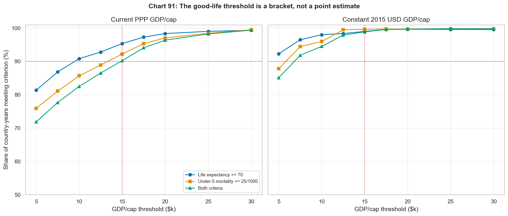
*The \$15k reference is descriptive. Outcome-income associations depend on the metric, sample, and price base; they do not identify the minimum expenditure needed to produce those outcomes.*

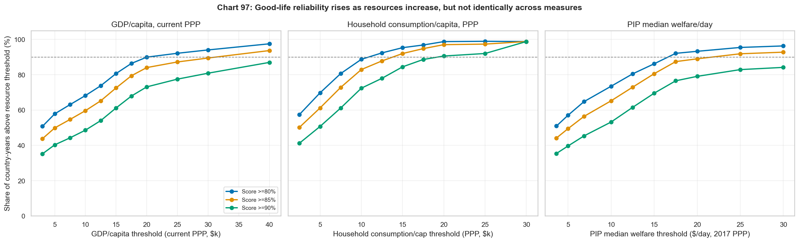
*The expanded bundle raises the bar. GDP/capita is the noisiest resource proxy; household consumption and PIP median welfare give a more concrete measure of ordinary living standards.*

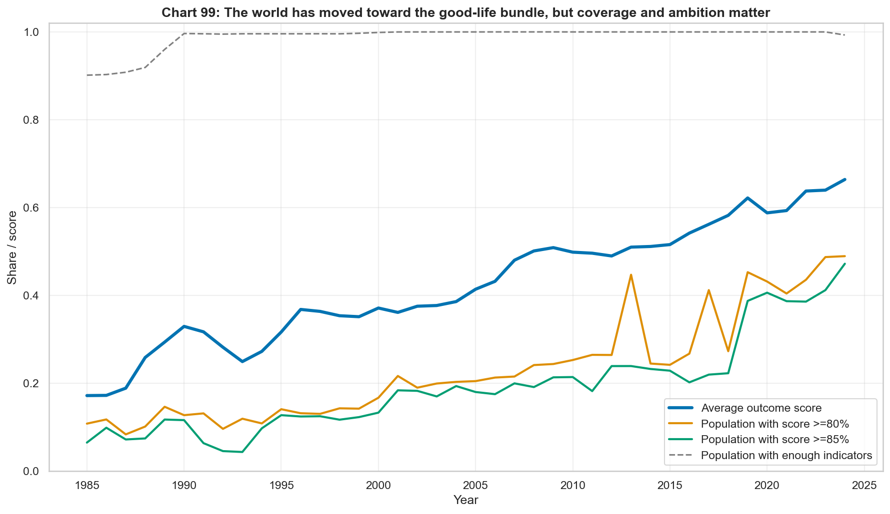
*The available-indicator series suggests improvement, with about half of covered population in countries scoring at least 80% and about 40% reaching 90%. Country-years qualify with as few as 8 of 19 indicators: changing indicator and population coverage can move the score, so this is not a fixed-bundle global trend.*

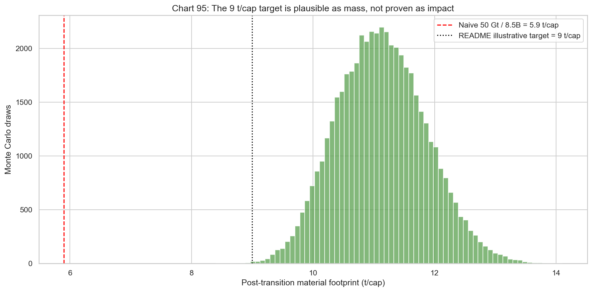
*A ~9 t/cap post-transition mass target is possible only under optimistic category assumptions; the unresolved question is whether a 10-12 t/cap footprint with radically different composition is ecologically acceptable.*

---

## The Debate

Two papers were presented as evidence that capitalism cannot solve poverty within ecological limits. Paper 1 explicitly argues the system is "mathematically unworkable"; Paper 2 is more methodologically careful, concluding that empirical data alone cannot settle the systemic question.

**Paper 1 — "Growth Alone Cannot End Poverty"** makes three interlocking arguments:

- *Arithmetic*: Between 1990–2008, every \$100 of per capita growth contributed only \$0.60 to poverty reduction below \$1/day — a 166:1 inefficiency ratio [[1]](#references-and-sources). The poorest 60% received just 5% of new income. Growth elasticity of poverty collapses at higher thresholds (from –2.0 at \$1.90/day to near zero at \$6.85), meaning growth increasingly bypasses the poor as ambition rises.
- *Provisioning*: The world already extracts ~100 Gt of materials per year — enough to meet basic needs for 8.5 billion people several times over. The problem is allocation, not production capacity. Hickel & Sullivan (2024) estimate decent living standards require roughly 28–40 Gt/yr of materials and ~175 EJ of energy — well within current extraction. GDP growth is the wrong tool because capital flows toward profitable returns, not essential needs.
- *Ecological*: Material extraction is already 2× the sustainable limit (~50 Gt/yr) [[19]](#references-and-sources). A synthesis of 835 peer-reviewed studies (Haberl et al. 2020) found absolute decoupling of GDP from material use "rare" and never observed at global scale [[18]](#references-and-sources). Even countries with absolute CO₂ decoupling would need 220+ years at achieved rates to cut emissions 95%, overshooting fair-share carbon budgets by 27×. The remaining 1.5°C carbon budget is exhausted in 6–10 years at current emissions.
- *Institutional update*: In June 2025, the World Bank itself revised its poverty lines upward using 2021 PPPs, setting the new extreme threshold at \$3.00/day (from \$2.15) and the upper-middle-income line at \$8.30/day (from \$6.85). Under the new \$3.00 line, 838 million people were in extreme poverty in 2022 — 125 million more than previously estimated. The Bank also introduced a "Prosperity Gap" benchmarked at \$25/day, finding that global incomes would need to increase roughly 5-fold on average to reach this standard, and 12-fold in Sub-Saharan Africa. Paper 1 reads this revision as the Bank itself conceding that growth-only approaches are insufficient.

The paper's strongest claim is not the 175× GDP headline. Stated broadly—"a system that allocates by profitability rather than need"—it overreaches, because for many goods whose returns are appropriable, competitive profit signals can align with productive investment where rents and externalities are contained. Its defensible and still-powerful core is narrower: a system that allocates by *private* profitability will predictably under-deliver goods whose returns are non-excludable or long-horizon—public health, basic education, and ecological restraint—because private and social returns diverge. That is a market-failure argument, and historically it holds. The [provisioning section](#testing-the-provisioning-argument-directly) tests this narrower claim.

**Paper 2 — "Measuring Global Poverty"** is the more methodologically rigorous of the two, and its real contribution is showing how measurement choices shape the narrative:

- *Threshold sensitivity*: At \$2.15/day, both rates and absolute numbers fell dramatically. At \$6.85/day, the rate fell (67% → 47%) but absolute numbers barely moved — ~3.5 billion for three decades. The poverty line you choose determines whether you see triumph or stagnation.
- *PPP and BNPL uncertainty*: The alternative Basic Needs Poverty Line methodology avoids PPP conversions by comparing incomes to local prices of essentials, finding more modest progress (only 6 percentage points of decline, 1980–2011, with absolute numbers *rising*). But BNPL has its own fatal flaw: under socialist price controls with severe shortages, low nominal prices produce artificially low poverty counts despite actual scarcity — making pre-reform China look implausibly good.
- *Non-income confirmation*: Independent welfare indicators (life expectancy +7 years, child mortality –59%, literacy 76% → 87%, caloric supply +400–600 kcal) confirm real material improvement that cannot be dismissed as a PPP artifact.
- *China's outsized not determinative role*: China drove ~75% of extreme poverty reduction, but excluding China entirely still shows poverty rates falling from 33% to 12% (1990–2025). Both camps overstate what China proves: growth-pessimists use it to minimize global progress; growth-optimists credit "capitalism" when China used heterodox state-directed development.

It concludes that *"whether this requires systemic transformation or continued growth is not a question empirical methodology alone can answer"* — and that measurement itself is political: the \$1.90 line makes the world look like a success story; the \$7.40 line makes it look catastrophic; both describe the same underlying reality.

Paper 2's measured framing is sound. The primary contention is with Paper 1's leap from "growth alone is insufficient," which is well supported, to "capitalism is mathematically unworkable," which is not. Paper 1's provisioning and system-dynamics arguments nevertheless deserve more serious engagement than most growth-optimist responses give them.

---

## A note on terms: capitalism, growth, and development

Before adjudicating the debate, three categories need clarifying, because the disagreement partly dissolves or sharpens depending on which definitions are in use.

**Capitalism.** Here, "capitalism" means roughly "market economies with private ownership of productive assets." Paper 1 and the heterodox tradition it draws on (Brenner, Ellen Meiksins Wood, Hickel & Sullivan in *Monthly Review*) use a narrower technical definition: an economy characterized by *generalized market dependence*, *capital accumulation as a systemic imperative*, and *separation of direct producers from the means of production*. On that definition, pre-reform China was not capitalist; post-reform China is. Nordic social democracy is capitalism with a large redistributive state, and the East Asian developmental states are capitalism with heterodox macro governance. This matters because "historical command economies failed" approaches a tautology under the strict definition: few non-capitalist modern economies have been tested at scale since World War II. The Varieties-of-Capitalism literature distinguishes liberal-market, coordinated-market, and state-permeated systems with different distributional and ecological records. The finding that market economies with strong states have delivered broad-based growth refers to the coordinated and state-permeated variants, not specifically to the Anglo-American liberal-market model that dominates global rule-setting.

**Growth.** GDP growth is an outcome, not a welfare measure or an institution. The growth-imperative literature asks whether debt, competition, accumulation, and fiscal arrangements create systemic pressure for continued expansion [[44]](#references-and-sources). This is contested rather than an established impossibility theorem. Separately, relative decoupling means falling resource intensity per unit GDP; absolute decoupling means falling total resource use while GDP rises. Per-capita declines do not necessarily imply falling totals, and territorial DMC is not a consumption-based material footprint. Historical trends must be compared on consistent measures and periods before they can support claims about either institutional model.

**Development and measurement.** The quantitative apparatus used here—GDP per capita, WDI indicators, poverty lines, and planetary-boundary budgets—embeds specific commitments: that monetary aggregates proxy welfare, that nations are the natural unit of analysis, that "the economy" is separable from society and ecology, and that welfare thresholds can be numerically specified. Several decades of development anthropology argue that "development" as an epistemic regime converts political questions into technical ones and renders legible only what can be counted. The poverty/affluence framing also fits uneasily onto subsistence, commoning, and gift-exchange economies. This critique has merit. Global statistics are used because they exist at scale and because their findings on child mortality, literacy, nutrition, and life expectancy describe something real, but the numbers should be read with their blind spots visible.

**How to read the welfare metrics.** The good-life threshold is an *outcome-reliability floor*, not a complete theory of flourishing. It asks when severe measurable deprivations become uncommon; it does not decide what makes a life meaningful, chosen, dignified, or culturally intact.

- **What the metric sees:** life expectancy, child survival, safe childbirth, nutrition, water, sanitation, electricity, clean cooking, schooling, safety, air quality, household consumption, and PIP median welfare.
- **What it misses on the upside:** commons access (grazing, forage, fuelwood, fisheries, water), gift exchange, reciprocity and mutual-insurance networks, unpaid care, kinship, ritual life, land attachment, autonomy, and diversified subsistence options. Where those institutions are intact, measured income and consumption can understate welfare.
- **What it misses on the downside:** commodification of previously free provisioning, alienation, land loss, coercive migration, debt dependency, cultural destruction, and loss of political autonomy. A country can score well on the outcome bundle while producing harms the bundle does not price.
- **How it should be used:** diagnostically, not as a moral aggregator. If two development paths produce similar gains in survival, schooling, services, and consumption, the path that preserves more autonomy and does less social damage is better. If there is a trade-off, the metric should expose it rather than pretend to resolve it.
- **What data could add:** Cantril life satisfaction, Gallup social support and perceived freedom, World Values Survey trust and agency items, V-Dem and Freedom House political measures, land-tenure and conflict datasets, and DHS/MICS/LSMS/IPUMS/PIP subgroup data. These can become companion diagnostics for subjective wellbeing, agency, subgroup exclusion, and provisioning-mode harms; they should not be collapsed uncritically into the same score.

The anthropological critique therefore has real merit but should be aimed precisely. It is a serious critique of calling any quantitative bundle "the good life." It is not a strong critique of measuring whether preventable child death, undernutrition, unsafe water, lack of sanitation, illiteracy, indoor air pollution, and extreme material insecurity have become uncommon. Below the floor, large-scale flourishing is predictably constrained; above it, people may or may not have lives they would choose, for reasons the metric only partly sees.

*Commons are an institutional option, not a universal winner.* Ostrom (1990), Cox, Arnold & Villamayor-Tomás (2010), and Porter-Bolland et al. (2012) document conditions under which community resource governance can work [[27b]](#references-and-sources). Clear rights, monitoring, participation, conflict resolution, and support from wider institutions matter. These studies do not establish universal superiority over public or private provision, nor a global percentage-of-GDP welfare gain. Commons, cooperatives, public services, and markets can coexist; their relative performance depends on the resource and institutional setting.

These institutional and measurement limits do not alter the arithmetic below, but they do constrain its interpretation.

---

## Where the Papers Are Right

### Growth alone is too slow and too blunt

The 1988–2008 Lakner–Milanovic result—5% of the global income increment accruing to the poorest 60% of the *global* distribution—is evidence about one global period, not a production function linking GDP growth to poverty reduction. Comparable PIP survey pairs test the closer within-country claim. Among 247 positive-welfare-growth spells starting since 1990, each country's bottom 60% captured 33.2% of the aggregate increment on an increment-weighted basis (95% country-cluster bootstrap interval 29.8–37.2%); the median spell was 32.6%, and 8.9% of spells were below 5%. The result is similar for income surveys (33.9%) and consumption surveys (35.5%). Since 2010 the weighted share was 38.1% and the median 41.1%. These figures are still distributionally unequal relative to a 60% population share, but they are not “single-digit pass-through.”

This does not establish that growth alone is sufficient. The calculation conditions on positive survey-welfare growth, measures household income or consumption rather than GDP, and says nothing about ecological feasibility or speed at high thresholds. It establishes a narrower point: global distribution across countries and people is not the same estimand as incidence within a growing country.

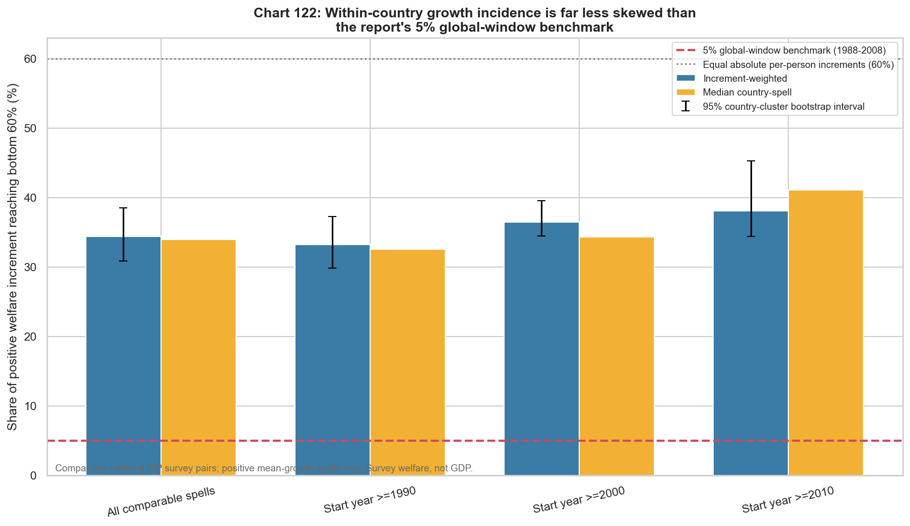
*Comparable PIP survey spells show much higher within-country bottom-60 capture than the 5% global-window benchmark. The 60% line represents equal absolute per-person increments. Under proportional, distribution-neutral growth, capture instead equals the group's initial welfare share, which need not be 60%.*

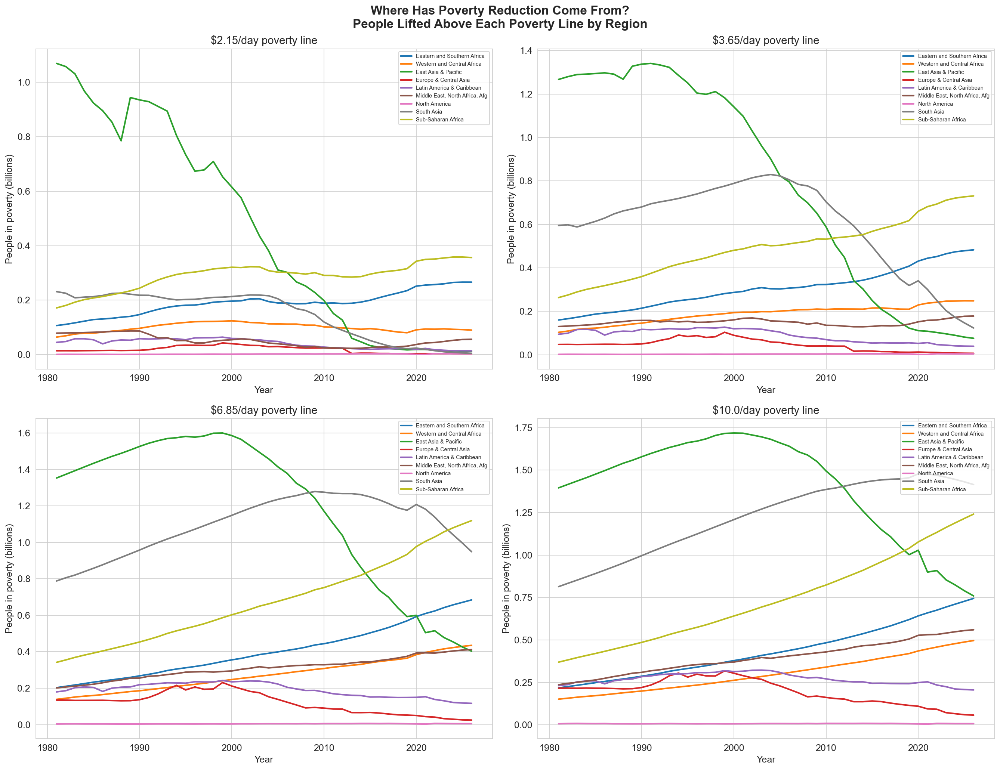
*At \$2.15/day, East Asia's dramatic decline dominates the global story. At \$6.85/day, South Asia and Sub-Saharan Africa remain largely unchanged. The "declining poverty" narrative is essentially an East Asian story at higher thresholds.*

### Transfers hit the poverty gap more directly

For immediate monetary-gap closure, a targeted transfer is direct by construction, while aggregate growth has variable and usually unequal incidence. Delivery rates depend on the program, targeting, and cost definition; a single cents-per-dollar figure is not a universal transfer-efficiency estimate. Nor should it be divided by a growth-incidence share: the denominators measure different things. Transfers can also improve nutrition, investment, and risk-sharing, while growth can change jobs and the tax base. The right comparison is not “transfers or growth,” but their costs, distribution, and welfare effects in context [[15]](#references-and-sources).

### Sub-Saharan Africa is being left behind

SSA's share of global extreme poverty rose from 13% to 65% while the absolute number of poor people nearly doubled. This is the most serious ongoing development failure, and no amount of global-average optimism erases it.

### Planetary boundaries are real

The ecological critique does not depend on every proposed threshold being exact. [Richardson et al. (2023), Table 1 and boundary-specific results](https://doi.org/10.1126/sciadv.adh2458) assess **six of nine boundaries as transgressed**. The table below uses that framework and its reported assessment values throughout, rather than combining dates and definitions. It is a 2023 literature summary, not a new measurement or an assertion of present-day status.

| Boundary | Control variable and boundary in Richardson (2023) | Reported assessment/status |
|---|---|---|
| Climate change | Atmospheric CO₂ ≤350 ppm; anthropogenic radiative forcing ≤+1 W/m² relative to 1750 | 417 ppm; +2.91 W/m². **Transgressed** |
| Biosphere integrity | Extinction rate <10 extinctions per million species-years; human appropriation of net primary production (HANPP) <10% of preindustrial Holocene NPP | >100 extinctions per million species-years; ~30% HANPP. **Transgressed** |
| Biogeochemical flows (N **and** P: one boundary) | Industrial + intentional biological N fixation applied to agriculture: 62 Tg N/yr. P: 11 Tg P/yr from freshwater to ocean; regional component 6.2 Tg P/yr from fertilizer to erodible soils | N ~190 Tg/yr (~3.1× boundary); P ~22 Tg/yr to ocean and ~17.5 Tg/yr fertilizer application. **Both components transgressed** |
| Land-system change | Forest cover relative to potential Holocene forest area; biome boundaries 85% boreal, 50% temperate, 85% tropical | **Transgressed**; global and biome-level forest losses cannot be represented by a single percentage of all land |
| Freshwater change | Area experiencing streamflow (blue water) and root-zone soil-moisture (green water) deviations from preindustrial variability; boundaries ~10% and ~11% of global ice-free land | ~18% blue and ~16% green. **Both components transgressed** |
| Novel entities | Zero release of untested synthetic chemicals; safety-assessment and monitoring criterion | **Transgressed**; global magnitude not quantified |
| Atmospheric aerosol loading | Annual mean interhemispheric difference in aerosol optical depth (AOD): 0.1 | ~0.076. **Not globally transgressed**, but regional exceedances and harms occur |
| Ocean acidification | Surface-ocean aragonite saturation ≥80% of preindustrial level (~2.75 Ω) | ~2.8 Ω (~81%). **Close to boundary**, not globally transgressed in this assessment |
| Stratospheric ozone depletion | Ozone concentration ≥276 Dobson units | ~284 DU globally. **Within global boundary**, with recovery and seasonal Antarctic depletion |

**Accounting matters.** The Living Planet Index (LPI) summarizes monitored vertebrate-population trends; it is neither the extinction-rate variable nor HANPP and cannot be substituted for either. Freshwater change replaces the former 4,000 km³/yr global blue-water-use boundary with water-cycle deviation measures. The nitrogen control variable includes **intentional biological as well as industrial fixation**, not just synthetic fertilizer. Its 62 Tg value was already used in Steffen et al. (2015), not introduced in 2023. On the earlier report's mismatched 150 Tg baseline, 150/35 is 4.3 and 150/62 is 2.4—not the previously stated 3.4 and 1.9. Those comparisons are superseded here by the internally consistent ~190/62 ≈ 3.1 assessment.

**Interpretive limits.** These are precautionary Earth-system risk boundaries, not exact tipping points, universally safe local pollution limits, or ratios of ecological damage. Their uncertainty, regional variation, and interactions matter. The aggregate 50 Gt material target discussed elsewhere is not part of these nine boundaries. The [corrected scorecard](charts/31_planetary_scorecard.png) reproduces the dated nine-process classification; the [nitrogen graphic](charts/94_nitrogen_uncertainty.png) now displays a withdrawal notice rather than invalid modeled compliance.

### Progress depends on which poverty line you use

At \$2.15/day, the world has achieved extraordinary progress — from 1.9 billion (36%) in 1990 to 0.45 billion (5.7%) in 2024. At \$6.85/day, 3.14 billion people remain below the line, with only modest improvement in absolute numbers. The papers are right to insist on higher thresholds.

**The optimistic case is a conjunction, but its probability is not identified.** None of the five global endpoints has a validated observed-frequency forecast calibration. More fundamentally, the nitrogen input in the former joint calculations was not a boundary-compliance measure. The previous Fréchet ranges, independence products, copula outputs and information rankings are therefore withdrawn. Correct probability mathematics cannot repair a misdefined event. A compatible total-N budget and evidence on restoration remain important research needs, without a quantified ranking of their information value.

**Joint sensitivity changes the question from “which single assumption matters?” to “which assumptions and interactions control the result?”** A 4,096-base-draw Sobol pick-freeze design jointly varies 26 transfer, infrastructure, and food parameters over declared stress ranges. In the transfer model, growth and bottom-60 capture dominate the 2050 top-up; growth, administrative delivery, and discounting dominate present value. In infrastructure, initial and target stocks dominate virgin demand while virgin-material energy intensity dominates process energy. In food, diet change dominates land, nitrogen efficiency and waste dominate synthetic N, and waste plus irrigation efficiency dominate water pressure. These are rankings within assumed models and ranges, not causal policy rankings. Synthetic-N crossings of 62 or 44 Tg are withdrawn from the main conclusions: the models omit part of the total-fixation control variable, so even a low synthetic-N result cannot demonstrate global boundary compliance.

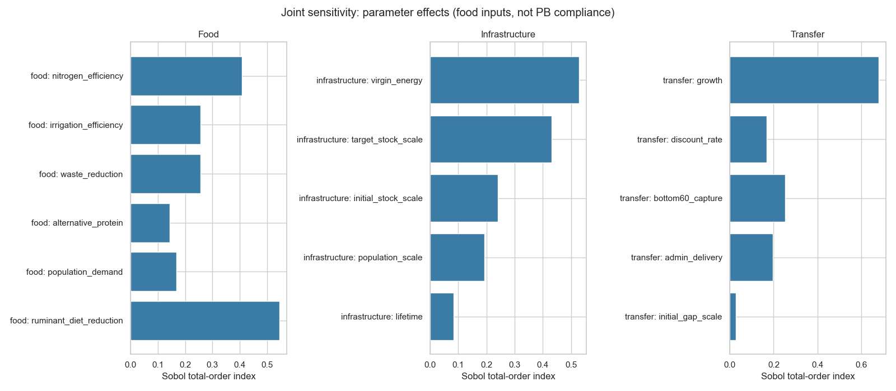
*Total-order Sobol indices include each parameter’s interactions. Dominant levers differ by system, so no single technological or institutional parameter controls the joint problem.*

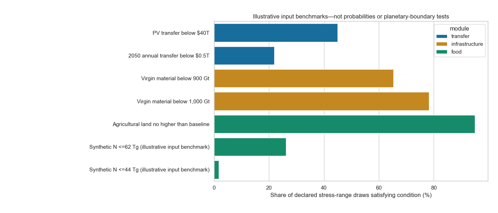
*Threshold frequencies report sensitivity over declared stress ranges, not forecasts or confidence levels. Nitrogen labels now explicitly identify illustrative synthetic-input benchmarks—not total-fixation boundary compliance.*

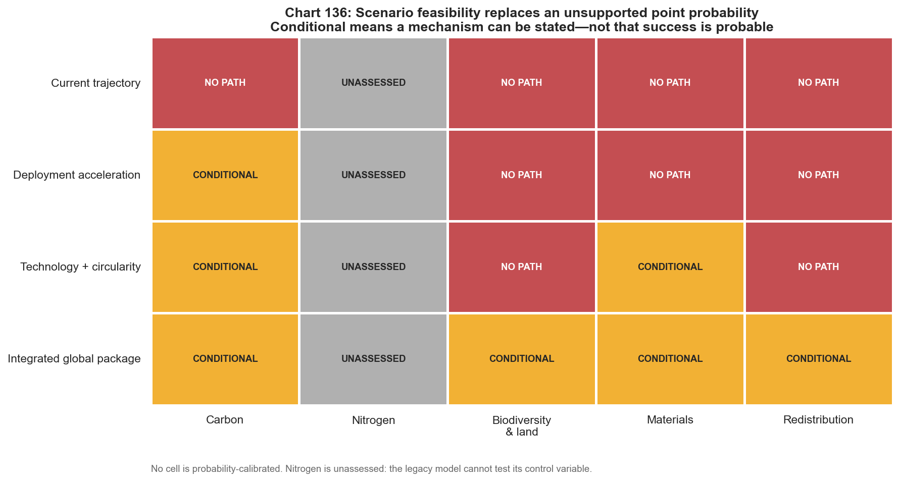
*None of the five conditions has a calibrated global-endpoint probability. This exploratory matrix does not certify feasibility: nitrogen requires a complete fixation budget, and land release is not observed restoration.*

---

## The Poverty Arithmetic: What Growth Actually Changed

The papers frame growth and redistribution as alternatives. The accounting and wider literature suggest they can be complements: productivity growth can expand resources, while transfers can improve nutrition, schooling, investment, and risk-taking. This report's scenario comparison does not identify those feedbacks or prove a cost-dominant strategy.

A dynamic model based on the latest post-2010 PIP distributions for 163 countries compares permanent transfers, inclusive survey-welfare growth, and growth plus annual top-ups through 2050. Under the central assumptions—2.5% annual welfare growth, 35% bottom-60 capture, 83.3% net transfer delivery, and a 3% discount rate—the present value of targeted outlays is \$62.2T for permanent transfers and \$39.3T for the mixed strategy. The mixed path lowers annual top-ups from \$3.38T to \$0.87T by 2050; growth alone leaves 15.6% of covered people below \$6.85/day. The model does not price the investment, energy, or material requirements behind growth, so the lower transfer bill is not a claim that the mixed strategy has lower total social cost.

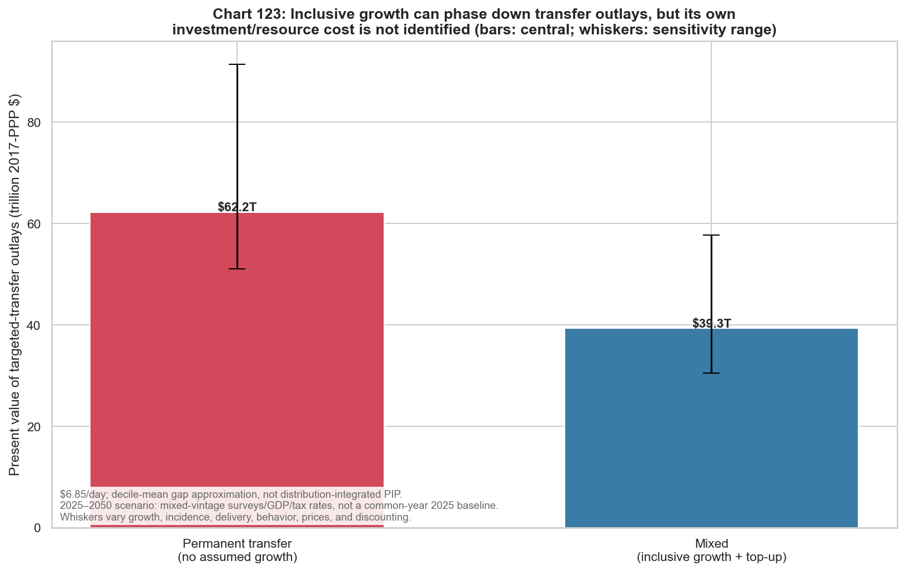
*Growth plus top-ups phases down transfer outlays in the scenario model, but the productive and ecological costs required to generate growth are outside the monetized comparison.*

**Unit and horizon:** the dynamic amounts above are **2017-PPP welfare dollars over 2025–2050**, not nominal donor-budget dollars or an infinite-horizon present value. “Permanent transfers” names the modeled recurring strategy; the simulation ends in 2050. Country-specific price conversion, financing capacity and complete social costs remain separate calculations.

Growth incidence also resists a simple institutional rule. In 192 comparable spells with at least 1% annual survey-welfare growth, median bottom-60 capture is 33.2%. Initial inequality, sector shares, tax revenue, and basic-service coverage have unstable or imprecise adjusted associations; faster measured welfare growth is associated with a lower capture ratio, partly because capture is itself a ratio with a changing denominator. Verified pooled commodity-dependence, labor-transformation, and institutional-quality variables were unavailable. The result is heterogeneity, not a causal recipe for inclusive growth.

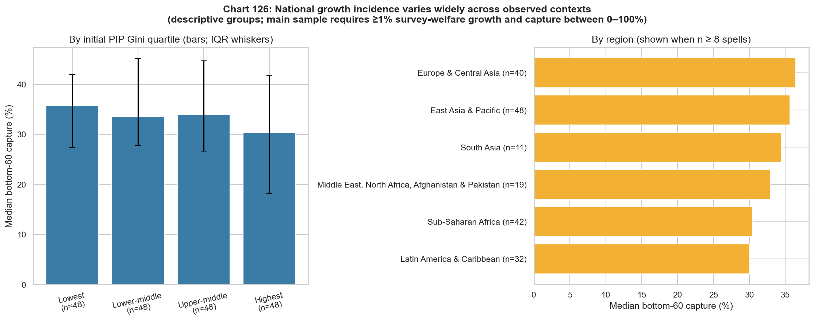
*Regional and inequality-group differences are descriptive. Sample rules and ratio instability preclude interpreting them as causal institutional effects.*

### Poverty gaps fell relative to output — not necessarily relative to collectable revenue

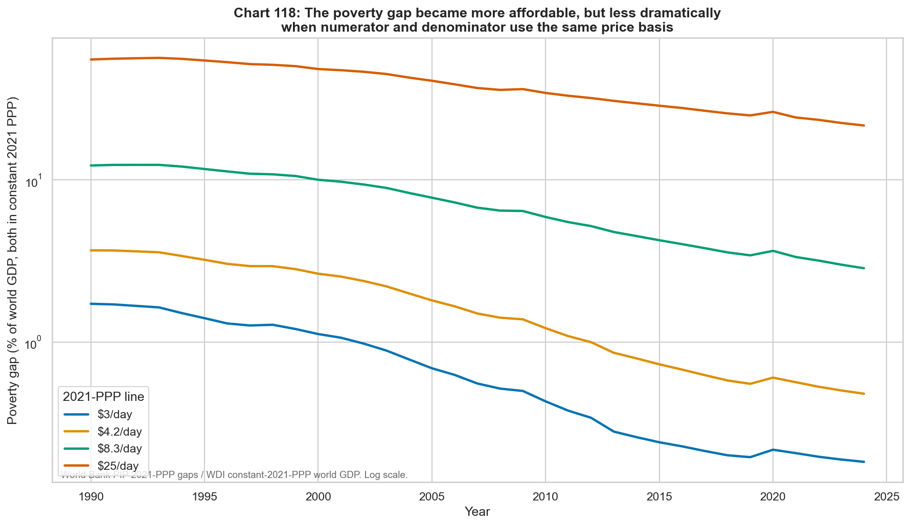
*Poverty gaps and world GDP are both expressed in constant 2021-PPP dollars, making the ratio comparable through time.*

| Poverty Line | People Below | Gap (2017 PPP) | Nominal Cost | ×3 Overhead | % World GDP |
|---|---|---|---|---|---|
| \$2.15/day | 0.45B | \$118B | ~\$41B | ~\$122B | 0.12% |
| \$3.65/day | 1.21B | \$560B | ~\$179B | ~\$538B | 0.51% |
| \$6.85/day | 3.14B | \$3,132B | ~\$965B | ~\$2,895B | 2.76% |

The consistent-price trajectory is less dramatic but still substantial. At the 2021-PPP \$8.30/day line, the gap fell from 12.25% of world GDP in 1990 to 2.85% in 2024. Its absolute value fell from \$7.31T to \$4.96T; a log decomposition attributes 26.5% of the relative decline to that contraction and 73.5% to growth of the denominator. At \$3/day the gap fell from 1.72% to 0.18%. At \$25/day, however, the absolute gap rose from \$32.9T to \$37.7T even as its GDP share fell from 55.2% to 21.6%. Growth clearly expanded capacity relative to the shortfall, but “the gap became cheaper” should not be confused with “the shortfall disappeared.”

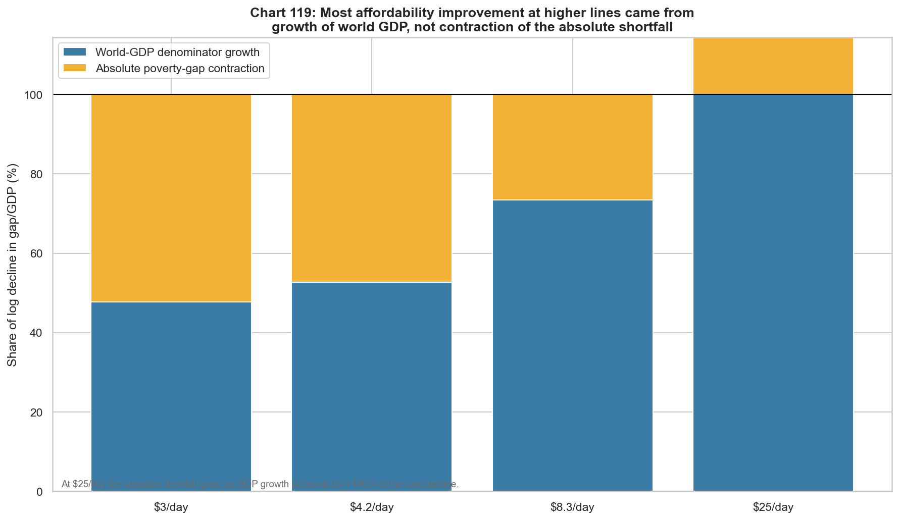
*At higher lines, most of the decline in gap/GDP comes from world-GDP growth; at \$25/day the absolute gap increased.*

**Note on units:** Poverty gaps in this legacy table are in 2017 PPP dollars. “Nominal cost” uses an approximate country price-level conversion (GDP nominal ÷ GDP PPP), weighted by poverty share; it is not an observed program bill or household-specific conversion. GDP price levels can differ from poor households' consumption prices, and exchange rates, imports, local supply, and inflation affect delivery. Nominal transfer estimates must be compared with nominal fiscal resources, not directly with PPP GDP. See [analysis/ppp_nominal_conversion.py](analysis/ppp_nominal_conversion.py).

**Affordability in 2021 PPP.** Under the World Bank's 2021-PPP poverty lines (~\$3.00, \$4.20, and \$8.30/day), the nominal-converted delivery cost is compared with nominal world GDP so that numerator and denominator use the same basis. Closing the gap costs **0.11% of world GDP at the \$3.00 line (0.32% at a 3× delivery-overhead assumption), 0.27% at \$4.20 (0.80% at 3×), and 1.49% at \$8.30 (4.46% at 3×).** The \$25/day good-life line is deliberately *not* in this affordability table—at that level the exercise stops being a poverty-gap transfer and becomes a question of global income *convergence*, which the within/between decomposition below addresses directly.

**Within-country vs between-country: the gap changes character as the line rises.** In the report's covered household-survey distribution, equalizing each country's welfare to its survey mean decomposes the shortfall into a removable within-country component and a residual between-country component. At \$3.65/day about **77%** is within-country; at \$6.85 the split is roughly even; at \$25/day about **89%** is between-country. The reported global above-line surplus is roughly **100×** the low-line gap but only **0.7×** the \$25 gap. These are ratios within the modeled **survey income/consumption pool**, not world GDP or all transferable wealth. Surveys miss some top incomes and differ from national accounts; an aggregate surplus also says nothing about each country's fiscal access to it. The result does not prove that redistribution of current world output is infeasible, or that national redistribution alone is administratively and politically sufficient at a low line.

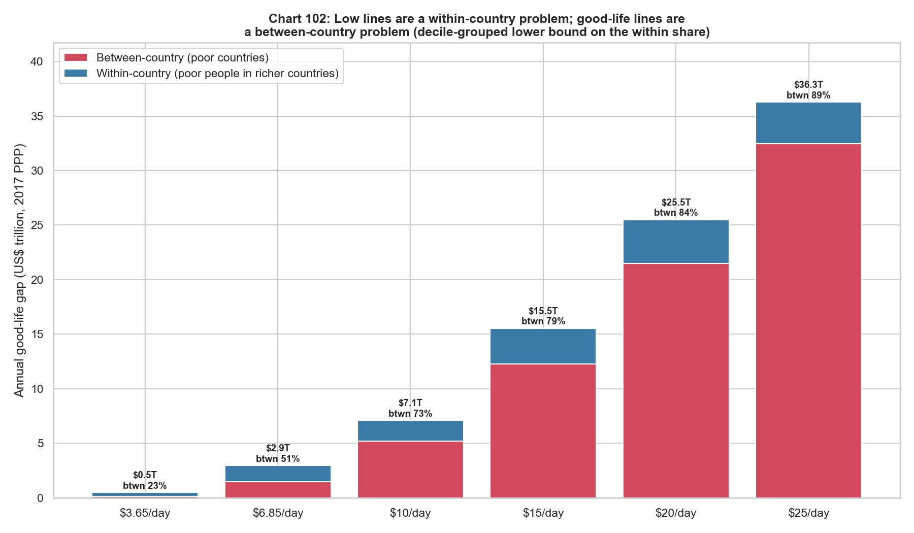
*In the covered survey-welfare pool, higher lines leave a larger residual after equalizing national survey means. This is not an accounting of world output, a tax-capacity estimate, or a test of all provisioning alternatives.*

**Recurring transfers are a finite but persistent fiscal commitment.** A dynamic model with population growth, a price-feedback term, and Monte Carlo macro shocks finds that the \$6.85 line requires sustaining an average of **~0.67% of world GDP per year** (denominator-sensitivity range 0.58–0.77%). The present value of that stream is about **21× a single year's cost**, close to ordinary annuity arithmetic. Adverse supply-side price feedback raises the path under stress assumptions, while productive growth can reduce the required top-up over time.

### The target is basic welfare, not American consumption — but that raises hard questions

Universal American consumption is neither necessary nor a serious welfare target. The GDP per capita above which 91–95% of country-years achieve life expectancy of at least 70 is near **\$15,000 per capita (PPP)**, but this is only a lower-bound heuristic. For a 19-indicator bundle covering health, nutrition, water, sanitation, electricity, clean cooking, education, safety, and air quality, the reliable resource band is higher: roughly \$20k GDP/cap population-weighted and \$40k unweighted for 90% reliability on an 85% outcome score; \$12.5k–\$15k household consumption/cap; or \$15–\$25/day PIP median welfare.

These are **descriptive resource–outcome associations**, not causal income requirements, minimum provisioning costs, or a valuation of wellbeing. Country-years enter with at least **8 of 19 indicators**; the mix of indicators, covered countries, and population changes through time. A high country score also does not mean every resident meets the component standards. A fixed-bundle, stable-coverage comparison would be needed to isolate genuine outcome change from composition.

In 2024, the World Bank PIP world aggregate has 52.7% of humanity below \$10/day, 65.0% below \$15/day, 72.3% below \$20/day, and 77.2% below \$25/day. In the available-indicator outcome bundle, the latest covered population-weighted score is 0.67; about 49% of covered population lives in countries scoring at least 80%, 47% at least 85%, and 40% at least 90%. These indicate substantial remaining deprivation but do not establish a universal cost of eliminating it.

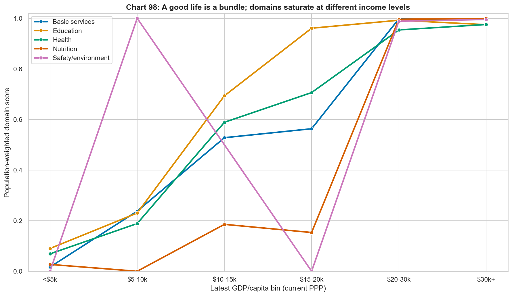
*The bundle is not one thing. Education, health, nutrition, clean services, and safety/environment outcomes saturate at different income levels, which is why a single GDP threshold overstates precision.*

The comparison raises a distributional question without identifying a universal income ceiling. GDP/capita is not household consumption. The report's US footprint snapshot of 22.7 t/cap is far above proposed 5–8 t/cap material targets, but those targets are not formal planetary-boundary control variables. Rich-country emissions and resource demands remain substantial; improving poorer populations' welfare is not a substitute for reducing those pressures.

**Do favorable outcomes coexist with low measured throughput?** The fitted 0.80 outcome-score crossing is roughly **18 t/cap on a log fit and 13 t/cap on a logistic fit**, above the illustrative 8 t/cap mass target in both specifications. **15 countries/economies**, including Sri Lanka and Colombia, meet a high score at or below that target and account for ~2.5% of the covered cross-section population. However, the available series is domestic material **consumption** (DMC), not the consumption-based raw-material footprint; imported products enter DMC at traded weight rather than including all upstream extraction. These cross sections demonstrate coexistence under particular measures, not longitudinal decoupling or verified welfare within all ecological boundaries. Outcome coverage and functional-form uncertainty further limit inference.

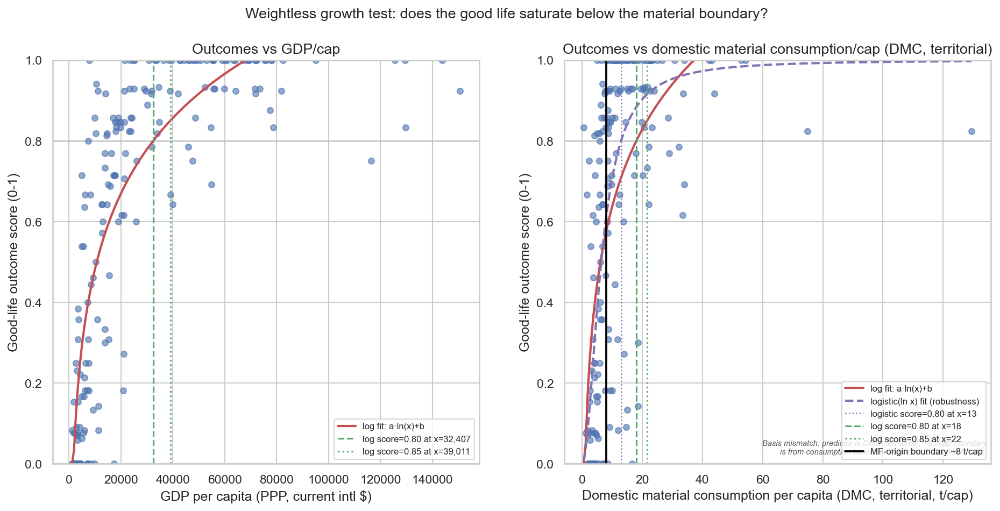
*Cross-sectional outcomes versus DMC, compared with an illustrative mass target—not a formal planetary boundary. Low-DMC/high-score cases do not prove consumption-footprint compliance or a globally scalable decoupling path.*

The normative aim is improved welfare with lower ecological damage, not universal American consumption or blanket restraint on poor populations. Redistribution, public provision, productivity, and lower-impact consumption can contribute. The descriptive thresholds do not identify a uniquely necessary GDP path, and a few favorable country examples do not establish a scalable global solution.

### Does the good-life score match people's own evaluations?

**A reproducible external check, not a new moral aggregate.** [Analysis 35](analysis/run_analysis_35.py) matches the cached OWID/World Happiness Report Cantril ladder to objective outcomes and resources. Cantril scores evaluate life as a whole; they are not daily emotional experience or clinical mental health. The ladder stays separate from the objective score.

The source's end-year labels are **three-year survey averages**, not independent annual observations. Each covariate uses exactly the same three years, with no missing-year interpolation. The latest window with at least 60 countries meeting the fixed-core coverage rule is **2018–2020**; more recent happiness data exist, but the complete outcome core does not. This window includes the beginning of COVID-19 and should not be assumed representative of every period.

| Check | Result | Interpretation |
|---|---|---|
| Fixed objective core versus life evaluation | **88 countries; Pearson r=0.74** | Favorable outcomes and self-reported lives covary, but high objective scores coexist with different life evaluations. |
| Coverage and weighting sensitivity, same 88 countries | Original available-indicator r=0.69; available-domain-balanced r=0.70; fixed-core r=0.74 | The relationship survives these alternatives. The fixed core is narrower, not a validated universal replacement. |
| Excluding China and India | **87 countries; r=0.74** | China is already absent from the complete-core sample; this exclusion removes India only, not two large observations. |
| Resource prediction, same 132 countries | Log-linear leave-one-country-out RMSE: **0.66 GDP**, **0.68 household consumption**, **0.60 PIP median welfare**, in ladder points | Median welfare predicts somewhat better in this sample. Quadratic-log alternatives give 0.64, 0.65 and 0.61; no causal superiority or satiation threshold is inferred. |
| Within-country real income | **131 countries, 393 non-overlapping-window observations**; a 10% higher real GDP/capita is associated with **+0.097 ladder points**, 95% interval **−0.029 to +0.223** | Country/year fixed effects and country-clustered uncertainty do not remove time-varying confounding. The estimate is imprecise and does not settle the Easterlin debate. |
| Wellbeing and consumption-based carbon | **80 complete countries**, three-dimensional sample frontier | Some combinations outperform others within the observed sample. Carbon alone does not establish ecological sufficiency or a scalable transition. |

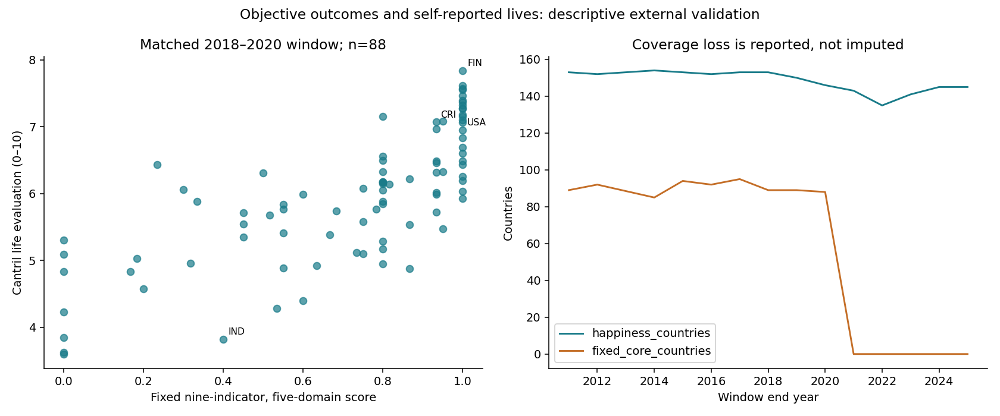
*The fixed core requires nine outcomes in all three years and equally weights health, services, education, nutrition and environment. Coverage falls to zero in later windows because the cached complete bundle is unavailable, not because welfare collapses.*

The fixed core preserves selected existing thresholds but omits several full-bundle outcomes, including maternal/neonatal health, vaccination, child anthropometrics and homicide. It is a sensitivity analysis with normative weights. The full outcome panel also contained **12 duplicated country-year keys** from complementary country-name aliases; the producer now coalesces compatible observations by code/year before scoring and rejects conflicting values. The published resource-threshold bands did not change after this repair.

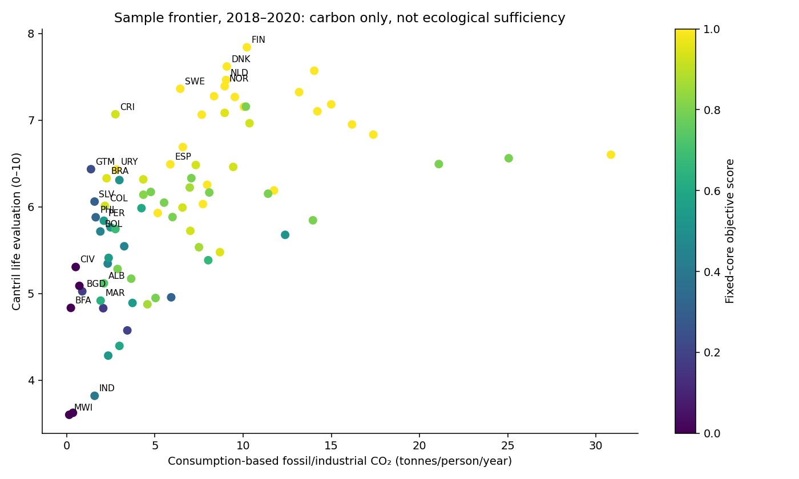
*Labels identify nondominated combinations of life evaluation, fixed-core outcomes and lower consumption CO₂, not “sustainable countries.” This carbon series excludes land-use change and other greenhouse gases. No happiness-per-tonne ratio is used.*

**Limits and next evidence.** Country means do not reveal wellbeing inequality, cultural response styles, adaptation or subgroup exclusion. Neither reported happiness nor favorable averages excuse deprivation or rights violations. The cached material-footprint series is world-only, so territorial DMC is not silently substituted for country footprints. Survey uncertainty and individual/subgroup data are unavailable in the cache; [WHR access terms](https://worldhappiness.report/data-sharing/) distinguish free mean/interval data from richer Gallup access. [Generated methods, results and input hashes](WELLBEING_VALIDATION.md) provide reproduction details. These are descriptive validation results, not a new poverty line or a full ecological-welfare model.

### A note on rich-world working-class stagnation

**Absolute living standards, relative position, and dissatisfaction are distinct.** Long-run gains in some consumption goods, health technologies, and real incomes can coexist with insecure work, expensive housing, poor public services, or declining income shares. Neither “universal immiseration” nor “everyone is better off on every meaningful dimension” follows from the available evidence. This is literature synthesis and interpretation of the existing wage series, not a new analysis of subjective wellbeing.

**The unit and period matter.** The existing US earnings comparisons distinguish education, gender, and race/ethnicity; the OECD comparison concerns *average* wages, not the median or bottom half. Worker earnings, equivalized disposable household income, consumption, and pre-tax national-income shares answer different questions. Changes in employment, hours, household composition, taxes, and transfers prevent treating any one series as a complete account of working-class welfare. National trajectories also differ substantially [[49]](#references-and-sources).

**Country cross sections do not settle long-run change.** Stevenson & Wolfers (2008, 2013) document positive income–subjective-wellbeing relationships and challenge strong claims of universal satiation. A cross-sectional association between richer countries and higher wellbeing, however, does not by itself refute the temporal Easterlin hypothesis about how wellbeing changes as a country's income grows. Time horizons, survey comparability, institutions, and distribution must be examined separately [[60]](#references-and-sources).

**Emotional wellbeing is not life evaluation.** [Killingsworth, Kahneman & Mellers (2023)](https://doi.org/10.1073/pnas.2208661120) reanalyze experience-sampling data: average emotional wellbeing rises with **log income**, with flattening concentrated in an unhappy minority rather than across the whole sample. This is not a universal causal claim that an extra dollar makes everyone happier, nor evidence of equal gains per dollar at high incomes. Evaluations of life as a whole and moment-to-moment feelings need not share the same relationship with income.

**Political dissatisfaction has multiple plausible causes.** Material insecurity, relative losses, local job displacement, inflation, public-service quality, identity, trust, and media environments can interact. Studies of partisan polarization or social-media exposure do not identify their share of an international dissatisfaction trend. Youth mental-health trends cannot establish that economic conditions are irrelevant, and national wage averages cannot establish that dissatisfied voters' concerns are merely mistaken perceptions.

**The policy implication is distribution-sensitive transition design, not a diagnosis of voters.** Ecological policies and international assistance need durable consent alongside material effectiveness. Compensation for concentrated losses, reliable services, participation, and credible implementation may help; this report does not rank their causal importance. Claims about rich-world dissatisfaction should therefore remain country-, cohort-, and period-specific rather than serve as a verdict on an entire economic system.

### Testing the provisioning argument directly

Paper 1's strongest version is not "175× GDP." It is that decent lives require specific material inputs — housing, nutrition, healthcare, sanitation, education, energy — and the world already extracts enough material (~100 Gt/yr) to provide these several times over. The problem, on this view, is not insufficient production but misallocation: capital flows toward profitable returns rather than essential needs, so the poor lack what already exists in aggregate.

**What "profitability rather than need" actually means.** The slogan conflates two distinct axes. The first is *consumption vs. investment* — an intertemporal choice (eat the corn now or plant it). The second is *allocation by price signal vs. by assessed need* — a coordination choice (let prices route capital, or have a planner direct it). "Profitability vs. need" treats these as one axis; they are orthogonal, and untangling them is what makes the critique precise rather than sloganeering.

Two asymmetries follow. First, much of what the profit signal funds is *not* productive investment—rent extraction, regulatory arbitrage, and speculative real estate are routed by profitability yet build little. Second, and more important, much "need" spending *is* also high-return investment: early-childhood nutrition (commonly estimated in the low-double-digit benefit-cost range), vaccination, deworming, girls' education, and clean water/sanitation. These are *need* on the coordination axis but *investment* on the intertemporal axis. Markets under-fund many of them not because social returns are low, but because beneficiaries lack purchasing power, the returns spill over beyond whoever pays, and the payoffs arrive too late or too diffusely for private investors to capture. The same externality logic applies to fossil pricing and non-excludable climate public goods.

The distinction between consumption and investment is useful but porous. Transfers can finance nutrition, schooling, business assets, migration, or insurance against risks that suppress investment; whether they raise productivity is empirical, not settled by calling them “checks.” Public and private investment can also be misallocated. Only 43.6% of fixed high-investment events in this report meet the subsequent-convergence criterion, with intervals overlapping the comparison groups. The defensible synthesis is that private/social return gaps and allocation quality matter, not that transfers consume resources while growth creates them without cost.

The available data support a conditional rather than universal verdict:

**Where provisioning is right:**
- At \$2.15/day, the estimated gap (\$118B PPP, ~\$41B nominal under the report's conversion) is small relative to world output. This supports a large role for distribution, while local supply, prices, public services, and delivery capacity still matter.
- Global food availability and persistent hunger demonstrate that aggregate production alone is not enough. Access, affordability, conflict, nutrition, waste, and local production/storage constraints must be considered together [[34]](#references-and-sources).
- The Decent Living Standards (DLS) framework specifies material prerequisites rather than an income target [[33]](#references-and-sources). Related energy scenarios find that much lower global final-energy use could support basic provisioning under strong infrastructure, technology, and distribution assumptions [[52]](#references-and-sources); this is not proof of compliance with every ecological boundary.

**Where provisioning is incomplete:**
- DLS material/energy budgets and this report's outcome-income associations answer different questions. The latter **cannot be converted into a minimum material cost** or used to refute DLS by comparing dollar thresholds. A fair test would map common service standards, infrastructure, maintenance, labor, and ecological impacts rather than infer that observed higher spending was necessary.
- Provisioning can include hospitals, schools, infrastructure, and trained staff—not just consumables. Finance can support these capabilities, but delivering them requires time, skills, governance, and recurrent resources; transferring purchasing power alone does not guarantee supply.
- Sustaining welfare is a flow problem under either strategy. Transfers, maintenance, productive investment, and public services have recurring costs and potential productivity feedbacks. The present models do not estimate a complete social-cost comparison.

**Synthesis:** The provisioning critique usefully focuses attention on access and the composition of production. Higher welfare ambitions make durable service systems and productive capacity more important, but the report does not identify where allocation stops being binding or establish that further aggregate GDP growth is the uniquely necessary solution.

Paper 1 cites Hickel & Sullivan's estimate that DLS for 8.5 billion people requires 28–40 Gt of materials and ~175 EJ of energy. An illustrative post-transition material budget lands at roughly 50–55 Gt—above the DLS minimum but radically different in composition from today's 100 Gt. The gap is largely construction minerals for infrastructure maintenance, among the less ecologically damaging categories. Whether that gap matters depends on whether aggregate mass or boundary-specific impacts such as carbon, nitrogen, and land use are the binding constraint. The available evidence favors boundary-specific impacts, while the papers' framework gives greater weight to aggregate mass. This is a genuine point of disagreement rather than an empirical gap that more data can straightforwardly close.

The \$15k proxy is a GDP correlation rather than a direct material-needs calculation [[37]](#references-and-sources). The broader outcome bundle and the household-consumption and PIP-welfare measures narrow this gap but do not replace DLS material accounting. A rigorous provisioning comparison would map DLS material bundles to post-transition budgets category by category.

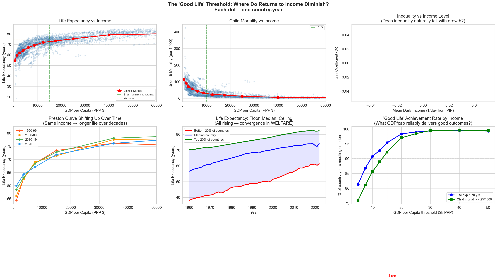
*This threshold chart is useful for the narrow claim that life expectancy has sharp diminishing returns. It should not be read as the full good-life threshold.*

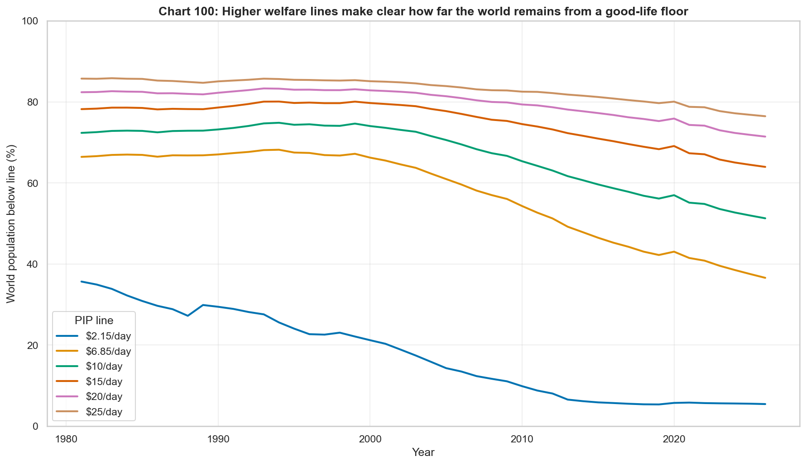
*Higher PIP lines show the scale of the remaining welfare gap. Extreme poverty has fallen dramatically, but most of humanity remains below \$15-\$25/day, the band associated with reliable achievement of the expanded outcome bundle.*

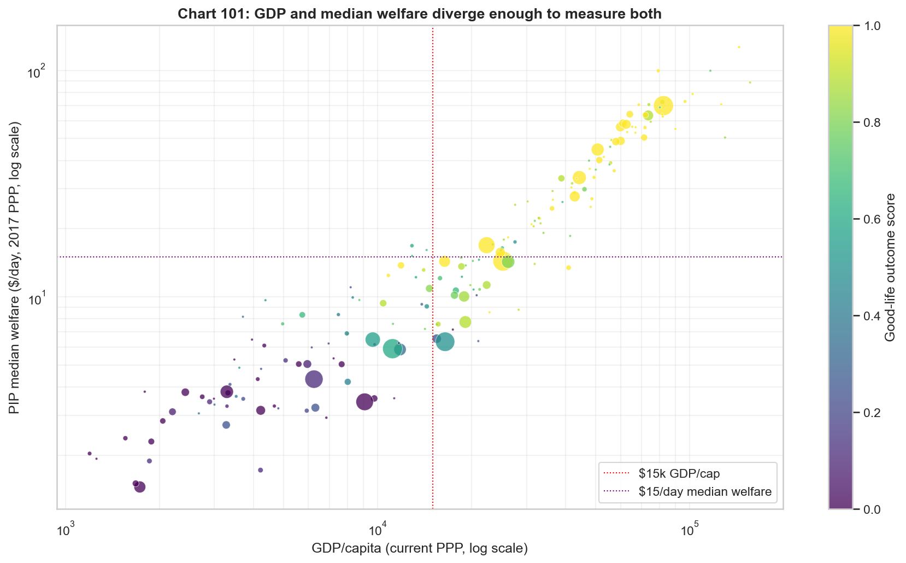
*GDP and median household welfare are correlated but not interchangeable. A good-life analysis should measure both national productive capacity and ordinary-person command over resources.*

### ODA and the extreme poverty gap converged

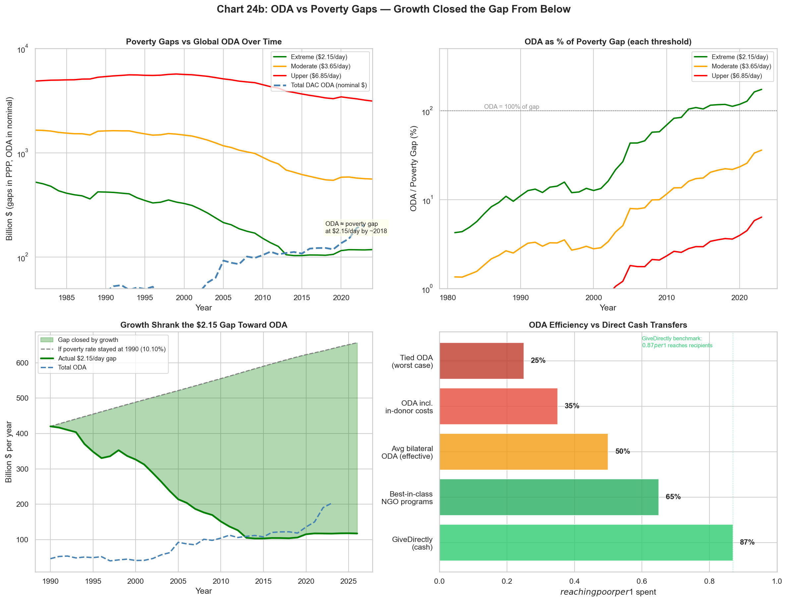
*The \$2.15/day poverty gap fell from ~\$420B to \$118B (2017 PPP) while ODA rose to \$203B (nominal USD). In comparable nominal terms, ODA exceeds the extreme-poverty delivery cost by roughly 5:1. At higher thresholds, ODA covers only a fraction of the gap. Growth brought the extreme-poverty mountain down to where aid could reach it.*

### Sovereignty and the enforcement gap

There is no global treasury with the compulsory taxing and spending authority of a national government. Domestic fiscal systems themselves vary in capacity, legitimacy, and distribution; international institutions depend on treaties, contributions, and national implementation. Cooperation can still finance public goods and transfers, but participation, recipient voice, avoidance, and the durability of commitments are constraints [[57]](#references-and-sources).

International aid is exposed to donor policy changes, while domestic tax and transfer systems also face legal and political constraints. Cross-border taxation need not require unanimity: source-based rules, information exchange, and coordinated national enforcement can limit avoidance. The effectiveness and durability of particular arrangements remain empirical and institutional questions, not consequences of the absence of a world government alone.

A proposed multi-trillion-dollar transfer program is not “arithmetically trivial” merely because world GDP is larger. Costs and denominators must use comparable units, and output is not collectable revenue: national tax capacity, existing spending, borrowing constraints, incidence, exchange rates, delivery, and consent matter. Streeck (2014) and Pistor (2019) raise broader questions about how legal and financial arrangements shape redistributive power. Whether those arrangements can sustain much larger international redistribution is unresolved.

### But the scale problem at higher thresholds is genuine — and the strongest proposals go beyond ODA

The papers discuss redistribution at a scale well beyond existing aid. However, PPP poverty gaps cannot be compared directly with nominal ODA, and published aid totals differ by year and coverage. Serious proposals also go beyond scaling up donor-budget aid. Their design questions include:

- **Financial transaction taxes:** revenue depends on the instrument base, rates, trading responses, residence/issuance rules, and enforcement; gross trading volume is not a fixed tax base [[10]](#references-and-sources).
- **SDR rechanneling:** reserve assets can support liquidity and concessional financing arrangements, but they are not automatically budget grants and can involve interest costs and institutional restrictions [[11]](#references-and-sources).
- **Minimum corporate taxation:** coordinated rules may reduce some profit shifting; which jurisdictions collect the revenue matters as much as the global total [[12]](#references-and-sources).
- **Carbon border adjustments:** revenue is not automatically earmarked for exporting countries or adaptation, and trade and distributional effects require assessment.
- **Wealth taxation:** proposals such as Zucman's billionaire minimum tax require valuation, anti-avoidance rules, and coordination; projected revenue is conditional on design and behavior [[13]](#references-and-sources).

These mechanisms cannot be added as though their revenues, country incidence, and uses were independent. Avoidance, valuation, liquidity, administration, and political participation are genuine constraints, but not proofs that every tax must fail without universal participation. Conversely, an estimated global revenue total does not establish a deliverable international transfer program. This report does not supply a validated combined revenue forecast or a maximum feasible transfer ceiling.

At low poverty lines, monetary scale is less daunting than at higher ones, but fiscal and delivery capacity must be established rather than inferred from a GDP ratio. Historical development successes support combinations of domestic investment, public services, trade, and external assistance; they do not identify the counterfactual performance of a much larger global redistribution program. Growth and expanded redistribution should be compared on consistent units, costs, institutions, and welfare outcomes.

---

## The Ecological Constraint

### Carbon: severe, with a plausible but unproven technological pathway

The carbon budget arithmetic is sobering.

| Growth Rate | Required decoupling for 1.5°C | For 2°C | For ~3°C |
|---|---|---|---|
| 0% growth | 12.5%/yr | 3.4%/yr | 0.0%/yr |
| **3% growth** | **15.0%/yr** | **6.3%/yr** | **1.8%/yr** |
| 5% growth | 16.7%/yr | 8.0%/yr | 3.7%/yr |

**Current best achieved: ~2.5–2.8%/yr (high-income countries, 2010–2020).**

These are illustrative constant-growth, constant-intensity-decline calculations using the report's assumed budgets, not temperature forecasts. Remaining budgets depend on their start date, probability, non-CO₂ forcing, and Earth-system feedbacks; an AR6 budget measured from 2020 cannot be treated as still fully available today. The comparison shows the scale of acceleration required under those assumptions, not that 1.5°C is physically impossible under every pathway or that a particular intensity trend uniquely implies 3°C.

Clean-energy deployment is an important source of potential emissions reduction. However, the historical solar series does not identify a future economy-wide decoupling rate. Transition minerals, grids, manufacturing, permitting, and fossil retirement must also be considered. Clean technologies replace continuing fuel extraction with equipment and supply chains that still have mining, water, labor, and land impacts. The [IEA's *Global Critical Minerals Outlook 2024*](https://www.iea.org/reports/global-critical-minerals-outlook-2024) distinguishes demand scenarios and supply risks; broad multipliers should not be transferred between scenarios or commodities. The just-transition literature emphasizes who bears those impacts and who participates in decisions [[53]](#references-and-sources).

**Cheap solar helps, but overbuild is not a reliability calculation.** Capacity in GW, generation in TWh, capacity factor, and coincident demand are different quantities. If nameplate capacity is twice average demand, output at 7–10% of nameplate supplies only 14–20% of average demand, not the previously claimed 60–90%. If “twice” instead means twice the capacity needed to balance annual energy, the implied nameplate capacity depends on the capacity factor; annual balance still cannot guarantee supply through a weather event. A credible system comparison needs chronological demand and weather, curtailment, storage power and duration, transmission constraints, firm capacity, and a stated reliability standard. Neither doubling a solar LCOE nor comparing standalone plant costs establishes a universal solar-plus-storage system cost [[38]](#references-and-sources).

**Won't demand just expand to consume the surplus?** This is Jevons paradox applied to the overbuild margin. The standard optimistic answer is that the loads which show up to consume cheap midday surplus — electrolyzers, data-center batch processing, EV charging, desalination, industrial heat storage — are inherently *flexible* demand that ramps down when power is scarce and prices spike, effectively becoming demand-side batteries. There is real truth to this, but the 2024–2026 experience with AI data-center load growth complicates the picture: utilities in Virginia, Georgia, and Texas have responded by extending coal-plant retirement dates, building new gas peakers, and pre-contracting the output of planned nuclear rather than by absorbing clean surplus. Data-center load has in several cases been neither flexible nor clean-displacing — it has directly *extended* fossil operation. The general principle ("new flexible loads can soak up surplus and accelerate displacement") is correct in principle but contingent on grid composition, interconnection queue timing, and utility business models; the 2020s experience shows it is not automatic. Jevons for fossils means more emissions; Jevons for solar *can* mean more fossil displacement, but only when the marginal supply is actually cleaner than what it replaces. The careful claim is that intermittency is more tractable than often portrayed, not that Jevons resolves itself.

**Storage is a portfolio, not a guaranteed cost curve.** Short-duration lithium-ion batteries and pumped hydro are established; flow batteries, thermal storage, and emerging multi-day chemistries serve different applications. Thermal storage supplying industrial heat is not equivalent to storage returning electricity. Low charging prices can help, but round-trip efficiency still determines required generation, charging power, land, equipment, and losses; “free” curtailed electricity is available only at particular times and places and has alternative uses. Learning curves and manufacturer targets do not establish future system costs or the residual quantity of firm generation needed. This report has no chronological dispatch or resource-adequacy model to resolve those quantities.

**HVDC transmission can reduce, not eliminate, geographic constraints.** Interconnection can share wind, solar, hydro, and firm generation across regions; operational links such as NordLink and Viking Link demonstrate the technology. Seasonal solar scarcity, correlated weather, converter and line losses, finite transfer capacity, outages, permitting, and cross-border security remain. Proposed links are not delivered capacity. High-latitude reliability therefore requires a portfolio assessment, not an assumption that imported sunshine removes the need for storage or firm supply.

**Three complementary technologies further strengthen the portfolio:**

- **Enhanced geothermal** could expand firm low-emissions generation beyond conventional hydrothermal resources. Demonstrations and planned projects support further development, but drilling cost, geology, reservoir performance, water, and induced seismicity constrain deployment. Conventional-geothermal LCOE ranges are not demonstrated enhanced-geothermal costs [[39]](#references-and-sources).
- **Nuclear fission** is an established low-life-cycle-emissions source of firm power. New-build costs and delivery records vary substantially by country, financing, and construction program; existing plants and new designs also have different economics. Neither universal cost superiority nor universal obsolescence follows from standalone LCOE comparisons. SMR learning benefits remain contingent on successful construction and repetition [[38]](#references-and-sources).
- **Fusion** remains a research and engineering option, not an available basis for near-term emissions commitments. Scientific milestones do not establish net-electric plant performance, maintainability, fuel supply, or commercial costs [[40]](#references-and-sources).

The energy transition is best understood as a portfolio with **three tiers of confidence**, and the techno-optimist case is strong for Tier 1, plausible for Tier 2, and genuinely contested for Tier 3:

- **Tier 1 (established commercial applications):** solar PV, onshore wind, short-duration Li-ion storage, HVDC interconnection, passenger EVs, building heat pumps, pumped hydro where geography permits, and conventional firm low-emissions generation. Commercial maturity does not mean universal cost advantage or sufficient deployment.
- **Tier 2 (moderate confidence, commercial and scaling but with residual cost gaps):** 8-hour Li-ion and flow batteries, industrial heat pumps (<200 °C), high-temperature industrial electrification (>400 °C via green hydrogen or electric arc) at 2–3× cost gap, long-haul battery/fuel-cell trucking, enhanced geothermal, offshore wind in mature markets. Pathways are demonstrated; the question is deployment speed and cost parity.
- **Tier 3 (contested, pre-commercial or target-only):** 24–100+hr long-duration storage (iron-air, novel chemistries) at published cost targets, sustainable aviation fuel (~0.2% of current aviation), green ammonia shipping, H₂-DRI green steel (<1% of current output), cement decarbonization (half of cement emissions are process CO₂ from calcination, which electrification does not touch), petrochemical feedstocks, fusion. Some Tier 3 pathway in each category will probably scale — the design space is broad — but treating manufacturer targets as achieved is a category error, and the carbon budget demands results within a window that current trajectories may not deliver.

The tiers are qualitative maturity judgments, not universal rankings or a complete portfolio. Several technologies can serve similar functions, while costs and deployment constraints differ by region. Demand reduction and efficiency are also options. The following charts provide selected deployment indicators; they do not jointly model grid reliability, costs, or a carbon-budget-compatible transition.

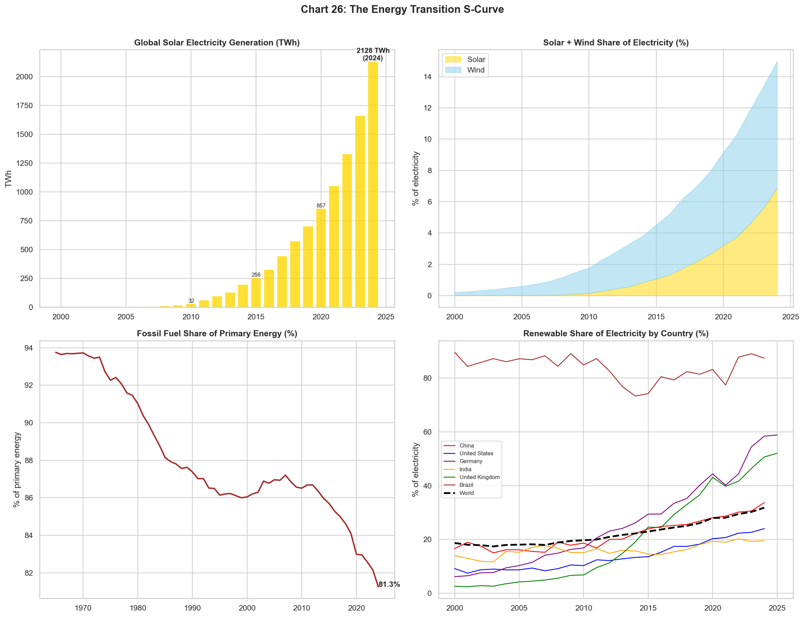
*The historical series shows rapid solar growth. Extending an exponential rate is not fitting a logistic S-curve; comparisons with today's electricity demand also hold the denominator fixed. Neither extrapolation establishes future market share, reliability, or emissions displacement.*

**Deployment vs. required trajectory.** The report's combined solar-and-wind series reaches ~4,600 TWh in 2024. Its illustrative 17% annual-growth extrapolation reaches ~12,000 TWh in 2030, below the ~16,400 TWh NZE waypoint used in the chart. These are generation comparisons, not temperature estimates. [IEA net-zero pathways](https://www.iea.org/reports/net-zero-roadmap-a-global-pathway-to-keep-the-15-0c-goal-in-reach) jointly specify demand, efficiency, fossil retirement, other clean supply, methane, and additional sectoral changes. Matching one renewable waypoint cannot establish that the world is on track for either 1.5°C or 2°C.

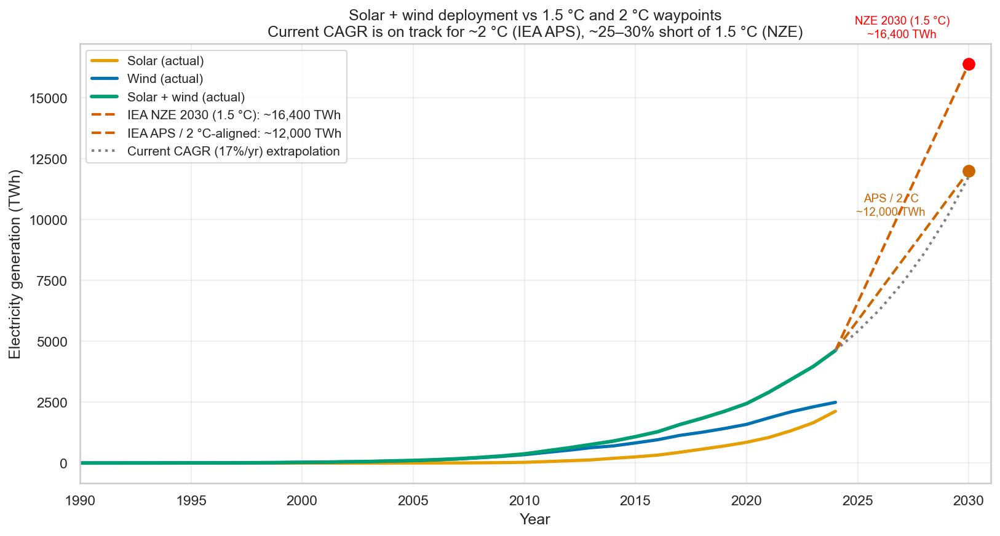
*Historical generation and a constant-growth extrapolation compared with the scenario waypoint used in the legacy chart. Any temperature-pathway interpretation of this one comparison is withdrawn: cumulative economy-wide emissions, not renewable generation alone, determine warming.*

**Electricity progress is not the whole energy transition.** The legacy chart places solar and wind at roughly 14% of electricity generation and fossil fuels at roughly 82% of primary energy in its 2024 snapshot. Electricity is only one part of final energy, and primary-energy conventions differ in how they account for non-combustible generation and conversion losses. Electrification can reduce measured energy requirements while supplying the same useful service. What matters for climate is absolute emissions and fossil displacement, not a renewable percentage in isolation; added clean supply can meet new demand without retiring fossil supply.

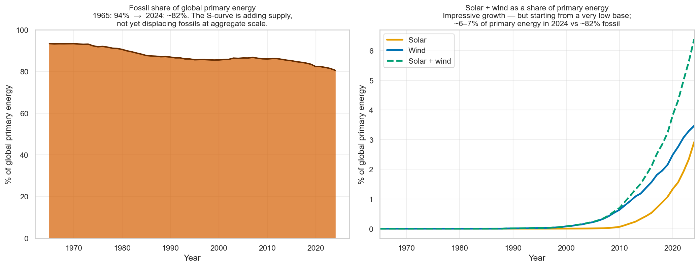
*Legacy primary-energy and electricity shares use different denominators. Their gap is not a direct measure of useful-energy dependence or the amount of final demand that must be replaced one-for-one.*

**Grid integration is the current binding constraint, not generation cost.** The US interconnection queue grew from ~600 GW in 2014 to ~3,450 GW at end-2024 — more than double the country's total installed generating capacity, with the overwhelming majority being solar, wind, and storage. Median time-in-queue has risen to ~5 years. LCOE comparisons implicitly price generation in isolation; they do not price the ~5-year wait to plug in, the transmission upgrades required, or the grid-service shortfalls that create curtailment. Large clean-generation additions *exist* on paper but are not *deploying* at the rate the LCOE numbers would predict.

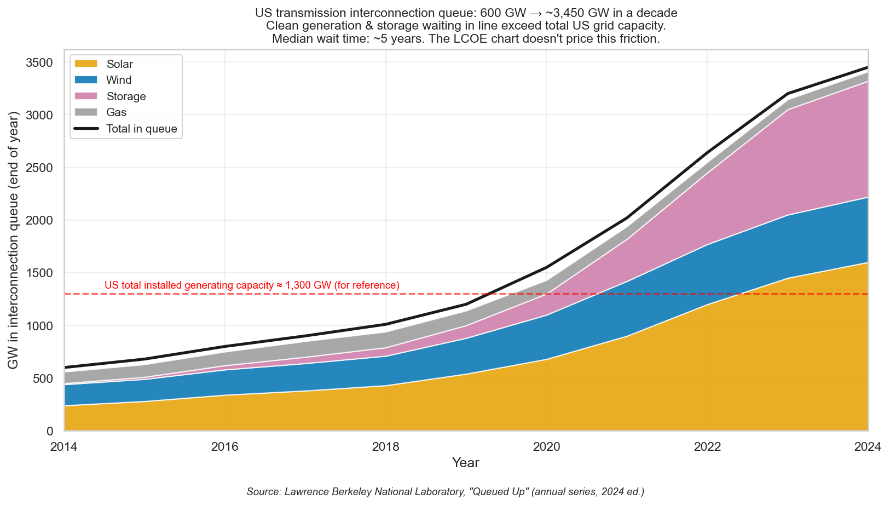
*The US grid has roughly 3,450 GW of generation and storage waiting to interconnect — nearly 3× total installed capacity. Clean technologies dominate the queue. The bottleneck is no longer project economics but transmission access, interconnection-study backlogs, and state-level siting permits. This friction is invisible in standard LCOE presentations.*

**Storage cost needs consistent units.** Chart 86 is withdrawn from the main comparison because it treats an iron-air capital-cost target in **\$/kWh of storage capacity** as though it were **\$/MWh of electricity discharged** (LCOS). Even converting kWh to MWh does not turn a capital-stock price into a levelized flow cost. LCOS requires capital and financing costs, operating life, cycling/utilization, charging prices, efficiency, maintenance, and replacement assumptions. No valid cross-technology LCOS ranking or residual-gas requirement follows from the current chart [[38]](#references-and-sources).

**Critical-mineral supply is a near-term bottleneck.** Copper is the most immediate concern: S&P Global's *Future of Copper* (2022) projects demand roughly doubling to ~50 Mt/yr by 2035 under a net-zero pathway, against announced mine capacity plus recycling of ~40 Mt — a ~10 Mt/yr gap, or ~20% of total demand. Lithium supply is less constrained in absolute terms (reserves are adequate for decades of NZE demand) but announced project pipelines cover only ~65% of IEA STEPS demand and ~40% of NZE demand by 2040. Mining is slow to expand (10–15 year lead times from discovery to first metal), and the social/environmental constraints identified in the "just transition" literature compress the available pool further. This is not a thesis-killer — the transition does not require any single mineral — but it is a pricing pressure not yet visible in LCOE curves, and it falls disproportionately on a small number of countries (Chile, DRC, Indonesia, China).

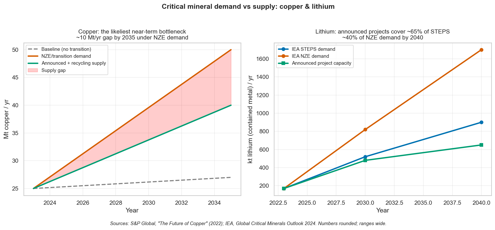
*Copper: ~10 Mt/yr gap by 2035 between announced supply and NZE demand. Lithium: announced projects cover ~65% of STEPS demand and ~40% of NZE demand by 2040. Neither is fatal to the transition, but both imply significant price pressure and concentration of geographic exposure.*

**Incumbent resistance, measured honestly.** IMF's headline figure (Parry, Black & Vernon 2023) for total fossil subsidies reached \$7.0T in 2022, but the composition matters and is frequently misrepresented. The *explicit* component — direct fiscal transfers to fossil producers or consumers — was ~\$1.3T in 2022 (spiking from ~\$500B pre-2022 when European governments capped consumer prices during the Russia-Ukraine energy emergency). The much larger *implicit* component (~\$5.7T) is the IMF's estimate of *uncharged externalities*: air-pollution health costs, climate damages, and foregone consumption taxation. It is not money being paid to fossil firms; it is damage those firms cause that is not priced. Against the ~\$1.8T of clean-energy investment in 2023 (IEA), two distinct facts matter: (a) clean-energy investment *exceeds* direct fossil subsidies by roughly 1.4×, which is progress on the fiscal-support front; (b) the \$5.7T implicit figure shows the scale of *damage that is not yet being priced*, which is a different — and arguably larger — policy problem. These are separate measurement categories and should not be collapsed into a single ratio.

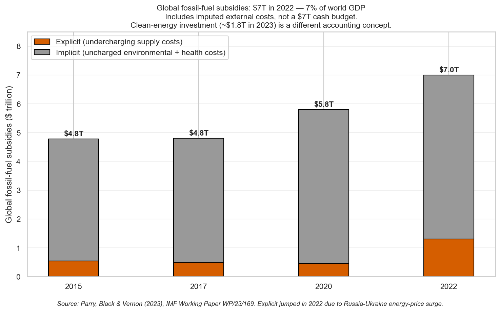
*Global fossil subsidies (IMF). The \$7.0T 2022 total splits into ~\$1.3T *explicit* (direct transfers, spiked by European 2022 price-cap emergency measures) and ~\$5.7T *implicit* (uncharged externalities — not money transferred to fossil firms, but damage they cause that is not priced). Clean-energy investment (~\$1.8T in 2023) now exceeds explicit fossil subsidies; the implicit number is a separate fact about what the price system is failing to charge for.*

**Where the deployment frontier actually is: China, not the US.** A US-centric framing misses the most important recent development — China is now dramatically ahead of the US on nearly every leading-edge electrification metric, and meaningfully ahead on industrial electrification. EV share of new car sales hit ~47% in China in 2024 vs ~10% in the US and ~21% in the EU. China produces ~80% of global solar modules, ~75% of global lithium-ion batteries (by cell capacity), and ~60% of global wind turbine components. On industrial electrification (the electricity share of industrial final energy consumption), China is at ~27%, roughly 6 points ahead of the US at ~21%, though behind the EU (~32%), Japan (~29%), and Korea (~42%). US climate policy debate often treats domestic politics as the binding constraint on the global transition; in practice, the global transition is now substantially driven by Chinese manufacturing scale and Chinese consumer adoption, with the US participating as an importer rather than a frontier.

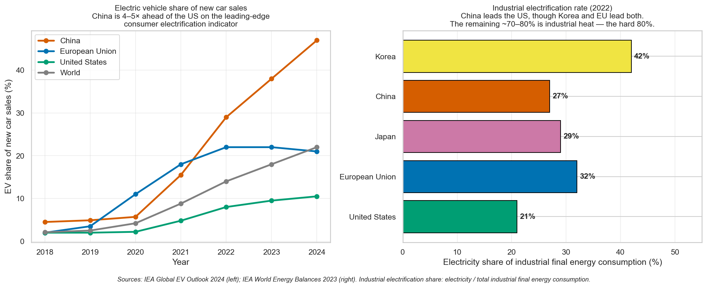
*Left: China is now 4–5× ahead of the US on EV share of new car sales. Right: on industrial electrification, China leads the US but both lag the EU, Japan, and particularly Korea. The US is not the frontier on either consumer or industrial electrification; framing the transition as "US-led" overstates where the deployment actually is.*

**Final energy, feedstocks, and process emissions are different accounts.** Electricity is an energy carrier used across buildings, industry, and transport, not a sector to add to them. An energy balance must also specify whether non-energy feedstock use is included. Cement calcination releases CO₂ through chemistry; those emissions are not an energy flow and cannot take a percentage share of final energy. Chart 90 and its normalized sector/tier shares are withdrawn: the source mapping and categories do not support a consistent additive balance.

The following **qualitative literature synthesis**, informed by the [IEA's sectoral transition assessments](https://www.iea.org/energy-system), replaces that percentage allocation. Rows are applications, not mutually exclusive energy shares, and maturity varies within each row.

| Application/account | Available pathways | Remaining constraints |
|---|---|---|
| Building energy | Insulation, heat pumps, efficient appliances, clean electricity | Retrofit costs, climate, building stock, peak demand, and grid capacity |
| Road-transport energy | Battery vehicles, public transport, modal shifts | Charging, vehicle turnover, heavy-duty duty cycles, affordability |
| Industrial heat and energy | Heat pumps, electric boilers/furnaces, efficiency; hydrogen in selected applications | Temperature and process requirements, electricity prices, infrastructure |
| Aviation and shipping energy | Efficiency, demand management, alternative fuels, electrification for limited routes | Fuel life-cycle emissions, sustainable feedstock supply, energy conversion losses, fleet turnover |
| Non-energy feedstocks and reducing agents | Material efficiency, reuse/recycling, alternative carbon sources, low-emissions hydrogen | Product chemistry, carbon sourcing, infrastructure and cost; separately defined in energy balances |
| Cement process emissions (**not energy**) | Less clinker, suitable alternative binders, material efficiency, carbon capture | Product standards, feedstock availability, capture/storage performance and deployment |

Electrification can reduce cement's combustion emissions but does not directly eliminate calcination emissions. More generally, commercial technologies can still face costly integration and slow turnover, while emerging options need evidence on operating performance rather than just demonstrations. There is no defensible “half solved / one-third scaling / remainder requires breakthroughs” percentage decomposition in the present analysis.

**Bottom line.** A carbon budget that requires all three tiers to decarbonize at global scale within 20 years sits at the edge of what current technology trajectories can deliver under favorable political conditions — and the political conditions are visibly worse than favorable. The pathway is defensible for Tier 1 and Tier 2; Tier 3 is where the portfolio is genuinely exposed, and where the next decade of engineering progress determines whether decarbonization of industry, aviation, shipping, and cement arrives in time to matter.

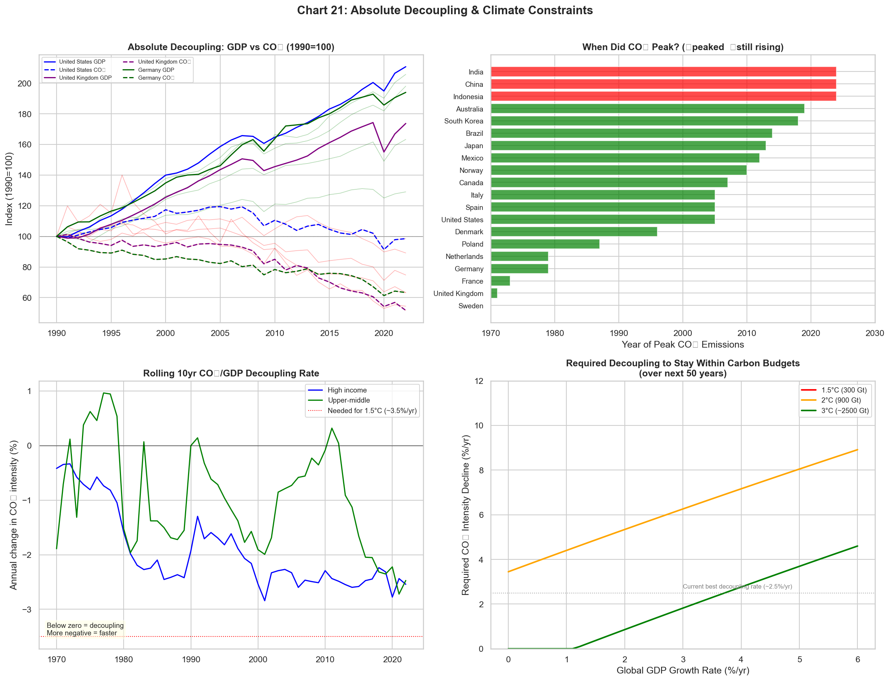
*Selected historical decoupling rates. Comparing them with assumed carbon-budget scenarios illustrates the scale of change required; it does not map a single observed rate to a temperature forecast.*

### The poor world's growth is not the problem — but climate is a development headwind

In the report's snapshot, countries below the illustrative \$15k GDP/capita cutoff account for about 20% of global CO₂ and 55% of population. The legacy fixed-emissions exercise highlights the large contribution of countries above that cutoff; its budget-exhaustion date uses dated assumptions and is not a current countdown. Production-based national emissions, historical responsibility, consumption footprints, and within-country inequality are different allocation questions.

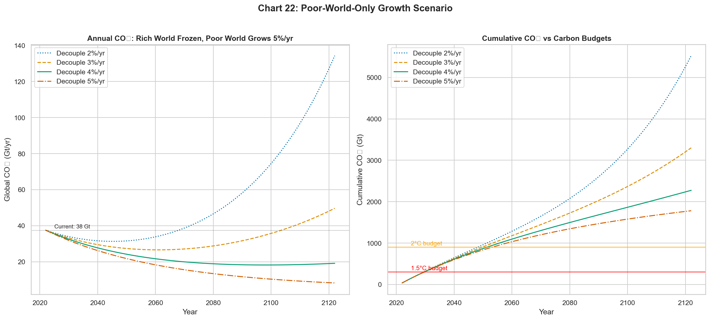
*An illustrative carbon-emissions allocation, not a result about all planetary boundaries. The cutoff is descriptive and masks substantial within-country variation.*

That framing measures countries' contribution to emissions, not their exposure to climate damage. **Source correction:** Kotz, Levermann & Wenz's 2024 *Nature* paper, *The economic commitment of climate change*, was **retracted on 3 December 2025** ([retraction notice](https://www.nature.com/articles/s41586-025-09726-0)). Its widely quoted 19% global-income loss by mid-century is withdrawn from this report's evidence base. The earlier claims of an established 0.5–1.5 percentage-point annual tropical-growth penalty and a general 10–20% developing-country GDP loss by 2050 were also not supported by a comparable, verified synthesis and are removed.

**Retraction does not imply negligible climate damages.** [IPCC AR6 Working Group II](https://www.ipcc.ch/report/ar6/wg2/) synthesizes evidence of adverse effects on health, food security, water, livelihoods, infrastructure, and ecosystems, with unequal exposure and adaptive capacity. Crop responses, heat-related labor losses, disasters, and interrupted education provide credible development channels. Their magnitudes depend on location, warming, adaptation, and the outcome measured; estimates from individual sectors or countries cannot simply be added into a universal annual GDP-growth penalty.

**Macroeconomic damage estimates remain model-sensitive.** Burke, Hsiang & Miguel (2015) and Kahn et al. (2021) study temperature and economic outcomes using different specifications. Whether effects are temporary, persist in income levels, or alter longer-run growth is central to cumulative projections; weather variation does not automatically identify the response to sustained climate change. Newell, Prest & Sexton (2021) document substantial specification uncertainty. This report estimates no new climate-damage function and does not replace the retracted result with a new point estimate [[54]](#references-and-sources).

**Adaptation finance is not a clean private/public percentage split.** Some cooling, resilient buildings, seeds, and water-efficiency investments can yield private returns. Early warning, public health, drainage, ecosystem protection, and resilience for households unable to pay often require public or concessional finance. The mix varies by place and project. A high *social* benefit-cost ratio does not demonstrate a bankable private cash flow; concessional finance may support both private and public provision. Loss and damage after adaptation limits is also distinct from adaptation investment. No evidence here supports the former 40–50%, 30–40%, and 15–25% allocation shares or a claim that adaptation can neutralize all losses.

For a dated financing benchmark, [UNEP's *Adaptation Gap Report 2023*](https://www.unep.org/resources/adaptation-gap-report-2023) reports modeled developing-country adaptation costs of **\$215B/year this decade**, versus **\$387B/year** to implement domestic adaptation priorities—different estimation approaches, not a statistical confidence interval. International public adaptation flows were **\$21B in 2021**. UNEP describes needs as 10–18 times those flows; the comparison is not a complete accounting of domestic and private spending or loss-and-damage needs.

The implication is to treat climate as an important, uneven development risk and to test growth scenarios against adverse conditions, without claiming a calibrated penalty this analysis cannot identify. Mitigation, adaptation, social protection, and recovery finance are complements. Responsibility for historical emissions and unequal capacity to respond remain important distributional questions independently of any disputed GDP-damage headline.

### Beyond carbon: harder problems with emerging solutions

Carbon gets the headlines, but the non-carbon boundaries are arguably more concerning — because they lack equivalent technological exits.

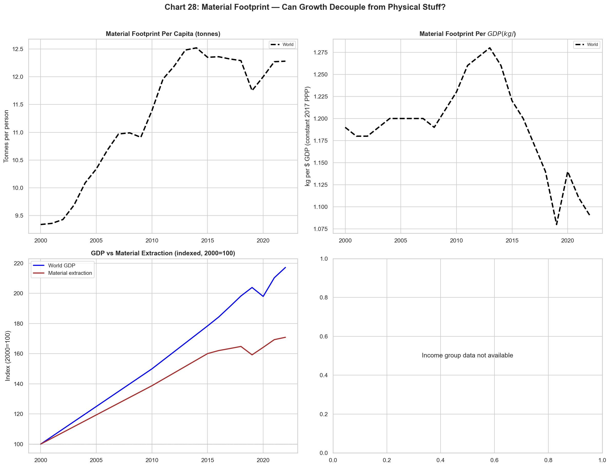
*Material intensity of GDP is declining at only 0.4%/yr — compared to 1.8%/yr for carbon. But see the discussion below on whether aggregate material tonnage is the right metric: a tonne of sand is not a tonne of burned coal.*

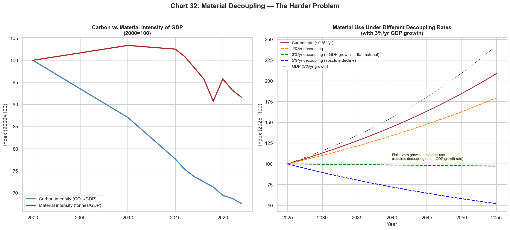
*The plotted intensity series show different trends. Replacing fossil combustion could reduce continuing fuel extraction, but complete elimination is a scenario assumption, not an observed outcome; equipment, feedstocks, and other material demands remain.*

The technology pathway analysis reveals a clear pattern, but with very different evidentiary status across boundaries:

**Tier 1 — Deployed and scaling (conclusions robust):**

| Boundary | Technology | Status |
|---|---|---|
| **Carbon** | Solar/wind generation | Commercial, substantial observed deployment; future growth uncertain |
| **Carbon** | EV adoption, heat pump deployment | Commercial, adoption varies by region |
| **Materials** | Industrial recycling (steel, aluminum) | Mature, economics improving with cheap energy |

**Tier 2 — Demonstrated but contingent on scaling (conclusions depend on continued progress):**

| Boundary | Technology | Status |
|---|---|---|
| **Freshwater** | Desalination | Commercial, but too expensive for agriculture at scale |
| **Nitrogen** | Precision agriculture, nitrification inhibitors | Commercial options to improve use efficiency or reduce particular losses; no total-fixation compliance estimate here |
| **Food/Land** | Precision fermentation (dairy proteins) | Commercial, scaling |
| **Phosphorus** | Waste-stream recovery, precision application | Proven, adoption limited |

**Tier 3 — Requires breakthroughs not yet achieved (conclusions speculative if these stall):**

| Boundary | Technology | Key Uncertainty |
|---|---|---|
| **Nitrogen** | Enhanced biological fixation associated with cereals | Research and some microbial products; replacing industrial fixation with intentional biological fixation does not automatically reduce the boundary variable |
| **Food/Land** | Cultivated meat at broadly competitive prices | Limited commercialization; claimed prototype costs do not establish sustained production cost or mass-market parity |
| **Carbon** | Direct air capture at gigatonne scale | Demonstrated at small scale; economics uncertain |
| **Biodiversity** | Habitat protection and restoration at scale | Land can be spared through diet, waste, and yield changes without cultivated meat; restoration still requires governance and secure rights |

These tiers organize technological maturity, not shares of ecological damage or probabilities of success. Clean power can reduce combustion emissions and support some agricultural processes; it does not itself resolve nutrient losses, habitat conversion, or freshwater-cycle change. Existing practices can reduce pressure without bioengineering breakthroughs, while emerging technologies may broaden the options. The current models cannot establish either that breakthroughs are necessary for nitrogen compliance or that the full technology stack would be sufficient.

### The implied policy differentiation

The ecological evidence points toward a differentiated strategy rather than a single global prescription. Rich countries—which produce 80% of CO₂ with 45% of the population—need rapid decarbonization and reduced material throughput. Poor countries still need substantial productivity growth to reach basic welfare thresholds, and that growth will have ecological costs. Both need far stronger ecological governance than currently exists. The question is not "growth or no growth" at the global level. It is whether institutions can deliver restraint where it is needed and development where it is needed, simultaneously and fast enough. Current institutional capacity suggests they cannot yet do so.

### Can everyone live well? What a good future requires

The analysis identifies large rich-country ecological pressures and substantial unmet welfare needs elsewhere. It does not identify a necessary GDP trajectory for every country. Changes in technology, demand, distribution, and institutions could improve that trade-off; the question is whether a joint pathway can deliver high welfare within ecological limits.

**Affordable clean energy expands the available options.** The recorded growth of solar is encouraging, but constant-rate extrapolation is not an identified S-curve. Future electricity demand changes, and primary-energy shares depend on accounting conventions and conversion efficiencies; reaching today's electricity total cannot be converted into a future primary-energy share. The opportunities below are conditional literature synthesis, not outputs of an integrated feasibility model:

| Boundary | What cheap clean energy unlocks | What remains hard | Tier |
|---|---|---|---|
| **Carbon** | Electrify suitable end uses; supply low-emissions fuels and carbon removal | Process emissions, system reliability, costs, and gigatonne-scale DAC | 1–3 by application |
| **Freshwater** | Lower energy costs for desalination and treatment | Brine, ecosystems, water transport, irrigation economics; desalination does not restore the full water cycle | 2 |
| **Nitrogen** | Precision control, nutrient recovery, some controlled-environment production | Total industrial + biological fixation, nutrient demand, losses, and local ecological limits; combustion NOx is a separate accounting channel | 1–3 by application |
| **Materials** | Lower processing costs for some recycling routes | Collection, sorting, contamination, losses, and growing stocks still require virgin inputs | 1–2 by application |
| **Food/Land** | Vertical farming, precision fermentation, cultured meat | Cultural adoption; transition timeline | 2 (fermentation) / 3 (cultured meat at parity) |
| **Biodiversity** | Less land pressure can create restoration opportunities | Protection, tenure, ecological suitability, restoration, and rebound; abandonment alone is not recovery | Varies |

**Food-system change has several routes.** Lower ruminant demand, less waste, context-appropriate yield gains, nutrient efficiency, and habitat protection can reduce land and nutrient pressure without cultivated meat. Fermentation and cultivated products may add options, but commercial scale, energy/feedstock needs, consumer uptake, and land-use rebound are uncertain. No comparative analysis here establishes food technology as the single largest or uniquely necessary intervention.

A regional food accounting check reduces reliance on that speculative lever. Trend demand raises modeled 2050 agricultural land from 4.79 to 5.87 billion hectares. A package limited to deployed or commercial measures—moderate yield gains, lower waste and ruminant demand, and nutrient and irrigation efficiency—reduces the requirement to 4.16 billion hectares and **synthetic** nitrogen from 106 to 74 Tg/year. A high-ambition package **without assumed breakthroughs** reaches 2.67 billion hectares and **45 Tg synthetic N/year**, but requires unusually broad adoption. These synthetic-N quantities are **not directly comparable with the 62 Tg global industrial-plus-intentional-biological-fixation boundary**, even when numerically below it. Sub-Saharan Africa still shows roughly 259 Mha of additional land pressure under the commercial-measures package. The model is regional rather than subnational; water is an area-weighted pressure index, phosphorus is fertilizer P₂O₅ rather than elemental-P leakage, and land spared in arithmetic is not automatically restored in reality.

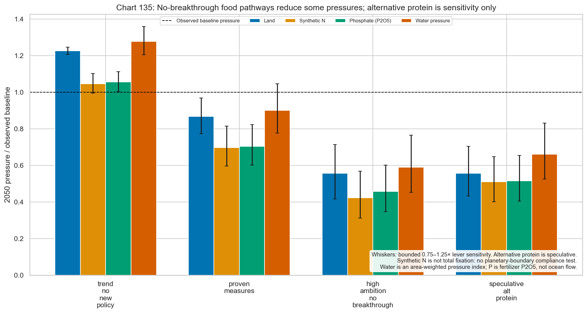
*Commercial measures reduce modeled global pressure, but regional constraints remain. Synthetic fertilizer, P₂O₅ application, agricultural area, and the water-pressure index are not the corresponding Richardson control variables; the chart is not a boundary-compliance test.*

**But does "material footprint" measure the right thing?** The optimistic technology scenario above still leaves a typical rich-country citizen at ~8–11 tonnes per capita (US at ~10.6) against a "sustainable" budget of ~5.9 (50 Gt ÷ 8.5 billion people). That sounds alarming — until you ask what the 50 Gt limit actually measures and where it comes from.

The ~50 Gt "safe" material extraction limit (UNEP International Resource Panel; Bringezu 2015, Hickel et al. 2022) [[19]](#references-and-sources) is far less rigorous than the carbon budget. The carbon budget rests on hard physics: CO₂ concentrations → radiative forcing → temperature, with a clear causal chain. The material budget is an aggregate mass estimate of ecosystem capacity to absorb extraction impacts — and it treats all tonnes as equal. A tonne of sand from a quarry and a tonne of rainforest cleared for soybeans count the same. They are obviously not the same.

Current global extraction (~100 Gt/yr) breaks down roughly as:

| Category | Gt/yr | Share | Ecological character |
|---|---|---|---|
| Construction minerals (sand, gravel, stone) | 44 | 44% | Quarries, mostly local. Among the *least* ecologically damaging per tonne |
| Biomass (crops, wood, fiber) | 24 | 24% | Agriculture and forestry. Primary driver of land, nitrogen, and phosphorus boundaries |
| Fossil fuels (coal, oil, gas) | 15 | 15% | *Burned and gone*. Drives the carbon boundary. Eliminated by solar/wind/nuclear |
| Metal ores | 10 | 10% | Mining. Concentrated ecological damage, but recyclable |
| Industrial minerals | 7 | 7% | Chemicals, fertilizer feedstocks |

After the energy and food transitions, the composition changes radically: fossil fuels (15 Gt) disappear entirely, agricultural biomass drops sharply, and metal ore extraction falls with circular-economy recycling. What remains is mostly construction minerals and recycled metals — ecologically far less damaging per tonne than what was removed. Whether ~55 Gt of mostly sand, gravel, and recycled steel is ecologically equivalent to today's 100 Gt (which includes burning fossil fuels and clearing forests) is not a question the aggregate metric can answer.

The stock-flow extension makes one missing constraint explicit: circularity arrives only after physical stocks exist long enough to be retired. Depending on whether infrastructure convergence is completed around 2040, 2050, or 2060, the modeled 2025–2050 build requires roughly 880–991 Gt of virgin material and 1,774–2,025 EJ of process energy, with annual virgin demand peaking near 40–55 Gt. In the central pathway, secondary material supplies about 47% of additions by 2050, but only about 30% in Sub-Saharan Africa versus 71% in Europe/Central Asia. Young, growing capital stocks cannot recycle scrap that does not yet exist. These are mass-balance scenarios built from assumed regional stocks and lifetimes, not observed inventories or damage-weighted footprints.

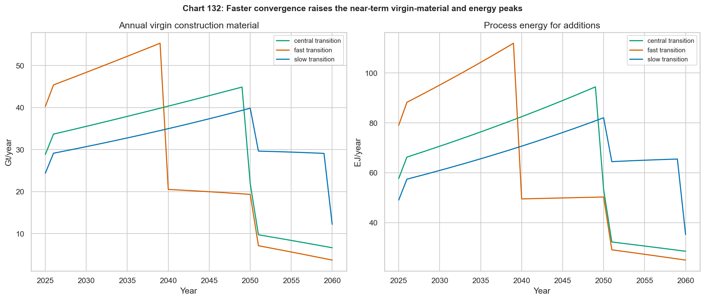
*Faster convergence raises the near-term extraction peak; recycling grows later as accumulated stocks begin to retire.*

This matters because aggregate material footprint carries substantial argumentative weight in both papers. Richardson's nitrogen assessment is ~190/62 ≈ 3.1 times the boundary, while biosphere integrity uses extinction rates and HANPP—not the LPI. These pressures remain serious despite measurement uncertainty. Aggregate tonnage cannot establish that a differently composed post-transition economy is either safe or unsafe; damage-weighted and geographically resolved accounting is needed.

One important distinction is between continuing fuel extraction and the materials embodied in durable equipment. Solar, wind, and nuclear have different lifetime material and fuel requirements from coal and oil, but comparisons depend on system boundaries, ore grades, equipment lifetime, capacity factors, and storage/transmission. A single mass ratio cannot establish relative ecological damage. Reduced fossil use is an opportunity to lower extraction, not evidence that all fossil material use or its replacement impacts disappear.

**What does a sustainable consumption target actually look like?** The aggregate material footprint obscures a crucial insight: different categories of consumption have vastly different ecological impacts. The US (22.7 t/cap) provides the worked example because it is the heaviest major rich-country footprint and therefore the most demanding case; European and Japanese footprints sit at ~12–18 t/cap, with correspondingly smaller gaps to close:

| Category | Current US | Sustainable Target | How |
|---|---|---|---|
| Fossil fuels | 5.5 t/cap | 0.0 | Solar/wind/nuclear |
| Construction | 7.5 | 4.0 | Dense urbanism (Japanese/European density) |
| Biomass/food | 4.0 | 2.0 | Precision ag + bioreactor protein + waste reduction |
| Metals | 3.0 | 1.5 | Circular economy, 90%+ recycling with cheap clean energy |
| Other/imports | 2.7 | 1.5 | Lighter manufactured goods, digital substitution |
| **TOTAL** | **22.7** | **9.0** | |

*Note: The sustainable targets above are illustrative estimates, not values sourced from peer-reviewed literature. They represent plausible post-transition figures given the technology pathways described but carry substantial uncertainty, particularly for biomass and metals, which depend on food-technology and circular-economy scaling. European and Japanese starting points are lower primarily because of denser urban form, smaller vehicle fleets, and less beef-heavy diets, so the qualitative pathway generalizes even though the arithmetic is tuned to the US case.*

The naive "sustainable budget" is 5.9 t/cap (50 Gt ÷ 8.5B). Weighting by ecological damage rather than mass would plausibly yield a higher effective budget for a post-transition economy because fossil fuels cause far more damage per tonne than construction minerals. Under broad category-level uncertainty, however, the median post-transition rich-country footprint is ~11.1 t/cap, and 9 t/cap appears only in the optimistic tail. The key unresolved question is therefore not just "how many tonnes?" but "which tonnes, extracted where, with what ecological damage?" No rigorous damage-weighting methodology is available here, so this remains a conceptual argument rather than a quantified metric. **Sustainable consumption is not only about less stuff. It is about different stuff, different methods, and damage-weighted accounting.**

**The crucial reframe: welfare can decouple from material throughput even when GDP doesn't fully.** Rich economies have already made large compositional shifts toward services — the US is ~82% services by value, Japan and the UK ~70%, Germany ~63%, with most of the OECD clustered between 60% and 80%. The marginal unit of rich-world welfare is increasingly weightless — streaming, telehealth, education, AI tools, social connection, creative work. Welfare growth may be far less materially intensive than past GDP growth: better health outcomes, richer experiences, more knowledge, and more creativity do not require proportionally more tonnes of stuff. Whether this constitutes fully "weightless" growth or merely *lighter* growth is an open empirical question — and the cross-country evidence is mixed: the UK, Germany, France, and Japan have achieved modest *absolute* decoupling of material footprint from GDP since ~2000, while the US plateau since 2007 is weaker decoupling. But a future of continued improvement in living standards — more abundance, more research, more exploration, more wonders — does not require proportionally more material extraction, especially once energy is cheap, clean, and abundant.

The transition therefore has several practical requirements, none guaranteed by falling energy prices:

- **Food and land:** the high-ambition, no-breakthrough scenario above already models substantial land sparing. Cultivated meat at price parity is **not required by that scenario**. Whether spared land becomes habitat depends on diet and yield assumptions, rebound, protection, finance, and ecological suitability; not all pasture should become forest.
- **Rights and livelihoods:** smallholders, pastoralists, Indigenous communities, and commercial producers face different incentives and constraints. Falling agricultural employment does not establish that every transition is voluntary or welfare-improving. Secure tenure, participation, alternative livelihoods, and safeguards against displacement matter; this report has no causal ranking of which constituency most impedes restoration [[58]](#references-and-sources).
- **Materials:** recycling can substantially reduce primary processing, but scrap availability, product lifetimes, quality, collection, and demand growth constrain it. Electric-arc furnaces can use scrap or primary iron; their presence alone does not establish a closed material loop. The stock-flow scenarios above explicitly retain large virgin requirements during infrastructure expansion.
- **Nitrogen:** lowering synthetic fertilizer use is not the same as lowering total intentional fixation. Cereals supplied through biological fixation still introduce new reactive N. Nitrification inhibitors can alter loss pathways without reducing initial fixation; denitrification acts downstream; combustion NOx reduction is not a deduction from agricultural intentional fixation. Adding these effects as independent reductions double-counts or mixes accounts. A valid pathway needs a complete N mass balance, regional losses, crop uptake, and interactions—not the legacy additive stack.
- **Welfare:** improvements in health, education, security, and leisure are valuable without proportional increases in throughput, but services and digital systems still use buildings, energy, equipment, and supply chains. Their resource requirements must be measured rather than assumed away.

These options support investigating a joint pathway, not assigning it a probability or claiming every component follows a demonstrated S-curve. Engineering feasibility, adoption, governance, ecological recovery, and distribution are separate questions.

**What about managed degrowth?** Serious degrowth proponents—Hickel, Kallis, and Raworth—do not propose an involuntary collapse. They propose selective contraction of ecologically destructive production in rich countries, including fossil fuels, fast fashion, planned obsolescence, SUVs, excessive aviation, and consumption-driving advertising, while *expanding* healthcare, education, public transit, housing, clean energy, and ecological restoration. Raworth's "doughnut economics" frames this as operating between a social foundation and an ecological ceiling. This is closer to a directed composition shift and overlaps substantially with the strategy implied by the evidence here.

The overlap is substantial: both approaches call for eliminating fossil fuels, shifting from land-intensive to precision agriculture, moving from linear to circular material flows, and measuring welfare through health and education rather than tonnes of consumption. The genuine disagreement is narrower than the rhetorical distance suggests. It concerns two questions:

1. **Whether markets can deliver selective contraction.** The degrowth position says no: an economy organized around private capital accumulation and GDP growth will predictably resist shrinking profitable sectors, even ecologically destructive ones. No rich-world market economy has yet demonstrated sustained reduction in aggregate material throughput to sustainable levels, and the political economy of incumbent retirement in coal, beef, and automobiles provides substantial supporting evidence. Technology-driven substitution could achieve compositional shift without aggregate contraction, but this depends on technology outpacing political lock-in and is not a proven outcome.

2. **Whether aggregate rich-world consumption must decline.** A composition-shift strategy calls for *different* consumption at roughly the same welfare level. Serious degrowth calls for *less* consumption of material goods, offset by more leisure, care work, and public services. The empirical question is whether post-transition economies can sustain high welfare around ~10–12 t/cap—with 9 t/cap as an optimistic case—without aggregate GDP contraction, or whether ecological limits require rich-world GDP to shrink. The services share of GDP has risen from 58% to 82% in the US since 1950, suggesting welfare growth can increasingly decouple from material throughput. Whether it will decouple fast enough remains open, and the Jevons paradox is a serious threat.

The most honest framing: managed degrowth and technology-driven composition shift are not opposites. They share 80% of their prescriptions. The disagreement is about whether the remaining 20% — aggregate GDP trajectory and the political economy of transition — requires transcending market mechanisms or can be achieved within them. That question cannot be settled by data alone.

**Verdict:** The report finds no proof that growth and ecological sustainability are *mathematically* incompatible, but it also does not demonstrate a feasible global pathway. Several required technologies exist; others are pre-commercial or speculative, and deployment, rebound, political economy, and cross-boundary interactions are not modeled in an integrated assessment. The aggregate material-footprint metric has important composition problems, yet that does not make its observed coupling irrelevant. The narrow conclusion is that impossibility has not been established. Claims that the full transition is technologically available or probable go beyond this evidence.

---

## Building Prosperity, Not Just Sending Checks

Poverty gaps measure shortfalls in income or consumption flows. Closing one year's gap does not guarantee next year's welfare, but neither does it imply an unchanged transfer bill forever: transfers can affect productivity and risk, and growth, distribution, prices, and demographics can change the gap. Durable prosperity requires both current support and the capabilities to sustain welfare. The models compare conditional transfer outlays, not the complete costs of competing development strategies.

### Aid, transfers, and investment can support development through different channels

External finance includes FDI, remittances, portfolio flows, concessional finance, and philanthropy [[24]](#references-and-sources). Their published totals use different country coverage, years, and gross/net definitions; South–South finance overlaps other categories, and ODA is not solely government-to-government spending. The former additive table and “ODA is 10% of total flows” conclusion are therefore removed. Flow size also does not identify development impact: FDI can transfer technology or acquire existing assets, while aid can finance infrastructure, health, education, research, and institutional capacity.

The aid–growth literature is contested, not a consensus that aid cannot build economies [[23]](#references-and-sources). Intervention evaluations can establish local benefits more credibly than country-level comparisons identify long-run macro effects. Historical successes combined domestic policy, investment, trade, and external support in different proportions; the absence of development through aid *alone* is not evidence of zero aid contribution.

Most aid is not designed primarily to raise measured GDP, and this is not a failure—PEPFAR is designed to save HIV patients and succeeds at what it is designed to do. The distinction between aid structured as physical or capability investment (infrastructure, trade capacity, health, girls' education) and immediate consumption support (food or emergency cash) is useful but porous: health, nutrition, and household liquidity can affect later productivity, while badly selected infrastructure can fail to do so. The clean narrative (“aid doesn't work”) is wrong; so is treating transfers as a complete development strategy.

Donor policy changes can interrupt both humanitarian and investment programs. A small aid/GDP ratio cannot establish that cuts have small growth effects: dependence varies by recipient and sector, and health, education, and infrastructure have longer-run consequences. This report does not estimate the humanitarian or macroeconomic effects of the 2025 cuts.

**Remittances are large but neither free nor insulated from politics.** They usually reach households without donor-budget allocation, but incur transfer fees, foreign-exchange spreads, compliance costs, and sometimes taxes. Migration rules, host-country employment, banking access, sanctions, and exchange controls affect their volume and delivery. The [World Bank's Remittance Prices Worldwide](https://remittanceprices.worldbank.org/) tracks substantial variation in corridor costs. Philanthropy likewise has funding and governance risks; neither flow automatically substitutes for public services.

Cash and multi-component “graduation” programs can improve welfare and sometimes productive outcomes [[15]](#references-and-sources), [[29]](#references-and-sources). Effects vary with local markets, baseline constraints, design, and follow-up horizon. Transfers can support agricultural investment, savings, and structural change as well as human capital, so the former chart assigning them only “1–2 of 7” development functions is not retained as evidence. The relevant question is which combination of support, public provision, and investment works in a given setting—not whether external transfers and development are opposites.

### Development correlates — not an identified recipe

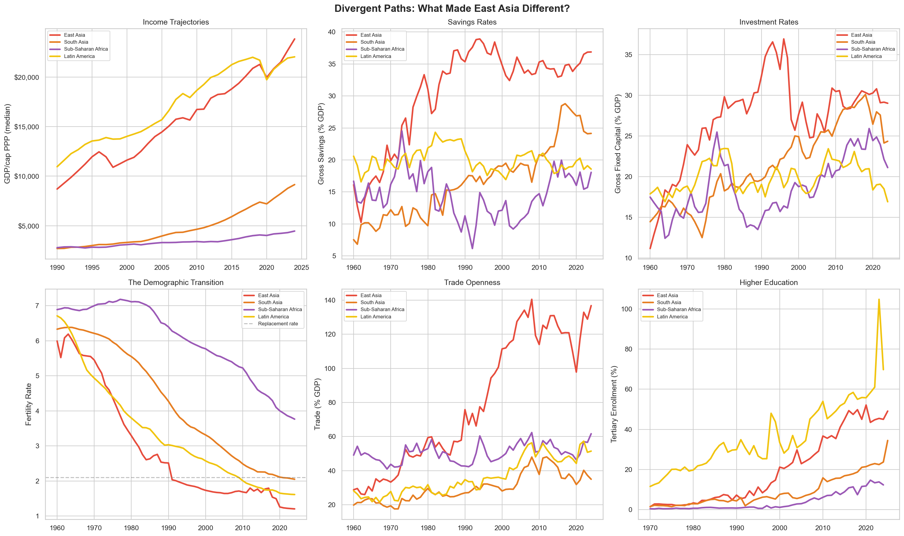
*East Asia pulled away from all other regions on income, savings, investment, trade openness, and education. Its demographic transition also began 20–30 years before Sub-Saharan Africa, but timing alone does not identify fertility as the cause.*

The cross-country growth literature (Barro, Rodrik, Acemoglu, Hausmann, Pritchett) repeatedly studies physical security, macroeconomic stability, investment, demography, trade, infrastructure, human capital, and state capacity. Calling these a hierarchy of “necessary conditions” and “growth accelerators” is stronger than the evidence can establish: countries select into policies, growth changes several predictors, and institutions are difficult to measure. The recurring correlates and proposed mechanisms are:

- **High domestic savings** (30–45% in East Asia vs 10–20% in SSA) — funds investment without foreign debt
- **High investment rates** (25–40% of GDP) — the 222-spell panel finds +0.52 percentage points of subsequent annual GDP/capita growth per standardized increase (95% CI +0.17 to +0.87), but reverse causality and omitted institutions remain. In a separate fixed-window event comparison, 43.6% of high-investment events meet the convergence criterion versus 34.9% of medium- and 33.3% of low-investment events; the Wilson intervals overlap. Investment is the strongest measured correlate, not a demonstrated sufficient or necessary cause.
- **Early fertility decline** — creating a demographic dividend of falling dependency ratios
- **Trade openness and export manufacturing** — technology transfer and learning-by-doing
- **State capacity** — whether government channels investment into productive capacity or elite consumption

These patterns are not uniquely “Asian.” Bangladesh (+310% GDP/capita), Rwanda (+191%), Ethiopia (+231%), and Chile (+175%) share some of them. But a small set of selected successes and counterexamples cannot establish that institutions, rather than culture or geography, are *the* relevant variable; it is consistent with that hypothesis and with a large literature, not a decisive test.

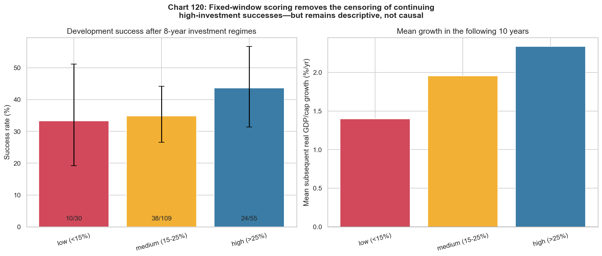
*Fixed windows avoid censoring continuing high-investment cases such as Bangladesh, China, India, Korea, and Viet Nam. Restricting to events classified with PPP data raises all three success rates and preserves their ordering; in both samples, uncertainty overlaps the medium- and low-investment baselines.*

**Conflict changes the constraints; it does not make all development or transfers impossible.** Insecurity, displacement, damaged infrastructure, and weak administration can sharply reduce investment and disrupt assistance. Yet firms, households, public services, and humanitarian programs can continue operating under some forms of conflict. Conditions differ within and across countries. The conflict literature motivates attention to security and institutions, not a universal sequence in which every other intervention must wait for peace [[56]](#references-and-sources).

Separating conflict-affected, low-capacity non-conflict, and stable developing windows yields subsequent growth averages of 2.3%, 3.1%, and 3.0% per year, respectively, but adjusted contrasts are imprecise and indistinguishable from zero. That null does not show conflict is harmless: conflict selection, survival, reconstruction rebounds, measurement error, and only 17 low-capacity spells make the comparison weak. Fourteen otherwise eligible 1996 windows are excluded for insufficient WGI capacity observations, an explicit early-period availability limitation. A separate investment-onset design produces positive matched estimates but fails its joint pre-trend diagnostic (p=0.019); the synthetic-control-like comparison rests on five cases and remains positive but imprecise when restricted to better pre-fit cases. The proper result is diagnostic failure of causal identification, not a causal investment estimate.

### Commodity windfalls: a stronger shock, but not a clean investment instrument

The World Bank Pink Sheet makes one more credible differential-exposure design possible. For fuel, metals, food, and agricultural raw materials, each country’s export composition is averaged over years $t-5$ through $t-3$ and interacted with the common annual global price change. Scaling by merchandise exports/GDP produces a windfall measured in percentage points of GDP. Country fixed effects remove stable specialization; year fixed effects remove common shocks; uncertainty is clustered by country. The main sample excludes countries supplying more than 3% of observed world exports in any category and trims extreme windfalls.

The result is mostly fiscal rather than a clear growth acceleration. A one-percentage-point-of-GDP windfall is associated in the impact year with **+0.124 percentage points of government revenue/GDP** (95% CI +0.057 to +0.191). The GDP/capita response is **−0.026 percentage points** (−0.122 to +0.069), and the investment response is **−0.099 points of GDP** (−0.207 to +0.009); neither is distinguishable from zero at 5%. Cumulative GDP/capita estimates remain imprecise through five years. A one-year lead placebo is insignificant in the main trimmed price-taker sample ($p=0.255$), although it becomes marginal or significant in some broader/time-restricted samples. Leave-one-price-year estimates preserve the positive revenue response (range +0.105 to +0.148), but interactions with government effectiveness are imprecise. The sparse 194-spell PIP exercise also cannot identify whether poor households capture the windfall ($p=0.415$).

This design improves on comparing commodity exporters with non-exporters, but it does not turn prices into a valid instrument for investment. Historical specialization is endogenous, commodity prices affect exchange rates, fiscal revenue, inflation, conflict risk, and demand directly, and there are only a few independent global price sequences. The evidence supports a near-term fiscal-revenue channel; it does not establish a general causal effect on growth or distribution.

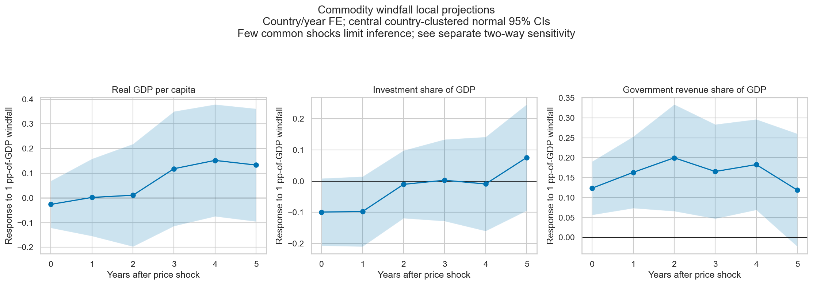
*Predetermined export exposure to common global prices produces a measurable revenue response, but GDP/capita and investment responses remain imprecise. Intervals are country-clustered with country and year fixed effects.*

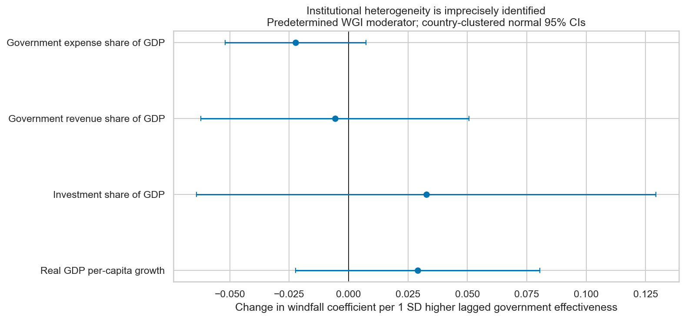
*Predetermined government effectiveness does not precisely moderate the reported windfall responses. This is a heterogeneity diagnostic, not an estimate of the causal effect of institutions.*

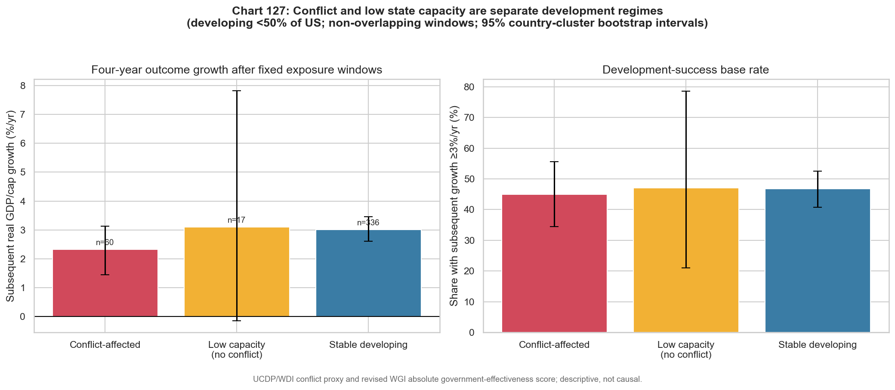
*Separating conflict and low capacity is substantively necessary, but adjusted differences are too imprecise to identify an independent regime effect.*

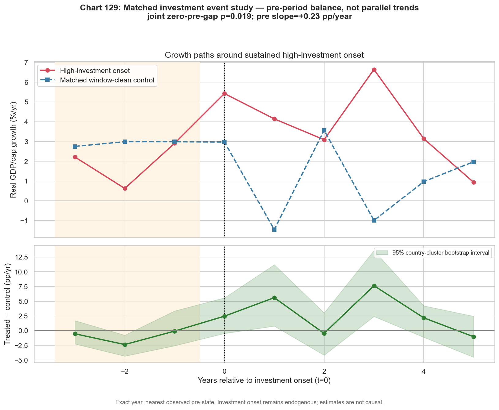
*The post-onset association is positive, but the joint pre-trend test fails. The design therefore cannot support a causal investment claim.*

**Fragility requires context-specific support, not a new universal recipe.** The literature describes feedback between insecurity, weak institutions, lost livelihoods, and low investment. It does not establish that poor households invariably become recruits or that one political system reliably escapes this cycle. Conflict-affected and low-capacity settings should not be treated as interchangeable, as the imprecise original comparisons above also illustrate [[56]](#references-and-sources).

Cash transfers, livelihoods support, and psychological interventions address different problems. The Liberia cash-and-CBT studies concern high-risk men in a post-war setting; they are not trials of ending an active civil war. Crost, Felter & Johnston (2016) examine a Philippine conditional-transfer program and local conflict outcomes [[56a]](#references-and-sources). These studies neither justify scaling a per-participant effect mechanically across the Sahel nor imply that transfers elsewhere will inevitably be captured. Humanitarian cash versus in-kind assistance depends on market access, prices, protection, delivery systems, and recipient needs; this report does not estimate their comparative effectiveness across crises.

Peacekeeping, negotiated settlements, reintegration, and institution-building are complementary possibilities, not a proven package or cost-effectiveness ranking. Research on peacekeeping distinguishes recurrence, battlefield violence, and civilian protection; effect estimates should not be pooled into a single universal percentage [[56b]](#references-and-sources). Mandates, consent, resources, and selection into missions matter. The earlier claims of a fixed “best-value” intervention, an always-successful sequence, and a halving of civil wars are not retained.

**Large reconstruction outlays do not identify the return to additional aid.** The legacy comparison places the Marshall Plan at about \$173B and Iraq-plus-Afghanistan reconstruction at about \$293B in 2024 dollars. These are selected accounting totals with different periods, populations, spending definitions, and security conditions—not comparable treatments. Poor outcomes despite large spending show that funding alone does not guarantee success; they do not show that additional money cannot be a binding constraint, that recipients lacked all prior institutional capacity, or that transfers cannot support recovery.

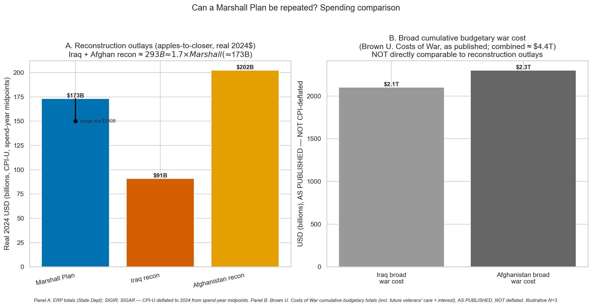
*Legacy spending comparison, not a causal test of aid or institutional quality. Total reconstruction expenditure is neither spending received by households nor a standardized intervention cost.*

For the broader argument, fragility complicates both growth and redistribution without making either irrelevant. Security, accountable institutions, services, and livelihoods may need simultaneous support. The report has not estimated a scalable peace-building budget, comparative total benefits, or a universally sufficient commitment duration. Domestic politics and international incentives both affect implementation; neither can be reduced to a lack of money, patience, or sovereignty alone.

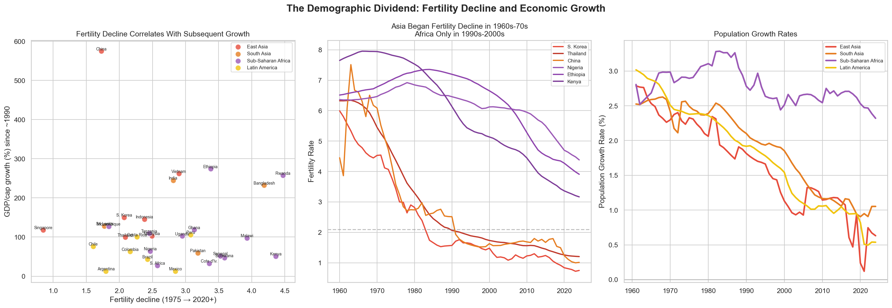
*Fertility decline and later GDP growth are descriptively associated, and East Asia began its transition much earlier than SSA. In the multivariable spell regression, however, fertility's standardized coefficient is −0.44 percentage points with a 95% interval of −0.95 to +0.06 (p=0.083). The chart is suggestive, not evidence that demography is the single most important divergence driver.*

The demographic transition deserves attention because the proposed mechanisms are credible: when fertility falls, dependency ratios can improve, women's paid employment may rise, families can invest more per child, and savings may increase. Bangladesh achieved near-replacement fertility alongside large gains in output. Yet simultaneous change is not causal identification, and the panel does not reject a zero partial association at 5%. SSA's falling TFR is therefore one reason for cautious optimism, conditional on health, education, labor absorption, stability, and investment—not a standalone forecast.

Two caveats matter. First, fertility transitions vary across countries, and the literature on stalls cautions against treating SSA as a delayed copy of East Asia [[55]](#references-and-sources). Population projections are conditional and revised over time, not evidence for a predetermined regional trajectory. Second, a demographic dividend depends on health, education, care arrangements, and opportunities for productive employment. A youthful population is neither an automatic dividend nor a prediction of instability. Voluntary reproductive choices and welfare remain important independently of any projected growth benefit.

### Capital mobilization: how savings become investment

The development literature and the country-spell association both make capital formation important. But *where does the capital come from?*

**Capital formation combines domestic and external sources.** Household and corporate savings, public revenue, retained earnings, aid, foreign investment, and borrowing can all finance productive assets. East Asian experience includes state-directed finance as well as markets and external support; it does not isolate a single funding source or prove that the same arrangements work everywhere. Informal savings also have productive and insurance functions, even when they cannot readily finance large infrastructure.

**Household finance has several evidence-backed mechanisms, not one universal winner.** Jack & Suri (2014) and Suri & Jack (2016) study mobile-money access, risk sharing, and welfare in Kenya [[27]](#references-and-sources). Those findings support examining payment infrastructure, not assuming the same impacts across countries. Network coverage, fees, competition, consumer protection, and the availability of counterparties all affect outcomes.

Microcredit, savings accounts, insurance, and savings groups address different constraints. Banerjee et al. (2015) study microcredit in India; Dupas & Robinson (2013) study savings access in Kenya; Karlan et al. (2014) examine credit and risk constraints in Ghana; Cole et al. (2013) examine barriers to insurance adoption in India; Karlan et al. (2017) evaluate savings groups [[27a]](#references-and-sources). These are not a common-population, common-outcome comparison proving savings or insurance always beats credit. Effects and take-up vary, and liquidity support can itself be productive investment.

The policy question is which constraint is binding and which institution can address it at acceptable cost and risk. Cooperative and digital finance can complement public services and productive organization, but longevity or user counts alone do not establish causal welfare gains. Governance, macroeconomic stability, financial economics, and local opportunities jointly shape the results; this report provides no integrated capital-mobilization model.

### Debt: capitalism's growth engine — or trap

Borrowing against future returns to fund productivity-boosting investment is one of capitalism's foundational technologies. The question is not whether developing countries should borrow — it is whether the borrowing funds productive investment that generates returns exceeding the cost of capital.

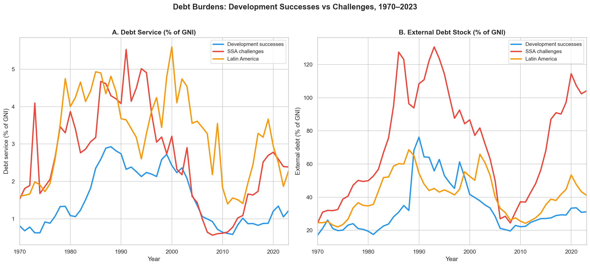
*Development successes maintained consistently lower **external** debt service (1–2% of GNI) compared to SSA challenges (2–5%) and Latin America (2–5%). But this understates how much the successes actually borrowed — they funded investment primarily from domestic savings (30–45% of GDP in East Asia), which is internal borrowing without currency risk or foreign creditor power.*

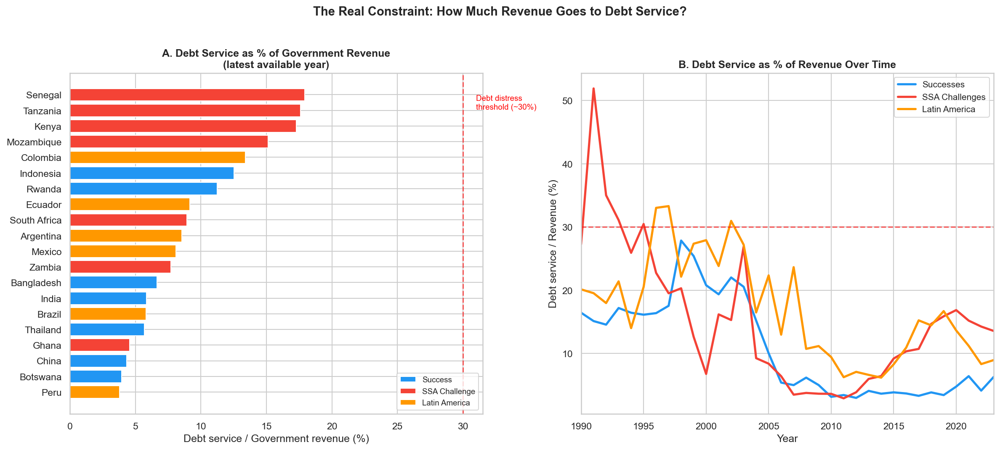
*The real constraint is what share of government revenue goes to creditors rather than investment. SSA peaked at 50%+ in the early 1990s, fell to ~5% after HIPC/MDRI debt relief, and is now climbing back toward 15%.*

**The distinction is not debt versus no debt — it is productive debt versus extractive debt.** East Asian successes mobilized enormous capital from domestic savings through state-directed banking into infrastructure and exports that generated returns well above the cost of capital. Latin America and SSA borrowed externally, often on commercial terms, sometimes to fund consumption or military spending, under conditions imposed by creditors whose interests diverged from borrowers'. SSA's HIPC (1996) and MDRI (2005) debt relief dropped external debt from ~100% to ~25% of GNI, creating fiscal space that accelerated growth — but new borrowing since 2010, increasingly from China and commercial creditors on less concessional terms, has rebuilt debt to ~45% of GNI. Ghana, Zambia, and Ethiopia all defaulted or restructured in 2020–2024. Many SSA countries now pay *more* in debt service than they receive in ODA. The goal is not to eliminate borrowing but to shift from external dependence to domestic capital mobilization — which circles back to the development recipe.

### What rich countries can actually do

Rich countries can affect development through finance, market access, technology, migration, taxation, climate policy, and security. The report does not estimate comparable causal effects or full costs across these instruments, so the following is a **literature-informed menu, not an impact ranking**. Distributional losses, implementation capacity, recipient priorities, and political resistance matter even where direct donor-budget costs are modest.

**Potential channels:**
- **Trade access.** Export opportunities can support scale, learning, and employment, conditional on productive capacity and labor/environmental protections. Adjustment costs, commodity exposure, and preference erosion complicate the gains. Selected export successes do not establish trade access as the single most effective development instrument.
- **Investment facilitation.** Development finance institutions can share risks and support investments that otherwise would not occur. Mobilization ratios are project-specific; additionality, public contingent liabilities, and development outcomes must be evaluated, and some instruments qualify as aid.
- **Remittance cost reduction.** Competition, interoperable payments, transparent exchange pricing, and proportionate regulation can increase recipients' net receipts. Implementation and compliance are not costless, and the gain depends on actual fees and transfer volumes.
- **Debt restructuring.** Timely, coordinated relief can restore fiscal space where debt is unsustainable; creditor coordination, burden sharing, future borrowing terms, and the use of released resources matter.
- **Infrastructure and public services.** Grants, concessional loans, and other finance have different roles depending on debt sustainability, public benefits, and cash flows. Neither loans nor grants are universally preferable; MCC compacts, for example, are grant-funded.
- **Girls' education and voluntary reproductive healthcare.** These are valuable rights and welfare investments with potential demographic and productivity benefits. Benefits depend on quality, access, and opportunities; no comparative analysis here establishes a universal highest-return ranking.

**What rich countries should *stop* doing** often matters as much: agricultural subsidies that undercut poor farmers, enabling capital flight and tax havens, arms sales to conflict zones, tied aid (where contractors must be from the donor country), and expensive remittance corridors.

**Domestic agency and international conditions interact.** Institutional capacity is important in the development literature [[25]](#references-and-sources), but this report does not establish it as the single dominant cause. Institutions are not exclusively domestic creations: external finance, trade rules, security guarantees, technology, colonial legacies, and tax/financial arrangements can strengthen or weaken them. External actors cannot simply purchase capable institutions, yet domestic ownership does not imply outsiders have no constructive role or responsibility.

### The Bretton Woods institutions

The IMF and World Bank are central to the debt and development story, and the critique of their structural adjustment programs in the 1980s–90s has substantial empirical support. A naive curated comparison shows IMF-heavy countries growing at +1.4%/yr versus +4.0% for countries that largely avoided the Fund—a –2.6pp gap that critics cite as evidence of harm. **That comparison should not be read causally.** A country-and-year fixed-effects specification gives an IMF-credit-exposure association of roughly **–0.8pp/yr with a confidence interval of [–1.7, +0.1] that spans zero**. The curated gap largely collapses after conditioning on the pre-existing state of the economy. Two caveats prevent a conclusion that the IMF is harmless: the treatment proxy is the *stock* of outstanding IMF credit rather than verified program entry or conditionality timing, and a clean-onset event study of 53 first-exposure episodes shows growth already falling ~2pp/yr before exposure begins. The defensible conclusion is narrow: **the –2.6pp comparison is confounded by crisis selection, no cleanly identified causal IMF growth effect survives the controls, and the data neither exonerate nor convict the Fund.** Sub-Saharan Africa's GDP per capita contracted during the structural-adjustment era (–0.2%/yr, 1980–1999) before rebounding to +2.5%/yr after 2000, but that regional record is also observational. The institutions have evolved, while structural problems persist: Western governance dominance and an inherent creditor bias. → [Full analysis: The IMF and World Bank](IMF_WORLD_BANK.md)

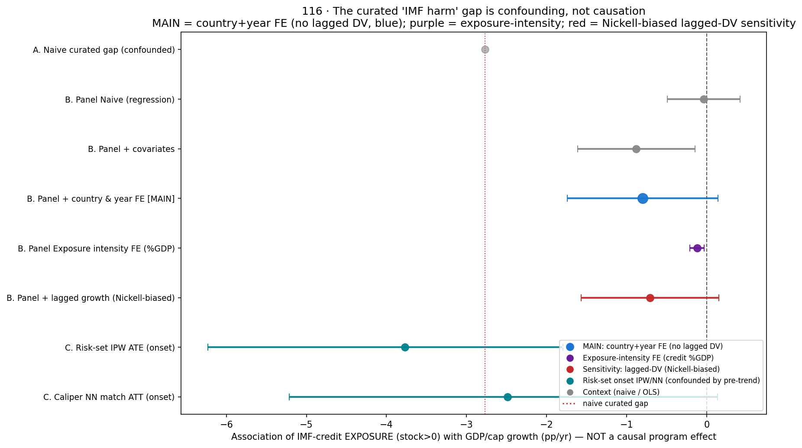
*The –2.6pp curated gap does not survive selection controls. The main fixed-effects estimate of IMF-credit exposure is –0.8pp/yr with a confidence interval spanning zero; the treatment is a credit-stock proxy, not verified program participation, so even this is an association rather than a clean causal effect.*

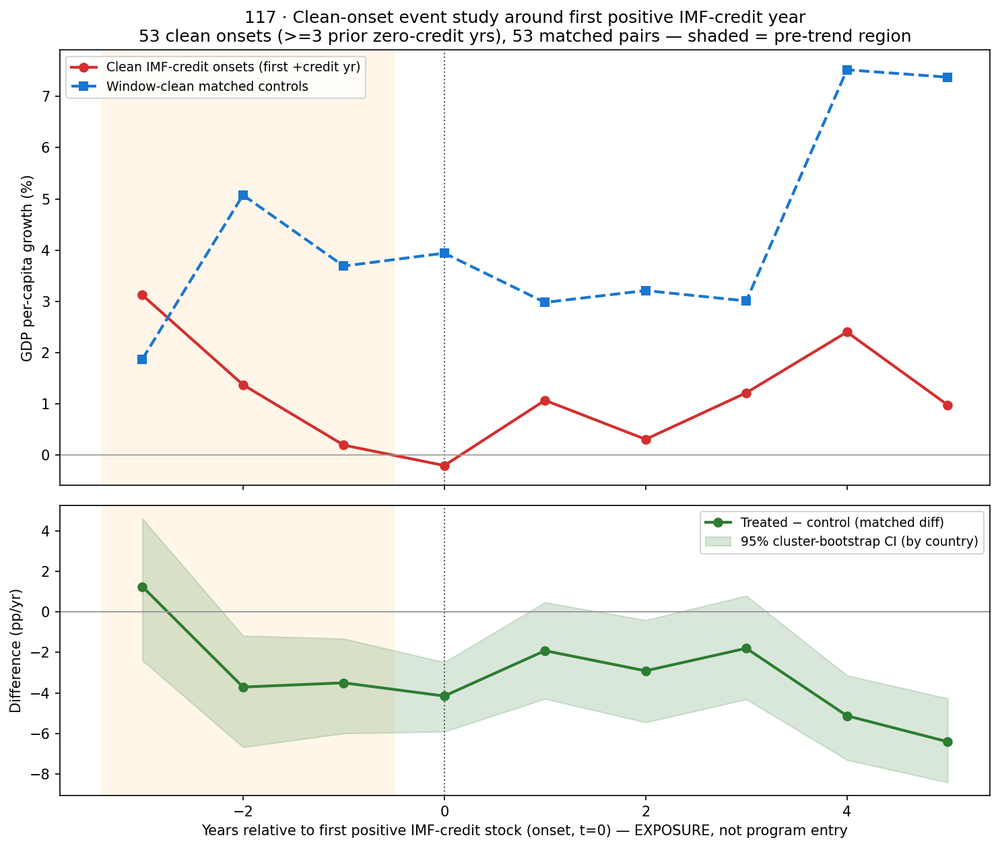
*Growth is already falling ~2pp/yr before the first year of IMF-credit exposure. This pre-trend is the signature of crisis-selection: countries turn to the Fund because they are already contracting, which is exactly why the raw +1.4 vs +4.0 comparison cannot be read as the Fund's causal effect.*

---

## What the Evidence Actually Shows

### Three claims well-supported by data:

**1. Growth alone is not an adequate policy plan.** Aggregate growth has variable, unequal incidence and does not guarantee poverty elimination; SSA is being left behind. Transfer pass-through and growth incidence are different estimands, and the 5% global growth-incidence statistic does not generalize to national bottom-60 groups.

**2. Historical development includes markets and strong public institutions in varied combinations.** The selected country histories show substantial gains in several reform and industrialization episodes, alongside serious failures. They do not isolate “capitalism” as a treatment or separate markets from public investment, education, external support, and wider historical conditions. Neither these cases nor the descriptive growth regressions establish a universal institutional recipe or rule out untested alternatives.

**3. Ecological pressures are severe and cannot be inferred from GDP alone.** Richardson (2023) assesses six boundaries as transgressed. The report's carbon scenarios illustrate demanding emissions reductions, but neither intensity extrapolation nor renewable generation alone predicts temperature. Technologies and changes in demand can reduce pressure; the present nitrogen, land, water, and material models do not demonstrate compliance with the full boundary framework.

### Two claims not supported by data:

**4. "Capitalism is mathematically unworkable."** The papers show that growth *alone*, under particular distribution and coupling assumptions, is insufficient; they do not prove impossibility across every institutional and technological configuration. Conversely, showing that individual technologies or redistributive market economies exist does not prove that a globally scalable, politically feasible joint pathway exists. The evidence supports “current policies are inadequate” and leaves the system-level counterfactual unresolved.

**5. "The current growth model is basically on track."** The evidence does not establish a sustainable poverty-eradication trajectory. The legacy 2017-PPP series still puts 3.14 billion below \$6.85/day, development outcomes vary greatly across regions, and the 2023 planetary assessment identifies six transgressed boundaries. Clean-energy progress is substantial but is not a complete climate pathway. Output growth alone does not ensure distribution, tax capacity, or ecological restraint.

### The bottom line

Low-line monetary poverty gaps are small relative to world output, and higher-line gaps have also fallen as a share of output since 1990. Those comparisons support ambition, not a claim that resources are already collectable and deliverable wherever needed. Historical experience identifies useful development mechanisms, but not a universally identified recipe; ecological evidence establishes serious pressures without validating the report's full transition scenario.

**On a consistent 2021-PPP basis, the \$8.30/day gap fell from 12.25% to 2.85% of world GDP; most of that relative decline came from GDP growth, while substantial absolute deprivation remains. The remaining barriers are distributional, political-economic, and ecological—and may not be separable from the system itself.**

Poverty is a *flow problem*, but redistribution can also improve productive capacity, and productive investment has costs and uncertain returns. Lower modeled transfer outlays under growth plus top-ups do not establish total-cost dominance over transfers or alternative provisioning. Trade, finance, public services, institutional reform, and security interact; their effects are context-dependent and shaped by both domestic decisions and international rules.

Market economies with strong public institutions have delivered substantial welfare gains, while rents, unequal bargaining power, and unpriced ecological harms can undermine those gains. These are reasons to examine institutional design and political constraints, not proof that one system inevitably succeeds or fails. Better-performing national examples show possibilities; they do not establish global scalability or the speed of ecological transition.

Two claims should be distinguished. First: **the evidence does not establish mathematical impossibility.** Lower-threshold monetary gaps are small relative to global output, though that does not establish fiscal feasibility; historical development successes demonstrate that some market economies with strong states can deliver broad-based growth. Second: **the evidence does not establish a globally scalable joint pathway or estimate its probability.** Universal high welfare, rapid decarbonization, nitrogen control, biodiversity protection, and lower rich-world throughput must be achieved together. The available analyses study these pieces separately; their joint odds remain unidentified. The system-level question remains unresolved.

---

## Limitations and What This Doesn't Settle

- **The systemic political economy critique.** Redistribution plus managed growth could work in principle. But if capitalist political economies structurally tend to concentrate gains, resist redistribution, and externalize ecological costs, then "political failure" is intrinsic rather than an external caveat. Nordic social democracy proves better outcomes are possible; it does not prove the global system tends toward them. This is arguably the central unresolved question, and the available data do not settle it.

- **The provisioning argument.** Paper 1's strongest version is not "175× GDP." It is that decent lives require specific material throughputs with real ecological costs, and the world already produces enough to meet those needs through reallocation rather than further growth. The expanded good-life threshold is an outcome-reliability assessment, not a direct rebuttal to provisioning frameworks that measure material sufficiency rather than GDP, consumption, or welfare correlations.

- **Accounting and source corrections.** The Kotz et al. (2024) climate-damage result is retracted and is not evidence for this report's conclusions. Richardson's nitrogen boundary covers industrial plus intentional biological fixation, unlike the synthetic-fertilizer scenarios. Chart 86 mixes storage-capacity capital cost and levelized discharge cost; chart 90 mixes final energy and process emissions; the old scorecard and nitrogen stack mix control variables. These artifacts are not repaired by caveats or reproducibility and require separate model/figure revisions before reuse as quantitative evidence.

- **Welfare coverage and fiscal feasibility.** An available-indicator score with an 8-of-19 inclusion rule can change with coverage. Country-level associations do not establish causal income requirements or minimum material provisioning costs. Survey-welfare surplus is not world-output surplus, and world GDP is not global tax capacity. Transfer productivity feedbacks, growth investment costs, and ecological costs are not jointly estimated, so no strategy has demonstrated full-cost dominance here.

- **The exploitation critique and ecologically unequal exchange.** Our emissions-offshoring analysis is too narrow. It addresses carbon geography but not terms of trade, debt discipline, intellectual property regimes, supply chain ownership, currency hierarchy, or the structural orientation of Global South production toward exports rather than domestic provisioning. The [IMF/World Bank analysis](IMF_WORLD_BANK.md) partially addresses the debt discipline question — the structural-adjustment era coincided with badly damaged African development in the 1980s–90s, though our selection-aware re-analysis finds that no cleanly-identified causal IMF growth effect survives the crisis-selection controls, so the harm is real in the regional record but hard to attribute cleanly to the Fund — but the deeper structural critique about who designs global economic rules remains. The ecologically-unequal-exchange literature (Hornborg 2009; Dorninger et al. 2021, *Global Environmental Change*) estimates net physical transfers from South to North on the order of ~10 Gt of raw materials, ~800 Mha-eq of embodied land, and ~3 Gt of embodied CO₂ per year, alongside Hickel, Sullivan & Zoomkawala (2021, *New Political Economy*) monetary-value-drain estimates of \$10–30 trillion over 1990–2015 depending on method. These numbers are contested (the value-drain estimate in particular depends on strong assumptions about counterfactual wages), but they are not marginal. They make Paper 1's framing — that Global North consumption is materially subsidized by Global South production — harder to dismiss. A companion literature on dollar hegemony and currency hierarchy (Prasad 2014; Pistor 2019, *The Code of Capital*; the "original sin" literature from Eichengreen & Hausmann) argues that the global financial architecture itself makes Global South borrowing structurally more expensive and pro-cyclical than Global North borrowing, which our debt analysis touches on but does not theorize. Chang's *Kicking Away the Ladder* (2002) makes the complementary historical argument that every currently-developed country used industrial policy, tariff protection, and weak IP enforcement of the kind now constrained by WTO/TRIPS rules — meaning "the development recipe" is partially unavailable to today's poor countries by design.

- **East Asian replicability.** Asian development success depended partly on Cold War geopolitics, cheap fossil energy, export absorption by rich-country markets, and ecological slack that may not exist for today's poorest countries. Retrospective patterns do not identify a universal recipe; their transferability under present constraints is uncertain.

- **The anthropological and epistemic critique.** The quantitative apparatus used throughout this report—GDP, WDI indicators, poverty lines, and planetary-boundary budgets—is not politically neutral scaffolding. It renders some things legible and others invisible, including commoning, subsistence, care work, gift exchange, and ecological relationships that do not map onto a production function. Development anthropology argues that "development" as an epistemic regime converts political questions into technical ones and can impose forms of legibility that serve planners more than planned-for populations. Global statistics nevertheless describe real changes in child mortality, literacy, and material welfare. The good-life threshold, sustainable budget, and development correlates should therefore be read as outcome and resource diagnostics, not as a complete theory of flourishing. Commons, kinship, autonomy, ritual life, dignity, and land attachment can raise welfare above the measured floor; coercive migration, land loss, debt, dependency, alienation, and cultural destruction can lower welfare even when measured outcomes improve. Subjective wellbeing, trust, perceived freedom, social support, violence, land security, and subgroup gaps can supplement the dashboard but cannot be collapsed into a universal moral score without recreating the problem. The tension remains unresolved.

- **Measurement as politics.** As Paper 2 demonstrates, the poverty line chosen determines whether the record looks like triumph or stagnation—both can accurately describe the same underlying reality. Multiple thresholds are used here, but every number reflects choices about poverty, currency conversion, coverage, and indicator weights. Boundary ratios compare specified control variables; they are not ratios of ecological damage or statements that all lower values are locally safe.

- **The welfare question.** Whether growth has "worked" depends on the weight assigned to improvements for the poorest relative to total output. The [welfare-weighted analysis](README_v2_archive.md) (Charts 52–57) shows country rankings shift dramatically with this value judgment—the US leads on mean income, while Norway leads on every pro-poor measure.

- **What remains unresolved.** Historically observed growth can reduce low-end deprivation, but it does so through a system that channels gains upward, locks in luxury consumption, and externalizes ecological costs. The boundaries that matter most now—land use, biodiversity, and nitrogen—have the weakest technological escape routes. This is the strongest version of the papers' argument, and the available evidence does not decisively refute it.

---

## References and Sources

Contested claims, headline numbers, and key frameworks are sourced below. Data sources for charts are listed in the Appendix.

### Poverty and growth
- **\$0.60 per \$100 of growth reaching extreme poor**: Woodward 2015, "Incrementum ad Absurdum," *World Economic Review* 4: 43–62. [1]
- **5% of new income reaching poorest 60%**: Lakner & Milanovic 2016, "Global Income Distribution," *World Bank Economic Review* 30(2): 203–232. [2]
- **Growth elasticity declining at higher thresholds**: Klasen & Misselhorn 2008; Ravallion 2012, "Why Don't We See Poverty Convergence?" *American Economic Review* 102(1): 504–523. [3]
- **Poverty headcounts and gaps**: World Bank Poverty and Inequality Platform (PIP), accessed April 2026. [4]
- **GDP data**: World Bank World Development Indicators (WDI), indicators NY.GDP.MKTP.PP.KD and NY.GDP.MKTP.CD. [5]
- **BNPL methodology and limitations**: Reddy & Pogge 2010, "How Not to Count the Poor," in Anand, Segal & Stiglitz eds., *Debates on the Measurement of Global Poverty*. [6]
- **Non-income welfare confirmation (life expectancy, mortality, literacy, calories)**: Kenny 2011, *Getting Better*; Deaton 2013, *The Great Escape*. [7]
- **China's ~75% share of extreme poverty reduction**: Ravallion 2011, "A Comparative Perspective on Poverty Reduction in Brazil, China, and India," *World Bank Research Observer* 26(1). [8]
- **3× targeting multiplier**: Ravallion 2009, "How Relevant is Targeting to the Success of an Antipoverty Program?" *World Bank Research Observer* 24(2). [9]

### Redistribution proposals
- **Global financial transaction tax (\$200–400B/yr)**: Schulmeister 2014, CEPR; Baker 2016, "The Benefits of a Financial Transactions Tax," *Tax Policy Center*. [10]
- **SDR reallocation**: Stiglitz & Bhatt 2021, "IMF and SDR Allocation," various; IMF 2021 allocation report. [11]
- **Global minimum corporate tax**: OECD 2021, "Two-Pillar Solution"; Tax Justice Network 2021, "State of Tax Justice" (\$100–240B estimate). [12]
- **Zucman billionaire wealth tax**: Zucman 2024, report for G20 Brazil presidency. [13]
- **ODA figures and 0.7% target**: OECD Development Assistance Committee preliminary 2024 data. [14]
- **Cash-transfer outcomes, not a universal administrative delivery ratio**: Haushofer & Shapiro (2016), [“The Short-Term Impact of Unconditional Cash Transfers to the Poor: Experimental Evidence from Kenya”](https://doi.org/10.1093/qje/qjw025), *Quarterly Journal of Economics* 131(4): 1973–2042. [15]

### Ecological boundaries and decoupling
- **Planetary boundaries framework and 2023 status**: Richardson et al. (2023), [“Earth beyond six of nine planetary boundaries,” Table 1 and Results](https://doi.org/10.1126/sciadv.adh2458), *Science Advances* 9(37), eadh2458. Earlier versions: Rockström et al. (2009), *Nature* 461: 472–475; Steffen et al. (2015), [“Planetary boundaries: Guiding human development on a changing planet”](https://doi.org/10.1126/science.1259855), *Science* 347, 1259855. [16]
- **Nitrogen accounting**: Richardson et al. (2023), [Biogeochemical flows](https://doi.org/10.1126/sciadv.adh2458): 62 Tg N/yr boundary retained from Steffen (2015); ~190 Tg N/yr reported industrial + intentional biological fixation applied to agriculture. Synthetic fertilizer alone is not that control variable. Historical 35 Tg and legacy 44 Tg scenario references are not interchangeable versions of the same accounting exercise. [17]
- **Absolute decoupling "rare"**: Haberl et al. 2020, "A Systematic Review of the Evidence on Decoupling," *Environmental Research Letters* 15(6). [18]
- **Proposed aggregate material target, not a formal planetary boundary**: Bringezu (2015), [“Possible Target Corridor for Sustainable Use of Global Material Resources”](https://doi.org/10.3390/resources4010025), *Resources* 4(1): 25–54; Hickel et al. (2022) synthesis. [19]
- **Historical solar generation**: [Our World in Data energy dataset](https://github.com/owid/energy-data), drawing on energy statistical sources. Extrapolations in this report are not fitted S-curve forecasts. [20]
- **Dated carbon budgets**: [IPCC AR6 WG1, Table SPM.2](https://www.ipcc.ch/report/ar6/wg1/chapter/summary-for-policymakers/): from the beginning of 2020, 500 GtCO₂ for a 50% likelihood of limiting warming to 1.5°C, or 400 GtCO₂ for 67%. Budgets are conditional on non-CO₂ assumptions and are depleted by subsequent emissions. [21]
- **Budget exhaustion arithmetic**: Years at constant emissions = remaining budget ÷ annual emissions. The legacy 6–10-year statements are scenario arithmetic with dated inputs, not an updated countdown or a forecast of the date a temperature threshold is crossed. [22]

### Development and aid
- **Aid effectiveness debate**: Banerjee & Duflo (2011), *Poor Economics*; Easterly (2006), *The White Man's Burden*; Deaton (2013), *The Great Escape*; Moyo (2009), *Dead Aid*. These are differing arguments, not a consensus estimate. For a contrasting macroeconomic analysis: Clemens et al. (2012), [“Counting chickens when they hatch: Timing and the effects of aid on growth”](https://doi.org/10.1111/j.1468-0297.2011.02482.x), *Economic Journal* 122: 590–617. [23]
- **FDI, remittances, ODA flow magnitudes**: World Bank 2024, *Migration and Development Brief*; OECD DAC statistics; UNCTAD *World Investment Report* 2024. [24]
- **Development recipe (savings, investment, institutions)**: Barro 1991, *Quarterly Journal of Economics*; Rodrik 2007, *One Economics, Many Recipes*; Acemoglu & Robinson 2012, *Why Nations Fail*. [25]
- **Demographic dividend**: Bloom, Canning & Sevilla 2003, "The Demographic Dividend," RAND; Galor 2011, *Unified Growth Theory*. [26]
- **M-Pesa and mobile money**: Jack & Suri (2014), [“Risk Sharing and Transactions Costs: Evidence from Kenya's Mobile Money Revolution”](https://doi.org/10.1257/aer.104.1.183), *AER* 104(1): 183–223; Suri & Jack (2016), [“The Long-Run Poverty and Gender Impacts of Mobile Money”](https://doi.org/10.1126/science.aah5309), *Science* 354(6317). [27]
- **Microfinance, savings, and index insurance evidence**: Banerjee, Duflo, Glennerster & Kinnan 2015, "The Miracle of Microfinance? Evidence from a Randomized Evaluation," *AEJ: Applied* 7(1); Roodman 2012, *Due Diligence: An Impertinent Inquiry into Microfinance*; Dupas & Robinson 2013, "Savings Constraints and Microenterprise Development," *AEJ: Applied* 5(1); Karlan, Osei, Osei-Akoto & Udry 2014, "Agricultural Decisions after Relaxing Credit and Risk Constraints," *QJE* 129(2); Cole, Giné, Tobacman, Topalova, Townsend & Vickery 2013, "Barriers to Household Risk Management: Evidence from India," *AEJ: Applied* 5(1); Karlan, Savonitto, Thuysbaert & Udry 2017, "Impact of savings groups on the lives of the poor," *PNAS* 114(12); Bhatt 2006, *We Are Poor but So Many: The Story of Self-Employed Women in India*. [27a]
- **Commons governance and Ostrom principles**: Ostrom 1990, *Governing the Commons*; Cox, Arnold & Villamayor-Tomás 2010, "A Review of Design Principles for Community-based Natural Resource Management," *Ecology and Society* 15(4); Porter-Bolland et al. 2012, "Community managed forests and forest protected areas: An assessment of their conservation effectiveness across the tropics," *Forest Ecology and Management* 268; Platteau 2000, *Institutions, Social Norms, and Economic Development*; Fafchamps 2003, *Rural Poverty, Risk and Development*. [27b]
- **PEPFAR**: PEPFAR 2024 annual report (20M+ on antiretrovirals); 2025 disruptions from press/USAID reporting. [28]
- **Graduation programs (BRAC)**: Banerjee et al. 2015, "A Multifaceted Program Causes Lasting Progress for the Very Poor," *Science* 348(6236). [29]

### IMF and structural adjustment
- **IMF program effects on growth**: Barro & Lee 2005, "IMF Programs: Who Is Chosen and What Are the Effects?" *Journal of Monetary Economics*; Dreher 2006, "IMF and Economic Growth," *World Development*. [30]
- **Structural adjustment critique**: Stiglitz 2002, *Globalization and Its Discontents*; Easterly 2005, "What Did Structural Adjustment Adjust?" *Journal of Development Economics*. [31]
- **SSA GDP contraction during SAP era**: Maddison Project Database 2023; WDI GDP per capita growth rates. [32]

### Provisioning and decent living standards
- **Decent Living Standards material requirements**: Rao & Min 2018, "Decent Living Standards: Material Prerequisites for Human Wellbeing," *Social Indicators Research* 138: 225–244. [33]
- **Global food production sufficiency**: FAO 2023, *The State of Food Security and Nutrition in the World*. [34]
- **Cultivated meat cost trajectory**: Good Food Institute annual reports 2013–2025. [35]

### Welfare measurement
- **Atkinson EDEI welfare-weighted growth**: Atkinson 1970, "On the Measurement of Inequality," *Journal of Economic Theory* 2(3): 244–263. [36]
- **Good-life threshold**: Original descriptive analysis in [analysis/run_analysis_19.py](analysis/run_analysis_19.py), with sensitivity in [analysis/run_analysis_18.py](analysis/run_analysis_18.py). The expanded assessment uses WDI outcomes and separate GDP, household-consumption, and PIP-welfare resource proxies. At least 8 of 19 indicators are required, so coverage varies. These associations are not externally validated causal thresholds or estimates of minimum provisioning cost. [37]

### Structural political economy and anthropology
- **Capitalism definitions / Varieties of Capitalism**: Wood 2002, *The Origin of Capitalism*; Brenner 1977, "The Origins of Capitalist Development," *New Left Review* I/104; Hall & Soskice 2001, *Varieties of Capitalism*; Amable 2003, *The Diversity of Modern Capitalism*; Streeck 2014, *Buying Time*. [43]
- **Growth imperative literature**: Binswanger 2009, "Is there a growth imperative in capitalist economies?" *Journal of Socio-Economics*; Richters & Siemoneit 2019, "Growth imperatives: Substantiating a contested concept," *Structural Change and Economic Dynamics*; Jackson & Victor 2020, "The Transition to a Sustainable Prosperity — A Stock-Flow-Consistent Ecological Macroeconomic Model," *Ecological Economics*; Fix 2021, "Economic Development and the Death of the Free Market," *Evolutionary and Institutional Economics Review*. [44]
- **Development as epistemic regime**: Escobar 1995, *Encountering Development*; Ferguson 1994, *The Anti-Politics Machine*; Ferguson 2006, *Global Shadows*; Mitchell 2002, *Rule of Experts*; Li 2007, *The Will to Improve*; Mosse 2005, *Cultivating Development*; Graeber & Wengrow 2021, *The Dawn of Everything*. [45]
- **Ecologically unequal exchange**: Hornborg 2009, "Zero-Sum World," *International Journal of Comparative Sociology*; Dorninger et al. 2021, "Global patterns of ecologically unequal exchange," *Global Environmental Change* 179; Hickel, Sullivan & Zoomkawala 2021, "Plunder in the post-colonial era," *New Political Economy* 26(6). [46]
- **Currency hierarchy and global financial architecture**: Eichengreen & Hausmann 1999, "Exchange Rates and Financial Fragility," NBER WP 7418; Prasad 2014, *The Dollar Trap*; Pistor 2019, *The Code of Capital*. [47]
- **Industrial policy history**: Chang 2002, *Kicking Away the Ladder*; Chang 2007, *Bad Samaritans*. [48]
- **Rich-world working-class stagnation**: Karabarbounis & Neiman 2014, "The Global Decline of the Labor Share," *Quarterly Journal of Economics* 129(1); Case & Deaton 2015, "Rising morbidity and mortality in midlife among white non-Hispanic Americans in the 21st century," *PNAS* 112(49); Case & Deaton 2020, *Deaths of Despair and the Future of Capitalism*; Case & Deaton 2022, "The great divide: Education, despair, and death," *Annual Review of Economics* 14; Gelman & Auerbach 2016, "Age-aggregation bias in mortality trends," *PNAS* 113(7); Ruhm 2019, "Drivers of the Fatal Drug Epidemic," *Journal of Health Economics* 64; Alpert, Powell & Pacula 2018, "Supply-side drug policy in the presence of substitutes," *American Economic Journal: Economic Policy* 10(4); Friedman & Hansen 2022, "Evaluation of Increases in Drug Overdose Mortality Rates in the US by Race and Ethnicity Before and During the COVID-19 Pandemic," *JAMA Psychiatry* 79(4); Masters, Tilstra & Simon 2018, "Explaining recent mortality trends among younger and middle-aged White Americans," *International Journal of Epidemiology* 47(1); Milanovic 2016, *Global Inequality*; Milanovic 2023, "The three eras of global inequality, 1820–2020," working paper; Sacerdote 2017, "Fifty Years Of Growth In American Consumption, Income, And Wages," NBER WP 23292; Meyer & Sullivan 2011, "Further Results on Measuring the Well-Being of the Poor Using Income and Consumption," *Canadian Journal of Economics*; Economic Policy Institute 2024, "The Productivity–Pay Gap"; Congressional Budget Office, *The Distribution of Household Income* (annual). [49]

- **Income and subjective wellbeing: distinct estimands**: Stevenson & Wolfers (2008), “Economic Growth and Subjective Well-Being: Reassessing the Easterlin Paradox,” *Brookings Papers on Economic Activity*; Stevenson & Wolfers (2013), [“Subjective Well-Being and Income: Is There Any Evidence of Satiation?”](https://doi.org/10.1257/aer.103.3.598), *AER* 103(3): 598–604; Killingsworth (2021), [“Experienced well-being rises with income, even above $75,000 per year”](https://doi.org/10.1073/pnas.2016976118), *PNAS* 118(4); **Killingsworth, Kahneman & Mellers (2023)**, [“Income and emotional well-being: A conflict resolved”](https://doi.org/10.1073/pnas.2208661120), *PNAS* 120(10), e2208661120. Cross-sectional, temporal, emotional-wellbeing, and life-evaluation findings are not interchangeable. [60]
- **Cross-country growth regression critique**: Levine & Renelt 1992, "A Sensitivity Analysis of Cross-Country Growth Regressions," *American Economic Review* 82(4); Durlauf, Johnson & Temple 2005, "Growth Econometrics," in *Handbook of Economic Growth*; Rodrik 2012, "Why We Learn Nothing from Regressing Economic Growth on Policies," *Seoul Journal of Economics*. [50]
- **Planetary boundaries framework critique**: Montoya, Donohue & Pimm 2018, "Planetary Boundaries for Biodiversity: Implausible Science, Pernicious Policies," *Trends in Ecology & Evolution* 33(2); Biermann & Kim 2020, "The Boundaries of the Planetary Boundary Framework," *Annual Review of Environment and Resources* 45; Persson et al. 2022, "Outside the Safe Operating Space of the Planetary Boundary for Novel Entities," *Environmental Science & Technology* 56(3); Nordhaus 2019, "Climate Change: The Ultimate Challenge for Economics," *American Economic Review* 109(6). [51]
- **Provisioning (peer-reviewed)**: Millward-Hopkins, Steinberger et al. 2020, "Providing decent living with minimum energy: A global scenario," *Global Environmental Change* 65; Kikstra et al. 2021, "Decent living gaps and energy requirements," *Environmental Research Letters* 16(9). [52]
- **Critical minerals and just transition**: IEA 2024, *Critical Minerals Outlook*; Sovacool 2021, "When subterranean slavery supports sustainability transitions?" *The Extractive Industries and Society* 8(1); Riofrancos 2023, "The Security–Sustainability Nexus: Lithium Onshoring in the Global North," *Global Environmental Politics* 23(1). [53]
- **Climate impacts and uncertainty**: [IPCC AR6 WGII (2022)](https://www.ipcc.ch/report/ar6/wg2/); Burke, Hsiang & Miguel (2015), [“Global non-linear effect of temperature on economic production”](https://doi.org/10.1038/nature15725), *Nature* 527: 235–239; Kahn et al. (2021), “Long-term macroeconomic effects of climate change,” *Energy Economics* 104; Newell, Prest & Sexton (2021), [“The GDP-Temperature relationship: Implications for climate change damages”](https://doi.org/10.1016/j.jeem.2021.102445), *Journal of Environmental Economics and Management* 108, 102445. **Retracted—not supporting evidence:** Kotz, Levermann & Wenz (2024), “The economic commitment of climate change”; [retraction notice, 3 December 2025](https://www.nature.com/articles/s41586-025-09726-0), *Nature* 648: 764. Adaptation financing: [UNEP, *Adaptation Gap Report 2023*](https://www.unep.org/resources/adaptation-gap-report-2023). [54]
- **Demographic transition critique**: Gerland et al. 2014, "World population stabilization unlikely this century," *Science* 346(6206); Bongaarts 2017, "Africa's Unique Fertility Transition," *Population and Development Review* 43(S1); Schoumaker 2019, "Stalls in Fertility Transitions in sub-Saharan Africa," *Studies in Family Planning* 50(3); UN DESA 2024, *World Population Prospects 2024*. [55]
- **Fragile states and conflict-development**: Collier 2007, *The Bottom Billion*; Blattman & Miguel 2010, "Civil War," *Journal of Economic Literature* 48(1); World Bank 2020, *Fragility, Conflict, and Violence Strategy*. [56]
- **Transfers and behavioral interventions in specific settings**: Blattman, Jamison & Sheridan (2017), “Reducing Crime and Violence: Experimental Evidence from Cognitive Behavioral Therapy in Liberia,” *American Economic Review* 107(4); Blattman, Chaskel, Jamison & Sheridan (2023), “Cognitive Behavior Therapy Reduces Crime and Violence over Ten Years: Experimental Evidence,” *American Economic Review: Insights* 5(4); Crost, Felter & Johnston (2016), “Conditional cash transfers, civil conflict and insurgent influence: Experimental evidence from the Philippines,” *Journal of Development Economics* 118. [56a]
- **Peacekeeping outcomes**: Fortna (2008), *Does Peacekeeping Work? Shaping Belligerents' Choices after Civil War*; Hultman, Kathman & Shannon (2013), “United Nations Peacekeeping and Civilian Protection in Civil War,” *American Journal of Political Science* 57(4). These studies address different outcomes, not a common intervention ranking. [56b]
- **Sovereignty / global governance**: Rodrik 2011, *The Globalization Paradox* (trilemma); Streeck 2014, *Buying Time*; Pistor 2019, *The Code of Capital*. [57]
- **Food-system political economy**: Li 2014, *Land's End*; Borras & Franco 2012, "Global Land Grabbing and Trajectories of Agrarian Change," *Journal of Agrarian Change* 12(1). [58]
- **Woodward/Simms UN DESA paper**: Woodward & Simms 2006, "Growth Isn't Working," UN DESA / New Economics Foundation. [59]

### Energy de-risking and materials
- **Grid architecture and storage accounting**: Sepulveda et al. (2018), [“The Role of Firm Low-Carbon Electricity Resources in Deep Decarbonization of Power Generation”](https://doi.org/10.1016/j.joule.2018.08.006), *Joule* 2(11): 2403–2420; Albertus et al. (2020), [“Long-Duration Electricity Storage Applications, Economics, and Technologies”](https://doi.org/10.1016/j.joule.2019.11.009), *Joule* 4(1): 21–32. The legacy Form Energy cost input is a capacity capital-cost target (\$/kWh), not demonstrated LCOS (\$/MWh). No new system-cost or reliability estimate is produced here. [38]
- **Nuclear fission and SMRs**: World Nuclear Association 2024 country profiles; Lazard LCOE+ 2023 (\$141–221/MWh new US nuclear, \$31/MWh existing); EIA 2022 capital cost estimates (\$6,695–7,547/kW); Berthélemy & Rangel 2015, "Nuclear reactors' construction costs: The role of lead-time, standardization and technological progress," *Energy Policy* 82: 118–130; Our World in Data, "Why did renewables become so cheap so fast?" (Roser 2020, updated 2025); Our World in Data, "Nuclear Energy" (Ritchie & Rosado 2020). [38]
- **Enhanced geothermal**: Fervo Energy 2023 Project Red (Nevada) and Cape Station (Utah) demonstrations; DOE GeoVision study 2019 (60 GW by 2050); DOE Enhanced Geothermal Shot Analysis 2023 (90 GW by 2050, \$45/MWh target by 2035); MIT "The Future of Geothermal Energy" 2006 (Tester et al.; 13,000+ ZJ US EGS resources, 100+ GWe feasible); Lazard 2023 geothermal LCOE (\$61–102/MWh); NREL ATB 2024. [39]
- **Fusion progress**: Commonwealth Fusion Systems 2021 magnet demonstration (20T HTS); National Ignition Facility 2022 net energy gain. [40]
- **EAF steel transition**: World Steel Association 2024 statistics (~30% global EAF share, ~70% US share); energy savings ~75% vs blast furnace (IEA Iron and Steel Technology Roadmap 2020). [41]
- **Aluminum recycling**: International Aluminium Institute; ~95% energy savings for secondary vs primary production; ~75% of all aluminum ever produced still in use. [42]

---

## Appendix

### Data Sources

| Source | Key Variables |
|---|---|
| [World Bank WDI](https://data.worldbank.org/) | GDP, population, household consumption, life expectancy, mortality, maternal/neonatal health, nutrition, clean cooking, water, sanitation, education, investment |
| [World Bank PIP](https://pip.worldbank.org/) | Headcount ratios and poverty gaps at \$2.15, \$3.65, \$6.85, \$10, \$15, \$20, and \$25/day; country-level mean, median, and decile welfare |
| [Maddison Project](https://www.rug.nl/ggdc/historicaldevelopment/maddison/) | Historical GDP per capita (1–2022) |
| [Our World in Data](https://github.com/owid/co2-data) | CO₂ emissions (production + consumption), decoupling metrics |
| [Our World in Data](https://github.com/owid/energy-data) | Solar/wind/fossil generation, energy mix, renewable shares |
| [Our World in Data](https://ourworldindata.org/) | Material footprint, LPI, Red List, nitrogen, phosphorus, water stress, HDI, Cantril life satisfaction |
| [OECD Revenue Statistics](https://www.oecd.org/tax/tax-policy/revenue-statistics.htm) | Total government tax revenue (% GDP) |
| [IEA](https://www.iea.org/) | Critical minerals demand projections |
| [USGS](https://pubs.usgs.gov/) | Mineral production volumes |
| [World Bank Commodity Markets](https://www.worldbank.org/en/research/commodity-markets) | Pink Sheet annual global energy, metals, food, and agricultural raw-material price indices |
| [UCDP Dataset Download Center](https://ucdp.uu.se/downloads/) | Official intrastate and interstate country-level conflict-onset panels acquired for future risk-set/event-study work |

### Analysis Pipeline

The 35 numbered analyses use chart identifiers through 145, including withdrawal notices for invalid legacy comparisons. Run the acquisition steps before the numbered analyses; run [analysis/download_good_life_data.py](analysis/download_good_life_data.py) before [analysis/run_analysis_19.py](analysis/run_analysis_19.py). [Analysis 35](analysis/run_analysis_35.py) runs offline after Analysis 19 from cached Cantril, WDI, country and CO₂ inputs. Raw and processed caches are gitignored; generated reports and source code document the calculations and input hashes, but a fresh clone must first acquire the data.

| Script | Topic | Charts |
|---|---|---|
| `run_analysis.py` | Core poverty & growth | 01–08 |
| `run_analysis_2.py` | Poverty–growth feedbacks | 09–12 |
| `run_analysis_3.py` | Floor-raising, good-life threshold | 13–16 |
| `run_analysis_4.py` | Market reforms, command economies | 17–18 |
| `run_analysis_5.py` | Decoupling, carbon budget, trade flows | 19–23 |
| `run_analysis_6.py` | ODA, political economy, energy S-curve | 24–27 |
| `run_analysis_7.py` | Non-carbon planetary boundaries | 28–32 |
| `run_analysis_8.py` | Country-level ecological decomposition | 33–36 |
| `run_analysis_9.py` | Transition minerals vs fossil fuels | 37–40 |
| `run_analysis_10.py` | Transfers to self-sufficiency | 41–46 |
| `run_analysis_11.py` | Rich-world quintile incomes | 47–51 |
| `run_analysis_12.py` | Welfare-weighted growth (27 countries) | 52–57 |
| `run_analysis_13.py` | Why some countries develop | 58–65 |
| `run_analysis_14.py` | Debt burdens: success vs challenge | 66–71 |
| `run_analysis_15.py` | IMF & World Bank: help or harm? | 72–77 |
| `run_analysis_16.py` | Rich-world working-class welfare (multi-group) | 78–82 |
| `run_analysis_17.py` | Is the energy transition on track? | 83–90 |
| `run_analysis_18.py` | Robustness checks and unresolved questions | 91–96 |
| `run_analysis_19.py` | Expanded good-life threshold | 97–101 |
| `run_analysis_20.py` | Within- vs between-country good-life decomposition | 102–103 |
| `run_analysis_21.py` | Weightless-growth saturation test | 104–105 |
| `run_analysis_22.py` | 2021-PPP affordability robustness | 106–107 |
| `run_analysis_23.py` | Development-recipe base rate | 108–109 |
| `run_analysis_24.py` | Dynamic recurring-transfer model | 110–111 |
| `run_analysis_25.py` | Marshall Plan vs Iraq/Afghanistan reconstruction | 112–113 |
| [analysis/run_analysis_26.py](analysis/run_analysis_26.py) | Compatibility entry point: invalid joint probabilities withdrawn | 114–115 (notices) |
| `run_analysis_27.py` | IMF credit exposure: selection-aware estimates | 116–117 |
| [analysis/run_analysis_28.py](analysis/run_analysis_28.py) | Same-basis poverty gaps, fixed investment windows, PIP growth incidence; legacy probability audit withdrawn | 118–122 (121 notice) |
| `run_analysis_29.py` | Dynamic transfers and growth-incidence heterogeneity | 123–126 |
| `run_analysis_30.py` | Fragile-state regimes and causal-development diagnostics | 127–130 |
| `run_analysis_31.py` | Infrastructure stock-flow and regional food-boundary scenarios | 131–135 |
| [analysis/run_analysis_32.py](analysis/run_analysis_32.py) | Feasibility evidence audit; invalid joint bounds and information rankings withdrawn | 136–138 (137–138 notices) |
| `run_analysis_33.py` | Predetermined commodity-export exposure, local projections, placebos, and governance heterogeneity | 139–140 |
| `run_analysis_34.py` | Joint Sobol sensitivity, parameter interactions, and reversal regions | 141–142 |
| [analysis/run_analysis_35.py](analysis/run_analysis_35.py) | Matched-window happiness validation, fixed-core sensitivity, resource prediction and carbon frontier | 143–145 |

(`_fetch_malawi.py` adds Malawi to the `run_analysis_13.py` development panel.)

### Methodology Notes

- **Poverty gaps** use the World Bank PIP world aggregate (WLD) row. The 3× delivery multiplier is a stress assumption, not an estimated universal overhead. Nominal conversions use approximate country price-level proxies; local inflation, imports, exchange rates, and fiscal collection are separate issues. Results using 2017 and 2021 PPP lines are not interchangeable price updates.
- **Decoupling rates** are annualized: \$(I_t/I_0)^{1/t} - 1\$ where \$I\$ is CO₂ intensity of GDP.
- **Carbon budget scenarios** solve for annual intensity decline \$d\$ such that cumulative emissions \$\sum_{t=0}^{49} E_0 (1+g)^t (1-d)^t \leq B\$.
- **Expanded good-life threshold** describes outcome reliability conditional on observed resource proxies, not causality or minimum material cost. The score draws on 19 indicators across health, nutrition, basic services, education, safety, and air quality; country-years need at least 8 available indicators. Changing indicator/country/population coverage means the historical series is not a fixed-bundle panel. GDP/capita, household consumption/capita, and PIP median welfare are separate measures; country scores do not establish universal individual attainment.
- **External wellbeing validation** now uses matched three-year Cantril averages, a complete fixed core, equal-domain sensitivity, leave-one-country-out prediction, and a non-overlapping-window country/year fixed-effects association. It does not validate a causal welfare threshold. Subgroup wellbeing, agency, land security, and provisioning-mode harms still need richer data; they must not be inferred from country means.
- **Welfare-weighted growth** uses the Atkinson EDEI at ε = 0, 0.5, 1, 2, and ∞ across 27 countries.
- **Robustness and extension analyses** test good-life threshold sensitivity, poverty-gap delivery overhead, growth-incidence assumptions, nitrogen interventions, post-transition material demand, and development correlates. The development panel excludes aggregates, uses non-overlapping windows, and clusters uncertainty by country. The supporting scripts also estimate the expanded good-life assessment; same-basis poverty gaps; fixed-window investment outcomes; bottom-60 capture from comparable PIP survey spells; dynamic transfer paths and incidence heterogeneity; distinct fragility regimes and causal-design diagnostics; physical infrastructure stocks and food boundaries; and scenario feasibility, calibration, partial-identification bounds, and value of information.
- **Commodity-windfall local projections** interact export composition measured in years $t-5$ through $t-3$ with common global Pink Sheet price changes. The main sample removes average suppliers above 3% of observed world category exports, requires at least 0.5% of GDP predetermined commodity exposure, trims the outer 1% of windfalls, includes country and year fixed effects plus a lagged shock, and clusters inference by country. These safeguards do not make historical specialization random or supply a valid exclusion restriction for investment.
- **Global sensitivity** uses a scrambled Sobol pick-freeze design with 4,096 base draws per module. First-order and total-order indices are Jansen estimators; bootstrap intervals measure Monte Carlo stability only. Uniform independent bounds are declared stress ranges, not posterior distributions. Reversal frequencies come from 32,768 quasi-random draws and must not be interpreted as forecasts.
- **Corrected and withdrawn outputs.** [Chart 31](charts/31_planetary_scorecard.png) is now a consistent dated nine-process scorecard. [Chart 94](charts/94_nitrogen_uncertainty.png) withdraws the mixed-flow nitrogen stack; [chart 86](charts/86_lcos_by_duration.png) withdraws unsupported LCOS; [chart 90](charts/90_final_energy_tractability.png) withdraws invalid energy shares. Analyses 26, 28 and 32 no longer regenerate the dependent joint probabilities; affected CSVs deliberately omit invalid numerical columns. Synthetic-N comparisons in Analyses 31/34 are labeled illustrative input benchmarks only. [Chart 46](charts/46_transfers_vs_development.png) remains a withdrawn historical diagram, not evidence of exclusive transfer functions. Other legacy energy estimates have not been comprehensively revalidated; the archive carries a historical warning.
- **Claim governance** is documented in the [Claim and Identification Appendix](CLAIMS_EVIDENCE_APPENDIX.md), which records the estimand, evidence class, identification assumption, main threat, diagnostics, epistemic rating, reversal condition, and reproduction pointer for each major claim.

### Full Chart Atlas

The historical chart index is in [README_v2_archive.md](README_v2_archive.md); current qualifications above supersede archived interpretations. New wellbeing figures 143–145 are documented in [WELLBEING_VALIDATION.md](WELLBEING_VALIDATION.md). Charts 72–77 are featured in [IMF_WORLD_BANK.md](IMF_WORLD_BANK.md). Chart identifiers are not a count of validated findings: some files are withdrawal notices, and retained exploratory figures still carry dated inputs and assumptions.

### Tools & Environment

Python 3.14 · pandas, numpy, matplotlib, seaborn, scipy, statsmodels · July 2026
AI assistants: Claude Opus 4.8 (primary analysis and writing), GPT-5.5 (independent critical review)

---

*This project is open-source. All data is from publicly available sources. Supporting exploratory material is available in [README_v2_archive.md](README_v2_archive.md). Reproduce, critique, and extend.*
