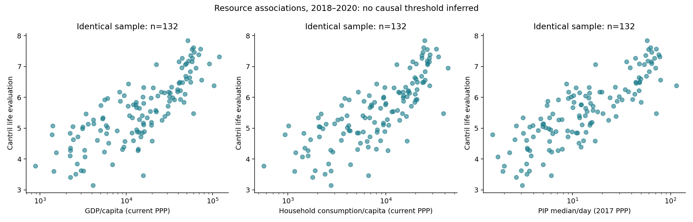

# Wellbeing validation: generated results

Generated by [analysis/run_analysis_35.py](analysis/run_analysis_35.py) from cached inputs; see the [input hashes and method registry](data/processed/wellbeing_validation_manifest.json).

- Selected common window: **2018–2020** (latest with at least 60 fixed-core countries).
- Paired objective-score sample: **88 countries**. Fixed-core Pearson correlation with life evaluation: **0.74**; excluding China and India where present: **0.74** (actually removed: **IND**). These are unweighted country-level associations, not individual effects or population-weighted summaries.
- Resource comparison: **132 identical countries**, log-linear and quadratic-log leave-one-country-out prediction errors reported in the [model table](data/processed/wellbeing_validation_resource_models.csv). Lower errors are descriptive predictive performance, not causal superiority.
- Non-overlapping-window country/year fixed-effects model: **131 countries**, **393 observations**. A 10% increase in three-year-average real GDP/capita is associated with **0.097** Cantril points (country-clustered 95% interval **-0.029 to 0.223**). Time-varying confounding, reverse causality, measurement error and selection remain; this is not a policy effect or a resolution of the Easterlin debate.
- Carbon/frontier sample: **80 countries**. Labels mark nondominance in this sample across life evaluation, objective score and consumption CO₂—not sustainability, efficient policies or a ranking robust to measurement uncertainty.

## Interpretation and limits

The fixed core requires all nine indicators in every year of each three-year window, then weights five domains equally. It preserves Analysis 19 thresholds but omits maternal/neonatal outcomes, vaccination, literacy, child nutrition and homicide; it is a coverage/weighting sensitivity, not a replacement full bundle. Score comparisons use identical countries. No missing outcome is filled with success or failure. Duplicate country-years trigger an audit and an error requiring the corrected Analysis 19 producer; conflicting scores are never selected or averaged. PIP windows mixing income and consumption concepts are excluded from resource comparisons.

The Cantril measure evaluates life as a whole; it is not daily positive affect or a clinical mental-health measure. Cultural response styles and adaptation matter. Neither high reported satisfaction nor a high national mean excuses deprivation or rights violations. Population-weighted summaries of national means cannot recover individual wellbeing inequality.

OWID end-year labels represent three-year survey averages. Covariates are matched to exactly those years. The within-country model uses endpoints 2013, 2016, 2019, 2022 and 2025, requiring at least three available windows per country. Survey sampling uncertainty is unavailable in the cached data; the regression intervals do not incorporate it. Richer annual and subgroup Gallup data may need institutional access: [WHR data-sharing terms](https://worldhappiness.report/data-sharing/).

The carbon comparison uses consumption-based fossil/industrial CO₂, not territorial emissions, material footprint, all greenhouse gases or all planetary boundaries. The cached material-footprint file is world-only and cannot support country merges. A complete ecological frontier needs compatible country footprints, land, water and nutrients. No happiness-per-tonne ratio is calculated.

## Figures

